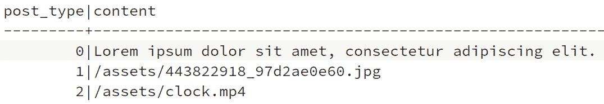

# *第九章*：显示用户帖子

在本章中，我们将实现显示用户帖子。除了显示用户帖子外，我们还将学习 **泛型数据类型** 和 **特质边界**，以将行为相似的类型分组，从而减少相似代码的创建。我们还将学习 Rust 编程语言最重要的部分：内存模型及其术语。我们将学习更多关于 **所有权**、**移动**、**复制**、**克隆**、**借用** 和 **生命周期** 的知识，以及如何在我们的代码中实现这些。

完成本章后，你将理解并在 Rust 编程中实现这些概念。泛型数据类型和特质边界有助于减少重复，而 Rust 的内存模型和概念可以说是 Rust 语言最独特的特性，使其不仅速度快，而且是最安全的编程语言之一。这些概念也使得人们说 Rust 有一个陡峭的学习曲线。

在本章中，我们将涵盖以下主要主题：

+   显示帖子 – 文本、照片和视频

+   使用泛型数据类型和特质边界

+   学习所有权和移动

+   借用和生命周期

# 技术要求

对于本章，我们与上一章有相同的技术要求。我们需要一个 Rust 编译器、一个文本编辑器、一个 HTTP 客户端和一个 PostgreSQL 数据库服务器。

你可以在 [`github.com/PacktPublishing/Rust-Web-Development-with-Rocket/tree/main/Chapter09`](https://github.com/PacktPublishing/Rust-Web-Development-with-Rocket/tree/main/Chapter09) 找到本章的源代码。

# 显示帖子 – 文本、照片和视频

在前面的章节中，我们实现了用户管理，包括列出、显示、创建、更新和删除用户实体。现在，我们想要对帖子做同样的事情。为了刷新你的记忆，我们计划有 `User` 帖子。帖子可以是文本、照片或视频。

当我们实现了应用程序骨架时，我们在 `src/models/post.rs` 中创建了一个 `Post` 结构体，其内容如下：

```rs
pub struct Post {
```

```rs
    pub uuid: Uuid,
```

```rs
    pub user_uuid: Uuid,
```

```rs
    pub post_type: PostType,
```

```rs
    pub content: String,
```

```rs
    pub created_at: OurDateTime,
```

```rs
}
```

计划使用 `post_type` 来区分帖子类型，并使用 `content` 字段来存储帖子的内容。

现在我们已经重新梳理了我们想要做的事情，让我们来实现显示帖子：

1.  我们想要做的第一件事是创建一个迁移文件来更改数据库模式。我们想要创建一个表来存储帖子。在应用程序根目录下，运行以下命令：

    ```rs
    sqlx migrate add create_posts
    ```

1.  我们应该会在 `migrations` 文件夹中看到一个名为 `YYYYMMDDHHMMSS_create_posts.sql` 的新文件（取决于当前日期时间）。使用以下行编辑文件：

    ```rs
    CREATE TABLE IF NOT EXISTS posts
    (
        uuid       UUID PRIMARY KEY,
        user_uuid  UUID NOT NULL,
        post_type  INTEGER NOT NULL DEFAULT 0,
        content    VARCHAR NOT NULL UNIQUE,
        created_at TIMESTAMPTZ NOT NULL DEFAULT CUR-
        RENT_TIMESTAMP,
        FOREIGN KEY (user_uuid) REFERENCES "users" (uuid)
    );
    ```

1.  编辑文件后，在命令行中运行迁移以创建数据库表：

    ```rs
    sqlx migrate run
    ```

1.  我们还在 `src/traits/mod.rs` 中创建了一个名为 `DisplayPostContent` 的特质，它有一个 `raw_html()` 方法。我们希望通过将内容转换为 HTML 片段并在 Tera 模板中渲染这些片段来显示 `Post` 中的内容。更改 `raw_html()` 的签名，以便我们可以使用 `Post` 作为 HTML 片段的来源：

    ```rs
    fn raw_html(&self) -> String;
    ```

1.  现在，我们可以实现 `src/models/text_post.rs`、`src/models/photo_post.rs` 和 `src/models/video_post.rs` 中的每个类型。从修改 `src/models/text_post.rs` 开始：

    ```rs
    pub struct TextPost(pub Post);
    impl DisplayPostContent for TextPost {
        fn raw_html(&self) -> String {
            format!("<p>{}</p>", self.0.content)
        }
    }
    ```

实现非常简单，我们只是在 `Post` 内容周围包裹了一个 `p` HTML 标签。

1.  接下来，修改 `src/models/photo_post.rs`：

    ```rs
    pub struct PhotoPost(pub Post);
    impl DisplayPostContent for PhotoPost {
        fn raw_html(&self) -> String {
            format!(
    r#"<figure></figure>"#,
                self.0.content
            )
        }
    }
    ```

对于 `PhotoPost`，我们使用 `Post` 内容作为 `img` HTML 标签的来源。

1.  最后一个我们修改的类型是 `src/models/video_post.rs`：

    ```rs
    pub struct VideoPost(pub Post);
    impl DisplayPostContent for VideoPost {
        fn raw_html(&self) -> String {
            format!(
                r#"<video width="320" height="240" con-
                trols>
        <source src="img/{}" type="video/mp4">
        Your browser does not support the video tag.
        </video>"#,
                self.0.content
            )
        }
    }
    ```

对于 `VideoPost`，我们使用 `Post` 内容作为 `video` HTML 标签的来源。

我们需要为帖子创建模板。让我们从一个将用于单个帖子或多个帖子的模板开始。

1.  在 `src/views` 文件夹中创建一个 `posts` 文件夹。然后，在 `src/views/posts` 文件夹中创建一个 `_post.html.tera` 文件。将该文件中的以下行添加到文件中：

    ```rs
    <div class="card fluid">
      {{ post.post_html | safe }}
    </div>
    ```

我们在 `div` 中包裹了一些内容，并将内容过滤为安全的 HTML。

1.  在 `src/views/posts` 文件夹中，创建一个 `show.html.tera` 文件作为模板来显示单个帖子。将该文件中的以下行添加到文件中：

    ```rs
    
    
      
      <button type="submit" value="Submit" form="delete-
      Post">Delete</button>
      <a href="/users/{{user.uuid}}/posts" class="but-
      ton">Post List</a>
    
    ```

1.  在 `src/views/posts` 文件夹中创建一个 `index.html.tera` 文件来显示用户帖子。将该文件中的以下行添加到文件中：

    ```rs
    
    
      
        <div class="container">
          <div><mark class="tag">{{ loop.index 
          }}</mark></div>
          
          <a href="/users/{{ user.uuid }}/posts/{{ 
          post.uuid }}" class="button">See Post</a>
        </div>
      
      
        <a href="/users/{{ user.uuid }}/posts?pagina
        tion.next={{ pagination.next }}&paginat-
        ion.limit={{ pagination.limit }}" class="button">
          Next
        </a>
      
      <a href="/users/{{ user.uuid }}/posts/new" 
      class="button">Upload Post</a>
    
    ```

1.  创建视图后，我们可以实现 `Post` 结构体的方法来从数据库获取数据。修改 `src/models/post.rs` 文件以包含 `use` 声明：

    ```rs
    use super::bool_wrapper::BoolWrapper;
    use super::pagination::{Pagination, DEFAULT_LIMIT};
    use super::photo_post::PhotoPost;
    use super::post_type::PostType;
    use super::text_post::TextPost;
    use super::video_post::VideoPost;
    use crate::errors::our_error::OurError;
    use crate::fairings::db::DBConnection;
    use crate::traits::DisplayPostContent;
    use rocket::form::FromForm;
    use rocket_db_pools::sqlx::{FromRow, PgConnection};
    use rocket_db_pools::{sqlx::Acquire, Connection};
    ```

1.  我们需要为 `Post` 结构体派生 `FromRow` 以将数据库行转换为 `Post` 实例：

    ```rs
    #[derive(FromRow, FromForm)]
    pub struct Post {
        ...
    }
    ```

1.  为 `Post` 创建一个 `impl` 块：

    ```rs
    impl Post {}
    ```

1.  在 `impl Post` 块内部，我们可以添加查询数据库并返回 `Post` 数据的函数。由于这些函数与 `User` 函数类似，你可以从 `Chapter09/01DisplayingPost` 源代码文件夹中的 *步骤 14* 到 *17* 复制代码。首先，我们添加 `find()` 方法来获取单个帖子：

    ```rs
    pub async fn find(connection: &mut PgConnection, uuid: &str) -> Result<Post, OurError> {
        let parsed_uuid = 
        Uuid::parse_str(uuid).map_err(Our
        Error::from_uuid_error)?;
        let query_str = "SELECT * FROM posts WHERE uuid = 
        $1";
        Ok(sqlx::query_as::<_, Self>(query_str)
            .bind(parsed_uuid)
            .fetch_one(connection)
            .await
            .map_err(OurError::from_sqlx_error)?)
    }
    ```

1.  添加 `find_all()` 方法：

    ```rs
    pub async fn find_all(
        db: &mut Connection<DBConnection>,
        user_uuid: &str,
        pagination: Option<Pagination>,
    ) -> Result<(Vec<Self>, Option<Pagination>), OurError> {
        if pagination.is_some() {
            return Self::find_all_with_pagination(db, 
            user_uuid, &pagination.unwrap()).await;
        } else {
            return Self::find_all_without_pagination(db, user_uuid).await;
        }
    }
    ```

1.  添加 `find_all_without_pagination()` 方法：

    ```rs
    async fn find_all_without_pagination(
        db: &mut Connection<DBConnection>,
        user_uuid: &str,
    ) -> Result<(Vec<Self>, Option<Pagination>), OurError> {
        let parsed_uuid = 
        Uuid::parse_str(user_uuid).map_err(Our-
        Error::from_uuid_error)?;
        let query_str = r#"SELECT *
    FROM posts
    WHERE user_uuid = $1
    ORDER BY created_at DESC
    LIMIT $2"#;
        let connection = db.acquire().await.map_err(Our-
        Error::from_sqlx_error)?;
        let posts = sqlx::query_as::<_, Self>(query_str)
            .bind(parsed_uuid)
            .bind(DEFAULT_LIMIT as i32)
            .fetch_all(connection)
            .await
            .map_err(OurError::from_sqlx_error)?;
        let mut new_pagination: Option<Pagination> = None;
        if posts.len() == DEFAULT_LIMIT {
            let query_str = "SELECT EXISTS(SELECT 1 FROM 
            posts WHERE created_at < $1 ORDER BY 
            created_at DESC LIMIT 1)";
            let connection = db.acquire().
            await.map_err(OurError::from_sqlx_error)?;
            let exists = sqlx::query_as::<_,
            BoolWrapper>(query_str)
                .bind(&posts.last().unwrap().created_at)
                .fetch_one(connection)
                .await
                .map_err(OurError::from_sqlx_error)?;
            if exists.0 {
                new_pagination = Some(Pagination {
                    next: posts.last().unwrap()
                    .created_at.to_owned(),
                    limit: DEFAULT_LIMIT,
                });
            }
        }
        Ok((posts, new_pagination))
    }
    ```

1.  添加 `find_all_with_pagination()` 方法：

    ```rs
    async fn find_all_with_pagination(
        db: &mut Connection<DBConnection>,
        user_uuid: &str,
        pagination: &Pagination,
    ) -> Result<(Vec<Self>, Option<Pagination>), OurError> {
        let parsed_uuid = 
        Uuid::parse_str(user_uuid).map_err(
        OurError::from_uuid_error)?;
        let query_str = r#"SELECT *
    FROM posts
    WHERE user_uuid = $1 AND☐created_at < $2
    ORDER BY created_at☐DESC
    LIMIT $3"#;
        let connection = db.acquire().await.map_err(
        OurError::from_sqlx_error)?;
        let posts = sqlx::query_as::<_, Self>(query_str)
            .bind(&parsed_uuid)
            .bind(&pagination.next)
            .bind(DEFAULT_LIMIT as i32)
            .fetch_all(connection)
            .await
            .map_err(OurError::from_sqlx_error)?;
        let mut new_pagination: Option<Pagination> = None;
        if posts.len() == DEFAULT_LIMIT {
            let query_str = "SELECT EXISTS(SELECT 1 FROM 
            posts WHERE created_at < $1 ORDER BY 
            created_at DESC LIMIT 1)";
            let connection = db.
            acquire().await.map_err(
            OurError::from_sqlx_error)?;
            let exists = sqlx::query_as::<_,
            BoolWrapper>(query_str)
                .bind(&posts.last().unwrap().created_at)
                .fetch_one(connection)
                .await
                .map_err(OurError::from_sqlx_error)?;
            if exists.0 {
                new_pagination = Some(Pagination {
                    next: posts.last().unwrap().
                    created_at.to_owned(),
                    limit: DEFAULT_LIMIT,
                });
            }
        }
        Ok((posts, new_pagination))
    }
    ```

1.  我们需要添加将 `Post` 实例转换为 `TextPost`、`PhotoPost` 或 `VideoPost` 的方法。在 `impl Post` 块内部添加以下行：

    ```rs
    pub fn to_text(self) -> TextPost {
        TextPost(self)
    }
    pub fn to_photo(self) -> PhotoPost {
        PhotoPost(self)
    }
    pub fn to_video(self) -> VideoPost {
        VideoPost(self)
    }
    ```

1.  当视图和模型实现就绪后，我们可以实现显示用户帖子的函数。在 `src/routes/post.rs` 中添加所需的 `use` 声明：

    ```rs
    use crate::models::{pagination::Pagination, post::Post, post_type::PostType, user::User};
    use crate::traits::DisplayPostContent;
    use rocket::http::Status;
    use rocket::serde::Serialize;
    use rocket_db_pools::{sqlx::Acquire, Connection};
    use rocket_dyn_templates::{context, Template};
    ```

1.  修改 `src/routes/post.rs` 中的 `get_post()` 函数：

    ```rs
    #[get("/users/<user_uuid>/posts/<uuid>", format = "text/html")]
    pub async fn get_post(
        mut db: Connection<DBConnection>,
        user_uuid: &str,
        uuid: &str,
    ) -> HtmlResponse {}
    ```

1.  在 `get_post()` 函数内部，从数据库查询 `user` 信息和 `post` 信息。写入以下行：

    ```rs
    let connection = db
        .acquire()
        .await
        .map_err(|_| Status::InternalServerError)?;
    let user = User::find(connection, user_uuid)
        .await
        .map_err(|e| e.status)?;
    let connection = db
        .acquire()
        .await
        .map_err(|_| Status::InternalServerError)?;
    let post = Post::find(connection, uuid).await.map_err(|e| e.status)?;
    if post.user_uuid != user.uuid {
        return Err(Status::InternalServerError);
    }
    ```

1.  在 `src/views/posts/show.html.tera` 和 `src/views/posts/_post.html.tera` 文件中，我们设置了两个变量：`user` 和 `post`。我们必须将这两个变量添加到传递给模板的上下文中。添加两个将要传递给模板的结构体：

    ```rs
    #[derive(Serialize)]
    struct ShowPost {
        post_html: String,
    }
    #[derive(Serialize)]
    struct Context {
        user: User,
        post: ShowPost,
    }
    ```

1.  最后，我们可以将`user`和`post`变量传递到`context`中，与`context`一起渲染模板，并从函数中返回。添加以下行：

    ```rs
    let mut post_html = String::new();
        match post.post_type {
            PostType::Text => post_html = 
            post.to_text().raw_html(),
            PostType::Photo => post_html = 
            post.to_photo().raw_html(),
            PostType::Video => post_html = 
            post.to_video().raw_html(),
        }
        let context = Context {
            user,
            post: ShowPost { post_html },
        };
        Ok(Template::render("posts/show", context))
    ```

1.  对于`src/routes/post.rs`中的`get_posts()`函数，我们希望从数据库中获取`posts`数据。将函数修改为以下行：

    ```rs
    #[get("/users/<user_uuid>/posts?<pagination>", format = "text/html")]
    pub async fn get_posts(
        mut db: Connection<DBConnection>,
        user_uuid: &str,
        pagination: Option<Pagination>,
    ) -> HtmlResponse {
        let user = User::find(&mut db, 
        user_uuid).await.map_err(|e| e.status)?;
    let (posts, new_pagination) = Post::find_all(&mut 
        db, user_uuid, pagination)
            .await
            .map_err(|e| e.status)?;
    }
    ```

1.  现在我们已经实现了获取`posts`数据的功能，是时候将这些帖子渲染出来了。在`get_posts()`函数内部，添加以下行：

    ```rs
    #[derive(Serialize)]
    struct ShowPost {
     uuid: String,
     post_html: String,
    }
    let show_posts: Vec<ShowPost> = posts
        .into_iter()
        .map(|post| {
            let uuid = post.uuid.to_string();
            let mut post_html = String::new();
            match post.post_type {
                PostType::Text => post_html = 
                post.to_text().raw_html(),
                PostType::Photo => post_html = 
                post.to_photo().raw_html(),
                PostType::Video => post_html = 
                post.to_video().raw_html(),
            };
            ShowPost { uuid, post_html }
        })
        .collect();
    let context =
        context! {user, posts: show_posts, pagination: 
        new_pagination.map(|pg|pg.to_context())};
    Ok(Template::render("posts/index", context))
    ```

现在我们已经完成了`get_post()`和`get_posts()`的代码，是时候测试这两个端点了。尝试向静态文件夹中添加图片和视频，并在数据库中添加条目。你可以在 GitHub 仓库中找到本章源代码中的静态文件夹中的示例图片和视频。以下是一个示例：



图 9.1 – 测试端点

当我们打开网络浏览器并导航到用户帖子页面时，我们应该能够看到类似于以下截图的内容：


图 9.2 – 示例用户帖子页面

我们已经实现了显示帖子的函数，但如果我们回顾一下代码，我们可以看到这三种类型（文本、照片和视频）都有相同的方法，因为它们都在实现相同的接口。

在下一节中，让我们将这些内容转换为泛型数据类型和特质界限。

# 使用泛型数据类型和特质界限

**泛型数据类型**、**泛型类型**，或者简单地称为**泛型**，是编程语言能够将相同的程序应用于不同数据类型的一种方式。

例如，我们希望为不同的数据类型创建一个`multiplication(a, b) -> c {}`函数，例如`u8`或`f64`。如果一个语言没有泛型，程序员可能不得不实现两个不同的函数，例如，`multiplication_u8(a: u8, b: u8) -> u8`和`multiplication_f64(a: f64, b: f64) -> f64`。创建两个不同的函数看起来可能很简单，但随着应用程序的复杂性增加，分支和确定使用哪个函数将会更加复杂。如果一个语言有泛型，那么可以通过使用单个可以接受`u8`和`f64`的函数来解决多个函数的问题。

在 Rust 语言中，我们可以通过在函数名后面声明泛型来创建一个泛型函数，如下所示：

```rs
fn multiplication<T>(a: T, b: T) -> T {}
```

我们还可以在`struct`或`enum`定义中使用泛型。以下是一个示例：

```rs
struct Something<T>{
```

```rs
    a: T,
```

```rs
    b: T,
```

```rs
}
```

```rs
enum Shapes<T, U> {
```

```rs
    Rectangle(T, U),
```

```rs
    Circle(T),
```

```rs
}
```

我们还可以在方法定义中使用泛型。在`Something<T>`之后，我们可以实现方法如下：

```rs
impl<T, U> Something<T, U> {
```

```rs
    fn add(&self, T, U) -> T {}
```

```rs
}
```

在编译时，编译器通过使用具体的类型（在我们的乘法示例中为 `u8` 或 `f64`）来识别和将泛型代码转换为特定代码，具体取决于使用了哪种类型。这个过程称为**单态化**。由于单态化，使用泛型编写的代码生成的二进制文件将具有与使用特定代码生成的二进制文件相同的执行速度。

现在我们已经了解了泛型简介，让我们在我们的现有应用程序中使用泛型：

1.  在 `src/models/post.rs` 文件中，添加另一个方法将 `Post` 实例转换为 `media`：

    ```rs
    pub fn to_media(self) -> Box<dyn DisplayPostContent> {
        match self.post_type {
            PostType::Text => Box::new(self.to_text()),
            PostType::Photo => Box::new(self.to_photo()),
            PostType::Video => Box::new(self.to_video()),
        }
    }
    ```

我们正在告诉 `to_media()` 方法返回实现了 `DisplayPostContent` 的类型，并将 `TextPost`、`PhotoPost` 或 `VideoPost` 放入堆中。

1.  在 `src/routes/post.rs` 文件中，`get_post()` 函数内部，`Context` 结构体声明之后，添加以下行：

    ```rs
    struct Context {
        …
    }
    fn create_context<T>(user: User, media: T) -> Context {
        Context {
            user,
            post: ShowPost {
                post_html: media.raw_html(),
            },
        }
    }
    ```

是的，我们可以在另一个函数内部创建一个函数。内部函数将具有局部作用域，并且不能在 `get_post()` 函数外部使用。

1.  我们需要将 `context` 变量从直接初始化结构体更改为如下所示：

    ```rs
    let context = Context {...};
    ```

我们需要将其更改为使用 `create_context()` 函数：

```rs
let media = post.to_media();
let context = create_context(user, media);
```

到目前为止，我们可以看到 `create_context()` 可以使用任何类型，例如 `String` 或 `u8`，但 `String` 和 `u8` 类型没有 `raw_html()` 函数。当编译代码时，Rust 编译器将显示错误。让我们通过使用**特性界限**来解决这个问题。

我们已经定义和实现了多个特性，并且我们已经知道特性为不同数据类型提供了一致的行为。我们在 `src/traits/mod.rs` 中定义了 `DisplayPostContent` 特性，并且实现了 `DisplayPostContent` 的每个类型都有相同的方法，即 `raw_html(&self) -> String`。

我们可以通过在泛型声明后添加一个特性来限制泛型类型。将 `create_context()` 函数更改为使用特性界限：

```rs
fn create_context<T: DisplayPostContent>(user: User, media: T) -> Context {...}
```

不幸的是，仅使用 `DisplayPostContent` 是不够的，因为 `T` 的大小不是固定的。我们可以将函数参数从 `media: T` 改为 `media: &T` 引用，因为引用具有固定的大小。我们还有另一个问题，因为 `DisplayPostContent` 的大小在编译时是未知的，所以我们需要添加另一个界限。每个 `T` 类型在编译时都隐式地期望具有一个常量大小，隐式特性界限为 `std::marker::Sized`。我们可以通过使用特殊的 `?Size` 语法来移除隐式界限。

我们可以使用多个特性绑定，并通过使用加号（`+`）将它们组合起来。`create_context()` 函数的结果签名将如下所示：

```rs
fn create_context<T: DisplayPostContent + ?Sized>(user: User, media: &T) -> Context {...}
```

在尖括号（`<>`）内编写多个特性界限会使函数签名难以阅读，因此有一个用于定义特性界限的替代语法：

```rs
fn create_context<T>(user: User, media: &T) -> Context
```

```rs
where T: DisplayPostContent + ?Sized {...}
```

由于我们更改了函数签名以使用引用，因此我们必须更改函数的使用方式：

```rs
let context = create_context(user, &*media);
```

我们通过使用解引用符号（`*`）获取 `media` 对象，并通过使用引用符号（`&`）再次引用 `media`。

现在，Rust 编译器应该能够再次编译代码。我们将在下一两个部分中学习更多关于引用的内容，但在那之前，我们必须学习 Rust 的内存模型，称为所有权和移动。

# 学习所有权和移动

当我们实例化一个结构体时，我们创建一个**实例**。想象一下结构体就像一个模板；实例是基于模板在内存中创建的，并填充了适当的数据。

Rust 中的实例有一个**作用域**；它在函数中创建并返回。以下是一个例子：

```rs
fn something() -> User {
```

```rs
    let user = User::find(...).unwrap();
```

```rs
    user
```

```rs
}
```

```rs
let user = something()
```

如果一个实例没有被返回，那么它将从内存中移除，因为它不再被使用。在这个例子中，`user` 实例将在函数结束时被移除：

```rs
fn something() {
```

```rs
    let user = User::find(...).unwrap();
```

```rs
    ...
```

```rs
}
```

我们可以说实例有一个作用域，如前所述。在作用域内创建的资源将在作用域结束时以它们创建的**相反顺序**被销毁。

我们还可以通过使用花括号 `{}` 在例程中创建一个局部作用域。在作用域内创建的任何实例将在作用域结束时被销毁。例如，`user` 作用域位于花括号内：

```rs
...
```

```rs
{
```

```rs
    let user = User::find(...).unwrap();
```

```rs
}
```

```rs
...
```

实例**拥有**资源，不仅是在**栈内存**中，也在**堆内存**中。当实例超出作用域时，无论是由于函数退出还是花括号作用域退出，附加到实例的资源将自动以创建的**相反顺序**清理。这个过程被称为**资源获取即初始化**（**RAII**）。

想象一下计算机内存由栈和堆组成：

```rs
Stack: ☐☐☐☐☐☐☐☐☐☐☐☐
```

```rs
Heap:  ☐☐☐☐☐☐☐☐☐☐☐☐
```

实例拥有栈内存中的内存：

```rs
Stack: ☐☒☒☒☐☐☐☐☐☐☐☐
```

```rs
Heap:  ☐☐☐☐☐☐☐☐☐☐☐☐
```

另一个实例可能从栈和堆中拥有内存。例如，一个字符串可以是一个单词或几段文字。我们无法确定 `String` 实例的大小，因此我们无法将所有信息存储在栈内存中；相反，我们可以将一些信息存储在栈内存中，将一些信息存储在堆内存中。这是一个简化的表示：

```rs
Stack: ☐☒☐☐☐☐☐☐☐☐☐☐
```

```rs
         ↓
```

```rs
Heap:  ☐☒☒☒☒☐☐☐☐☐☐☐
```

在其他编程语言中，有一个名为 `std::ops::Drop` 的函数。但是，大多数类型不需要实现 `Drop` 特性，并且当它们超出作用域时将自动从内存中移除。

在 Rust 中，如果我们创建一个实例并将其设置为另一个实例，它被称为 `src/routes/post.rs` 文件中的 `get_posts()` 函数，修改如下：

```rs
let show_posts: Vec<ShowPost> = posts
```

```rs
    .into_iter()
```

```rs
    .map(|post| ShowPost {
```

```rs
        post_html: post.to_media().raw_html(),
```

```rs
        uuid: post.uuid.to_string(),
```

```rs
    })
```

```rs
    .collect();
```

```rs
let context = ...
```

如果我们编译程序，我们应该看到类似于以下错误的错误：

```rs
error[E0382]: borrow of moved value: `post`
  --> src/routes/post.rs:78:19
   |
76 |         .map(|post| ShowPost {
   |               ---- move occurs because `post` has type `models::post::Post`, which does not implement the `Copy` trait
77 |             post_html: post.to_media().raw_html(),
   |                             ---------- `post` moved due to this method call
78 |             uuid: post.uuid.to_string(),
   |                   ^^^^^^^^^^^^^^^^^^^^^ value borrowed here after move
```

什么是移动？让我们回到内存简化的例子。当一个实例被分配给另一个实例时，第二个实例的一部分将在栈内存中分配：

```rs
Stack: ☐☒☐☐☒☐☐☐☐☐☐☐
```

```rs
         ↓
```

```rs
Heap:  ☐☒☒☒☒☐☐☐☐☐☐☐
```

然后，一些新的实例指向堆中的旧数据：

```rs
Stack: ☐☒☐☐☒☐☐☐☐☐☐☐
```

```rs
              ↓
```

```rs
Heap:  ☐☒☒☒☒☐☐☐☐☐☐☐
```

如果两个实例都指向相同的堆内存，那么第一个实例被丢弃时会发生什么？由于无效数据的可能性，在 Rust 中，只有一个实例可以拥有自己的资源。Rust 编译器将拒绝编译使用已移动实例的代码。

如果我们查看我们的代码，`Post`中的`to_media()`方法移动了`post`实例，并将其放入`TextPost`、`PhotoPost`或`VideoPost`中。因此，我们不能在`post.uuid.to_string()`中使用`post`实例，因为它已经被移动了。现在，我们可以通过改变行顺序来修复代码：

```rs
let show_posts: Vec<ShowPost> = posts
```

```rs
    .into_iter()
```

```rs
    .map(|post| ShowPost {
```

```rs
        uuid: post.uuid.to_string(),
```

```rs
        post_html: post.to_media().raw_html(),
```

```rs
    })
```

```rs
    .collect();
```

当我们使用`post.uuid.to_string()`时没有移动，所以代码应该可以编译。

但是，我们如何创建一个`std::marker::Copy` trait，这样当我们从一个实例赋值给另一个实例时，它会在栈上创建一个副本。这就是为什么像`u8`这样的简单类型，它们不需要太多内存或具有已知大小，实现了`Copy` trait。让我们看看这个代码是如何工作的说明：

```rs
let x: u8 = 8;
```

```rs
let y = x;
```

```rs
Stack: ☐☒☐☐☒☐☐☐☐☐☐☐
```

```rs
Heap:  ☐☐☐☐☐☐☐☐☐☐☐☐
```

如果一个类型的所有成员都实现了`Copy` trait，那么这个类型可以自动推导出`Copy` trait。我们还需要推导`Clone`，因为`Copy` trait 在其定义中由`Clone` trait 所约束：`pub trait Copy: Clone { })`。以下是一个推导`Copy` trait 的例子：

```rs
#[derive(Copy, Clone)]
```

```rs
struct Circle {
```

```rs
    r: u8,
```

```rs
}
```

然而，这个例子将不会工作，因为`String`没有实现`Copy`：

```rs
#[derive(Copy, Clone)]
```

```rs
pub struct Sheep {
```

```rs
    ...
```

```rs
    pub name: String,
```

```rs
    ...
```

```rs
}
```

这个例子会工作：

```rs
#[derive(Clone)]
```

```rs
pub struct Sheep {
```

```rs
    ...
```

```rs
    pub name: String,
```

```rs
    ...
```

```rs
}
```

克隆是通过复制堆内存的内容来工作的。例如，假设我们有前面的代码和以下代码：

```rs
let dolly = Sheep::new(...);
```

我们可以将`dolly`可视化如下：

```rs
Stack: ☐☒☐☐☐☐☐☐☐☐☐☐
```

```rs
         ↓
```

```rs
Heap:  ☐☒☒☒☒☐☐☐☐☐☐☐
```

假设我们像这样从`dolly`赋值另一个实例：

```rs
let debbie = dolly;
```

这就是内存使用的情况：

```rs
Stack: ☐☒☐☐☐☐☒☐☐☐☐☐
```

```rs
         ↓                ↓
```

```rs
Heap:  ☐☒☒☒☒☐☒☒☒☒☐☐
```

由于分配堆内存很昂贵，我们可以使用另一种方式来查看实例的值：**借用**。

# 借用和生命周期

我们已经在我们的代码中使用了**引用**。引用是栈中的一个实例，它指向另一个实例。让我们回顾一下实例内存使用的情况：

```rs
Stack: ☐☒☐☐☐☐☐☐☐☐☐☐
```

```rs
         ↓
```

```rs
Heap:  ☐☒☒☒☒☐☐☐☐☐☐☐
```

引用是在栈内存中分配的，指向另一个实例：

```rs
Stack: ☐☒←☒☐☐☐☐☐☐☐☐
```

```rs
         ↓
```

```rs
Heap:  ☐☒☒☒☒☐☐☐☐☐☐☐
```

在栈上分配比在堆上分配更便宜。正因为如此，大多数时候使用引用比克隆更高效。创建引用的过程被称为**借用**，因为引用借用了另一个实例的内容。

假设我们有一个名为`airwolf`的实例：

```rs
#[derive(Debug)]
```

```rs
struct Helicopter {
```

```rs
    height: u8,
```

```rs
    cargo: Vec<u8>,    
```

```rs
}
```

```rs
let mut airwolf = Helicopter {
```

```rs
    height: 0,
```

```rs
    cargo: Vec::new(),
```

```rs
};
```

```rs
airwolf.height = 10;
```

我们可以通过使用连字符(`&`)操作符来创建对`airwolf`的引用：

```rs
let camera_monitor_a = &airwolf;
```

借用一个实例就像是一个摄像头监视器；一个引用可以看到被引用实例的值，但不能修改这个值。我们可以有多个引用，就像这个例子中看到的那样：

```rs
let camera_monitor_a = &airwolf;
```

```rs
let camera_monitor_b = &airwolf;
```

```rs
...
```

```rs
let camera_monitor_z = &airwolf;
```

如果我们想要一个可以修改其所引用实例值的引用呢？我们可以创建一个`&mut`操作符：

```rs
let remote_control = &mut airwolf;
```

```rs
remote_control.height = 15;
```

现在，如果我们有两个遥控器会发生什么呢？嗯，直升机不能同时上升和下降。同样地，Rust 限制了可变引用，并且一次只允许一个可变引用。

Rust 还禁止同时使用可变引用和不可变引用，因为可能会发生数据不一致。例如，添加以下行将不会工作：

```rs
let last_load = camera_monitor_a.cargo.last(); // None
```

```rs
remote_control.cargo.push(100);
```

`last_load`的值是多少？我们期望`last_load`为`None`，但遥控器已经将某些内容推送到货物中。由于数据不一致问题，如果我们尝试编译代码，Rust 编译器将发出错误。

## 实现借用和生命周期

现在我们已经学习了所有权、移动和借用，让我们修改我们的代码以使用引用。

1.  如果我们查看`TextPost`、`PhotoPost`和`VideoPost`的当前定义，我们可以看到我们正在获取`post`的所有权并将`post`实例移动到新的`TextPost`、`PhotoPost`或`VideoPost`实例中。在`src/models/text_post.rs`中添加以下结构体：

    ```rs
    pub struct TextPost(pub Post);
    ```

1.  在`src/models/post.rs`中，添加以下函数：

    ```rs
    pub fn to_text(self) -> TextPost { // self is post instance
        TextPost(self) // post is moved into TextPost instance 
    }
    ```

1.  我们可以将`TextPost`字段转换为对`Post`实例的引用。将`src/models/text_post.rs`修改为以下内容：

    ```rs
    pub struct TextPost(&Post);
    ```

1.  由于我们将未命名的字段转换为私有未命名的字段，我们还需要一个初始化器。追加以下行：

    ```rs
    impl TextPost {
        pub fn new(post: &Post) -> Self {
            TextPost(post)
        }
    }
    ```

由于我们改变了`TextPost`的初始化，我们还需要更改`to_text()`和`to_media()`的实现。在`src/models/post.rs`中，将`to_text()`方法修改为以下内容：

```rs
pub fn to_text(&self) -> TextPost {
    TextPost::new(self)
}
```

将`to_media()`方法修改为以下内容：

```rs
pub fn to_media(self) -> Box<dyn DisplayPostContent> {
    match self.post_type {
        PostType::Text => Box::new((&self).to_text()),
        ...
    }
}
```

1.  让我们尝试编译代码。我们应该看到一个错误，如下所示：

    ```rs
    error[E0106]: missing lifetime specifier
     --> src/models/text_post.rs:4:21
      |
    4 | pub struct TextPost(&Post);
      |                     ^ expected named lifetime parameter
    ```

出现这个错误的原因是代码需要一个**生命周期指定符**。生命周期指定符是什么？让我们看看一个非常简单的程序的例子：

```rs
fn main() {
    let x;
    {
        let y = 5;
        x = &y;
    } // y is out of scope
    println!("{}", *x);
}
```

1.  记住，在 Rust 中，任何实例在达到作用域的末尾后都会自动移除。在前面的代码中，`y`是在由花括号`{}`表示的作用域内创建的。当代码到达作用域的末尾`}`时，`y`实例将从内存中清除。那么`x`会发生什么？前面的代码将无法编译，因为`x`不再有效。我们可以按照以下方式修复代码：

    ```rs
    fn main() {
        let x;
        {
            let y = 5;
            x = &y;
            println!("{}", *x);
        }
    }
    ```

1.  现在，让我们看看`src/models/text_post.rs`中的代码：

    ```rs
    pub struct TextPost(&Post);
    ```

由于 Rust 是多线程的，并且有很多分支，我们无法保证对`Post`实例的引用`&Post`可以像`TextPost`实例一样长命。如果`&Post`在`TextPost`实例未销毁的情况下已经被销毁，会发生什么？解决方案是在以下位置放置一个标记，称为`TextPost`：

```rs
pub struct TextPost<'a>(&'a Post);
```

我们在告诉编译器，任何`TextPost`实例都应该与引用的`&Post`一样长命，这由生命周期指示符`'a`表示。如果编译器发现`&Post`没有像`TextPost`实例一样长命，它将不会编译程序。

生命周期指定符的约定是使用小写单字母，如`'a`，但还有一个特殊的生命周期指定符，`'static`。`'static`生命周期指定符意味着引用的数据与应用程序一样长命。例如，我们说`pi`引用的数据将与应用程序一样长命：

```rs
let pi: &'static f64 = &3.14;
```

1.  让我们修改应用程序的其余部分。我们已经看到了如何在类型定义中使用生命周期指定符；现在让我们在 `impl` 块和方法中也使用它。将 `src/models/text_post.rs` 的其余部分修改为以下内容：

    ```rs
    impl<'a> TextPost<'a> {
        pub fn new(post: &'a Post) -> Self {...}
    }
    impl<'a> DisplayPostContent for TextPost<'a> {...}
    ```

1.  让我们将 `src/models/photo_post.rs` 中的 `PhotoPost` 修改为也使用生命周期：

    ```rs
    pub struct PhotoPost<'a>(&'a Post);
    impl<'a> PhotoPost<'a> {
        pub fn new(post: &'a Post) -> Self {
            PhotoPost(post)
        }
    }
    impl<'a> DisplayPostContent for PhotoPost<'a> {...}
    ```

1.  让我们也将 `VideoPost` 在 `src/models/video_post.rs` 中进行更改：

    ```rs
    pub struct VideoPost<'a>(&'a Post);
    impl<'a> VideoPost<'a> {
        pub fn new(post: &'a Post) -> Self {
            VideoPost(post)
        }
    }
    impl<'a> DisplayPostContent for VideoPost<'a> {...}
    ```

1.  在 `src/models/post.rs` 文件中，按照以下方式修改代码：

    ```rs
    impl Post {
        pub fn to_text(&self) -> TextPost {
            TextPost::new(self)
        }
        pub fn to_photo(&self) -> PhotoPost {
            PhotoPost::new(self)
        }
        pub fn to_video(&self) -> VideoPost {
            VideoPost::new(self)
        }
        pub fn to_media<'a>(&'a self) -> Box<dyn 
        DisplayPostContent + 'a> {
            match self.post_type {
                PostType::Photo => Box::new(self.to_photo()),
                PostType::Text => Box::new(self.to_text()),
                PostType::Video => Box::new(self.to_video()),
            }
        }
        ...
    }
    ```

现在，我们正在使用借用的 `Post` 实例来处理 `TextPost`、`PhotoPost` 或 `VideoPost` 实例。但在结束本章之前，让我们根据以下说明稍微重构一下代码：

1.  我们可以看到 `ShowPost` 结构体在 `get_post()` 和 `get_posts()` 中被重复。在 `src/models/post.rs` 中添加一个新的结构体：

    ```rs
    use rocket::serde::Serialize;
    ...
    #[derive(Serialize)]
    pub struct ShowPost {
        pub uuid: String,
        pub post_html: String,
    }
    ```

1.  添加一个将 `Post` 转换为 `ShowPost` 的方法：

    ```rs
    impl Post {
        ...
        pub fn to_show_post<'a>(&'a self) -> ShowPost {
            ShowPost {
                uuid: self.uuid.to_string(),
                post_html: self.to_media().raw_html(),
            }
        }
        ...
    }
    ```

1.  在 `src/routes/post.rs` 中，将 `ShowPost` 添加到 `use` 声明中：

    ```rs
    use crate::models::{
        pagination::Pagination,
        post::{Post, ShowPost},
        user::User,
    };
    ```

1.  通过删除以下行来修改 `get_post()` 函数，以删除不必要的结构体声明和函数：

    ```rs
    #[derive(Serialize)]
    struct ShowPost {
        post_html: String,
    }
    #[derive(Serialize)]
    struct Context {
        user: User,
        post: ShowPost,
    }
    fn create_context<T: DisplayPostContent + ?Sized>(user: User, media: &T) -> Context {
        Context {
            user,
            post: ShowPost {
                post_html: media.raw_html(),
            },
        }
    }
    let media = post.to_media();
    let context = create_context(user, &*media);
    ```

1.  将这些行替换为 `context!` 宏：

    ```rs
    let context = context! { user, post: &(post.to_show_post())};
    ```

1.  在 `get_posts()` 函数中，删除以下行：

    ```rs
    #[derive(Serialize)]
    struct ShowPost {
        uuid: String,
        post_html: String,
    }
    let show_posts: Vec<ShowPost> = posts
        .into_iter()
        .map(|post| ShowPost {
            uuid: post.uuid.to_string(),
            post_html: post.to_media().raw_html(),
        })
        .collect();
    ```

将这些行替换为这一行：

```rs
let show_posts: Vec<ShowPost> = posts.into_iter().map(|post| post.to_show_post()).collect();
```

1.  此外，更改 `context` 实例化：

    ```rs
    let context = context! {user, posts: &show_posts, pagination: new_pagination.map(|pg|pg.to_context())};
    ```

1.  最后，删除不必要的 `use` 声明。删除以下行：

    ```rs
    use crate::traits::DisplayPostContent;
    use rocket::serde::Serialize;
    ```

现在使用借用的 `Post` 实例显示帖子，实现应该更简洁。应用程序的速度应该没有差异，因为我们只是使用单个实例的引用。

事实上，有时使用所有者属性而不是引用更好，因为没有显著的性能提升。在复杂的应用程序、高内存使用应用程序或高性能应用程序（如游戏或高速交易，数据量很大）中，使用引用可能是有用的，但这要以开发时间为代价。

# 摘要

在本章中，我们实现了 `get_post()` 和 `get_posts()` 来在网页中显示 `Post` 信息。随着这些实现，我们还学习了通过泛型和特质界限来减少代码重复。

我们还学习了 Rust 最独特和最重要的特性：其内存模型。我们现在知道一个实例拥有一个内存块，要么在栈上，要么同时在栈和堆上。我们还了解到将另一个实例赋值给实例意味着移动所有权，除非它是一个实现了 `Copy` 和/或 `Clone` 特性的简单类型。我们还学习了借用、借用的规则以及使用生命周期指定符来补充移动、复制和借用。

这些规则是 Rust 中最令人困惑的部分之一，但正是这些规则使得 Rust 在保持与其他系统语言（如 C 或 C++）相同性能的同时，成为一个非常安全的语言。现在我们已经实现了显示帖子，让我们在下一章学习如何上传数据。
