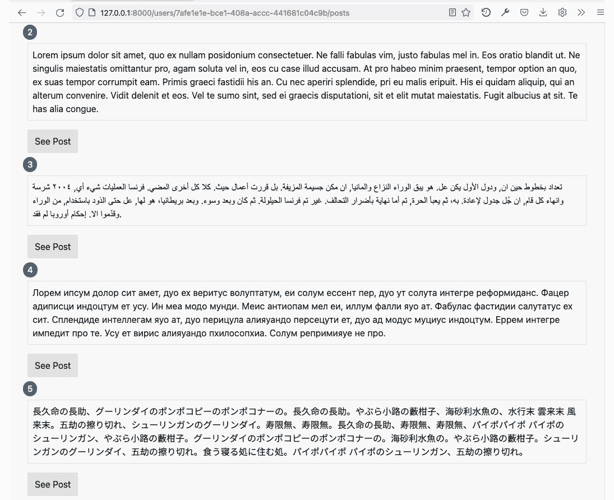
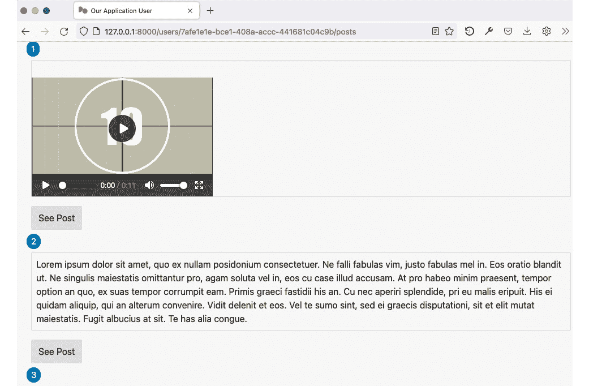

# *第十章*：上传和处理帖子

在本章中，我们将学习如何上传用户帖子。我们将从多部分上传的基本知识开始，然后继续使用`TempFile`来存储上传的文件。上传文件后，我们将实现图像处理。

接下来，我们将学习如何通过并发编程技术、异步编程和多线程来改进处理。

在本章中，我们将涵盖以下主要主题：

+   上传文本帖子

+   上传照片帖子

+   异步处理文件

+   使用工作进程上传视频帖子并处理

# 技术要求

对于本章，我们有通常的要求：Rust 编译器、文本编辑器、网络浏览器和 PostgreSQL 数据库服务器。除了这些要求之外，我们还将处理上传的视频文件。从[`www.ffmpeg.org/download.html`](https://www.ffmpeg.org/download.html)下载**FFmpeg**命令行。FFmpeg 是一个用于处理媒体文件的媒体框架。确保您可以在操作系统的终端上运行 FFmpeg。

您可以在此章节的源代码[`github.com/PacktPublishing/Rust-Web-Development-with-Rocket/tree/main/Chapter10`](https://github.com/PacktPublishing/Rust-Web-Development-with-Rocket/tree/main/Chapter10)中找到。

# 上传文本帖子

我们首先想要上传的是文本帖子，因为它是最简单的类型。当我们提交 HTML 表单时，我们可以指定`form`标签的`enctype`属性为`text/plain`、`application/x-www-form-urlencoded`或`multipart/form-data`。我们已经学习了如何在创建用户时处理`application/x-www-form-urlencoded`的 Rocket 应用程序。我们为该结构体创建一个结构体并为其推导`FromForm`。稍后，在路由处理函数中，我们设置一个路由属性，如`get`或`post`，并将结构体分配到`data`注释中。

对于`Content-Type="application/x-www-form-urlencoded"`的请求体是简单的：表单键和值通过`&`分隔成键值对，键和值之间用等号(`=`)连接。如果发送的字符不是字母数字，则进行百分号编码(`%`)。以下是一个表单请求体的示例：

```rs
name=John%20Doe&age=18
```

对于上传文件，`Content-Type`是`multipart/form-data`，其正文不同。假设我们有以下 HTTP 头：

```rs
Content-Type: multipart/form-data; boundary=---------------------------charactersforboundary123
```

HTTP 正文可以是以下内容：

```rs
Content-Type: multipart/form-data; boundary=---------------------------charactersforboundary123
```

```rs
Content-Disposition: form-data; name="name"
```

```rs
John Doe
```

```rs
-----------------------------charactersforboundary123
```

```rs
Content-Disposition: form-data; name="upload"; filename="file1.txt"
```

```rs
Content-Type: text/plain
```

```rs
Lorem ipsum dolor sit amet 
```

```rs
-----------------------------charactersforboundary123
```

```rs
Content-Disposition: form-data; name="other_field"
```

```rs
Other field
```

在 Rocket 中，我们可以通过使用`multer` crate 来处理`multipart/form-data`。让我们按照以下说明尝试使用该 crate 实现上传：

1.  通过将这些 crate 添加到`Cargo.toml`依赖项中修改我们的应用程序：

    ```rs
    multer = "2.0.2"
    tokio-util = "0.6.9"
    ```

1.  在`Rocket.toml`中添加以下配置以处理文件上传限制并添加一个临时目录来存储上传的文件：

    ```rs
    limits = {"file/avif" = "1Mib", "file/gif" = "1Mib", "file/jpg" = "1Mib", "file/jpeg" = "1Mib", "file/png" = "1Mib", "file/svg" = "1Mib", "file/webp" = "1Mib", "file/webm" = "64Mib", "file/mp4" = "64Mib", "file/mpeg4" = "64Mib", "file/mpg" = "64Mib", "file/mpeg" = "64Mib", "file/mov" = "64Mib"}
    temp_dir = "/tmp"
    ```

1.  修改`src/views/posts/index.html.tera`以添加一个用户可以上传文件的表单。在分页块之后添加以下行：

    ```rs
    <form action="/users/{{ user.uuid }}/posts" enctype="multipart/form-data" method="POST">
      <fieldset>
        <legend>New Post</legend>
        <div class="row">
          <div class="col-sm-12 col-md-3">
            <label for="upload">Upload file:</label>
          </div>
          <div class="col-sm-12 col-md">
            <input type="file" name="file" accept=" 
            text/plain">
          </div>
        </div>
        <button type="submit" value="Submit">Submit</
        button>
      </fieldset>
    </form>
    ```

1.  在`src/models/post.rs`文件中为`Post`添加`create()`方法。我们希望有一个方法将`Post`数据保存到数据库中。在`impl Post {}`块内添加以下行：

    ```rs
    pub async fn create(
        connection: &mut PgConnection,
        user_uuid: &str,
        post_type: PostType,
        content: &str,
    ) -> Result<Self, OurError> {
        let parsed_uuid = Uuid::parse_str(
        user_uuid).map_err(OurError::from_uuid_error)?;
        let uuid = Uuid::new_v4();
        let query_str = r#"INSERT INTO posts
    (uuid, user_uuid, post_type, content)
    VALUES
    ($1, $2, $3, $4)
    RETURNING *"#;
        Ok(sqlx::query_as::<_, Self>(query_str)
            .bind(uuid)
            .bind(parsed_uuid)
            .bind(post_type)
            .bind(content)
            .fetch_one(connection)
            .await
            .map_err(OurError::from_sqlx_error)?)
    }
    ```

1.  我们可以移除`FromForm`，因为我们不再使用占位符了。从`src/models/post.rs`中移除以下行：

    ```rs
    use rocket::form::FromForm;
    ...
    #[derive(FromRow, FromForm)]
    pub struct Post {...}
    ```

1.  我们需要从请求的`Content-Type`中获取多部分边界，但 Rocket 没有可以执行此操作的请求保护器。让我们创建一个可以处理原始 HTTP `Content-Type`头部的类型。在`src/lib.rs`中添加以下行：

    ```rs
    pub mod guards;
    ```

在`src`文件夹中，创建另一个名为`guards`的文件夹，然后创建一个`src/guards/mod.rs`文件。在文件中，添加一个处理原始 HTTP 请求体的结构体：

```rs
use rocket::request::{FromRequest, Outcome};
pub struct RawContentType<'r>(pub &'r str);
```

1.  实现`FromRequest`为`RawContent`以创建请求保护器：

    ```rs
    #[rocket::async_trait]
    impl<'r> FromRequest<'r> for RawContentType<'r> {
        type Error = ();
        async fn from_request(req: &'r rocket::
        Request<'_>) -> Outcome<Self, Self::Error> {
            let header = req.headers().get_one("
            Content-Type").or(Some("")).unwrap();
            Outcome::Success(RawContentType(header))
        }
    }
    ```

1.  Rocket 会将`"/users/delete/<uuid>"`路由视为与`"/users/<user_uuid>/posts"`路由冲突。为了避免这个问题，我们可以在路由宏中添加`rank`。在`src/routes/user.rs`中，编辑`delete_user_entry_point()`函数上面的路由宏：

    ```rs
    #[post("/users/delete/<uuid>", format = "application/x-www-form-urlencoded", rank = 2)]
    pub async fn delete_user_entry_point(...) -> ... {...}
    ```

1.  在`src/routes/post.rs`中添加所需的`use`声明以实现 HTTP 多部分请求的处理：

    ```rs
    use crate::guards::RawContentType;
    use crate::models::post_type::PostType;
    use multer::Multipart;
    use rocket::request::FlashMessage;
    use rocket::response::{Flash, Redirect};
    use rocket::data::{ByteUnit, Data};
    ```

1.  添加一个常量以限制上传文件的大小：

    ```rs
    const TEXT_LIMIT: ByteUnit = ByteUnit::Kibibyte(64); 
    ```

1.  让我们修改`get_posts()`函数，以便在上传失败或成功时添加一个`flash`消息：

    ```rs
    pub async fn get_posts(
        ...
        flash: Option<FlashMessage<'_>>,
    ) -> HtmlResponse {
        let flash_message = flash.map(|fm| 
        String::from(fm.message()));
        ...
        let context = context! {flash: flash_message,...};
        Ok(Template::render("posts/index", context))
    }
    ```

1.  现在是时候实现`create_post()`函数了。我们首先需要做的是修改`post`路由宏和函数签名：

    ```rs
    #[post("/users/<user_uuid>/posts", format = "multipart/form-data", data = "<upload>", rank = 1)]
    pub async fn create_post(
        mut db: Connection<DBConnection>,
        user_uuid: &str,
        content_type: RawContentType<'_>,
        upload: Data<'_>,
    ) -> Result<Flash<Redirect>, Flash<Redirect>> {...}
    ```

1.  在`create_post()`函数内部，添加一个返回错误的闭包。我们添加闭包以避免重复。添加以下行：

    ```rs
    let create_err = || {
        Flash::error(
            Redirect::to(format!("/users/{}/posts", 
            user_uuid)),
            "Something went wrong when uploading file",
        )
    };
    ```

1.  在`create_err`定义下，继续从`content_type`请求保护器中获取边界：

    ```rs
    let boundary = multer::parse_boundary(content_type.0).map_err(|_| create_err())?;
    ```

1.  对于`TextPost`，我们只需将文本文件的内容存储在帖子的`content`字段中。让我们打开请求体，将其作为多部分处理，并定义一个新变量来存储正文内容。添加以下行：

    ```rs
    let upload_stream = upload.open(TEXT_LIMIT);
    let mut multipart = Multipart::new(tokio_util::io::ReaderStream::new(upload_stream), boundary);
    let mut text_post = String::new();
    ```

1.  下一步我们需要做的是迭代多部分字段。我们可以这样迭代多部分字段：

    ```rs
    while let Some(mut field) = multipart.next_field().await.map_err(|_| create_err())? {
        let field_name = field.name();
        let file_name = field.file_name();
        let content_type = field.content_type();
        println!(
            "Field name: {:?}, File name: {:?}, 
            Content-Type: {:?}",
            field_name, file_name, content_type
        );
    }
    ```

由于我们表单中只有一个字段，我们只需获取第一个字段的内容并将其值放入`text_post`变量中。添加以下行：

```rs
while let Some(mut field) = multipart.next_field().await.map_err(|_| create_err())? {
    while let Some(field_chunk) = 
    field.chunk().await.map_err(|_| create_err())? {
        text_post.push_str(std::str::from_utf8(
        field_chunk.as_ref()).unwrap());
    }
}
```

1.  最后，在我们获取请求体内容并将其分配给`text_post`之后，是时候将其存储到数据库中并返回到`posts`列表页面。添加以下行：

    ```rs
    let connection = db.acquire().await.map_err(|_| create_err())?;
    Post::create(connection, user_uuid, PostType::Text, &text_post)
        .await
        .map_err(|_| create_err())?;
    Ok(Flash::success(
        Redirect::to(format!("/users/{}/posts", 
        user_uuid)),
        "Successfully created post",
    ))
    ```

现在，尝试重新启动应用程序并上传文本文件。你应该能在`posts`列表页面上看到文本文件的内容：



图 10.1 – 上传的文本帖子

现在我们已经实现了上传和处理文本文件，是时候继续上传和处理图片文件了。

# 上传图片帖子

在 Rocket *0.5*之前，上传多部分文件必须手动实现，如前节所述。从 Rocket *0.5*开始，有一个`rocket::fs::TempFile`类型可以直接用来处理上传文件。

为了处理图像文件，我们可以使用`image` crate。该 crate 可以处理打开和保存各种图像文件格式。`image` crate 还提供了操作图像的方法。

网站出于各种原因处理上传的媒体文件，如图像，包括减少磁盘使用。一些网站会降低图像质量，并将上传的图像编码成默认更小的文件格式。在这个例子中，我们将所有上传的图像转换为 75%质量的 JPEG 文件。

让我们按照以下步骤使用`image` crate 和`TempFile`结构体实现上传图像文件：

1.  从`Cargo.toml`中移除`multer`和`tokio-util`，然后添加`image` crate 到`Cargo.toml`：

    ```rs
    image = "0.24.0"
    ```

1.  从`src/lib.rs`中移除`pub mod guards;`，然后移除`src/guards`文件夹。

1.  在`src/models/post.rs`中添加一个结构体来处理上传文件：

    ```rs
    use rocket::fs::TempFile;
    ...
    #[derive(Debug, FromForm)]
    pub struct NewPost<'r> {
        pub file: TempFile<'r>,
    }
    ```

1.  修改`src/views/posts/index.html.tera`以包括作为接受文件的图像：

    ```rs
    ...
    <input type="file" name="file" accept="text/plain,image/*">
    ...
    ```

1.  从边界变量声明到多部分迭代块中移除未使用的`use`声明、`TEXT_LIMIT`常量和`create_post()`函数的一部分：

    ```rs
    use crate::guards::RawContentType;
    use multer::Multipart;
    use rocket::data::{ByteUnit, Data};
    ...
    const TEXT_LIMIT: ByteUnit = ByteUnit::Kibibyte(64);
    ...
    let boundary = multer::parse_boundary(content_type.0).map_err(|_| create_err())?;
    ...until
    while let Some(mut field) = multipart.next_field().await.map_err(|_| create_err())? {
    ...
    }
    ```

1.  添加所需的`use`声明：

    ```rs
    use crate::models::post::{NewPost, Post, ShowPost};
    use image::codecs::jpeg::JpegEncoder;
    use image::io::Reader as ImageReader;
    use image::{DynamicImage, ImageEncoder};
    use rocket::form::Form;
    use std::fs::File;
    use std::io::{BufReader, Read};
    use std::ops::Deref;
    use std::path::Path;
    ```

1.  我们可以使用我们之前创建的`NewPost`结构体作为常规的`FromForm`派生结构体。修改`create_post()`函数签名：

    ```rs
    pub async fn create_post<'r>(
        mut db: Connection<DBConnection>,
        user_uuid: &str,
        mut upload: Form<NewPost<'r>>,
    ) -> Result<Flash<Redirect>, Flash<Redirect>> {...}
    ```

1.  在`create_err`闭包声明下，为上传文件的新名称生成一个随机的`uuid`名称：

    ```rs
    let file_uuid = uuid::Uuid::new_v4().to_string();
    ```

1.  检查上传文件的`Content-Type`，如果 Temp 文件无法确定它，则返回一个错误：

    ```rs
    if upload.file.content_type().is_none() {
        return Err(create_err());
    }
    ```

1.  找到上传文件的扩展名并创建一个新的文件名：

    ```rs
    let ext = upload.file.content_type().unwrap().extension().unwrap();
    let tmp_filename = format!("/tmp/{}.{}", &file_uuid, &ext);
    ```

1.  在临时位置持久化上传的文件：

    ```rs
    upload
        .file
        .persist_to(tmp_filename)
        .await
        .map_err(|_| create_err())?;
    ```

1.  定义`content`和`post_type`以供以后保存：

    ```rs
    let mut content = String::new();
    let mut post_type = PostType::Text;
    ```

1.  检查文件的媒体类型。我们可以将媒体类型分为位图和`svg`文件。目前，我们将只处理文本和图像。视频将在下一节中处理。添加以下行：

    ```rs
    let mt = upload.file.content_type().unwrap().deref();
    if mt.is_text() {
    } else if mt.is_bmp() || mt.is_jpeg() || mt.is_png() || mt.is_gif() {
    } else if mt.is_svg() {
    } else {
        return Err(create_err());
    }
    ```

1.  我们首先处理文本。创建一个字节向量（`u8`），打开并读取文件到向量中，然后将向量推入我们之前定义的内容字符串中。在`mt.is_text()`块内添加这些行：

    ```rs
    let orig_path = upload.file.path().unwrap().to_string_lossy().to_string();
    let mut text_content = vec![];
    let _ = File::open(orig_path)
        .map_err(|_| create_err())?
        .read(&mut text_content)
        .map_err(|_| create_err())?;
    content.push_str(std::str::from_utf8(&text_content).unwrap());
    ```

1.  接下来，我们想要处理`svg`文件。对于这个文件，我们不能将其转换为 JPEG 文件；我们只想将文件复制到`static`文件夹中，并创建一个图像路径`/assets/random_uuid_filename.svg`。在`mt.is_svg()`块内添加以下行：

    ```rs
    post_type = PostType::Photo;
    let dest_filename = format!("{}.svg", file_uuid);
    content.push_str("/assets/");
    content.push_str(&dest_filename);
    let dest_path = Path::new(rocket::fs::relative!("static")).join(&dest_filename);
    upload
        .file
        .move_copy_to(&dest_path)
        .await
        .map_err(|_| create_err())?;
    ```

1.  对于位图文件，我们希望将它们转换为 JPEG 文件。首先，我们想要定义目标文件名。在`mt.is_bmp() || mt.is_jpeg() || mt.is_png() || mt.is_gif()`块内添加以下行：

    ```rs
    post_type = PostType::Photo;
    let orig_path = upload.file.path().unwrap().to_string_lossy().to_string();
    let dest_filename = format!("{}.jpg", file_uuid);
    content.push_str("/assets/");
    content.push_str(&dest_filename);
    ```

1.  继续处理位图，将文件打开到缓冲区中，并将缓冲区解码为`image` crate 理解的二进制格式：

    ```rs
    let orig_file = File::open(orig_path).map_err(|_| create_err())?;
    let file_reader = BufReader::new(orig_file);
    let image: DynamicImage = ImageReader::new(file_reader)
        .with_guessed_format()
        .map_err(|_| create_err())?
        .decode()
        .map_err(|_| create_err())?;
    ```

1.  在目标文件想要生成的 JPEG 结果的位置创建一个路径，并在该路径下创建一个文件。追加以下行：

    ```rs
    let dest_path = Path::new(rocket::fs::relative!("static")).join(&dest_filename);
    let mut file_writer = File::create(dest_path).map_err(|_| create_err())?;
    ```

1.  我们然后创建一个 JPEG 解码器，指定 JPEG 质量和图像属性，并将二进制格式写入目标文件。追加以下行：

    ```rs
    let encoder = JpegEncoder::new_with_quality(&mut file_writer, 75);
    encoder
        .write_image(
            image.as_bytes(),
            image.width(),
            image.height(),
            image.color(),
        )
        .map_err(|_| create_err())?;
    ```

1.  最后，我们可以像上一节那样保存帖子。将`Post::create()`方法更改为以下内容：

    ```rs
    Post::create(connection, user_uuid, post_type, &content)
    ...
    ```

我们现在已经完成了使用`TempFile`和`image`crate 上传和处理文本和图像文件的例程的创建。不幸的是，这个过程使用了一种更传统的编程范式，可以改进。让我们在下一节学习如何异步处理文件。

# 异步处理文件

在计算机发展的早期，可用的资源通常在某种程度上有限。例如，老一代 CPU 一次只能执行一个任务。这使得计算变得困难，因为计算机资源必须按顺序等待任务的执行。例如，当 CPU 正在计算一个数字时，用户无法使用键盘输入任何内容。

然后，人们发明了具有**调度器**的操作系统，它将资源分配给运行任务。调度器的发明导致了**线程**的概念。线程，或操作系统线程，是可以由调度器独立执行的程序指令的最小序列。

一些现代编程语言可以生成同时生成多个线程的应用程序，因此被称为**多线程**应用程序。

创建多线程应用程序可能是一个缺点，因为创建一个线程会分配各种资源，例如内存栈。在某些应用程序中，例如桌面应用程序，创建多个线程是合适的。但是，在创建多个线程可能成为问题的其他应用程序中，例如快速请求和响应的 Web 应用程序，可能会出现问题。

有多种技术可以以多种方式克服这个问题。一些语言选择使用**绿色线程**，或**虚拟线程**，其中语言运行时管理单个操作系统线程，并使程序表现得像多线程一样。其他一些语言，如 JavaScript 和 Rust，选择使用**async/await**，这是一种语法特性，允许执行部分被挂起和恢复。

在上一节中，我们使用了 Rust 标准库来打开和写入文件进行图像处理。该库本身被称为阻塞，因为它等待所有文件都已加载或写入。这并不高效，因为 I/O 操作比 CPU 操作慢，而线程可以用来执行其他操作。我们可以通过使用异步编程来改进程序。

在 Rust 中，我们可以如下声明一个`async`函数：

```rs
async fn async_task1() {...}
```

```rs
async fn async_task2() {...}
```

任何`async`函数都返回`std::future::Future`特质。默认情况下，运行函数不会做任何事情。我们可以使用`async_task1`和一个执行器，例如`futures`包，来运行`async`函数。以下代码将表现得像常规编程：

```rs
use futures::executor::block_on;
```

```rs
async fn async_task1() {...}
```

```rs
fn main() {
```

```rs
    let wait = async_task1();
```

```rs
    block_on(wait); // wait until async_task1 finish
```

```rs
}
```

我们可以在函数使用后使用`.await`来不阻塞线程，如下所示：

```rs
async fn combine() {
```

```rs
    async_task1().await;
```

```rs
    async_task2().await;
```

```rs
}
```

```rs
fn main() {
```

```rs
    block_on(combine());
```

```rs
}
```

或者，我们可以等待两个函数都完成，如下所示：

```rs
async fn combine2() {
```

```rs
  let t1 = async_task1();
```

```rs
  let t2 = async_task2();
```

```rs
  futures::join!(t1, t2);
```

```rs
}
```

```rs
fn main() {
```

```rs
  block_on(combine2());
```

```rs
}
```

`futures`包非常基础；我们可以使用提供执行器、调度器和其他许多功能的其他运行时。在 Rust 生态系统中，有几个竞争的运行时，例如`tokio`、`smol`和`async-std`。我们可以一起使用这些不同的运行时，但这并不高效，因此建议坚持使用单个运行时。Rocket 本身使用`tokio`作为`async`/`await`的运行时。

我们之前在代码中使用过`async`函数，现在让我们更深入地使用`async`函数。让我们按照以下步骤将之前的图像处理转换为使用`async`编程技术：

1.  在`Cargo.toml`中添加 crate 依赖项：

    ```rs
    tokio = {version = "1.16", features = ["fs", "rt"]}
    ```

1.  如果我们查看处理上传的代码，我们可以看到文件相关的操作使用的是标准库，因此是阻塞的。我们希望用 Tokio 等效的`async`库替换这些库。从`src/routes/post.rs`中移除`use`声明：

    ```rs
    use std::fs::File;
    use std::io::{BufReader, Read};
    ```

然后，添加以下`use`声明：

```rs
use image::error::ImageError;
use std::io::Cursor;
use tokio::fs::File;
use tokio::io::AsyncReadExt;
```

1.  将标准库中的`mt.is_text()`块的内容替换为 Tokio 等效库。找到以下行：

    ```rs
    let _ = File::open(orig_path)
        .map_err(|_| create_err())?
        .read(&mut text_content)
        .map_err(|_| create_err())?;
    ```

将这些行替换为以下内容：

```rs
let _ = File::open(orig_path)
    .await
    .map_err(|_| create_err())?
    .read_to_end(&mut text_content)
    .await
    .map_err(|_| create_err())?;
```

1.  接下来，替换`mt.is_bmp() || mt.is_jpeg() || mt.is_png() || mt.is_gif()`块中的文件读取。将文件的同步读取替换为 Tokio 等效的文件读取功能。我们希望将结果包裹在`std::io::Cursor`中，因为`ImageReader`方法需要`std::io::Read + std::io:Seek`特质，而`Cursor`是一个实现了这些特质的类型。

找到以下行：

```rs
let orig_file = File::open(orig_path).map_err(|_| create_err())?;
let file_reader = BufReader::new(orig_file);
```

将这些行替换为以下内容：

```rs
let orig_file = tokio::fs::read(orig_path).await.map_err(|_| create_err())?;
let read_buffer = Cursor::new(orig_file);
```

1.  将图像解码代码包裹在`tokio::task::spawn_blocking`中。这个函数允许同步代码在 Tokio 执行器中运行。找到以下行：

    ```rs
    let image: DynamicImage = ImageReader::new(file_reader)
        .with_guessed_format()
        .map_err(|_| create_err())?
        .decode()
        .map_err(|_| create_err())?
    ```

将它们替换为以下行：

```rs
let encoded_result: Result<DynamicImage, ()> = tokio::task::spawn_blocking(|| {
    Ok(ImageReader::new(read_buffer)
        .with_guessed_format()
        .map_err(|_| ())?
        .decode()
        .map_err(|_| ())?)
})
.await
.map_err(|_| create_err())?;
let image = encoded_result.map_err(|_| create_err())?;
```

1.  接下来，我们希望将 JPEG 编码也包裹在`spawn_blocking`中。我们还想将文件写入改为 Tokio 的`async`函数。找到以下行：

    ```rs
    let dest_path = Path::new(rocket::fs::relative!("static")).join(&dest_filename);
    let mut file_writer = File::create(dest_path).map_err(|_| create_err())?;
    JpegEncoder::new_with_quality(&mut file_writer, 75)
        .write_image(
            image.as_bytes(),
            image.width(),
            image.height(),
            image.color(),
        )
        .map_err(|_| create_err())?;
    ```

将它们替换为以下行：

```rs
let write_result: Result<Vec<u8>, ImageError> = tokio::task::spawn_blocking(move || {
    let mut write_buffer: Vec<u8> = vec![];
    let mut write_cursor = Cursor::new(&mut 
    write_buffer);
    let _ = JpegEncoder::new_with_quality(&mut 
    write_cursor, 75).write_image(
        image.as_bytes(),
        image.width(),
        image.height(),
        image.color(),
    )?;
    Ok(write_buffer)
})
.await
.map_err(|_| create_err())?;
let write_bytes = write_result.map_err(|_| create_err())?;
let dest_path = Path::new(rocket::fs::relative!("static")).join(&dest_filename);
tokio::fs::write(dest_path, &write_bytes)
    .await
    .map_err(|_| create_err())?;
```

现在，我们可以运行应用程序并再次尝试上传功能。应该没有差异，除了现在它使用了`async`函数。如果有大量请求，异步应用程序应该表现得更好，因为应用程序可以在处理长 I/O（例如从数据库读取和写入、处理网络连接和处理文件等）的同时使用线程来执行其他任务。

还有一个例子，其中应用程序使用 `tokio::sync::channel` 创建另一个异步通道，以及 `rayon`（一个用于数据并行的 crate）。您可以在 `Chapter10/04UploadingPhotoRayon` 文件夹中找到本章源代码中的此示例。

在下一节中，我们将创建用于上传视频和处理视频的 worker 的句柄。

# 使用 worker 上传视频帖子并处理

在本节中，我们将处理一个上传的视频。处理上传的视频不是一个简单任务，因为它可能需要很长时间，所以即使使用 `async` 编程技术，生成的响应也会花费很长时间。

编程中解决长时间处理问题的另一种技术是使用消息传递。我们将创建另一个线程来处理视频。当用户上传视频时，我们将执行以下操作：

1.  生成临时文件的路径。

1.  将路径标记为未处理。

1.  将文件的路径存储在数据库中。

1.  从主 Rocket 线程向处理视频的线程发送消息。

1.  返回上传视频的响应。

如果处理视频的线程收到消息，它将从数据库中找到数据，处理文件，并将帖子标记为完成。

如果用户在处理过程中请求 `posts` 列表或帖子，用户将看到加载图像。如果用户在处理完成后请求 `posts` 列表或帖子，用户将在网络浏览器中看到正确的视频。

Rust 的视频处理库还不够成熟。有几个库可以用来封装 `ffmpeg` 库，但使用 `ffmpeg` 库很复杂，即使是在其自己的语言中，也就是 C 语言。一个解决方案是使用 `ffmpeg-cli` crate，它是 `ffmpeg` 二进制的封装。

按照以下说明处理上传的视频文件：

1.  我们希望添加 `ffmpeg-cli` crate 和 `flume` crate 作为依赖项。`flume` crate 通过生成通道、生产者和消费者来工作。还有类似的库，如 `std::sync::mpsc` 或 `crossbeam-channel`，可以根据不同的性能和质量使用。将依赖项添加到 `Cargo.toml`：

    ```rs
    flume = "0.10.10"
    ffmpeg-cli = "0.1"
    ```

1.  修改表单以允许上传视频文件。编辑 `src/views/posts/index.html.tera`：

    ```rs
    <input type="file" name="file" accept="text/plain,image/*,video/*">
    ```

1.  找到一个占位图来显示视频仍在处理中。在 `Chapter10/05ProcessingVideo/static/loading.gif` 文件夹中可以找到本节源代码中的 `loading.gif` 示例文件。

1.  修改 `src/models/video_post.rs` 中 `VideoPost` 的 `raw_html()` 方法，以显示如果视频尚未处理，则显示 `loading.gif` 图像：

    ```rs
    fn raw_html(&self) -> String {
        if self.0.content.starts_with("loading") {
            return String::from(
    "<figure></figure>",
            );
        }
        ...
    }
    ```

1.  我们希望有一个方法来更新 `Post` 的内容并将其标记为永久。在 `src/models/post.rs` 的 `impl Post{}` 块中添加以下方法：

    ```rs
    pub async fn make_permanent(
        connection: &mut PgConnection,
        uuid: &str,
        content: &str,
    ) -> Result<Post, OurError> {
        let parsed_uuid = Uuid::parse_str(uuid).map_err(
        OurError::from_uuid_error)?;
        let query_str = String::from("UPDATE posts SET 
        content = $1 WHERE uuid = $2 RETURNING *");
        Ok(sqlx::query_as::<_, Self>(&query_str)
            .bind(content)
            .bind(&parsed_uuid)
            .fetch_one(connection)
            .await
            .map_err(OurError::from_sqlx_error))?
    }
    ```

1.  我们希望创建一个要发送到通道的消息。在 `src/models/mod.rs` 中添加一个新的模块：

    ```rs
    pub mod worker;
    ```

1.  然后，创建一个新文件，`src/models/worker.rs`。在文件中创建一个新的 `Message` 结构体如下：

    ```rs
    pub struct Message {
        pub uuid: String,
        pub orig_filename: String,
        pub dest_filename: String,
    }
    impl Message {
        pub fn new() -> Self {
            Message {
                uuid: String::new(),
                orig_filename: String::new(),
                dest_filename: String::new(),
            }
        }
    }
    ```

1.  创建一个当通道接收到消息时将被执行的工作线程。在 `src/lib.rs` 中添加一个名为 `worker` 的新模块：

    ```rs
    pub mod workers;
    ```

1.  创建一个名为 `workers` 的文件夹。然后，创建一个新文件，`src/workers/mod.rs`，并添加一个新的视频模块：

    ```rs
    pub mod video;
    ```

1.  创建一个新文件，`src/workers/video.rs`，并添加所需的 `use` 声明：

    ```rs
    use crate::models::post::Post;
    use crate::models::worker::Message;
    use ffmpeg_cli::{FfmpegBuilder, File, Parameter};
    use sqlx::pool::PoolConnection;
    use sqlx::Postgres;
    use std::process::Stdio;
    use tokio::runtime::Handle;
    ```

1.  添加以下函数签名来处理视频：

    ```rs
    pub fn process_video(connection: &mut PoolConnection<Postgres>, wm: Message) -> Result<(), ()> {...}
    ```

1.  在 `process_video()` 函数内部，添加以下行来准备目标文件：

    ```rs
    let mut dest = String::from("static/");
    dest.push_str(&wm.dest_filename);
    ```

1.  我们希望将所有文件重新编码成 MP4 文件，并使用 `x265` 编解码器作为视频文件的目标。将这些行添加到构建 `ffmpeg` 二进制文件的参数：

    ```rs
    let builder = FfmpegBuilder::new()
        .stderr(Stdio::piped())
        .option(Parameter::Single("nostdin"))
        .option(Parameter::Single("y"))
        .input(File::new(&wm.orig_filename))
        .output(
            File::new(&dest)
                .option(Parameter::KeyValue("vcodec", 
                "libx265"))
                .option(Parameter::KeyValue("crf", "28")),
        );
    ```

1.  对于工作线程来说，接下来的最后一步是执行构建器。我们也可以将其设置为 `async`。添加以下行：

    ```rs
    let make_permanent = async {
        let ffmpeg = builder.run().await.unwrap();
        let _ = ffmpeg.process.wait_with_output().
        unwrap();
        let mut display_path = String::from("/assets/");
        display_path.push_str(&wm.dest_filename);
        Post::make_permanent(connection, &wm.uuid, 
        &display_path).await
    };
    let handle = Handle::current();
    Ok(handle
        .block_on(make_permanent)
        .map(|_| ())
        .map_err(|_| ())?)
    ```

1.  我们接下来想要做的是创建一个线程来接收和处理消息。我们可以在初始化 `src/main.rs` 中的 Rocket 之后添加一个新的线程。我们想要做几件事情：

    +   初始化一个 `worker` 线程。

    +   初始化一个生产者（消息发送者）和一个消费者（消息接收者）。

    +   初始化一个数据库连接池。

    +   在 `worker` 线程中，消费者将从数据库连接池中获取一个连接并处理消息。

让我们从在 `src/main.rs` 中添加 `use` 声明开始：

```rs
use our_application::models::worker::Message;
use our_application::workers::video::process_video;
use rocket::serde::Deserialize;
use sqlx::postgres::PgPoolOptions;
use tokio::runtime::Handle;
```

1.  在 `src/main.rs` 中的 `use` 声明之后添加结构体以从 `Rocket.toml` 获取数据库配置：

    ```rs
    #[derive(Deserialize)]
    struct Config {
        databases: Databases,
    }
    #[derive(Deserialize)]
    struct Databases {
        main_connection: MainConnection,
    }
    #[derive(Deserialize)]
    struct MainConnection {
        url: String,
    }
    ```

1.  在 `rocket()` 函数中的 `setup_logger()` 之后，初始化 `flume` 生产者和消费者如下：

    ```rs
    let (tx, rx) = flume::bounded::<Message>(5);
    ```

1.  让 Rocket 管理 `tx` 变量。我们还想将生成的 Rocket 对象赋值给一个变量，因为我们想获取数据库配置。找到以下行：

    ```rs
    rocket::build()
        .attach(DBConnection::init())
        .attach(Template::fairing())
        .attach(Csrf::new())
        .mount(...)
    ```

将它们替换为以下行：

```rs
let our_rocket = rocket::build()
    .attach(DBConnection::init())
    .attach(Template::fairing())
    .attach(Csrf::new())
    .manage(tx)
    .mount(...);
```

1.  在我们获取 `our_rocket` 之后，我们想要获取数据库配置并为工作线程初始化一个新的数据库连接池。添加以下行：

    ```rs
    let config: Config = our_rocket
        .figment()
        .extract()
        .expect("Incorrect Rocket.toml configuration");
    let pool = PgPoolOptions::new()
        .max_connections(5)
        .connect(&config.databases.main_connection.url)
        .await
        .expect("Failed to connect to database");
    ```

1.  创建一个线程来接收和处理消息。同时，别忘了为了返回 `our_rocket` 作为 `rocket()` 签名，我们需要 `Rocket<Build>` 返回值。添加以下行：

    ```rs
    tokio::task::spawn_blocking(move || loop {
        let wm = rx.recv().unwrap();
        let handle = Handle::current();
        let get_connection = async { (&pool).
        acquire().await.unwrap() };
        let mut connection = handle.block_on(get_
        connection);
        let _ = process_video(&mut connection, wm);
    });
    our_rocket
    ```

1.  现在，在创建视频后，在 `create_post()` 路由处理函数中使用管理的 `tx` 变量发送消息。在 `src/routes/post.rs` 中添加所需的 `use` 声明：

    ```rs
    use crate::errors::our_error::OurError;
    use crate::models::worker::Message;
    use flume::Sender;
    use rocket::State;
    ```

1.  在 `create_post()` 函数中，检索由 Rocket 管理的 `Sender<Message>` 实例。将 `Sender<Message>` 实例添加到函数参数中：

    ```rs
    pub async fn create_post<'r>(
        ...
        tx: &State<Sender<Message>>,
    )
    ```

1.  在 `if mt.is_text()` 块之前，添加以下变量：

    ```rs
    let mut wm = Message::new();
    let mut is_video = false;
    ```

1.  在 `if mt.is_svg() {}` 块之后，添加一个新的块来初始化一个临时视频值并将其赋值给我们已经初始化的 `wm` 变量：

    ```rs
    else if mt.is_mp4() || mt.is_mpeg() || mt.is_ogg() || mt.is_mov() || mt.is_webm() {
        post_type = PostType::Video;
        let dest_filename = format!("{}.mp4", file_uuid);
        content.push_str("loading/assets/");
        content.push_str(&dest_filename);
        is_video = true;
        wm.orig_filename = upload
            .file
            .path()
            .unwrap()
            .to_string_lossy()
            .to_string()
            .clone();
        wm.dest_filename = dest_filename.clone();
    }
    ```

1.  在以下行中找到帖子创建和返回值：

    ```rs
    Post::create(connection, user_uuid, post_type, &content)
        .await
        .map_err(|_| create_err())?;
    Ok(Flash::success(
        Redirect::to(format!("/users/{}/posts", 
        user_uuid)),
        "Successfully created post",
    ))
    ```

将其修改为以下行：

```rs
Ok(Post::create(connection, user_uuid, post_type, &content)
    .await
    .and_then(move |post| {
        if is_video {
            wm.uuid = post.uuid.to_string();
            let _ = tx.send(wm).map_err(|_| {
                OurError::new_internal_server_error(
                    String::from("Cannot process 
                    message"),
                    None,
                )
            })?;
        }
        Ok(Flash::success(
            Redirect::to(format!("/users/{}/posts", 
            user_uuid)),
            "Successfully created post",
        ))
    })
    .map_err(|_| create_err())?)
```

现在尝试重新启动应用程序并上传视频文件；注意加载页面。如果视频已经被处理，视频应该会显示：



图 10.2 – 上传的视频帖子

消息传递是一种非常实用的技术，用于处理长时间运行的任务。如果你的应用程序需要大量处理但需要快速返回响应，请尝试使用这项技术。

一些应用程序使用更高级的应用程序，称为**消息代理**，它可以重试发送消息、安排发送消息、将消息发送到多个应用程序等。一些知名的消息代理应用程序包括 RabbitMQ、ZeroMQ 和 Redis。许多云服务也提供消息代理服务，例如 Google Cloud Pub/Sub。

在我们完成本章之前，我们还可以做一件事：删除用户帖子。尝试编写 `delete_post()` 函数。你可以在 GitHub 的 `Chapter10/06DeletingPost` 文件夹中找到示例代码。

# 摘要

在本章中，我们学到了很多东西。

我们首先学习的是如何在 Rocket 中处理多部分表单。之后，我们学习了如何使用 `TempFile` 上传文件。在上传照片和视频的同时，我们还学习了如何处理图像文件和视频文件。

我们通过 `async`/`await` 和多线程学习了更多关于并发编程的知识。我们还介绍了如何创建线程并将消息传递给不同的线程。

在下一章中，我们将重点关注如何在 Rocket 应用程序中实现身份验证、授权以及提供 API 服务。
