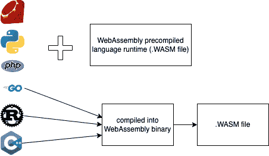
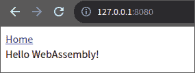

# *第十四章*：构建全栈应用程序

在本章中，我们将学习如何构建一个简单的 WebAssembly 应用程序，并使用 Rocket 来提供 WebAssembly 应用程序。我们将使 WebAssembly 从我们之前创建的一个端点中加载用户信息。学习本章中的信息后，您将能够使用 Rust 编写和构建 WebAssembly 应用程序。您将学习如何使用 Rocket 网络框架提供 WebAssembly。

在本章中，我们将涵盖以下主要主题：

+   介绍 WebAssembly

+   设置 Cargo 工作区

+   设置 WebAssembly 构建目标

+   使用 Yew 编写 WebAssembly 应用程序

+   使用 Rocket 提供 WebAssembly 应用程序

# 技术要求

本章的技术要求非常简单：Rust 编译器、Cargo 命令行和一个网页浏览器。

您可以在[`github.com/PacktPublishing/Rust-Web-Development-with-Rocket/tree/main/Chapter14`](https://github.com/PacktPublishing/Rust-Web-Development-with-Rocket/tree/main/Chapter14)找到本章的代码。

# 介绍 WebAssembly

在过去，几乎所有的网页浏览器应用程序都是使用 JavaScript 语言制作的。也有尝试在网页浏览器中使用不同语言的情况，例如 Java Applet、Adobe Flash 和 Silverlight。但是，所有这些不同的尝试都不是网络标准，因此这些尝试的采用并没有像 JavaScript 那样普遍。

然而，有一种方法可以在网页浏览器中使用其他编程语言：通过使用**WebAssembly**。WebAssembly 既是一种二进制可执行格式，也是对应于基于栈的虚拟机的文本格式。支持 WebAssembly 的网页浏览器可以执行二进制可执行格式。任何可以编译成 WebAssembly 的编程语言都可以由网页浏览器执行。

2015 年，WebAssembly 被宣布，并于 2017 年 3 月首次发布。所有主要的网页浏览器供应商都在 2017 年 9 月完成了对至少支持 WebAssembly 的浏览器的发布，然后万维网联盟于 2019 年 12 月 5 日推荐了 WebAssembly。

类似于 C++或 Rust 这样的编译型语言可以被编译成`.wasm`文件，然后浏览器中的虚拟机可以运行 WebAssembly 文件。要运行解释型语言，首先，语言运行时可以被编译成`.wasm`文件，然后运行时可以运行运行时脚本。



图 14.1 - WebAssembly 中的解释型语言和编译型语言

Rust 编程语言支持 WebAssembly，而且我们已经学习了 Rust 并使用 Rust 和 Rocket 创建了一个后端应用程序，我们可以利用这个机会学习一点使用 Rust 开发前端应用程序。旧的网络标准和网络技术，如 HTML、CSS 和 JavaScript，是改变了人类历史进程的技术。了解新的网络标准，如 WebAssembly，是成为未来开发一部分的好机会。

让我们在应用程序中实现一个页面，我们将渲染一个空模板。模板将从服务器加载 WebAssembly 二进制文件。WebAssembly 将调用我们之前创建的用户 API 端点。然后，它将使用自定义组件渲染用户。

对于实现，我们将使用 Yew ([`yew.rs`](https://yew.rs))，这是一个前端 Rust 框架。

# 设置 Cargo 工作区

由于我们即将创建一个新的应用程序，如果我们能让 `our_application` Rocket 应用程序的代码与这个新应用程序一起工作那就很好了。Cargo 有一个名为 **Cargo 工作区** 的功能。Cargo 工作区是在单个目录中包含多个 Cargo 包的集合。

让我们按照以下步骤设置一个 Cargo 工作区，以便在单个目录中拥有多个应用程序：

1.  创建一个目录，例如，`01Wasm`。

1.  将 `our_application` 目录移动到 `01Wasm` 目录内，并在 `01Wasm` 目录内创建一个新的 `Cargo.toml` 文件。

1.  按照以下方式编辑 `Cargo.toml` 文件：

    ```rs
    [workspace]
    members = [
      "our_application",
    ]
    ```

1.  在 `01Wasm` 内使用以下命令创建一个新的 Rust 应用程序：

    ```rs
    cargo new our_application_wasm
    ```

1.  然后，将新应用程序添加到 `01Wasm/Cargo.toml` 中的工作区成员，如下所示：

    ```rs
    members = [
      "our_application",
      "our_application_wasm",
    ]
    ```

1.  使用以下命令尝试构建这两个应用程序：

    ```rs
    cargo build
    ```

1.  要构建或运行其中一个应用程序，请使用二进制包名称添加 `--bin`，或使用库包名称添加 `--lib`。要运行应用程序，请考虑运行 Rocket 应用程序所需的目录位置。例如，如果没有日志目录，应用程序可能无法运行。此外，如果没有静态目录，应用程序可能无法找到资产文件。

1.  在终端中运行此命令尝试构建其中一个应用程序：

    ```rs
    cargo build --bin our_application
    ```

现在我们已经设置了 Cargo 工作区，我们可以学习如何为不同的目标构建应用程序，特别是针对 WebAssembly 的应用程序。

# 设置 WebAssembly 构建目标

Rust 编译器可以设置为编译到不同的架构。这些架构也称为 `x86_64-unknown-linux_gnu` 和 `x86_64-apple-darwin`。

目标可以分为三个级别，一级、二级和三级：

+   **一级**意味着目标保证能够正常工作。

+   **二级**意味着目标保证能够构建，但有时为这些目标构建的二进制文件的自动化测试可能不会通过。此级别的宿主工具和完整标准库也得到支持。

+   **Tier 3**表示 Rust 代码库支持目标的一些功能。为这些目标构建可能存在也可能不存在，并且工具可能不完整。

记住，WebAssembly 是一个虚拟机的二进制格式。Rust 编译器有针对虚拟机规范的 target，例如`asmjs-unknown-emscripten`、`wasm32-unknown-emscripten`或`wasm32-unknown-unknown`。社区主要支持围绕`wasm32-unknown-unknown`的工具。

要查看 Rust 编译器的可用目标列表，请在终端中运行以下命令：

```rs
rustup target list
```

要为 Rust 编译器添加 WebAssembly 目标支持，请在终端中运行以下命令：

```rs
rustup target add wasm32-unknown-unknown
```

添加目标后，通过运行此命令尝试构建`our_application_wasm`：

```rs
cargo build --target wasm32-unknown-unknown --bin our_application_wasm
```

在下一节中，我们将使用`wasm32-unknown-unknown`来构建 WebAssembly 应用程序。

# 使用 Yew 编写 WebAssembly 应用程序

在应用程序中，我们将使用 Yew（https://yew.rs）。在网站上，它说 Yew 是一个用于创建多线程前端 Web 应用程序的现代 Rust 框架。

Cargo 可以编译 WebAssembly 二进制文件，但如果没有其他步骤，WebAssembly 二进制文件本身是不可用的。我们必须在 Web 浏览器的虚拟机引擎中加载 WebAssembly 二进制文件。有一些提议，例如使用`<script type="module"></script>`标签，但不幸的是，这些提议还没有成为标准。我们必须告诉 JavaScript 使用 WebAssembly Web API 来加载模块。为了使开发更容易，我们可以使用来自 Rust WebAssembly 工作组（https://rustwasm.github.io/）的`wasm-pack`。Yew 使用一个名为`trunk`（https://trunkrs.dev）的应用程序，它封装了`wasm-pack`并提供其他便利。使用以下命令安装`trunk`：

```rs
cargo install --locked trunk
```

现在编译 WebAssembly 的准备已经完成，我们可以为 WebAssembly 应用程序编写代码。按照以下步骤创建应用程序：

1.  在`our_application_wasm`目录内创建一个名为`index.html`的 HTML 文件。我们将使用此 HTML 文件来模拟`our_application`上的模板，但有细微差别。我们希望为 HTML 标签添加一个 ID，使其成为 WebAssembly 应用程序的主要标签。让我们称这个 ID 为`main_container`。将以下行追加到`our_application_wasm/index.html`：

    ```rs
    <!DOCTYPE html>
    <html lang="en">
    <head>
    </head>
    <body>
      <header>
        <a href="/" class="button">Home</a>
      </header>
      <div class="container" id="main_container"></div>
    </body>
    </html>
    ```

1.  将`yew`作为依赖项添加到`our_application_wasm`中。我们还想访问浏览器 DOM，因此需要另一个依赖项。Gloo ([`gloo-rs.web.app/`](https://gloo-rs.web.app/))提供了对 Web API 的绑定，我们希望将`gloo_utils`作为我们的 WebAssembly 应用程序的依赖项来访问 DOM。将以下依赖项添加到`our_application_wasm/Cargo.toml`中：

    ```rs
    gloo-utils = "0.1.3"
    yew = "0.19"
    getrandom = { version = "0.2", features = ["js"] }
    ```

1.  在`our_application_wasm/src/main.rs`中添加所需的`use`声明：

    ```rs
    use gloo_utils::document;
    use yew::prelude::*;
    ```

1.  在`our_application_wasm/src/main.rs`中创建一个最小的组件，创建一个空的 HTML：

    ```rs
    #[function_component(App)]
    fn app() -> Html {
        html! {
            <>{"Hello WebAssembly!"}</>
        }
    }
    ```

1.  在`our_application_wasm/src/main.rs`的`main()`函数中使用`gloo_utils`选择具有`main_container` ID 的`div`标签。在`main()`函数中追加以下行：

    ```rs
    let document = document();
    let main_container = document.query_selector("#main_container").unwrap().unwrap();
    ```

1.  通过将此行添加到`main()`函数来初始化 Yew 应用程序：

    ```rs
    yew::start_app_in_element::<App>(main_container);
    ```

1.  我们可以使用`trunk`创建一个小的 Web 服务器，构建构建 WebAssembly 和相关 JavaScript 所需的一切，以加载 WebAssembly 并服务 HTML。在`our_application_wasm`目录内的终端中运行以下命令：

    ```rs
    trunk serve
    ```

终端中应该有如下输出：

```rs
Apr 27 20:35:44.122  INFO fetching cargo artifacts
Apr 27 20:35:44.747  INFO processing WASM
Apr 27 20:35:44.782  INFO using system installed binary app="wasm-bindgen" version="0.2.80"
Apr 27 20:35:44.782  INFO calling wasm-bindgen
Apr 27 20:35:45.065  INFO copying generated wasm-bindgen artifacts
Apr 27 20:35:45.072  INFO applying new distribution
Apr 27 20:35:45.074  INFO ✅ success
Apr 27 20:35:45.074  INFO 📡 serving static assets at -> /
Apr 27 20:35:45.075  INFO 📡 server listening at 0.0.0.0:8080
Apr 27 20:53:10.796  INFO 📦 starting build
Apr 27 20:53:10.797  INFO spawning asset pipelines
Apr 27 20:53:11.430  INFO building our_application_wasm
```

1.  尝试打开一个网络浏览器到`http://127.0.0.1:8080`；你会看到它加载并运行 Yew WebAssembly 应用程序：



图 14.2 - Hello WebAssembly！

1.  我们将使用一个 API 端点来获取用户信息，该端点返回我们在`our_application`中之前创建的 JSON，从`http://127.0.0.1:8000/api/users`。要将 JSON 转换为 Rust 类型，让我们定义与`our_application`中相似的类型。这些类型应该派生自 SerDes 的`deserialize`。在`our_application_wasm/Cargo.toml`中，添加 WebAssembly 代码的依赖项：

    ```rs
    chrono = {version = "0.4", features = ["serde"]}
    serde = {version = "1.0.130", features = ["derive"]}
    uuid = {version = "0.8.2", features = ["v4", "serde"]}
    ```

1.  然后，在`our_application_wasm/src/main.rs`中添加所需的`use`声明：

    ```rs
    use chrono::{offset::Utc, DateTime};
    use serde::Deserialize;
    use std::fmt::{self, Display, Formatter};
    use uuid::Uuid;
    ```

1.  最后，添加用于反序列化 JSON 的类型：

    ```rs
    #[derive(Deserialize, Clone, PartialEq)]
    enum UserStatus {
        Inactive = 0,
        Active = 1,
    }
    impl fmt::Display for UserStatus {
        fn fmt(&self, f: &mut fmt::Formatter<'_>) -> 
        fmt::Result {
            match *self {
                UserStatus::Inactive => write!(f, 
                "Inactive"),
                UserStatus::Active => write!(f, "Active"),
            }
        }
    }
    #[derive(Copy, Clone, Deserialize, PartialEq)]
    struct OurDateTime(DateTime<Utc>);
    impl fmt::Display for OurDateTime {
        fn fmt(&self, f: &mut fmt::Formatter<'_>) -> 
        fmt::Result {
            write!(f, "{}", self.0)
        }
    }
    #[derive(Deserialize, Clone, PartialEq)]
    struct User {
        uuid: Uuid,
        username: String,
        email: String,
        description: Option<String>,
        status: UserStatus,
        created_at: OurDateTime,
        updated_at: OurDateTime,
    }
    #[derive(Clone, Copy, Deserialize, PartialEq)]
    struct Pagination {
        next: OurDateTime,
        limit: usize,
    }
    #[derive(Deserialize, Default, Properties, PartialEq)]
    struct UsersWrapper {
        users: Vec<User>,
        #[serde(skip_serializing_if = "Option::is_none")]
        #[serde(default)]
        pagination: Option<Pagination>,
    }
    ```

    注意

    为了改进重新定义类型，我们可以创建一个库，该库定义的类型可以由两个应用程序使用。

1.  如果我们查看`User`结构体，我们可以看到描述字段是一个`Option`。创建一个便利函数，如果值是`None`，则返回一个空`String`，如果值是`Some`，则返回`String`的内容。将以下函数添加到`our_application_wasm/src/main.rs`：

    ```rs
    struct DisplayOption<T>(pub Option<T>);
    impl<T: Display> Display for DisplayOption<T> {
        fn fmt(&self, f: &mut Formatter) -> fmt::Result {
            match self.0 {
                Some(ref v) => write!(f, "{}", v),
                None => write!(f, ""),
            }
        }
    }
    ```

1.  现在是时候实现一个将渲染`User`的组件了。我们将该组件命名为`UsersList`。将以下函数添加到`our_application_wasm/src/main.rs`：

    ```rs
    #[function_component(UsersList)]
    fn users_list(UsersWrapper { users, .. }: &UsersWrapper) -> Html {
        users.iter()
            .enumerate().map(|user| html! {
            <div class="container">
                <div><mark class="tag">{ format!("{}", 
                user.0) }</mark></div>
                <div class="row">
                    <div class="col-sm-3"><mark>{ "UUID:" 
                    }</mark></div>
                    <div class="col-sm-9"> { format!("{}", 
                    user.1.uuid) }</div>
                </div>
                <div class="row">
                    <div class="col-sm-3"><mark>{ 
                    "Username:" }</mark></div>
                    <div class="col-sm-9">{ format!("{}", 
                    user.1.username) }</div>
                </div>
                <div class="row">
                    <div class="col-sm-3"><mark>{ "Email:" 
                    }</mark></div>
                    <div class="col-sm-9"> { format!("{}", 
                    user.1.email) }</div>
                </div>
                <div class="row">
                    <div class="col-sm-3"><mark>{ 
                    "Description:" }</mark></div>
                    <div class="col-sm-9"> { format!("{}", 
                    DisplayOption(user.1.description.
                    as_ref())) }</div>
                </div>
                <div class="row">
                    <div class="col-sm-3"><mark>{ 
                    "Status:" }</mark></div>
                    <div class="col-sm-9"> { format!("{}", 
                    user.1.status) }</div>
                </div>
                <div class="row">
                    <div class="col-sm-3"><mark>{ "Created 
                    At:" }</mark></div>
                    <div class="col-sm-9"> { format!("{}", 
                    user.1.created_at) }</div>
                </div>
                <div class="row">
                    <div class="col-sm-3"><mark>{ "Updated 
                    At:" }</mark></div>
                    <div class="col-sm-9"> { format!("{}", 
                    user.1.updated_at) }</div>
                </div>
                <a href={format!("/users/{}", 
                user.1.uuid)} class="button">{ "See user" 
                }</a>
            </div>
        }).collect()
    }
    ```

注意，`html!`宏的内容看起来像`our_application/src/views/users/_user.html.tera`的内容。

1.  我们希望从 API 端点加载`User`数据。我们可以通过使用两个库来实现这一点，`reqwasm`（它提供 HTTP 请求功能），以及`wasm-bindgen-futures`（它将 Rust `futures`转换为 JavaScript `promise`和反之亦然）。将以下依赖项添加到`our_application_wasm/Cargo.toml`：

    ```rs
    reqwasm = "0.2"
    wasm-bindgen-futures = "0.4"
    ```

1.  在`our_application_wasm/src/main.rs`中，为我们的 API 端点添加一个`const`。添加以下行：

    ```rs
    const USERS_URL: &str = "http://127.0.0.1:8000/api/users";
    ```

1.  实现获取`User`数据的例程。添加所需的`use`声明：

    ```rs
    use reqwasm::http::Request;
    ```

然后，在`our_application_wasm/src/main.rs`中的`app()`函数内追加以下行：

```rs
fn app() -> Html {
    let users_wrapper = use_state(|| UsersWrapper::
    default());
    {
        let users_wrapper = users_wrapper.clone();
        use_effect_with_deps(
            move |_| {
let users_wrapper = 
                users_wrapper.clone();
                wasm_bindgen_futures::spawn_
                local(async move {
let fetched_users_wrapper: 
                    UsersWrapper = Request::get(
                    USERS_URL)
                        .send()
                        .await
                        .unwrap()
                        .json()
                        .await
                        .unwrap();
                    users_wrapper.set(fetched_
                    users_wrapper);
                });
                || ()
            },
            (),
        );
    }
}
```

1.  在`users_wrapper`获取下的`{}`块中，设置`next`和`limit`的值。追加以下行：

    ```rs
    let users_wrapper = use_state(|| UsersWrapper::default());
    {
        ...
    }
    let (next, limit): (Option<OurDateTime>, Option<usize>) = if users_wrapper.pagination.is_some()
    {
        let pagination = users_wrapper.
        pagination.as_ref().unwrap();
        (Some(pagination.next), Some(pagination.limit))
    } else {
        (None, None)
    };
    ```

1.  将 HTML 从`Hello WebAssembly!`更改为显示正确的`User`信息。我们希望使用我们之前创建的`UsersList`组件。将`html!`宏内容更改为以下内容：

    ```rs
    html! {
        <>
            <UsersList users = {users_wrapper.
            users.clone()}/>
            if next.is_some() {
                <a href={ format!("/users?
                pagination.next={}&pagination.limit={}", 
                DisplayOption(next), DisplayOption(limit)) 
                } class="button">
                    { "Next" }
                </a>
            }
        </>
    }
    ```

1.  通过在终端运行此命令来构建 `our_application_wasm` WebAssembly 和 JavaScript：

    ```rs
    trunk build
    ```

命令应在 `dist` 目录中生成三个文件：`index.html`、一个具有随机名称的 WebAssembly 文件和一个具有随机名称的 JavaScript 文件。`dist` 目录中随机 WebAssembly 和 JavaScript 文件的示例是 `index-9eb0724334955a2a_bg.wasm` 和 `index-9eb0724334955a2a.js`。

到目前为止，我们已经成功编写并构建了一个 WebAssembly 应用程序。在下一节中，我们将学习如何使用 Rocket 服务 WebAssembly 应用程序。

# 使用 Rocket 服务 WebAssembly 应用程序

在本节中，我们将按照以下步骤使用以下步骤来服务 WebAssembly 网络应用程序：

1.  要在 `our_application` 中运行 WebAssembly 文件，我们需要对 `our_application` 进行一点修改。首先，将 WebAssembly 和 JavaScript 从 `our_application_wasm/dist` 复制到 `our_application/static` 目录。

1.  编辑模板以能够选择性地在 `our_application/src/views/template.html.tera` 中使用 WebAssembly，如下所示：

    ```rs
    <head>
      ...
      
      <meta...> 
    </head>
    <body>
      ...
      
    </body>
    ```

1.  添加一个名为 `our_application/src/views/users/wasm.html.tera` 的新模板文件。编辑文件以确保 HTML 文件加载必要的 WebAssembly 和 JavaScript 文件，并在正确的 DOM 上运行 WebAssembly。添加以下行：

    ```rs
    
    
    <link rel="preload" href="/assets/index-9eb0724334955a2a_bg.wasm" as="fetch" type="application/wasm" crossorigin="">
    <link rel="modulepreload" href="/assets/index-9eb0724334955a2a.js">
    
    
    <div id="main_container"></div>
    
    
    <script type="module">import init from '/assets/index-9eb0724334955a2a.js';init('/assets/index-9eb0724334955a2a_bg.wasm');</script>
    
    ```

1.  添加一个新的路由处理函数来加载生成的 HTML。在 `our_application/src/routes/user.rs` 中添加以下函数：

    ```rs
    #[get("/users/wasm", format = "text/html")]
    pub async fn wasm() -> HtmlResponse {
        let context = context! {};
        Ok(Template::render("users/wasm", context))
    }
    ```

1.  最后，别忘了加载路由。在 `our_application/src/lib.rs` 中添加新路由：

    ```rs
    user::delete_user_entry_point,
    user::wasm,
    post::get_post,
    ```

1.  通过在 `our_application` 目录中运行 `cargo run` 来运行 `our_application` 网络服务器，然后在网页浏览器中打开 `http://127.0.0.1:8000/users/wasm`。如果我们检查网页浏览器开发者工具，我们可以看到网页浏览器运行了 JavaScript 和 WebAssembly，如下面的截图所示：


图 14.3 - 网页浏览器加载和运行 our_application_wasm

通过修改带有 `main_container` 标签的标签，然后从 `http://127.0.0.1:8000/api/users` 加载 JSON 并在网页浏览器中正确渲染 HTML，WebAssembly 应该可以正常运行。

# 摘要

互联网技术已经发展到允许网络浏览器运行虚拟机的通用二进制格式。现在，网络浏览器可以运行由 Rust 编译器生成的二进制文件。

在本章中，我们概述了 WebAssembly，以及如何准备 Rust 编译器以编译到 WebAssembly。我们还学习了如何设置 Cargo 工作区，以便在单个目录中拥有多个应用程序。

然后，我们学习了如何编写一个简单的前端应用程序，该应用程序使用 Yew 和其他 Rust 库从我们之前创建的 `our_application` API 端点加载 `User` 数据。

最后，我们完成了如何在 `our_application` 网络服务器中服务生成的 WebAssembly 和 JavaScript。

下一章是最后一章，我们将探讨如何扩展 Rocket 应用并寻找其替代方案。
