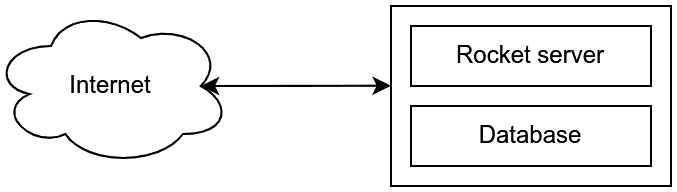
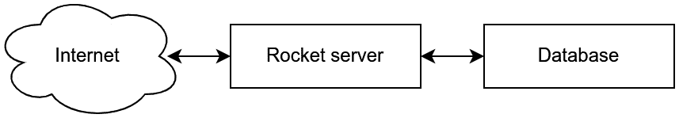
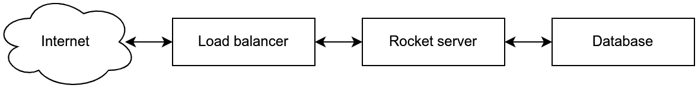
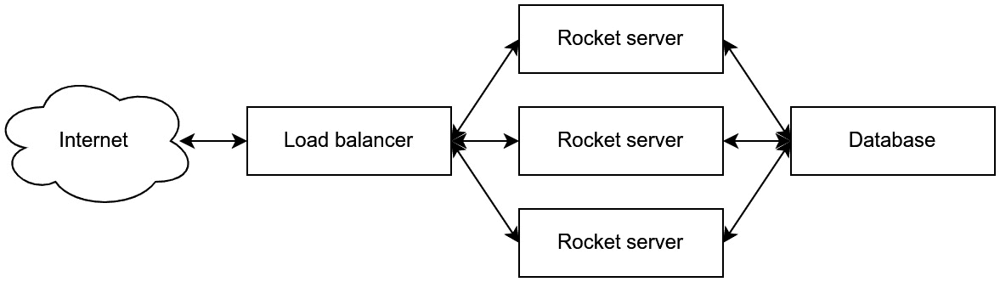
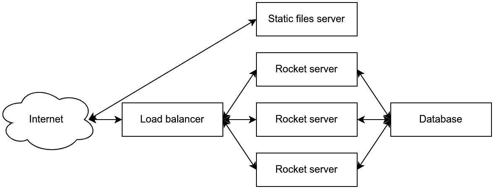
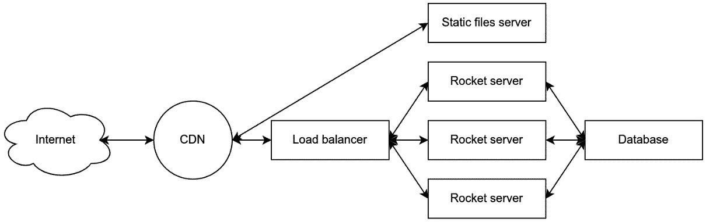
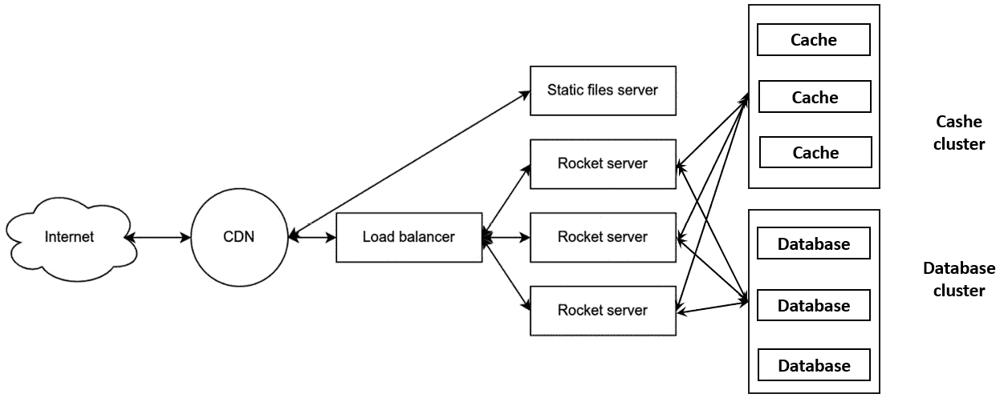

# 第十五章：*第十五章*：改进 Rocket 应用程序

现在我们已经完成了简单的应用程序，在本章的最后一节，我们将探讨我们可以对 Rocket 应用程序进行的改进。

在本章中，我们将了解如何添加各种技术，如日志、跟踪和监控，以使 Rocket 应用程序达到现代 Web 开发的标准。我们将探讨缩放 Rocket 应用程序的技术。

我们还将探索其他用于 Rust 语言的 Web 框架。一个 Web 框架可能不是适合所有事情的最好工具，因此通过了解其他 Web 框架，我们可以拓宽我们对 Rust Web 生态系统的知识。

在本章中，我们将涵盖以下主要主题：

+   扩展 Rocket 应用程序

+   缩放 Rocket 应用程序

+   探索替代的 Rust Web 框架

# 技术要求

本章的技术要求非常简单：Rust 编译器、Cargo 命令行和一个 Web 浏览器。

您可以在[`github.com/PacktPublishing/Rust-Web-Development-with-Rocket/tree/main/Chapter15`](https://github.com/PacktPublishing/Rust-Web-Development-with-Rocket/tree/main/Chapter15)找到本章的代码。

# 扩展 Rocket 应用程序

我们已经成功从头开始创建了一个简单的 Rocket 应用程序，从基本的 Rocket 概念如路由开始。有很多事情可以做来改进应用程序。在本节中，我们将讨论我们可以使用的库，以添加功能和改进系统。

## 添加日志

在现代设置中，一个好的 Web 应用程序通常需要日志和监控系统来获取有关系统本身的信息。之前，我们学习了如何向 Rocket 应用程序添加日志。日志系统将信息写入 `stdout` 和文件。我们可以通过使用分布式日志系统来改进日志系统，其中应用程序将日志发送到另一个服务器以创建应用程序事件的持续记录。

我们可以创建一个 Rocket 防火墙，将日志事件发送到第三方日志服务器，如 Logstash、Fluentd 或 Datadog。然后，日志可以被提取、转换、聚合、过滤，并用于进一步分析。

一个可以将日志发送到 Fluentd 的 crate 示例是[`github.com/tkrs/poston`](https://github.com/tkrs/poston)。使用 `poston` crate，我们可以创建一个工作池，定期将数据发送到 Fluentd 服务器。

## 将日志扩展到跟踪

在为 Rocket 应用程序设置日志之后，我们可以通过跟踪概念进一步改进日志功能。通常，日志关注记录单个事件，而跟踪关注应用程序的工作流程。有几个术语是常用的，包括 **日志**、**事件**、**跨度**和 **跟踪**。

**log**是程序员用来捕获数据的单个信息片段，而**event**是日志的结构化形式。例如，假设我们有一个使用**通用日志格式**（[`en.wikipedia.org/wiki/Common_Log_Format`](https://en.wikipedia.org/wiki/Common_Log_Format)）的日志，如下所示：

```rs
127.0.0.1 user-identifier frank [10/Oct/2000:13:55:36 -0700] "GET /apache_pb.gif HTTP/1.0" 200 2326
```

我们可以将日志转换为事件，如下所示：

```rs
{
    "request.host": "127.0.0.1",
    "request.ident": "user-identifier",
    "request.authuser": "frank",
    "request.date": "2000-10-10 13:55:36-07",
    "request.request": "GET /apache_pb.gif HTTP/1.0",
    "request.status": 200,
    "request.bytes": 2326,
}
```

**span**是一种日志类型，但它覆盖的是一段时间，而不是单一时间点的信息。最后，**trace**是一系列 span 的集合，可以用来创建应用程序各部分的流程。

假设我们有一个名为`Trace`的公平性 Rocket 应用程序，我们可以通过使用`Trace`公平性和以下步骤来实现跟踪：

1.  创建一个实现 Rocket 请求保护的 struct，例如，`RequestID`。

1.  当请求到达时，`Trace`公平性将`request_id`（`RequestID`的一个实例）分配给`Request`实例。

1.  然后，`Trace`公平性创建一个包含`request_id`和`start_time`信息的日志。

1.  一个路由处理函数随后检索`request_id`作为参数，因为结构实现了 Rocket 请求保护。

1.  在路由处理函数内部，我们希望应用程序首先做的是创建一个包含`request_id`和`function_start_time`信息的日志。

1.  我们可以在函数内部添加各种日志来记录时间；例如，在我们向数据库发送查询之前，我们创建一个包含`request_id`和时间信息的日志。稍后，当我们从数据库接收到响应时，我们再次创建一个日志。

1.  然后，我们可以在函数返回之前再次添加一个日志，包含`request_id`和时间，以标记函数的结束。

1.  最后，在`Trace`公平性中，我们再次使用`request_id`和`end_time`创建一个日志。

通过转换和分析日志，我们可以将具有相同`request_id`的日志构建成 span。最后，我们可以将 span 的树状结构构建成一个 trace，记录 Rocket 请求-响应生命周期中每个事件的计时。通过使用跟踪信息，我们可以确定哪些应用程序部分可以进一步改进。

有几个 crate 我们可以用来进行跟踪，例如，[`docs.rs/tracing/latest/tracing/`](https://docs.rs/tracing/latest/tracing/) 和 [`docs.rs/tracing-log/latest/tracing_log/`](https://docs.rs/tracing-log/latest/tracing_log/)，它们将 Rust 日志功能与跟踪功能桥接。

## 设置监控

在 Rocket 应用程序中使用日志和跟踪来获取信息时，监控是获取系统信息以评估系统自身能力的过程。例如，我们收集 Rocket 应用程序的服务器 CPU 使用情况。

对于监控，我们可以使用 Prometheus 与 Grafana 作为可视化工具，Datadog 或其他第三方应用程序。我们通常安装一个代理，这是一个收集并发送各种系统信息到分布式监控服务器的应用程序。

尽管没有直接连接到 Rocket 应用程序，通常监控系统也会收集有关应用程序本身的信息。例如，在容器化环境中，有活性和就绪概念确保容器准备好接收其预期功能。

我们可以在 Rocket 应用程序中设置一个返回`200` HTTP 状态码的路由，或者一个 ping 数据库并返回`200` HTTP 状态码的路由。然后我们可以告诉监控系统定期检查 Rocket 应用程序的响应。如果有响应，这意味着应用程序仍然运行正确，但没有响应则意味着 Rocket 应用程序存在问题。

## 设置邮件和警报系统

有时，我们需要在 Web 应用程序中实现邮件功能。例如，当用户在网站上注册时，系统随后会发送一封验证邮件。有几个库可以用于 Rust 发送邮件。例如，有一个名为 Lette 的 crate ([`crates.io/crates/lettre`](https://crates.io/crates/lettre))。让我们看看发送邮件的示例代码。

在`Cargo.toml`中添加以下依赖项：

```rs
[dependencies]
```

```rs
lettre = "0.9"
```

```rs
lettre_email = "0.9"
```

在应用程序中，例如在`src/lib.rs`中，我们可以添加以下函数来发送邮件：

```rs
use lettre::{SmtpClient, Transport};
```

```rs
use lettre_email::EmailBuilder;
```

```rs
fn send_email(email: &str, name: &str) -> Result<String, String> {
```

```rs
    let email = EmailBuilder::new()
```

```rs
        .to((email, name))
```

```rs
        .from("admin@our_application.com")
```

```rs
        .subject("Hi, welcome to our_application")
```

```rs
        .text("Hello, thank you for joining our_
```

```rs
        application.")
```

```rs
        .build()
```

```rs
        .unwrap();
```

```rs
    let mut mailer = SmtpClient::new_unencrypted_
```

```rs
    localhost().unwrap().transport();
```

```rs
    mailer
```

```rs
        .send(email.into())
```

```rs
        .map(|_| String::from("Successfuly sent email"))
```

```rs
        .map_err(|_| String::from("Couldn't send email"))
```

```rs
}
```

我们还可以向应用程序添加一个警报系统，用于在出现问题时发出警报。我们可以使用第三方通知系统或使用邮件系统在出现问题时发送通知。

现在我们已经探讨了多种改进 Rocket 应用程序的方法，让我们扩展我们的应用程序。

# 扩展 Rocket 应用程序

在开发 Rocket 应用程序并将其部署到生产环境之后，由于使用量的增加，应用程序可能需要扩展。有几种扩展 Web 应用程序的方法，它们可以分为两类：垂直扩展和水平扩展。

**垂直扩展**意味着为单个节点增加资源。例如，我们用速度更快的 CPU 替换运行 Rocket 应用程序的计算机的 CPU。垂直扩展的另一个例子是在运行 Rocket 应用程序的计算机中增加 RAM 的数量。

**水平扩展**是通过添加更多节点或更多计算机来处理工作负载来扩展应用程序。水平扩展的一个例子是在两台服务器上运行并设置 Rocket Web 服务器。

假设我们有以下系统：



图 15.1 – 简单的 Rocket 应用程序

我们首先可以将数据库移动到另一台服务器，如下所示：



图 15.2 – 分离数据库

然后，我们可以添加负载均衡器，如下所示：



图 15.3 – 添加负载均衡器

负载均衡器可以是硬件负载均衡器，IaaS（基础设施即服务）负载均衡器，如 AWS Load Balancer，Kubernetes 负载均衡器，或者软件负载均衡器，如 HAProxy 或 NGINX。

在添加负载均衡器后，我们还可以添加其他机器，每台机器都有自己的 Rocket 服务器实例，如下所示：



图 15.4 – 水平扩展 Rocket 应用程序

如果我们想要负载均衡 Rocket 服务器，有一些事情我们需要注意，例如，确保 `Rocket.toml` 中的 `"secret_key"` 在所有 Rocket 服务器实例中相同。我们还可以确保我们的会话库和 cookie 不在每个实例的内存中存储内容，而是在共享存储中，例如数据库。

另一个提高 Rocket 应用程序扩展性的想法是将静态文件或资源托管在它们自己的服务器上。静态文件服务器可以是通用的 Web 服务器，如 Apache HTTP 服务器或 NGINX，或者像 AWS S3 或 Azure Storage 这样的服务。我们需要注意的一件事是在生成 Rocket 响应时，我们需要将静态资源设置到正确的服务器上。例如，我们不必将 HTML CSS 设置为 `"./mini-default.css"`，而必须设置为 `"`[`static.example.com/mini-default.css`](https://static.example.com/mini-default.css)`"`.

在以下图中可以看到静态服务器与负载均衡器的示意图：



图 15.5 – 添加静态文件服务器

我们还可以添加一个 **内容分发网络** (**CDN**) 来在系统中分配负载，如下所示：



图 15.6 – 添加 CDN

CDN 可以来自 IaaS，例如 AWS CloudFront 或 GCP Cloud CDN，或者第三方 CDN 提供商，如 Fastly、Akamai 或 Cloudflare。这些 CDN 在各种地理位置提供服务器，并可以提供缓存和更快的网络连接，使我们的应用程序运行更快。

在基本扩展后，系统可以进一步扩展，例如通过添加数据库复制或集群，或者添加缓存系统，如 Redis 或 Redis 缓存集群。以下是一个此类系统的示例：



图 15.7 – 添加数据库集群和缓存集群

系统扩展的一个重要部分是确定哪些部分的规格可以改进，或者哪些部分可以隔离到自己的服务器中，例如，增加运行 Rocket 服务器的计算机的 CPU，或者将数据库移动到自己的服务器，然后稍后从单个服务器扩展数据库到数据库集群。

现在我们已经学习了扩展 Rocket 应用程序的基本技术，让我们在下一节讨论一些与 Rocket Web 框架类似的软件。

# 探索 Rust Web 框架的替代方案

Rocket 是 Rust 编程语言的优秀 Web 框架，但有时我们可能需要其他工具来构建 Web 应用程序。在本节中，我们将探讨一些 Rocket Web 框架的替代方案。这些替代框架包括 Actix Web、Tide 和 Warp。让我们逐一检查这些 Web 框架。

## Actix Web

Rocket 的一个很好的替代方案是 Actix Web ([`actix.rs/`](https://actix.rs/))。就像 Rocket 一样，Actix Web 是一个 Web 框架。最初，它是在 Actix crate（一个演员框架）之上创建的。如今，Actix 的功能不再使用，因为 Rust 的 futures 和 `async`/`await` 生态系统正在成熟。

就像 Rocket 一样，Actix Web 包含诸如路由、请求提取器、表单处理器、响应处理器和中间件系统等概念。Actix Web 还提供了诸如静态文件处理器、数据库连接、模板化等功能。

让我们看看一个 Actix Web 的代码示例，以了解它与 Rocket 的相似之处。

在 `Cargo.toml` 中，添加以下内容：

```rs
[dependencies]
```

```rs
actix-web = "4.0.1"
```

在 `src/main.rs` 中，添加以下内容：

```rs
use actix_web::{get, web, App, HttpServer, Responder};
```

```rs
#[get("/users/{name}")]
```

```rs
async fn user(name: web::Path<String>) -> impl Responder {
```

```rs
    format!("Hello {name}!")
```

```rs
}
```

```rs
#[actix_web::main]
```

```rs
async fn main() -> std::io::Result<()> {
```

```rs
    HttpServer::new(|| {
```

```rs
        App::new()
```

```rs
            .route("/hello_world", web::get().to(|| async { 
```

```rs
            "Hello World!" }))
```

```rs
            .service(user)
```

```rs
    })
```

```rs
    .bind(("127.0.0.1", 8080))?
```

```rs
    .run()
```

```rs
    .await
```

```rs
}
```

尝试运行应用程序并打开 `http://127.0.0.1:8080/hello_world` 或 `http://127.0.0.1:8080/users/world` 来查看结果。

## Tide

另一个 Rust Web 框架的替代方案是 Tide ([`github.com/http-rs/tide`](https://github.com/http-rs/tide))。与 Rocket 或 Actix Web 不同，这个框架只提供基本功能，如请求类型、结果类型、会话和中间件。

让我们看看一个 Tide 的代码示例，以了解它与 Rocket 的相似之处。

在 `Cargo.toml` 中，添加以下内容：

```rs
[dependencies]
```

```rs
tide = "0.16.0"
```

```rs
async-std = { version = "1.8.0", features = ["attributes"] }
```

在 `src/main.rs` 中，添加以下内容：

```rs
use tide::Request;
```

```rs
async fn hello_world(_: Request<()>) -> tide::Result {
```

```rs
    Ok(String::from("Hello World!").into())
```

```rs
}
```

```rs
#[async_std::main]
```

```rs
async fn main() -> tide::Result<()> {
```

```rs
    let mut app = tide::new();
```

```rs
    app.at("/hello_world").get(hello_world);
```

```rs
    app.listen("127.0.0.1:8080").await?;
```

```rs
    Ok(())
```

```rs
}
```

通过在命令行中运行 `cargo run` 并在浏览器中打开 `http://127.0.0.1:8080/hello_world` 来运行应用程序。

# Warp

另一个 Rust Web 框架的替代方案是 Warp ([`github.com/seanmonstar/warp`](https://github.com/seanmonstar/warp))。这个框架在其过滤器功能之上提供了各种功能。通过使用过滤器，它可以执行路径路由、提取参数和头部、反序列化查询字符串，并解析各种请求体，如表单、多部分表单数据和 JSON。Warp 还支持服务静态文件、目录、WebSocket、日志、中间件和基本的压缩系统。

让我们看看一个使用 Warp 的示例应用程序。在 `Cargo.toml` 文件中，添加以下内容：

```rs
[dependencies]
```

```rs
tokio = {version = "1", features = ["full"]}
```

```rs
warp = "0.3"
```

在`src/main.rs`文件中，添加以下内容：

```rs
use warp::Filter;
```

```rs
#[tokio::main]
```

```rs
async fn main() {
```

```rs
    let hello = warp::path!("hello_world")
```

```rs
        .and(warp::path::end())
```

```rs
        .map(|| format!("Hello world!"));
```

```rs
    warp::serve(hello).run(([127, 0, 0, 1], 8080)).await;
```

```rs
}
```

再次，像 Tide 和 Warp 示例一样，尝试在浏览器中打开`http://127.0.0.1:8080/hello_world`。

# 摘要

在本章的最后，我们学习了如何改进和扩展 Rocket 应用程序。我们可以使用各种工具来改进 Rocket 应用程序，例如添加日志记录、跟踪、监控和邮件发送器。我们还了解了一些关于扩展 Rocket 应用程序的原则。

最后，我们学习了其他 Rust Web 框架，如 Actix Web、Tide、13 和 Warp。

我们从学习如何创建和构建 Rust 应用程序以及与 Rust 一起工作的工具，如 Cargo 开始这本书。然后，我们学习了 Rocket 应用程序的基础知识，例如请求的生命周期以及如何配置 Rocket 应用程序。

然后，我们继续学习更多概念，例如 Rocket 路由和路由部分，如 HTTP 方法、路径、格式和数据。为了处理路由，我们必须创建一个函数，该函数接收请求对象并返回响应对象。

在继续学习 Rocket 的基础知识之后，我们更深入地了解了 Rocket 组件，例如状态、将数据库与 Rocket 连接以及防热罩。

之后，我们学习了如何组织 Rust 模块以创建更复杂的应用程序。然后，我们设计了一个应用程序并实现了路由来管理用户和帖子等实体。为了管理实体，我们学习了如何编写查询到数据库以添加、获取、修改或删除项目。

然后，我们讨论了更高级的话题，如 Rust 错误处理及其在 Rocket 应用程序中的实现。在继续讨论更高级的话题时，我们还学习了 Rocket 的功能，例如提供静态资产和使用模板生成响应。我们还讨论了如何使用表单，以及如何使用 CSRF 保护表单免受恶意攻击者攻击。

在学习如何处理表单数据后，我们学习了 Rust 泛型和如何在 Rocket 应用程序中应用 Rust 泛型以渲染具有相同特质的`Post`。为了处理`Post`的变体，我们学习了更多关于高级 Rust 编程的知识，包括生命周期和内存安全。我们还学习了在实现`Post`变体的处理时关于`async`编程和多线程的知识。

为了将 Rocket 作为一个现代 Web 框架使用，我们还学习了如何允许 Rocket 应用程序处理 API 和 JSON，使用身份验证和授权来保护应用程序，并学习了如何使用 JWT 来保护 API。

为了确保我们的 Rocket 应用程序按预期工作，我们接着学习了如何测试 Rust 和 Rocket 应用程序。在确认应用程序按预期工作后，我们学习了如何以不同的方式部署应用程序，例如将 Rocket 应用程序放在通用 Web 服务器后面，并使用 Docker 构建和提供 Rocket 应用程序。

为了补充后端应用，我们学习了如何在前端使用 Rust 创建 WebAssembly 应用程序。最后，我们还学习了如何扩展 Rocket 应用程序，以及如何寻找 Rocket 网络框架的替代方案。

现在我们已经掌握了构建 Rust 和 Rocket 应用程序的所有基础知识，我们可以在生产级别的网络应用程序中实现 Rust 和 Rocket 网络框架的技能。为了扩展这本书中的知识，你可以从 Rust 或 Rocket 网站和论坛中学习更多。不要犹豫，尝试使用 Rust 语言和 Rocket 网络框架制作出优秀的应用程序。
