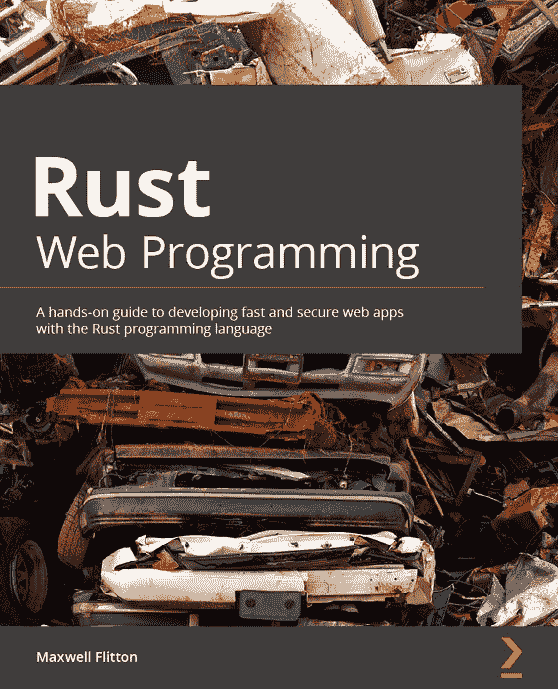
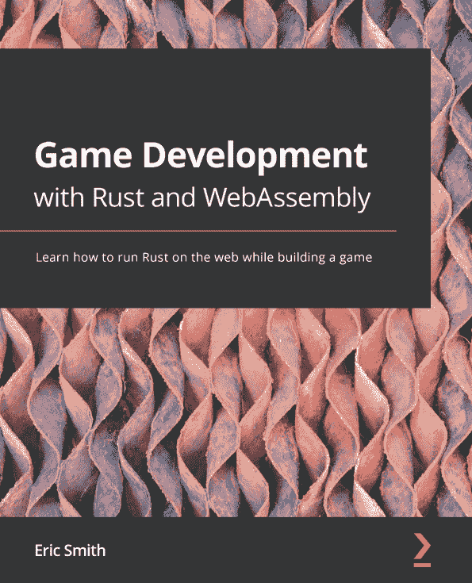

[Packt.com](http://Packt.com)

订阅我们的在线数字图书馆，全面访问超过 7,000 本书籍和视频，以及领先的行业工具，帮助你规划个人发展并推进职业生涯。如需更多信息，请访问我们的网站。

# 第十六章：为什么订阅？

+   使用来自 4,000 多名行业专业人士的实用电子书和视频，节省学习时间，多花时间编码

+   通过为你量身定制的 Skill Plans 提高学习效果

+   每月免费获得一本电子书或视频

+   完全可搜索，便于轻松访问关键信息

+   复制粘贴、打印和收藏内容

你知道吗，Packt 为每本书都提供电子书版本，包括 PDF 和 ePub 文件？你可以在[packt.com](http://packt.com)升级到电子书版本，作为印刷书客户，你有权获得电子书副本的折扣。如需了解更多详情，请联系我们 customercare@packtpub.com。

在[www.packt.com](http://www.packt.com)，你还可以阅读一系列免费的技术文章，订阅各种免费通讯，并享受 Packt 书籍和电子书的独家折扣和优惠。

# 你可能还会喜欢的其他书籍

如果你喜欢这本书，你可能对 Packt 的以下其他书籍也感兴趣：

**Rust Web Programming**

Maxwell Flitton

ISBN: 978-1-80056-081-9

+   在 Rocket、Actix Web 和 Warp 中构建可扩展的 Web 应用

+   使用 PostgreSQL 为你的 Web 应用应用数据持久性

+   为你的 Web 应用构建登录、JWT 和配置模块

+   从 Actix Web 服务器提供 HTML、CSS 和 JavaScript

+   在 Postman 和 Newman 中构建单元测试和功能 API 测试

**Game Development with Rust and WebAssembly**

Eric Smith

ISBN: 978-1-80107-097-3

+   使用 WebAssembly 将 Rust 应用程序构建和部署到 Web 上

+   使用 wasm-bindgen 和 Canvas API 绘制实时图形

+   编写游戏循环并获取键盘输入以进行动态操作

+   探索碰撞检测并创建一个可以在平台上跳上跳下并掉入洞中的动态角色

+   使用状态机管理动画

# Packt 正在寻找像你这样的作者

如果你对成为 Packt 的作者感兴趣，请访问[authors.packtpub.com](http://authors.packtpub.com)并今天申请。我们已与成千上万的开发者和技术专业人士合作，就像你一样，帮助他们将见解分享给全球技术社区。你可以提交一般申请，申请我们正在招募作者的特定热门话题，或者提交你自己的想法。

# 分享你的想法

现在你已经完成了《Rust Web Development with Rocket》的学习，我们非常想听听你的想法！如果你是从亚马逊购买了这本书，请[点击此处直接跳转到亚马逊评论页面](https://packt.link/r/180056130X)并分享你的反馈或在该购买网站上留下评论。

你的评论对我们和科技社区都非常重要，它将帮助我们确保我们提供的是高质量的内容。
