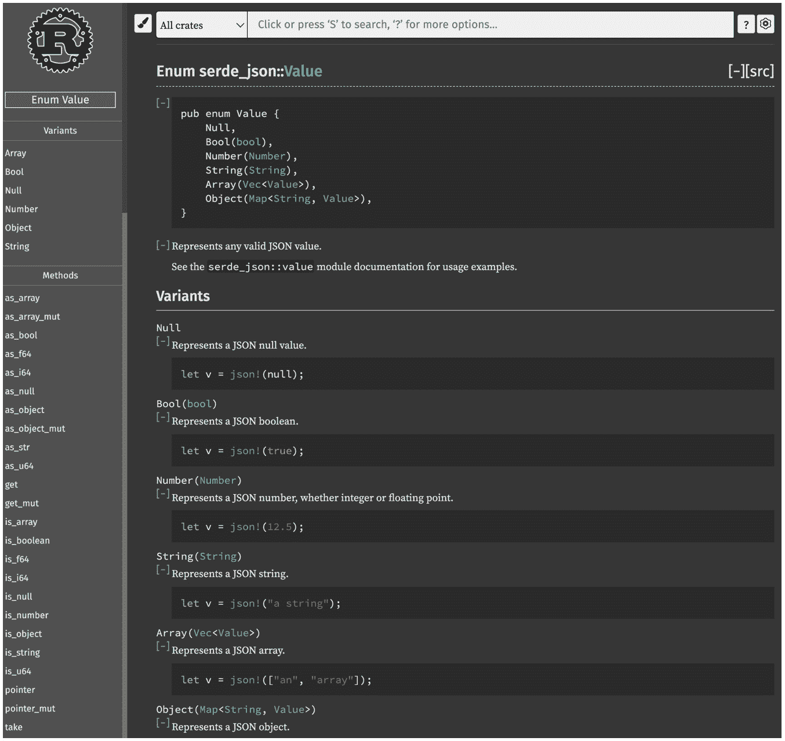
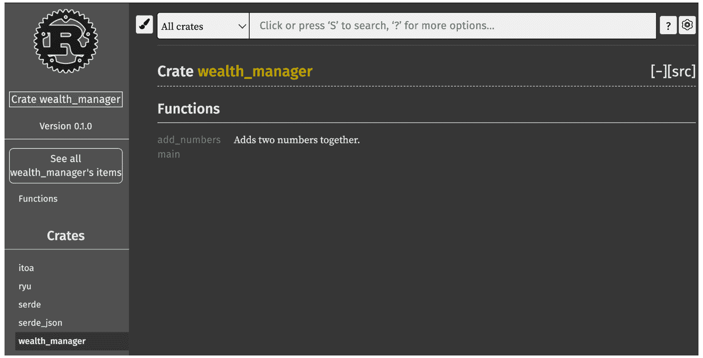
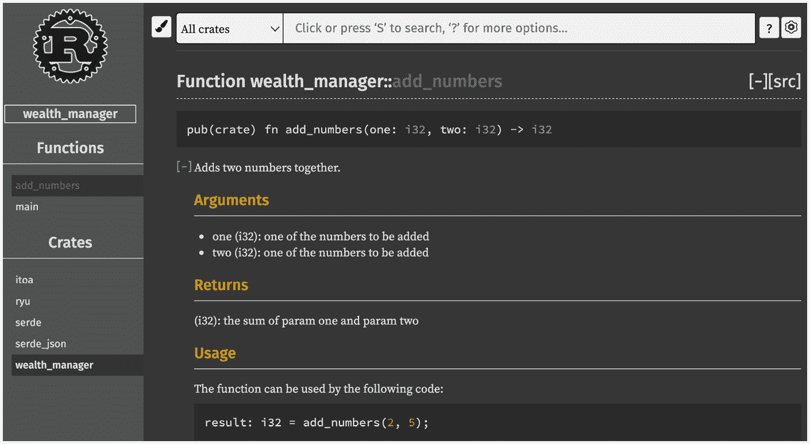
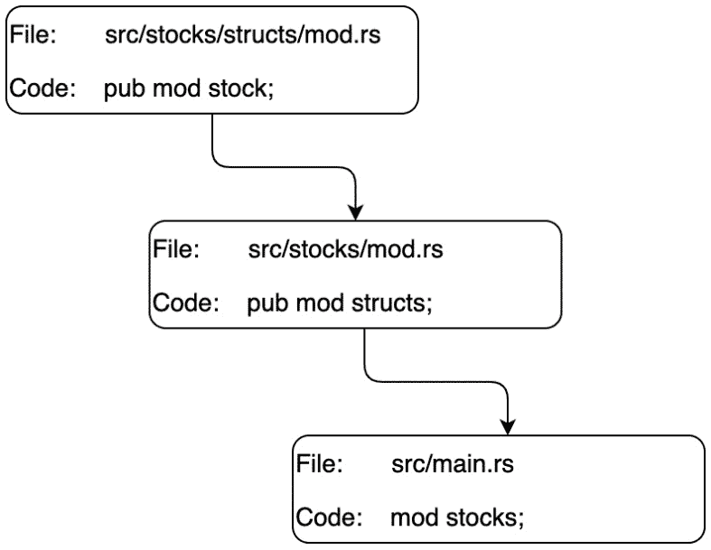
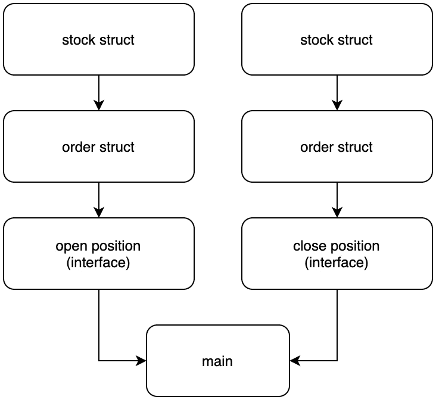
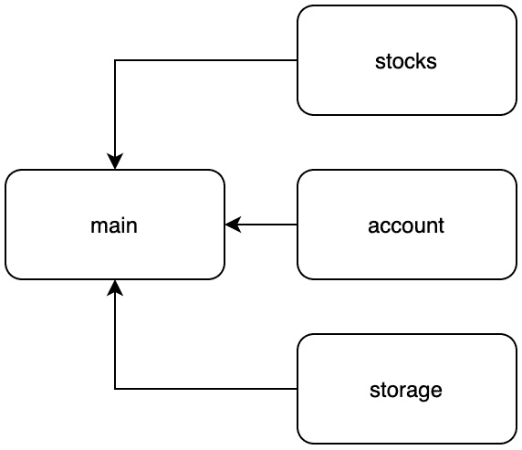
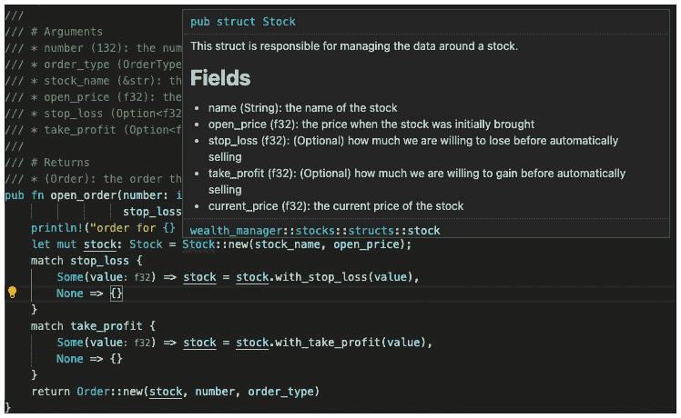

# 第一章：*第二章*：在 Rust 中结构化代码

现在我们已经掌握了 Rust 的基础知识，我们可以继续学习如何在多个文件中结构化代码，以便我们实际上可以用 Rust 解决问题。为了做到这一点，我们必须了解如何管理依赖项以及如何编译一个基本和结构化的应用程序。我们还必须考虑代码的隔离，以便我们可以重用它并保持应用程序开发的敏捷性，使我们能够快速做出更改而不会造成太多痛苦。完成这些后，我们还将使应用程序能够通过接受用户命令直接与用户交互。我们还将利用 Rust crates。Crate 是我们导入并使用的二进制文件或库。

在本章中，我们将涵盖以下主题：

+   使用 crates 和 Cargo 而不是 `pip` 来管理我们的代码

+   在多个文件和模块中结构化代码

+   构建模块接口

+   与环境交互

# 技术要求

我们将不再实现像第一章中那样不依赖任何第三方依赖的简单单页应用程序。因此，您将不得不直接在您的计算机上安装 Rust。我们还将通过 Cargo 管理第三方依赖项。您可以在以下链接中安装 Rust 和 Cargo：[`www.rust-lang.org/tools/install`](https://www.rust-lang.org/tools/install)。

在撰写本文时，对于编写 Rust 而言，迄今为止最好的**集成开发环境**（**IDE**）是 Visual Studio Code。它有一系列 Rust 插件，可以帮助您跟踪和检查您的 Rust 代码。您可以使用此链接安装它：[`code.visualstudio.com/download`](https://code.visualstudio.com/download)。

您可以在本章的 GitHub 仓库中找到所有代码文件：[`github.com/PacktPublishing/Speed-up-your-Python-with-Rust/tree/main/chapter_two`](https://github.com/PacktPublishing/Speed-up-your-Python-with-Rust/tree/main/chapter_two)。

# 使用 crates 和 Cargo 而不是 pip 来管理我们的代码

构建我们自己的应用程序将涉及以下步骤：

1.  创建一个简单的 Rust 文件并运行它。

1.  使用 Cargo 创建一个简单的应用程序。

1.  使用 Cargo 运行我们的应用程序。

1.  使用 Cargo 管理依赖项。

1.  使用第三方 crate 序列化 JSON。

1.  使用 Cargo 记录我们的应用程序。

在我们使用 Cargo 结构化程序之前，我们应该编译一个基本的 Rust 脚本并运行它：

1.  要做到这一点，创建一个名为 `hello_world.rs` 的文件，其中包含主函数，并使用字符串调用 `println!` 函数，就像我们在这里看到的那样：

    ```rs
    fn main() {
        println!("hello world");
    }
    ```

1.  完成这些后，我们可以导航到文件并运行 `rustc` 命令：

    ```rs
    rustc hello_world.rs 
    ```

1.  此命令将文件编译成可运行的二进制文件。如果我们是在 Windows 上编译，我们可以使用以下命令运行二进制文件：

    ```rs
    .\hello_world.exe
    ```

1.  如果我们在 Linux 或 Mac 上编译它，我们可以使用以下命令运行它：

    ```rs
    ./hello_world
    ```

    控制台应该会打印出字符串。虽然当构建独立文件时这很有用，但不建议用于管理跨多个文件的程序。即使在依赖项上，也不建议这样做。这就是 Cargo 发挥作用的地方。Cargo 通过一些简单的命令管理一切——运行、测试、文档、构建和依赖项。

现在我们对如何编译基本文件有了基本的了解，我们可以继续构建一个完整的应用程序：

1.  在您的终端中，导航到您希望应用程序所在的位置，并创建一个名为`wealth_manager`的新项目，如下所示：

    ```rs
    Cargo.toml file. In order to perform Cargo commands on this application, our terminal is going to have to be in the same directory as the `Cargo.toml` file. The code that we are going to be altering that makes up our application is housed in the `src` directory. Our entry point for the whole application is in the `main.rs` file. In Python, we can have multiple entry points, and we will explore these in *Chapter 4*, *Building pip Modules in Python*, where we will build pure Python packages for the first time. If we open the `.gitignore` file, we should have the following:

    ```

    /target

    ```rs

    This is not a mistake; this is how clean Rust is. Everything that Cargo produces when it comes to compiling, documenting, caching, and so on is all stored in the target directory. 
    ```

1.  目前，我们只有一个主文件，该文件在控制台打印出“hello world.”。我们可以用以下命令运行它：

    ```rs
    cargo run
    ```

1.  使用此命令，我们在终端中会得到以下输出：

    ```rs
    target/debug/wealth_manager, and this is then run, resulting in the hello_world.rs output. 
    ```

1.  如果我们要运行一个发布版本，我们只需运行以下命令：

    ```rs
    ./target/release/ directory under the binary wealth_manager. If we just want to compile our application without running it, we can simply swap the run command for build.
    ```

现在我们已经使应用程序运行起来，让我们探索如何管理其周围的元数据。这可以通过编辑`Cargo.toml`文件来完成。当我们打开它时，我们会看到以下内容：

```rs
[package]
```

```rs
name = "wealth_manager"
```

```rs
version = "0.1.0"
```

```rs
authors = ["maxwellflitton"]
```

```rs
edition = "2018"
```

```rs
[dependencies]
```

名称、版本和作者相对简单。以下是每个部分对项目的影响：

+   如果我们在`Cargo.toml`文件中更改`name`值，那么在构建或运行我们的应用程序时，将生成具有该名称的新二进制文件。旧的二进制文件仍然存在。

+   `version`用于在`crates.io`等服务上分发，如果我们想开源我们的应用程序供他人使用。作者也需要提供，即使没有它，我们的应用程序也可以在本地编译和运行。

+   `edition`代表我们正在使用的 Rust 版本。Rust 会频繁更新。这些更新随着时间的积累，每两到三年，新的平滑特性会被打包、文档化，并添加到新的版本中。最新的版本（2021）可以在[`devclass.com/2021/10/27/rust-1-56-0-arrives-delivering-rust-2021-edition-support/`](https://devclass.com/2021/10/27/rust-1-56-0-arrives-delivering-rust-2021-edition-support/)找到。

+   我们还有`dependencies`。这是我们导入第三方 crate 的地方。

为了了解这是如何工作的，让我们使用一个 crate 将股票的数据结构转换为 JSON，然后打印出来。自己编写代码会有些头疼。幸运的是，我们可以安装`serde` crate 并使用`json!`宏。为了让 Cargo 下载并安装 crate，我们在`Cargo.toml`文件中的依赖关系部分填写以下代码：

```rs
[dependencies]
```

```rs
serde="1.0.117"
```

```rs
serde_json="1.0.59"
```

在我们的`main.rs`文件中，我们随后导入将股票数据转换为 JSON 并打印出来的宏和结构体所需的代码：

```rs
use serde_json::{json, Value};
```

```rs
fn main() {
```

```rs
    let stock: Value = json!({
```

```rs
        "name": "MonolithAi",
```

```rs
        "price": 43.7,
```

```rs
        "history": [19.4, 26.9, 32.5]
```

```rs
    });
```

```rs
    println!("first price: {}", stock["history"][0]);
```

```rs
    println!("{}", stock.to_string());
```

```rs
}
```

需要注意的是，我们从 `serde_json` 值返回一个 `Value` 结构体。为了了解我们如何使用返回值，我们可以探索该结构体的文档。这时我们会看到 Rust 的文档系统非常全面。我们可以在以下位置找到该结构体的文档：[`docs.rs/serde_json/1.0.64/serde_json/enum.Value.html`](https://docs.rs/serde_json/1.0.64/serde_json/enum.Value.html)。

我们可以在 *图 2.1* 中看到，文档涵盖了该结构体支持的所有函数。我们的 `json!` 宏返回 `Object(Map<String, Value>)`。我们还有一系列其他值，这取决于我们如何调用 `json!` 宏。文档还涵盖了一系列我们可以利用的函数，以检查值的类型，判断 JSON 值是否为 `null`，以及将 JSON 值转换为特定类型的方法：



图 2.1 – serde_json 值的文档

当我们执行 Cargo `run` 命令时，我们会看到 Cargo 编译我们在依赖中定义的 crate。然后我们看到我们自己的应用的编译，以及价格和与股票相关的数据的打印输出，如图所示：

```rs
first price: 19.4
```

```rs
{"history":[19.4,26.9,32.5], "name":"MonolithAi",\ 
```

```rs
  "price":43.7}
```

回到文档，我们可以创建自己的。这很简单；我们不需要安装任何东西。我们只需要在代码中创建文档，就像 Python 中的 **docstrings** 一样。为了演示这一点，我们可以创建一个函数，将两个变量相加并定义文档字符串，如下面的代码所示：

```rs
/// Adds two numbers together. 
```

```rs
/// 
```

```rs
/// # Arguments
```

```rs
/// * one (i32): one of the numbers to be added
```

```rs
/// * two (i32): one of the numbers to be added
```

```rs
/// 
```

```rs
/// # Returns
```

```rs
/// (i32): the sum of param one and param two
```

```rs
/// 
```

```rs
/// # Usage
```

```rs
/// The function can be used by the following code:
```

```rs
/// 
```

```rs
/// '''rust
```

```rs
/// result: i32 = add_numbers(2, 5);
```

```rs
/// '''
```

```rs
fn add_numbers(one: i32, two: i32) -> i32 {
```

```rs
    return one + two
```

```rs
}
```

我们可以看到，这份文档是 Markdown 格式的！这个例子对于这种类型的函数来说有点过度。标准开发者应该能够在没有任何示例的情况下实现这个函数。对于更复杂的函数和结构体，值得注意的是，没有任何阻止我们记录如何实现我们所记录内容的代码示例。构建文档只需要以下命令：

```rs
cargo doc
```

在过程完成后，我们可以使用以下命令打开文档：

```rs
cargo doc --open
```

这将在网页浏览器中打开文档，如图 *图 2.2* 所示：



图 2.2 – 我们模块的文档视图

在这里我们可以看到，我们的 `main` 和 `add_numbers` 函数都是可用的。我们还可以在左侧看到安装的依赖项也是可用的。如果我们点击我们的 `add_numbers` 函数，我们可以看到我们编写的 Markdown，如图 *图 2.3* 所示：



图 2.3 – 我们 add_numbers 函数的文档视图

这里就是它——我们可以在构建应用程序的同时创建我们代码的交互式文档。需要注意的是，本书的其余部分将不会在代码片段中使用 Markdown；否则，这只会使本书变得过于冗长。然而，在编写代码时记录所有结构和函数是一个好的实践。

现在我们已经运行了代码，设置了基本的应用程序结构，并记录了我们的代码，我们就可以继续到下一个部分，即如何在多个文件中组织我们的应用程序。

# 在多个文件和模块中组织代码

为了构建我们的模块，我们将执行以下步骤：

1.  绘制我们的文件和文件夹结构。

1.  创建我们的`Stock`结构体。

1.  将我们的`Stock`结构体链接到主文件。

1.  在主文件中使用我们的`stocks`模块。

1.  从另一个模块添加代码。

现在我们已经到了在多个文件中构建应用程序的阶段，我们必须在我们的应用程序中定义我们的第一个模块，即**股票模块**：

1.  我们可以使我们的模块具有以下定义的结构：

    ```rs
    ├── main.rs
    └── stocks
        ├── mod.rs
        └── structs
            ├── mod.rs
            └── stock.rs
    ```

    我们采用这种结构是为了实现灵活性；如果我们需要添加更多的结构体，我们可以在`structs`目录中这样做。我们还可以在`structs`目录旁边添加其他目录。例如，我们可能想要为我们的股票构建一个存储数据的机制。这可以通过在`stocks`目录中添加一个`storage`目录并在此模块中根据需要使用它来实现。

1.  目前，我们只想在我们的`stocks`模块中创建一个股票结构体，将其导入到`main.rs`文件中，并使用它。我们的第一步是在`stock.rs`文件中用以下代码定义我们的`Stock`结构体：

    ```rs
    pub struct Stock {
        pub name: String,
        pub open_price: f32,
        pub stop_loss: f32,
        pub take_profit: f32,
        pub current_price: f32
    }
    ```

    这看起来很熟悉，因为它与我们之前章节中定义的`Stock`结构体相同。然而，有一个细微的差别。我们必须注意，在结构体定义和每个字段定义之前有一个`pub`关键字。这是因为我们必须在文件外部使用它们之前声明它们为公共的。这同样适用于在同一文件中实现的函数，如下面的代码所示：

    ```rs
    impl Stock {
        pub fn new(stock_name: &str, price: f32) -> \
          Stock {
            return Stock{
                name: String::from(stock_name), 
                open_price: price,
                stop_loss: 0.0,
                take_profit: 0.0,
                current_price: price
            }
        }
        pub fn with_stop_loss(mut self, value: f32) \
          -> Stock {
            self.stop_loss = value;
            return self
        }
        pub fn with_take_profit(mut self, value: f32) \
          -> Stock {
            self.take_profit = value;
            return self
        }
        pub fn update_price(&mut self, value: f32) {
            self.current_price = value;
        }
    }
    ```

    我们可以看到，我们现在有一个公开的结构体，其中包含所有函数都可以使用。

我们现在必须使我们的结构体能够在`main.rs`文件中使用。这就是`mod.rs`文件的作用所在。`mod.rs`文件在 Python 中相当于`__init__.py`文件。它们表明目录是一个模块。然而，与 Python 不同，Rust 数据结构需要公开声明才能从其他文件访问。我们可以在*Figure 2.4*中看到结构体是如何通过我们的`stocks`模块传递到`main.rs`文件的：



Figure 2.4 – 结构体如何在模块间传递

在这里，我们可以看到我们只是在最远离 `main.rs` 的模块中公开声明了结构体，在所属目录的 `mod.rs` 文件中。然后我们在 `stocks` 的 `mod.rs` 文件中公开声明了 `structs` 模块。现在是探索声明模块的 `mod` 表达式的好时机。如果我们想，我们可以在单个文件中声明多个模块。必须强调的是，这在我们示例中并没有发生。我们可以在单个文件中使用以下代码声明模块一和模块二：

```rs
mod one {
```

```rs
    . . . 
```

```rs
}
```

```rs
Mod two {
```

```rs
    . . .
```

```rs
}
```

现在我们已经在我们的主要示例项目中定义了我们的模块，我们只需在 `main.rs` 文件中声明 `stocks` 模块。这不是公开声明的原因是，`main.rs` 文件是应用程序的入口点；我们不会将此模块导入到任何其他地方：

1.  现在我们已经使结构体可用，我们可以像它定义在同一个文件中一样简单地使用它，如下所示：

    ```rs
    mod stocks;
    use stocks::structs::stock::Stock;
    fn main() {
        let stock: Stock = Stock::new("MonolithAi", 36.5);
        println!("here is the stock name: {}",\
          stock.name);
        println!("here is the stock name: {}",\
          stock.current_price);
    }
    ```

1.  运行此代码不出所料给出了以下结果：

    ```rs
    here is the stock name: MonolithAi
    here is the stock name: 36.5
    ```

现在我们已经覆盖了使用不同文件中的结构体的基础知识，我们可以继续探索从其他文件访问数据结构的其他途径，以便更加灵活：

1.  我们必须探索的第一个概念是从同一目录的文件中访问。为了演示这一点，我们可以在结构体中创建一个打印函数的废弃示例。在一个新的文件 `src/stocks/structs/utils.rs` 路径中，我们可以创建一个玩具函数，它仅仅打印出结构体的构造函数正在触发，如下面的代码所示：

    ```rs
    pub fn constructor_shout(stock_name: &str) -> () {
        println!("the constructor for the {} is firing", \
          stock_name);
    }
    ```

1.  然后，我们使用以下代码在 `src/stocks/structs/mod.rs` 文件中声明它：

    ```rs
    pub mod stock;
    mod utils;
    ```

    需要注意的是，我们并没有将其设置为公开；我们只是声明了它。没有任何东西阻止我们将其设置为公开；然而，使用非公开方法，我们只允许 `src/stocks/structs/` 目录内的文件访问它。

1.  我们现在希望我们的 `Stock` 结构体能够访问它并在我们的构造函数中使用它，这可以通过在 `src/stocks/structs/stock.rs` 文件中使用以下行来实现：

    ```rs
    use super::utils::constructor_shout;
    ```

1.  如果我们想将我们的引用移动到 `src/stocks/` 目录，我们可以使用 `super::super`。我们可以根据树的深度链式调用任意多个 `super`。需要注意的是，我们只能访问在目录的 `mod.rs` 文件中声明的部分。在我们的 `src/stocks/structs/stock.rs` 文件中，我们现在可以在构造函数中使用以下代码：

    ```rs
    pub fn new(stock_name: &str, price: f32) -> Stock {
        constructor_shout(stock_name);
        return Stock{
            name: String::from(stock_name), 
            open_price: price,
            stop_loss: 0.0,
            take_profit: 0.0,
            current_price: price
        }
    }
    ```

1.  现在，如果我们运行我们的应用程序，我们将在终端中得到以下打印输出：

    ```rs
    util function that we imported from. If we create another module, we can access our stocks module from it, because the stocks module is defined in the main.rs file.
    ```

虽然我们已经能够从不同的文件和模块中访问数据结构，但这并不非常可扩展，我们将有一些规则来实施股票。为了使我们能够编写可扩展的安全代码，我们需要在下一节中使用接口锁定功能。

# 构建模块接口

与 Python 不同，我们可以从任何地方导入我们想要的任何东西，最多我们的 IDE 只会给我们语法高亮，而 Rust 会主动不编译，如果我们尝试访问未明确公开的数据结构。这给了我们一个真正锁定我们的模块并通过接口强制功能的机会。

然而，在我们开始之前，让我们完全探索我们将要锁定哪些功能。保持模块尽可能隔离是一个好习惯。在我们的`stocks`模块中，逻辑应该只围绕如何处理股票，而不是其他任何事情。这看起来可能有点过度，但当我们思考时，我们很快就会意识到这个模块在复杂性方面将会扩展。 

为了本章的演示目的，让我们只构建股票订单的功能。我们可以买入或卖出股票。这些股票订单以倍数出现。购买公司股票的*n*股是非常常见的。我们还需要检查股票订单是空头还是多头。在空头订单中，我们从经纪人那里借钱，用这笔钱买股票，立即卖出，然后在以后某个时间点买回股票。如果股价下跌，我们就能赚钱，因为我们保留在偿还给经纪人时的差额。如果我们做多，我们只是买入并持有股票。如果它上涨，我们就能赚钱，所以根据订单的不同，会有不同的结果。

我们必须记住，这不是一本关于围绕股票市场开发软件的书，所以我们需要保持细节简单，以避免迷失方向。为了演示接口，我们可以采取分层的方法，如*图 2.5*所示：



图 2.5 – 简单模块接口的方法

为了实现这种方法，我们可以执行以下步骤：

1.  使用正确的文件结构来构建模块布局。

1.  为不同类型的订单创建一个枚举。

1.  构建一个订单结构体。

1.  安装用于`datetime`对象的`chrono`包。

1.  创建一个利用`chrono`包的订单构造函数。

1.  为结构体创建动态值。

1.  创建一个关闭订单接口。

1.  创建一个开放订单接口。

1.  在主文件中使用订单接口。

让我们开始吧：

1.  在这里，我们只允许通过订单结构体访问股票结构体。再次强调，还有其他方法可以解决这个问题，这展示了如何在 Rust 中构建接口。为了在代码中实现这一点，我们定义了以下文件结构：

    ```rs
    ├── main.rs
    └── stocks
        ├── enums
        │   ├── mod.rs
        │   └── order_types.rs
        ├── mod.rs
        └── structs
            ├── mod.rs
            ├── order.rs
            └── stock.rs
    ```

1.  首先，我们可以在`enums/order_types.rs`文件中使用以下代码定义我们的枚举顺序类型：

    ```rs
    pub enum OrderType {
        Short,
        Long
    }
    ```

1.  我们将在订单和接口中使用这个。为了使这种枚举类型对模块的其余部分可用，我们必须在`enums/mod.rs`文件中声明它，以下代码：

    ```rs
    pub mod order_types;
    ```

1.  既然我们已经构建了枚举类型，现在是时候将其投入使用。现在我们可以在`stocks/structs/order.rs`文件中使用以下代码构建我们的订单结构体：

    ```rs
    use chrono::{Local, DateTime};
    use super::stock::Stock;
    use super::super::enums::order_types::OrderType;
    pub struct Order {
        pub date: DateTime<Local>,
        pub stock: Stock,
        pub number: i32,
        pub order_type: OrderType
    }
    ```

1.  在这里，我们使用`chrono`包来定义订单何时被放置；我们还要注意订单是为哪种股票，我们购买了多少股票，以及订单的类型。我们必须记住在`Cargo.toml`文件中定义我们的`chrono`依赖项，以下代码：

    ```rs
    [dependencies]
    serde="1.0.117"
    serde_json="1.0.59"
    chrono="0.4.19"
    ```

    我们将股票结构体与订单结构体分开的原因是为了提供灵活性。例如，我们还可以对非订单的股票数据进行其他操作。我们可能想要构建一个结构体来存放用户股票观察列表中的股票，而用户实际上并没有购买任何东西，但他们仍然想看到可用的股票。

1.  股票数据还有其他用途。考虑到这一点，我们可以看到，将围绕股票的数据和方法保存在单独的股票结构体中，不仅有助于减少我们添加更多功能时需要编写的代码量，而且还可以标准化围绕股票的数据。这也使得我们更容易维护代码。如果我们添加或删除字段，或者更改股票数据的方法，我们只需要在一个地方更改，而不是多个地方。我们的订单结构体构造函数也可以在同一个文件中用以下代码创建：

    ```rs
    impl Order {
        pub fn new(stock: Stock, number: i32, \ 
          order_type: OrderType) -> Order {
          let today: DateTime<Local> = Local::now();
            return Order{date: today, stock, number, \
              order_type}
        }
    }
    ```

    在这里，我们通过接受`stock`、`number`和`order_type`参数并创建一个`datetime`结构体来创建一个`Order`结构体。

1.  由于我们的订单专注于围绕定价的逻辑，因为它包含了订单中引入的股票数量，在我们的`impl`块中，我们可以使用以下代码构建订单的当前价值：

    ```rs
        pub fn current_value(&self) -> f32 {
            return self.stock.current_price * self \
              .number as f32
        }
    ```

    必须注意的是，我们使用了`&self`作为参数，而不是仅仅使用`self`。这使我们能够多次使用该函数。如果参数不是一个引用，那么我们将结构体移动到函数中。我们就无法多次计算值，而且如果类型不是`Copy`，这将非常有用。

1.  我们还可以在此基础上构建函数来计算`impl`块中的当前利润，以下代码：

    ```rs
        pub fn current_profit(&self) -> f32 {
            let current_price: f32 = self.current_value();
            let initial_price: f32 = self.stock. \
              open_price * self.number as f32;
            match self.order_type {
              OrderType::Long => return current_price -\
                initial_price,
              OrderType::Short => return initial_price -\
                current_price
            }
        }
    ```

    在这里，我们获取当前价格和初始价格。然后匹配订单类型，因为这会改变利润的计算方式。现在我们的结构体已经完成，我们必须确保结构体在`stocks/structs/mod.rs`文件中可用，通过以下代码定义它们：

    ```rs
    pub mod stock;
    pub mod order;
    ```

1.  现在我们已经准备好创建我们的接口。为了在我们的`stocks` `/mod.rs`文件中构建接口，我们最初必须导入我们需要的所有内容，如下所示：

    ```rs
    pub mod structs;
    pub mod enums;
    use structs::stock::Stock;
    use structs::order::Order;
    use enums::order_types::OrderType;
    ```

1.  现在我们已经拥有了构建界面的所有要素，我们可以使用以下代码构建我们的紧密订单界面：

    ```rs
    pub fn close_order(order: Order) -> f32 {
        println!("order for {} is being closed", \
          &order.stock.name);
        return order.current_profit()
    }
    ```

1.  这是一个相当简单的接口；我们可以做更多，比如数据库或 API 调用，但在这个演示中，我们只是打印股票正在被出售并返回我们目前所获得的利润。考虑到这一点，我们可以通过在同一个文件中打开一个订单来构建更复杂的接口以下代码：

    ```rs
    pub fn open_order(number: i32, order_type: OrderType,\ 
                      stock_name: &str, open_price: f32,\
                      stop_loss: Option<f32>, \
                        take_profit: Option<f32>) -> \
                          Order { \
        println!("order for {} is being made", \ 
          &stock_name);              
        let mut stock: Stock = Stock::new(stock_name, \ 
          open_price);
        match stop_loss {
            Some(value) => stock = \ 
              stock.with_stop_loss(value),
            None => {}
        }
        match take_profit {
            Some(value) => stock = \
              stock.with_take_profit(value),
            None => {}
        }
        return Order::new(stock, number, order_type)
    }
    ```

    在这里，我们接收所有需要的参数。我们还引入了`Option<f32>`参数类型，它被实现为一个枚举类型。这允许我们传递一个`None`值。然后我们创建一个可变的股票（因为价格会变动，我们需要更新它），然后检查是否提供了`stop_loss`值；如果是，我们就将止损添加到股票中。然后我们检查是否提供了`take_profit`值，如果提供了，我们就用这个值更新股票。

1.  现在我们已经构建了所有的接口，我们只需要在`main.rs`文件中使用它们。在主文件中，我们需要导入所需的 structs 和 interfaces 以便使用以下代码：

    ```rs
    mod stocks;
    use stocks::{open_order, close_order};
    use stocks::structs::order::Order;
    use stocks::enums::order_types::OrderType;
    ```

1.  在我们的主函数中，我们可以通过创建一个新的可变订单来开始使用这些接口以下代码：

    ```rs
    println!("hello stocks");
    let mut new_order: Order = open_order(20, \
        OrderType::Long, "bumper", 56.8, None, None);
    ```

1.  在这里，我们将`take_profit`和`stop_loss`设置为`None`，但如果我们需要，我们可以添加它们。为了明确我们刚刚购买了什么，我们可以使用以下代码打印出当前价值和利润：

    ```rs
    println!("the current price is: {}", 
        &new_order.current_value());
    println!("the current profit is: {}", 
        &new_order.current_profit());
    ```

1.  然后，股票市场出现了一些波动，我们可以通过更新价格并打印每次变化时我们的投资价值来模拟它以下代码：

    ```rs
    new_order.stock.update_price(43.1);
    println!("the current price is: {}", \ 
        &new_order.current_value());
    println!("the current profit is: {}", \ 
        &new_order.current_profit());
    new_order.stock.update_price(82.7);
    println!("the current price is: {}", \
             &new_order.current_value());
    println!("the current profit is: {}", \
             &new_order.current_profit());
    ```

1.  我们现在有了利润，我们将出售我们的股票以关闭订单并打印以下代码的利润：

    ```rs
    let profit: f32 = close_order(new_order);
    println!("we made {} profit", profit);
    ```

1.  现在，我们的接口、模块和主文件都构建完成了。运行 Cargo `run`命令会给出以下输出：

    ```rs
    hello stocks
    the constructor for the bumper is firing
    the current price is: 1136
    the current profit is: 0
    the current price is: 862
    the current profit is: -274
    the current price is: 1654
    the current profit is: 518
    order for bumper is being closed
    we made 518 profit
    ```

如我们所见，我们的模块工作正常，并且有一个干净的接口。对于这本书，我们的例子就到这里，因为我们已经展示了如何使用接口在 Rust 中构建模块。然而，如果你想进一步构建应用程序，我们可以采取*图 2.6*中看到的方法：



图 2.6 – 构建我们的应用程序

在账户模块中，我们会围绕跟踪用户通过交易获得的金额来构建数据结构。然后我们会构建一个存储模块，它为账户和股票提供读写接口。存储是一个单独的模块的原因是我们可以保持接口不变，而在底层更改存储逻辑。

例如，我们可以从简单的 JSON 文件存储系统开始，用于开发和本地使用；然而，当应用程序部署到服务器上时，大量的用户开始进行交易和访问他们的账户。我们可以切换文件读取和写入，使用数据库驱动程序和数据库模型映射。然后系统会承受大量的流量，应用程序被分割成一组微服务。一个应用程序仍然会与数据库通信，而另一个用于频繁请求的股票/账户的应用程序可能会与 Redis 缓存通信。

考虑到这一点，将存储保持独立使我们保持灵活性。更改存储的要求不会破坏构建。事实上，一个配置文件可以启用根据环境切换不同的方法。只要接口保持不变，重构就不会是一项巨大的任务。

## 编码时文档化的好处

由于我们的模块跨越多个文件，我们现在正在引用不同文件中的函数和结构体。这就是文档重要性的体现。我们可以回顾一下使用 Visual Studio Code 的技术要求。GitHub 上的代码已经完全文档化。如果安装了 Rust 插件，只需将鼠标悬停在结构体或函数上，就会弹出文档，使我们能够看到接口中需要的内容，如图 *2.7* 所示：



图 2.7 – Visual Studio Code 中的弹出文档

有一个原因，为什么结构不良且未记录的代码被称为 *技术债务*，这是因为它会随着时间的推移积累利息。没有文档的糟糕结构代码虽然开发起来很快，但随着应用程序规模的扩大，更改事物和理解正在发生的事情会变得更加困难。一个结构良好且具有良好 Markdown Rust 文档的模块是保持您和您的团队生产力高的好方法。

我们现在有一个功能齐全的应用程序，它跨越多个页面，既干净又可扩展。然而，用户无法动态地使用它，因为一切都需要硬编码。这是不实用的。在下一节中，我们将与环境交互，以便我们可以将参数传递到程序中。

# 与环境交互

我们目前处于这样一个阶段，唯一阻碍我们构建一个完全功能化的命令行应用程序的是与环境交互。正如前文所述，这是一个开放性的主题，涵盖了从接受命令行参数到与服务器和数据库交互的任何内容。正如前文所述，我们将涵盖足够的内容，以便了解如何构建接受外部数据并对其进行处理的 Rust 代码的结构。

为了探索这一点，我们将使我们的股票应用程序能够从用户那里接收命令行参数，这样我们就可以买卖股票。我们不会通过选择做空或做多来使事情复杂化，我们也不会引入存储。

然而，到本节结束时，我们将能够构建可扩展且能从外部世界接受数据的代码。有了这个，进一步阅读连接到数据库或读写文件的 crate，将使我们能够无缝地将它们添加到我们结构良好的代码中。在数据库方面，我们将在*第十章*中介绍如何镜像数据库模式并连接到它，*将 Rust 注入 Python Flask 应用*。

对于我们的玩具示例，我们将生成一个随机数作为我们的销售库存价格，以便计算我们是盈利还是亏损。我们将通过添加带有`rand="0.8.3"`的`Cargo.toml`文件来实现这一点。我们可以通过以下步骤与环境交互：

1.  导入所有必需的 crate。

1.  从环境中收集输入。

1.  使用订单处理我们的输入。

让我们开始吧：

1.  现在我们已经添加了`rand` crate，我们可以在`main.rs`文件中使用以下代码添加我们需要的所有额外导入：

    ```rs
    use std::env;
    use rand::prelude::*;
    use std::str::FromStr;
    ```

    我们使用`env`来获取传递给 Cargo 的参数。我们从`rand` crate 的预导入中导入一切，以便我们可以生成随机数，并导入`FromStr`特质，以便我们可以将命令行参数中传递的字符串转换为数字。

1.  在我们的主函数中，我们最初使用以下代码从命令行收集传递的参数：

    ```rs
    let args: Vec<String> = env::args().collect();
    let action: &String = &args[1];
    let name: &String = &args[2];
    let amount: i32 = i32::from_str(&args[3]).unwrap();
    let price: f32 = f32::from_str(&args[4]).unwrap();
    ```

    我们声明我们将收集命令行参数到一个字符串向量中。我们这样做是因为几乎所有东西都可以表示为字符串。然后我们定义我们需要的所有参数。我们必须注意，我们从索引`1`开始，而不是`0`。这是因为索引`0`被`run`命令填充。我们还可以看到，当我们需要时，我们会将字符串转换为数字，并直接解包它们。这有点危险；如果我们正在构建一个真正的生产命令行工具，我们应该理想地匹配`from_str`函数的结果，并向用户提供更好的信息。

1.  现在我们已经拥有了所有需要的东西，我们使用以下代码创建一个新的订单，使用我们收集的数据：

    ```rs
    let mut new_order: Order = open_order(amount, \
        OrderType::Long, &name.as_str(), price, \ 
            None, None);
    ```

    我们每次都会创建一个新的订单，即使它是卖出，因为我们没有存储，我们需要所有关于我们股票头寸的结构化数据和逻辑。然后我们匹配我们的操作。如果我们打算卖出股票，我们会在卖出之前为股票生成一个新的价格。考虑到这一点，我们可以使用以下代码查看我们是否盈利：

    ```rs
    match action.as_str() {
        "buy" => {
            println!("the value of your investment is:\
              {}", new_order.current_value());
        }
        "sell" => {
            let mut rng = rand::thread_rng();

            let new_price_ref: f32 = rng.gen(); 
            let new_price: f32 = new_price_ref * 100 as \
              f32;
            new_order.stock.update_price(new_price);
            let sale_profit: f32 = close_order(new_order);
            println!("here is the profit you made: {}", \
                sale_profit);
        }
        _ => {
            panic!("Only 'buy' and 'sell' actions are \
              supported");
        }
    }
    ```

    必须指出的是，我们在匹配表达式的末尾有一个`_`。这是因为字符串理论上可以是任何东西，而 Rust 是一种安全语言。如果我们没有考虑到每一种结果，它将不允许我们编译代码。`_`是一个通配符模式。如果并非所有的匹配模式都被使用，那么就会执行这个。对我们来说，我们只是抛出一个错误，指出只支持买卖。

1.  为了运行此程序，我们执行以下命令：

    ```rs
    cargo run sell monolithai 26 23.4
    ```

1.  运行此命令将给出以下结果：

    ```rs
    order for monolithai is being made
    order for monolithai is being closed
    here is the profit you made: 1825.456
    ```

    你获得的利润将不同，因为生成的数字将是随机的。

这里就是我们的应用程序——它是交互式和可扩展的。如果你想构建带有帮助菜单的更全面的命令行界面，建议你阅读并使用`clap`crate。

# 摘要

在本章中，我们学习了 Cargo 的基础知识。通过 Cargo，我们成功地构建了基本的应用程序，对它们进行了文档化，编译并运行了它们。看到这种实现是多么干净和简单，很明显为什么 Rust 是最受欢迎的语言之一。通过一个文件中的几行代码管理所有功能、文档和依赖项，加快了整个过程。结合严格的、有帮助的编译器，使得 Rust 在管理复杂项目时成为不二之选。我们通过将模块包装在易于使用的接口中，并通过命令行与用户的输入交互来管理复杂性。

现在，正如你所站立的此刻，你可以开始编写 Rust 代码来解决一系列问题。如果你想构建一个作为 Rust 网络服务器与前端和数据库交互的应用程序，我建议你阅读我关于 Rust 网络开发的另一本书籍《Rust Web 编程》，并从*第三章*开始，因为你已经掌握了足够的 Rust 基础知识，可以开始构建 Rust 服务器。

在本书的下一章中，我们将介绍如何利用 Rust 的并发性。

# 问题

1.  随着我们继续编码，我们如何对其进行文档化？

1.  为什么保持模块独立于单一概念很重要？

1.  我们如何使我们的模块保持独立模块的优势？

1.  我们如何管理应用程序中的依赖项？

1.  当理论上存在无限多种结果时，例如匹配不同的字符串，我们如何确保在匹配表达式中所有结果都被考虑到？

1.  假设我们在`some_file/some_struct.rs`文件中有一个名为`SomeStruct`的结构体。我们如何使其在它所在的目录之外可用？

1.  假设我们改变了关于第 6 个问题中提到的`SomeStruct`结构体的想法，我们只想在`some_file/`目录中可用。我们该如何做？

1.  我们如何在`some_file/another_struct.rs`文件中访问我们的`SomeStruct`结构体？

# 答案

1.  我们的文档字符串在构建结构和函数时可以支持 Markdown。因为它是 Markdown，所以我们可以记录实现结构或函数的方法。如果我们使用 Visual Studio Code，这也有助于提高我们的生产力，因为只需将鼠标悬停在函数或结构上就会弹出文档。

1.  将我们的模块限制在单一概念内可以增加应用程序的灵活性，使我们能够根据需要切割和更改模块。

1.  为了保持我们的模块隔离，我们需要保持模块的接口不变；这意味着我们可以在不改变应用程序其余部分的情况下更改模块内部的逻辑。如果我们删除模块，我们只需要在整个应用程序中查找接口的实现，而不是模块中所有函数和结构的实现。

1.  我们在 `Cargo.toml` 文件中管理我们的依赖。只需运行 Cargo 就会在编译前安装我们所需的依赖。

1.  我们可以通过在匹配表达式的末尾实现一个 `_` 模式来捕捉任何未满足所有匹配条件的内容。这样做是通过执行附加到该模式的代码来完成的。

1.  我们通过在 `some_file/mod.rs` 文件中写入 `pub mod some_struct;` 使其公开可用。

1.  我们通过在 `some_file/mod.rs` 文件中写入 `mod some_struct;` 使其仅在 `some_file/` 目录中可用。

1.  我们可以通过在 `some_file/another_struct.rs` 文件中键入 `use super::some_struct::SomeStruct;` 来访问 `SomeStruct`。

# 进一步阅读

+   *Rust 网络编程*，Maxwell Flitton，Packt Publishing (2021)

+   *精通 Rust*，Rahul Sharma 和 Vesa Kaihlavirta，Packt Publishing (2019)

+   *Rust 编程语言*，Rust 基金会：[`doc.rust-lang.org/stable/book/`](https://doc.rust-lang.org/stable/book/) (2018)

+   *Clap 文档*，Clap Docs：[`docs.rs/clap/2.33.3/clap/`](https://docs.rs/clap/2.33.3/clap/) (2021)

+   *标准文件文档*，Rust 基金会：[`doc.rust-lang.org/std/fs/struct.File.html`](https://doc.rust-lang.org/std/fs/struct.File.html) (2021)

+   *chrono DateTime 文档*，Rust 基金会：[`docs.rs/chrono/0.4.19/chrono/struct.DateTime.html`](https://docs.rs/chrono/0.4.19/chrono/struct.DateTime.html) (2021)
