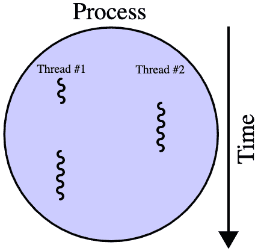

# *第三章*：理解并发

使用 Rust 加速我们的代码是有用的。然而，理解并发以及利用线程和进程可以将我们加速代码的能力提升到下一个层次。在本章中，我们将探讨进程和线程是什么。然后，我们将通过在 Python 和 Rust 中启动线程和进程的实际步骤进行讲解。然而，虽然这可能会令人兴奋，但我们还必须承认，在不考虑我们的方法的情况下盲目追求线程和进程可能会导致我们陷入困境。为了避免这种情况，我们还探讨了算法复杂度以及它如何影响我们的计算时间。

在本章中，我们将涵盖以下主题：

+   介绍并发

+   使用线程进行基本异步编程

+   运行多个进程

+   安全地定制线程和进程

# 技术要求

本章的代码可以通过以下 GitHub 链接访问：

[`github.com/PacktPublishing/Speed-up-your-Python-with-Rust/tree/main/chapter_three`](https://github.com/PacktPublishing/Speed-up-your-Python-with-Rust/tree/main/chapter_three)

# 介绍并发

正如我们在 *第一章* 的介绍中探讨的，*从 Python 视角介绍 Rust*，摩尔定律现在正在失效，因此我们必须考虑其他我们可以加速处理的方法。这就是并发出现的地方。并发本质上是在同一时间运行多个计算。并发无处不在，为了充分阐述这一概念，我们可能需要写一本书来专门介绍它。

然而，对于本书的范围，理解并发的基本知识（以及何时使用它）可以为我们的工具箱增添一个额外的工具，使我们能够加速计算。此外，线程和进程是我们将程序分解成可以同时运行的计算的方式。为了开始我们的并发之旅，我们将介绍线程。

## 线程

**线程**是我们能够独立处理和管理的最小计算单元。线程用于将程序分解成可以同时运行的计算部分。还应注意，线程可以按顺序外发。这提出了并发和并行之间的重要区别。**并发**是在同一时间运行和管理多个计算的任务，而**并行**是在同一时间运行多个计算的任务。并发具有非确定性的控制流，而并行具有确定性的控制流。线程共享资源，如内存和处理能力；然而，它们也会相互阻塞。例如，如果我们启动一个需要恒定处理能力的线程，我们只会阻塞其他线程，如下面的图所示：


图 3.1 – 随时间变化的两个线程

在这里，我们可以看到，当 **线程 B** 运行时，**线程 A** 停止运行。这可以在潘武 2020 年关于通过模拟理解多线程的文章中得到证明，其中对各种类型的任务进行了计时。文章中的结果总结在下述图表中：


图 3.2 – 不同任务的耗时 [来源：潘武，https://towardsdatascience.com/understanding-python-multithreading-and-multiprocessing-via-simulation-3f600dbbfe31]

在这里，我们可以看到，随着工作者数量的减少，时间也在减少，*除了* CPU 密集型多线程任务。这是因为，如 *图 3.1* 所示，CPU 密集型线程是阻塞的，所以一次只能有一个工作者处理。无论你添加多少工作者都没有关系。必须注意的是，这是因为 Python 的 **全局解释器锁**（**GIL**），这在 *第六章* *在 Rust 中使用 Python 对象* 中有所介绍。在其他上下文中，例如 Rust，它们可以在不同的 CPU 核心上执行，并且通常不会相互阻塞。

我们还可以在 *图 3.2* 中看到，当工作者数量增加时，**输入/输出**（**I/O**）密集型任务所花费的时间确实减少了。这是因为 I/O 密集型任务中有空闲时间。这正是我们可以真正利用线程的地方。假设我们的任务是调用服务器。在等待响应时会有一些空闲时间，因此利用线程对服务器进行多次调用将加快时间。我们还必须注意，进程适用于 CPU 和 I/O 密集型任务。正因为如此，探索进程是什么对我们来说是有益的。

## 进程

**进程**的生产成本比线程高。实际上，一个进程可以托管多个线程。这通常在以下经典的线程图中表示，如图所示（包括 multiprocessing *维基媒体* 页面）：



图 3.3 – 线程和进程之间的关系 [来源：Cburnett (2007) (https://commons.wikimedia.org/wiki/File:Multithreaded_process.svg), CC BY-SA 3.0]

这是一个经典的图表，因为它很好地封装了进程和线程之间的关系。在这里，我们可以看到线程是进程的一个子集。我们还可以看到为什么线程共享内存，因此我们必须注意，进程通常是独立的，并且不共享内存。我们还必须注意，使用进程时上下文切换的成本更高。上下文切换是指将进程（或线程）的状态存储起来，以便可以在稍后的状态中恢复和继续。一个例子就是等待 **应用程序编程接口**（**API**）响应。状态可以被保存，在我们等待 API 响应的同时，另一个进程/线程可以运行。

现在我们已经了解了线程和进程背后的基本概念，我们需要学习如何在程序中实际使用线程。

# 使用线程的基本异步编程

要利用线程，我们需要能够启动线程、允许它们运行，然后合并它们。我们可以在以下图中看到管理线程的各个阶段：


图 3.4 – 线程的阶段

我们启动线程，然后让它们运行，一旦它们运行完毕，我们就合并它们。如果我们不合并它们，程序将在线程完成之前继续运行。在 Python 中，我们通过继承`Thread`对象来创建线程，如下所示：

```rs
from threading import Thread 
```

```rs
from time import sleep
```

```rs
from typing import Optional
```

```rs
class ExampleThread(Thread):
```

```rs
    def __init__(self, seconds: int, name: str) -> None:
```

```rs
        super().__init__()
```

```rs
        self.seconds: int = seconds
```

```rs
        self.name: str = name
```

```rs
        self._return: Optional[int] = None
```

```rs
    def run(self) -> None:
```

```rs
        print(f"thread {self.name} is running")
```

```rs
        sleep(self.seconds)
```

```rs
        print(f"thread {self.name} has finished")
```

```rs
        self._return = self.seconds
```

```rs
    def join(self) -> int:
```

```rs
        Thread.join(self)
```

```rs
        return self._return
```

这里，我们可以看到我们已覆盖了`Thread`类中的`run`函数。该函数在线程运行时执行。然后我们覆盖`join`方法。然而，我们必须注意，在`join`函数中，幕后正在进行额外的功能；因此，我们必须调用`Thread`类的`join`方法，然后在最后返回我们想要的任何内容。如果我们不想返回任何内容，则不必返回。如果这种情况成立，那么覆盖`join`函数就没有意义了。然后我们可以通过运行以下代码来实现线程：

```rs
one: ExampleThread = ExampleThread(seconds=5, name="one")
```

```rs
two: ExampleThread = ExampleThread(seconds=5, name="two")
```

```rs
three: ExampleThread = ExampleThread(seconds=5, 
```

```rs
  name="three")
```

然后，我们需要计时启动、运行和合并结果的过程，如下所示：

```rs
import time
```

```rs
start = time.time()
```

```rs
one.start()
```

```rs
two.start()
```

```rs
three.start()
```

```rs
print("we have started all of our threads")
```

```rs
one_result = one.join()
```

```rs
two_result = two.join()
```

```rs
three_result = three.join()
```

```rs
finish = time.time()
```

```rs
print(f"{finish - start} has elapsed")
```

```rs
print(one_result)
```

```rs
print(two_result)
```

```rs
print(three_result)
```

当我们运行此代码时，我们得到以下控制台输出：

```rs
thread one is running
```

```rs
thread two is running
```

```rs
thread three is running
```

```rs
we have started all of our threads
```

```rs
thread one has finished
```

```rs
thread three has finished
```

```rs
thread two has finished
```

```rs
5.005641937255859 has elapsed
```

```rs
5
```

```rs
5
```

```rs
5
```

立即可以看出，整个过程仅用了 5 秒多。如果我们按顺序运行程序，则需要 15 秒。这表明我们的线程正在工作！

还必须注意的是，线程`three`在线程`two`之前完成，尽管线程`two`先开始。如果你得到`one`、`two`、`three`的完成顺序，不要担心；这是因为线程以不确定的顺序完成。尽管调度是确定的，但在程序运行时，CPU 幕后有数千个事件和进程在运行。因此，每个线程得到的精确时间片永远不会相同。这些微小的变化随着时间的推移而累积，因此，如果执行接近且持续时间大致相同，我们无法保证线程将以确定的顺序完成。

现在我们已经了解了 Python 线程的基础知识，我们可以继续学习在 Rust 中创建线程。然而，在我们开始这样做之前，我们必须理解`main`函数或其他作用域（包括其他函数）的概念。创建闭包的一个简单例子是打印输入，如下所示：

```rs
fn main() {
```

```rs
    let example_closure: fn(&str) = |string_input: &str| {
```

```rs
        println!("{}", string_input);
```

```rs
    };
```

```rs
    example_closure("this is a closure");
```

```rs
}
```

采用这种方法，我们可以利用作用域。还必须注意的是，由于闭包是作用域敏感的，我们还可以利用闭包周围的现有变量。为了演示这一点，我们可以创建一个闭包，该闭包计算由于外部基准利率而产生的贷款利息。我们还将它在内部作用域中定义，如下所示：

```rs
fn main() {
```

```rs
        let base_rate: f32 = 0.03;
```

```rs
        let calculate_interest = |loan_amount: &f32| {
```

```rs
            return loan_amount * &base_rate
```

```rs
        };
```

```rs
        println!("the total interest to be paid is: {}", 
```

```rs
          calculate_interest(&32567.6));
```

```rs
}
```

运行此代码会在控制台输出以下内容：

```rs
the total interest to be paid is: 977.02795
```

在这里，我们可以看到闭包可以返回值，但我们还没有为闭包定义类型。即使它返回的是浮点数，这也是如此。实际上，如果我们把 `calculate_interest` 设置为 `f32`，编译器会报错，指出类型不匹配。这是因为闭包是一个独特的匿名类型，无法被写出来。闭包是由编译器生成的一个结构体，它包含了捕获的变量。如果我们尝试在内部作用域之外调用闭包，我们的应用程序将无法编译，因为闭包不能在作用域之外被访问。

现在我们已经涵盖了 Rust 闭包，我们可以复制我们在本节中之前覆盖的 Python 线程示例。最初，我们必须导入标准模块，这些模块通过运行以下代码来要求：

```rs
use std::{thread, time};
```

```rs
use std::thread::JoinHandle;
```

我们使用 `thread` 来启动线程，使用 `time` 来跟踪我们的过程花费了多长时间，使用 `JoinHandle` 结构体来连接线程。有了这些导入，我们可以通过运行以下代码来构建自己的线程：

```rs
fn simple_thread(seconds: i8, name: &str) -> i8 {
```

```rs
    println!("thread {} is running", name);
```

```rs
    let total_seconds = time::Duration::new(seconds as \
```

```rs
      u64, 0);
```

```rs
    thread::sleep(total_seconds);
```

```rs
    println!("thread {} has finished", name);
```

```rs
    return seconds
```

```rs
}
```

在这里，我们可以看到我们创建了一个表示 `total_seconds` 的 `Duration` 结构体。然后我们使用线程和 `total_seconds` 来使函数休眠，当整个过程完成时返回秒数。目前，这只是一个函数，单独运行它不会启动不同的线程。在我们的 `main` 函数中，我们开始计时器，并通过运行以下代码启动我们的三个线程：

```rs
let now = time::Instant::now();
```

```rs
let thread_one: JoinHandle<i8> = thread::spawn(|| {
```

```rs
    simple_thread(5, "one")});
```

```rs
let thread_two: JoinHandle<i8> = thread::spawn(|| {
```

```rs
    simple_thread(5, "two")});
```

```rs
let thread_three: JoinHandle<i8> = thread::spawn(|| {
```

```rs
    simple_thread(5, "three")});
```

在这里，我们创建线程，并在闭包中传递正确的参数和我们的函数。没有什么阻止我们在闭包中放置任何代码。闭包中的最后一行将返回给 `JoinHandle` 结构体以解包的内容。一旦完成，我们将所有线程连接起来，保持程序直到所有线程完成，然后再继续执行此代码：

```rs
let result_one = thread_one.join();
```

```rs
let result_two = thread_two.join();
```

```rs
let result_three = thread_three.join();
```

`join` 函数返回一个 `Result<i8, Box<dyn Any + Send>>` 类型的结果。

这里有一些新的概念，但我们可以按以下方式分解它们：

+   我们记得，Rust 中的 `Result` 结构体要么返回 `Ok` 响应，要么返回 `Err` 响应。如果线程运行没有问题，那么我们将返回我们期望的 `i8` 值。如果不这样，那么我们将得到这个相当丑陋的 `Result<i8, Box<dyn Any + Send>>` 输出作为错误。

+   我们必须首先解决这里的 `Box` 结构体。这是指针最基本的形式之一，它允许我们在堆上而不是在栈上存储数据。留在栈上的只是指向堆上数据的指针。我们之所以使用它，是因为我们不知道数据的大小，当它从线程中出来时。

+   我们必须解释的下一个表达式是 `dyn`。这个关键字用于表示类型是一个特质对象。例如，我们可能想在数组中存储一系列的 `Box` 结构体。这些 `Box` 结构体可能指向不同的结构体。然而，如果它们具有某种共同的特质，我们仍然可以确保它们可以一起分组。例如，如果所有结构体都必须实现 `TraitA`，我们将用 `Box<dyn TraitA>` 来表示这一点。

+   `Any` 关键字是动态类型的一个特质。这意味着数据类型可以是任何类型。`Any` 特质通过使用 `Any + Send` 表达式与 `Send` 特质结合。这意味着两个特质都必须实现。

+   `Send` 特质是用于可以在线程边界之间传输的类型。如果编译器认为这是合适的，`Send` 将自动实现。有了这一切，我们可以自信地声明 Rust 中线程的连接返回的结果可以是所需的整数或指向任何可以跨线程传输的其他类型的指针。

为了处理线程的结果，我们只需直接解包它们。然而，当我们的多线程程序的需求增加时，这不会很有用。我们必须能够处理线程可能输出的内容，为此，我们必须向下转换结果。向下转换是 Rust 将特质转换为具体类型的方法。在这种情况下，我们将把表示 Python 类型的 `PyO3` 结构体转换为具体的 Rust 数据类型，如字符串或整数。为了演示这一点，让我们构建一个处理线程结果的函数，如下所示：

1.  首先，我们必须导入我们需要的所有内容，如下面的代码片段所示：

    ```rs
    use std::any::Any;
    use std::marker::Send;
    ```

1.  使用这些导入，我们可以创建一个函数来解包结果并使用以下代码打印它：

    ```rs
    fn process_thread(thread_result: Result<i8, Box<dyn \
      Any + Send>>, name: &str) {
        match thread_result {
            Ok(result) => {
                println!("the result for {} is {}", \
                  result, name);
            }
            Err(result) => {
                if let Some(string) = result.downcast \
                  _ref::<String>() {
                    println!("the error for {} is: {}", \
                      name, string);
                } else {
                    println!("there error for {} does \
                      not have a message", name);
                }
            }
        }
    }
    ```

1.  在这里，我们只是如果成功就打印出结果。然而，如果出错，正如之前指出的，我们不知道错误的数据类型是什么。然而，我们仍然希望处理这种情况。这就是我们进行向下转换的地方。向下转换返回一个选项，这就是为什么我们有 `if let Some(string) = result.downcast_ref::<String>()` 条件。如果向下转换成功，我们可以将字符串移动到作用域内并打印出错误字符串。如果它不成功，我们可以继续并声明尽管有错误，但没有提供错误字符串。如果我们想处理多种数据类型，我们可以使用多个条件语句。我们可以编写大量的 Rust 代码而不必依赖向下转换，因为 Rust 有严格的类型检查。然而，当与 Python 交互时，这可能很有用，因为我们知道 Python 对象是动态的，本质上可以是任何东西。

1.  现在我们可以在线程完成后处理它们，我们可以停止时钟并通过运行以下代码来处理结果：

    ```rs
    println!("time elapsed {:?}", now.elapsed());
    process_thread(result_one, "one");
    process_thread(result_two, "two");
    process_thread(result_three, "three");
    ```

1.  这给出了以下打印输出：

    ```rs
    thread one is running
    thread three is running
    thread two is running
    thread one has finished
    thread three has finished
    thread two has finished
    time elapsed 5.00525725s
    the result for 5 is one
    the result for 5 is two
    the result for 5 is three
    ```

而在这里，我们就有了：我们可以在 Python 和 Rust 中运行和处理线程。然而，记住，如果我们尝试使用我们编写的代码运行 CPU 密集型任务，我们不会得到速度提升。然而，必须注意的是，在 Rust 代码的上下文中，根据环境可能会有速度提升。例如，如果有多个 CPU 核心可用，操作系统（**OS**）调度器可以将这些线程放到这些核心上并行执行。要编写在此上下文中加速我们代码的代码，我们必须学习如何实际创建多个进程，这将在下一节中介绍。

# 运行多个进程

在技术上，我们可以通过运行以下代码简单地切换我们的线程从继承自`Thread`到`Process`：

```rs
from multiprocessing import Process
```

```rs
from typing import Optional
```

```rs
class ExampleProcess(Process):
```

```rs
    def __init__(self, seconds: int, name: str) -> None:
```

```rs
        super().__init__()
```

```rs
        self.seconds: int = seconds
```

```rs
        self.name: str = name
```

```rs
        self._return: Optional[int] = None
```

```rs
    def run(self) -> None:
```

```rs
        # do something demanding of the CPU
```

```rs
        pass
```

```rs
    def join(self) -> int:
```

```rs
        Process.join(self)
```

```rs
        return self._return
```

然而，也有一些限制。如果我们参考*图 3.3*，我们可以看到进程有自己的内存。这就是事情可能变得复杂的地方。

例如，如果之前定义的进程不是直接返回任何内容，而是写入数据库或文件，那么这并没有什么问题。另一方面，`join`函数不会直接返回任何内容，而是返回`None`。这是因为`Process`与主进程不共享相同的内存空间。我们还必须记住，创建进程的成本更高，因此我们必须更加小心。

由于我们正在处理更复杂的内存，资源也变得更加昂贵，因此将其限制在简单状态是有意义的。这就是我们利用**池**的地方。池是我们有多个工作进程同时处理输入，然后将它们打包成数组的地方，如图所示：


图 3.5 – 进程池

这里的优势在于，我们将昂贵的多进程上下文限制在程序的一小部分。我们还可以轻松控制我们愿意支持的工人数。对于 Python 来说，这意味着我们尽量保持交互尽可能轻量。如图所示，我们将单个隔离的函数包装在一个元组中，与输入数组一起。这个元组在池中被一个工作进程处理，然后从池中返回结果：


图 3.6 – 池数据流

为了通过池来演示多进程，我们可以利用**斐波那契数列**。这就是序列的下一个数字是序列中前一个数字和它前面的数字之和，如图所示：


要计算序列中的数字，我们必须使用**递归**。斐波那契序列有一个闭合形式；然而，这不会让我们探索多进程，因为闭合序列本身在计算上不会随着 *n* 的增加而扩展。要在 Python 中计算斐波那契数，我们可以编写一个独立的函数，如下面的代码片段所示：

```rs
def recur_fibo(n: int) -> int:
```

```rs
    if n <= 1:
```

```rs
        return n
```

```rs
    else:
```

```rs
        return (recur_fibo(n-1) + recur_fibo(n-2))
```

这个函数会一直回溯，直到它到达树的底部，即 1 或 0。这个函数在扩展性方面非常糟糕。为了演示这一点，让我们看看这里显示的递归树：


图 3.7 – 斐波那契递归树

我们可以看到，这些不是完美的树，如果你上网搜索 *斐波那契序列的大 O 表示法*，会有争论，有些方程会将扩展因子等同于黄金比例。虽然这很有趣，但这超出了本书的范围，因为我们专注于计算复杂性。因此，我们将简化数学，将其视为一个完美的对称树。递归树以  的速率扩展，其中 *n* 是树的深度。参照 *图 3.7*，我们可以看到，如果我们把树视为完美的对称，*n* 值为 3 时深度为 3，*n* 值为 4 时深度为 4。随着 *n* 的增加，计算呈指数增长。

我们稍微偏离了复杂性的主题，以强调在寻求多进程之前考虑这一点的重要性。你之所以购买这本书而不是在网上搜索可以复制粘贴到你的代码中的多进程代码片段，是因为你希望在这些概念上得到指导，有进一步阅读的指针，并理解其背景。在这个序列的情况下，寻求闭合形式或缓存答案将大大减少计算时间。如果我们有一个有序的数字列表，获取列表中的最大数字，然后创建一个直到最大数字的完整序列，会比反复为每个要计算的数字重新计算序列要快得多。完全避免递归比寻求多进程是一个更好的选择。

为了实现和测试我们的多进程池，我们首先需要计算一系列数字按顺序计算所需的时间。这可以这样做：

```rs
import time
```

```rs
start = time.time()
```

```rs
recur_fibo(n=8)
```

```rs
recur_fibo(n=12)
```

```rs
recur_fibo(n=12)
```

```rs
recur_fibo(n=20)
```

```rs
recur_fibo(n=20)
```

```rs
recur_fibo(n=20)
```

```rs
recur_fibo(n=20)
```

```rs
recur_fibo(n=28)
```

```rs
recur_fibo(n=28)
```

```rs
recur_fibo(n=28)
```

```rs
recur_fibo(n=28)
```

```rs
recur_fibo(n=36)
```

```rs
finish = time.time()
```

```rs
print(f"{finish - start} has elapsed")
```

我们引入了一个相当长的列表；然而，这是为了看到差异的必要条件。如果我们只计算两个斐波那契数，那么启动进程的成本可能会超过多进程带来的收益。

我们可以将多个处理池实现如下：

```rs
if __name__ == '__main__':
```

```rs
    from multiprocessing import Pool
```

```rs
    start = time.time()
```

```rs
    with Pool(4) as p:
```

```rs
        print(p.starmap(recur_fibo, [(8,), (12,), (12,), \
```

```rs
         (20,), (20,), (20,), (20,), (28,), (28,), (28,), \
```

```rs
           (28,),(36,)]))
```

```rs
    finish = time.time()
```

```rs
    print(f"{finish - start} has elapsed")
```

请注意，我们将此代码嵌套在 `if __name__ == "__main__"` 下。这是因为整个脚本在启动另一个进程时将再次运行，这可能导致无限循环。如果代码嵌套在 `if __name__ == "__main__"` 下，则不会再次运行，因为只有一个主进程。还必须注意的是，我们定义了一个包含四个工作者的池。这可以更改为我们觉得合适的任何值，但增加这个值时，回报会递减，我们将在稍后探讨。列表中的元组是每个计算的参数。运行整个脚本会给我们以下输出：

```rs
3.2531330585479736 has elapsed
```

```rs
[21, 144, 144, 6765, 6765, 6765, 6765, 317811, 
```

```rs
317811, 317811, 317811, 14930352]
```

```rs
3.100019931793213 has elapsed
```

我们可以看到，速度不是顺序计算的四分之一。然而，多进程池稍微快一点。如果你多次运行它，你将在时间差异中得到一些变化。然而，多进程方法始终更快。现在我们已经运行了 Python 中的多进程工具，我们可以在 Rust 的多进程池的不同上下文中实现我们的斐波那契多线程。我们将这样进行：

1.  在我们的新 Cargo 项目中，我们可以在 `main.rs` 文件中编写以下函数：

    ```rs
    pub fn fibonacci_recursive(n: i32) -> u64 {
         if n < 0 {
              panic!("{} is negative!", n);
         }
         match n {
               0     => panic!(
               "zero is not a right argument to 
               fibonacci_reccursive()!"),
               1 | 2 => 1,
               _     => fibonacci_reccursive(n - 1) + 
                        fibonacci_reccursive(n - 2)
    }
    }
    ```

    我们可以看到，我们的 Rust 函数并不比我们的 Python 版本更复杂。额外的代码行只是为了处理意外的输入。

1.  要运行此代码并计时，我们必须在 `main.rs` 文件的顶部导入 `time` crate，如下所示：

    ```rs
    use std::time;
    ```

1.  然后，我们必须计算与我们在 Python 实现中相同的斐波那契数，如下所示：

    ```rs
    fn main() {
        let now = time::Instant::now();
        fibonacci_reccursive(8);
        fibonacci_reccursive(12);
        fibonacci_reccursive(12);
        fibonacci_reccursive(20);
        fibonacci_reccursive(20);
        fibonacci_reccursive(20);
        fibonacci_reccursive(20);
        fibonacci_reccursive(28);
        fibonacci_reccursive(28);
        fibonacci_reccursive(28);
        fibonacci_reccursive(28);
        fibonacci_reccursive(36);
        println!("time elapsed {:?}", now.elapsed());
    }
    ```

1.  要运行这个程序，我们将使用以下命令：

    ```rs
    cargo run –release 
    ```

1.  我们将使用发布版本，因为这是我们将在生产中使用的。运行它给我们以下输出：

    ```rs
    time elapsed 40.754875ms
    ```

运行几次将给我们一个平均大约 40 毫秒的周转时间。考虑到我们的多进程 Python 代码大约运行了 3.1 秒，我们的 Rust 单线程实现比我们的 Python 多进程代码快 77 倍。这让人印象深刻！代码并不更复杂，而且它是内存安全的。因此，将 Rust 与 Python 结合起来是一个快速的成功！结合积极的类型检查和编译器强制我们考虑每个输入和输出，我们正在用更安全、更快的代码加速我们的 Python 系统。

现在，我们将看看当我们通过多线程工具运行我们的数字时速度会发生什么。我们将这样进行：

1.  要做到这一点，我们将使用 `rayon` crate。我们通过运行以下代码在 `Cargo.toml` 文件中定义这个依赖项：

    ```rs
    [dependencies]
    rayon="1.5.0"
    ```

1.  一旦完成，我们将其导入到 `main.rs` 文件中，如下所示：

    ```rs
    use rayon::prelude::*;
    ```

1.  然后，我们可以在我们的 `main` 函数中，在我们的顺序计算下方运行我们的多线程池，如下所示：

    ```rs
    rayon::ThreadPoolBuilder::new().num_threads(4) \
      .build_global().unwrap();
    let now = time::Instant::now();
    let numbers: Vec<i32> = vec![8, 12, 12, 20, 20, 20, \
      20, 28, 28, 28, 28, 36];
    let outcomes: Vec<u64> = numbers.into_par_iter() \
      .map(|n| fibonacci_reccursive(n)).collect();
    println!("{:?}", outcomes);
    println!("time elapsed {:?}", now.elapsed());
    ```

1.  在这里，我们定义了我们的池构建器拥有的线程数量。然后，我们在向量上执行`into_par_iter`函数。这是通过在导入`rayon`crate 时将`IntoParallelIterator`trait 实现到向量上实现的。如果没有导入，编译器会抱怨，指出向量没有与`into_par_iter`函数相关联。

1.  然后，我们使用闭包在向量中的整数上映射我们的斐波那契函数，并将它们收集起来。计算出的斐波那契数字与`outcomes`变量相关联。

1.  然后，我们打印它们并打印经过的时间。通过发布版运行此代码，控制台会显示以下输出：

    ```rs
    time elapsed 38.993791ms
    [21, 144, 144, 6765, 6765, 6765, 6765, 317811, 
    317811, 317811, 317811, 14930352]
    time elapsed 31.493291ms
    ```

    运行此代码多次将给出前一个控制台输出中所述的大致时间。计算此代码给我们带来了 20%的速度提升。考虑到 Python 的并行处理只给我们带来了 5%的提升，我们可以推断出，当应用正确的上下文时，Rust 在多线程方面也更为高效。

    我们可以更进一步，真正看到这些池的优势。记住，我们的序列是指数增长的。在我们的 Rust 程序中，我们可以在`n`为 46 时向顺序计算和池计算中添加三个计算，我们得到以下输出：

    ```rs
    time elapsed 12.5856675s
    [21, 144, 144, 6765, 6765, 6765, 6765, 317811, 317811, 
    317811, 317811, 14930352, 1836311903, 1836311903, 
    1836311903]
    time elapsed 4.0485755s
    ```

    首先，我们必须承认时间从毫秒变成了两位数的秒。指数级缩放算法很痛苦，仅仅在计算中加上 10 就会极大地提升它。我们还可以看到我们的节省增加了。与之前的测试相比，我们的池计算现在是 3.11 倍快，而不是 1.2 倍快！

1.  如果我们在 Python 实现中为`n`为 46 添加三个额外的计算，我们得到以下控制台输出：

    ```rs
    1105.5351197719574 has elapsed
    [21, 144, 144, 6765, 6765, 6765, 6765, 317811, 317811, 
    317811, 317811, 14930352, 1836311903, 1836311903, 
    1836311903]
    387.0687129497528 has elapsed
    ```

在这里，我们可以看到我们的 Python 池处理比 Python 顺序处理快 2.85 倍。我们还必须在这里指出，我们的 Rust 顺序处理大约比 Python 顺序处理快 95 倍，我们的 Rust 池多线程处理大约比 Python 池处理快 96 倍。随着需要处理的点的数量增加，这种差异也会增加。这更加突出了将 Rust 插入 Python 中的动机。

必须指出，我们在 Rust 程序中通过多线程而不是并行处理获得了速度提升。Rust 中的并行处理不像 Python 中那么直接——这主要是因为 Rust 是一种较新的语言。例如，有一个名为`mitosis`的 crate，它将使我们能够在单独的进程中运行函数；然而，这个 crate 只有四个贡献者，而本书撰写时的最后贡献是在 13 个月前。考虑到这一点，我们应该在没有第三方 crate 的情况下处理 Rust 中的并行处理。为了实现这一点，我们需要编写一个斐波那契计算程序和一个并行处理程序，该程序将在不同的进程中调用它，如下面的图所示：


图 3.8 – Rust 中的多进程

我们将把数据传递给这些进程，并处理`multiprocessing.rs`文件中的输出。为了以最简单的方式执行此操作，我们在同一目录中编写这两个文件。首先，我们构建`fib_process.rs`文件。我们必须通过运行以下代码来导入将要执行的操作：

```rs
use std::env;
```

```rs
use std::vec::Vec;
```

我们希望我们的进程能够接受一个整数列表来计算，因此我们定义了`Fibonacci`的`number`和`numbers`函数，如下所示：

```rs
pub fn fibonacci_number(n: i32) -> u64 {
```

```rs
      if n < 0 {
```

```rs
           panic!("{} is negative!", n);
```

```rs
      }
```

```rs
      match n {
```

```rs
           0     => panic!("zero is not a right argument \
```

```rs
                             to fibonacci_number!"),
```

```rs
           1 | 2 => 1,
```

```rs
           _     => fibonacci_number(n - 1) +
```

```rs
                    fibonacci_number(n - 2)
```

```rs
      }
```

```rs
}
```

```rs
pub fn fibonacci_numbers(numbers: Vec<i32>) -> Vec<u64> {
```

```rs
    let mut vec: Vec<u64> = Vec::new();
```

```rs
    for n in numbers.iter() {
```

```rs
        vec.push(fibonacci_number(*n));
```

```rs
    }
```

```rs
    return vec
```

```rs
}
```

我们之前已经见过这些函数，因为它们已经成为这本书中计算斐波那契数的标准方式。现在我们必须从参数中获取一个整数列表，将其解析为整数，传递给我们的计算函数，并返回结果，如下所示：

```rs
fn main() {
```

```rs
    let mut inputs: Vec<i32> = Vec::new(); 
```

```rs
    let args: Vec<String> = env::args().collect();
```

```rs
    for i in args {
```

```rs
        match i.parse::<i32>() {
```

```rs
            Ok(result) => inputs.push(result),
```

```rs
            Err(_) => (),
```

```rs
        }
```

```rs
    }
```

```rs
    let results = fibonacci_numbers(inputs);
```

```rs
    for i in results {
```

```rs
        println!("{}", i);
```

```rs
    }
```

```rs
}
```

在这里，我们可以看到我们从环境中收集输入。一旦输入的整数被解析为`i32`整数并用于计算斐波那契数，我们只需将它们打印出来。通常，将输出打印到控制台作为`stdout`。我们的进程文件已经完全编码，因此我们可以使用以下命令编译它：

```rs
rustc fib_process.rs
```

这将创建我们文件的二进制版本。现在这个步骤完成后，我们可以继续处理我们的`multiprocessing.rs`文件，该文件将启动多个进程。我们通过运行以下代码来导入所需的模块：

```rs
use std::process::{Command, Stdio, Child};
```

```rs
use std::io::{BufReader, BufRead};
```

`Command`结构体将用于启动新的进程，`Stdio`结构体将用于定义从进程返回数据的管道，当进程启动时返回`Child`结构体。我们将使用它们来访问输出数据并使进程等待完成。`BufReader`结构体用于从子进程读取数据。现在我们已经导入了所有需要的模块，我们可以定义一个函数，该函数接受一个整数数组作为字符串，并启动进程，返回`Child`结构体，如下所示：

```rs
fn spawn_process(inputs: &[&str]) -> Child {
```

```rs
    return Command::new("./fib_process").args(inputs)
```

```rs
    .stdout(Stdio::piped())
```

```rs
    .spawn().expect("failed to execute process")
```

```rs
}
```

在这里，我们可以看到我们只需调用我们的二进制文件，并通过`args`函数传递我们的字符串数组。然后我们定义`stdout`并启动进程，返回`Child`结构体。现在这个步骤完成后，我们可以在`main`函数中启动三个进程，并通过运行以下代码等待它们完成：

```rs
fn main() {
```

```rs
    let mut one = spawn_process(&["5", "6", "7", "8"]);
```

```rs
    let mut two = spawn_process(&["9", "10", "11", "12"]);
```

```rs
    let mut three = spawn_process(&["13", "14", "15", \
```

```rs
      "16"]);
```

```rs
    one.wait();
```

```rs
    two.wait();
```

```rs
    three.wait();
```

```rs
}
```

我们现在可以在`main`函数中通过运行以下代码开始从这些进程提取数据：

```rs
    let one_stdout = one.stdout.as_mut().expect(
```

```rs
        "unable to open stdout of child");
```

```rs
    let two_stdout = two.stdout.as_mut().expect(
```

```rs
        "unable to open stdout of child");
```

```rs
    let three_stdout = three.stdout.as_mut().expect
```

```rs
    ("unable to open stdout of child");
```

```rs
    let one_data = BufReader::new(one_stdout);
```

```rs
    let two_data = BufReader::new(two_stdout);
```

```rs
    let three_data = BufReader::new(three_stdout);
```

在这里，我们可以看到我们使用`stdout`字段访问了数据，然后使用`BufReader`结构体进行处理。然后我们可以遍历提取的数据，将其追加到一个空向量中，并通过运行以下代码打印出来：

```rs
    let mut results = Vec::new(); 
```

```rs
    for i in three_data.lines() {
```

```rs
        results.push(i.unwrap().parse::<i32>().unwrap());
```

```rs
    }
```

```rs
    for i in one_data.lines() {
```

```rs
        results.push(i.unwrap().parse::<i32>().unwrap());
```

```rs
    }
```

```rs
    for i in two_data.lines() {
```

```rs
        results.push(i.unwrap().parse::<i32>().unwrap());
```

```rs
    }
```

```rs
    println!("{:?}", results);
```

这段代码有点重复，但它说明了如何在 Rust 中启动和管理多个进程。然后我们使用以下命令编译文件：

```rs
rustc fib_multiprocessing.rs     
```

然后，我们可以使用以下命令运行我们的多进程代码：

```rs
./multiprocessing
```

然后我们获取输出，如下所示：

```rs
[233, 377, 610, 987, 5, 8, 13, 21, 34, 55, 89, 144] we have 
```

```rs
  it, our multiprocessing code in Rust works.
```

我们现在已经涵盖了关于运行进程和线程以加快计算所需的所有知识。然而，我们需要注意并调查如何安全地定制我们的线程和进程以避免陷阱。

# 安全地定制线程和进程

在本节中，我们将讨论一些我们在使用线程和进程进行创新时必须避免的陷阱。我们不会深入探讨这些概念，因为高级多进程和并发是一个很大的主题，而且有专门为此主题编写的书籍。然而，了解需要注意的事项以及哪些主题需要阅读，如果你想要增加你对多进程/线程的知识。

回顾我们的斐波那契序列，可能会诱使我们在线程内部生成额外的线程以加快线程池中单个计算的速度。然而，要真正理解这是否是一个好主意，我们需要理解**Amdahl 定律**。

## Amdahl 定律

Amdahl 定律让我们能够描述增加更多线程时的权衡。如果我们在线程内部生成线程，我们将会有线程的指数增长。你可能认为这是一个好主意；然而，Amdahl 定律指出，当增加核心数时，收益是递减的。看看下面的公式：


这里，以下规则适用：

+   *速度*: 这是整个任务执行的理论加速。

+   *s*: 这是指受益于改进系统资源的任务部分的加速。

+   *p*: 这是指原本受益于改进资源的部分所占用执行时间的比例。

通常，增加核心数确实有影响；然而，收益递减可以在以下屏幕截图中看到：


图 3.9 – 通过 Amdahl 定律的收益递减 [来源：Daniels220 (https://commons.wikimedia.org/w/index.php?curid=6678551), CC BY-SA 3.0]

考虑到这一点，我们可能想要研究使用代理来管理我们的多进程。然而，这可能导致代理**拥堵**，从而导致**死锁**。为了理解这种情况的严重性，我们将在下一节中探讨死锁。

## 死锁

当涉及到更大的应用程序时，死锁可能会出现，在这些应用程序中，通常通过任务代理来管理多进程。这通常是通过数据库或缓存机制（如 Redis）来管理的。它包括一个任务队列，任务被添加到其中，如图所示：


图 3.10 – 使用代理或队列进行多进程时的任务流程

在这里，我们可以看到可以添加新任务到队列。随着时间的推移，最旧的任务被从队列中移除并传递到池中。在整个应用程序中，我们的代码可以在应用程序的任何地方发送函数和参数到队列。

在 Python 中，执行此操作的库被称为**Celery**。还有为 Rust 定制的 Celery crate。这种方法也用于多个服务器设置。考虑到这一点，我们可能会倾向于在另一个任务内部发送任务到队列。然而，我们可以看到这种方法可能会锁定我们的队列：


图 3.11 – 与任务代理的死锁

在 *图 3.11* 中，我们可以看到池中的任务已经将任务发送到队列。然而，它们无法完成，直到它们的依赖项被执行。问题是，它们永远不会执行，因为池中充满了等待依赖项完成的任务，并且池已满，因此无法处理。这个问题的问题是，没有错误被抛出——池将只是挂起。死锁不是唯一在没有有用警告的情况下会出现的问题。考虑到这一点，我们必须涵盖我们在创新之前应该注意的最后一个概念：**竞态条件**。

## 竞态条件

当两个或更多线程访问它们都试图更改的共享数据时，就会发生竞态条件。正如我们在构建和运行线程时所指出的，它们有时会运行得无序。我们可以用一个简单的概念来演示这一点，如下所示：

+   如果我们让 *线程一* 计算价格并将结果写入文件，而 *线程二* 也计算价格并从 *线程一* 的文件中读取计算出的价格并将它们相加，那么价格可能不会在 *线程二* 读取它之前写入文件。更糟糕的是，文件中可能有一个旧的价格。如果是这种情况，我们将永远不知道错误发生了。*竞态条件*这个术语是基于这样一个事实，即两个线程都在争夺数据。

作为解决竞态条件的一种方法，我们可以引入**锁**。锁可以被用来阻止其他线程在您的线程完成之前访问某些东西，例如一个文件。然而，必须注意，这些锁只在进程内部起作用；因此，其他进程可以访问该文件。像 Redis 和通用数据库这样的缓存解决方案已经实现了这些安全措施，并且锁不能保护本节中描述的竞态条件。根据我的经验，当我们对锁等线程概念进行创新时，通常是一个我们必须退一步重新思考设计的信号。

即使是 SQLite 数据库文件也会在读写文件时管理我们的数据竞争问题，如果本节开头描述的数据竞争条件看起来可能发生，最好是根本不要让它们同时运行。顺序编程更安全且更有用。

# 摘要

在本章中，我们介绍了多进程和多线程的基础知识。然后，我们探讨了利用线程和进程的实用方法。接着，我们通过斐波那契数列来探讨进程如何加速我们的计算。我们还通过斐波那契数列看到，我们解决问题的方法比线程和进程更为重要。在追求多进程以获得速度提升之前，应该避免那些指数级扩展的算法。我们必须记住，虽然可能很诱人去寻求更复杂的多进程方法，但这可能导致死锁和数据竞争等问题。我们通过将多进程限制在处理池中，保持了多进程的紧凑性。如果我们牢记这些原则，并将所有多进程都包含在池中，我们将把难以诊断的问题降到最低。这并不意味着我们永远不应该在多进程中发挥创造性，但建议进一步阅读这一领域，因为有一些书籍完全致力于并发（如*进一步阅读*部分所述，特别章节关注）。这只是一个介绍，使我们能够在需要时在我们的 Python 包中使用并发。在下一章中，我们将构建自己的 Python 包，以便我们可以将我们的 Python 代码分发到多个项目中并重用代码。

# 问题

1.  进程和线程之间的区别是什么？

1.  为什么多线程不会加快我们的 Python 斐波那契数列计算？

1.  为什么使用多进程池？

1.  我们在 Rust 中的线程返回`Result<i8, Box<dyn Any + Send>>`。这是什么意思？

1.  如果可以的话，为什么我们应该避免使用递归树？

1.  当你需要更快的运行时，你只是启动更多的进程吗？

1.  如果可以的话，为什么你应该避免复杂的多进程？

1.  `join`在多线程中对我们程序有什么作用？

1.  为什么`join`在进程中不返回任何内容？

# 答案

1.  线程轻量级，并支持多线程，我们可以运行可能存在空闲时间的多项任务。进程更昂贵，使我们能够同时运行多个 CPU 密集型任务。进程不共享内存，而线程则共享。

1.  多线程不会加快我们的斐波那契数列计算，因为计算斐波那契数是一个 CPU 密集型任务，没有空闲时间；因此，在 Python 中线程会顺序执行。然而，我们确实展示了 Rust 可以同时运行多个线程，从而获得显著的加速。

1.  多进程成本高昂，并且进程不共享内存，这使得实现可能更加复杂。进程池将程序的并发部分保持在最低限度。这种方法还使我们能够轻松控制所需的工人数量，因为它们都在一个地方，我们还可以以与多进程池返回相同的顺序返回所有结果。

1.  我们的 Rust 线程可能会失败。如果没有失败，它将返回一个整数。如果失败了，它可能返回任何大小的事物，这就是为什么它在堆上的原因。它还具有 `Send` 特性，这意味着它可以跨线程传递。

1.  递归树呈指数级扩展。即使我们使用多线程，我们的计算时间也会迅速扩展，一旦我们越过边界，毫秒就会变成秒。

1.  不——正如阿姆达尔定律所证明的，增加工人数量将给我们带来一些加速，但随着工人数量的增加，我们将获得递减的回报。

1.  复杂的多进程/多线程可能会引入一系列静默错误，如死锁和数据竞争，这些错误可能难以诊断和解决。

1.  `join` 会阻塞程序，直到线程完成。它还可以返回线程的结果，如果我们重写 Python 的 `join` 函数。

1.  进程不共享相同的内存空间，因此它们无法被访问。然而，我们可以通过将数据保存到文件以供主进程访问或通过 `stdin` 和 `stdout` 管道数据来访问其他进程，就像我们在 Rust 多进程示例中所做的那样。

# 进一步阅读

+   *潘武* (2020). *通过模拟理解 Python 的多线程和多进程:* https://towardsdatascience.com/understanding-python-multithreading-and-multiprocessing-via-simulation-3f600dbbfe31

+   *布莱恩·特劳特温* (2018). *Rust 并发实战*

+   *加布里埃尔·拉纳罗和阮权* (2019). *高级 Python 编程学习路径*: *第八章* (*高级并发和并行编程介绍*)

+   *安德鲁·约翰逊* (2018). *Rust 函数式编程实战*: *第八章* (*实现并发*)

+   *拉胡尔·夏尔马和维萨·卡伊拉维塔* (2018). *精通 Rust*: *第八章* (*并发*)
