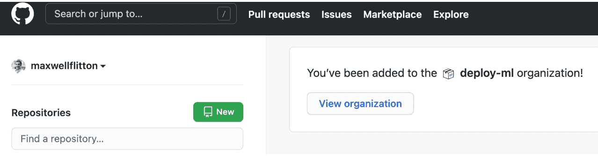
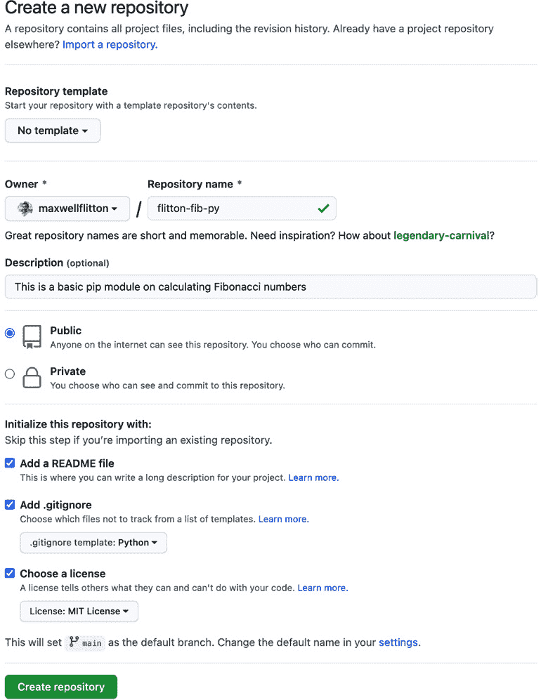
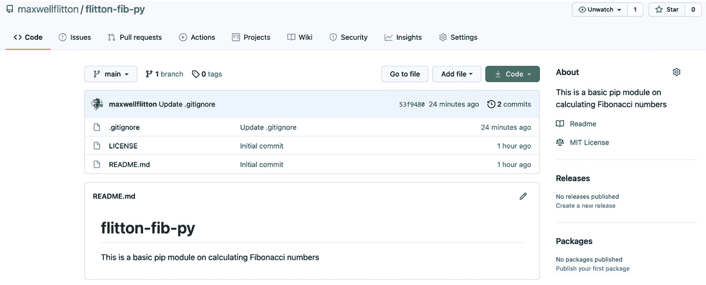
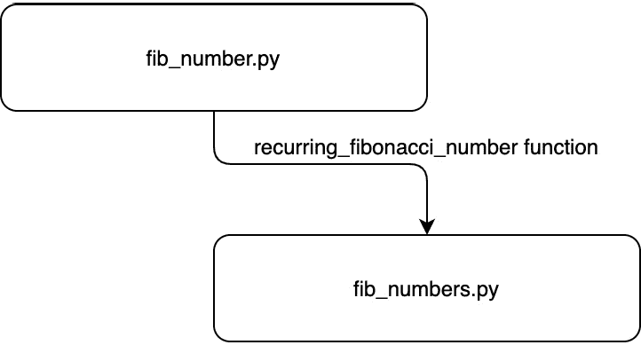
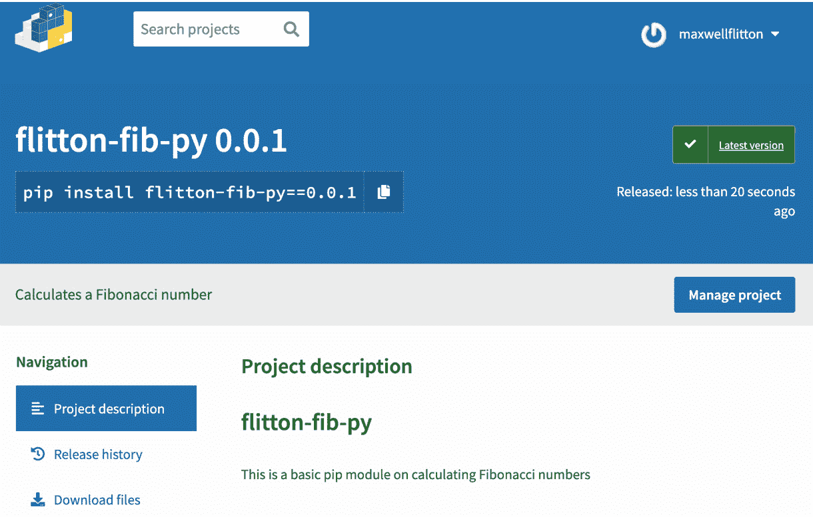
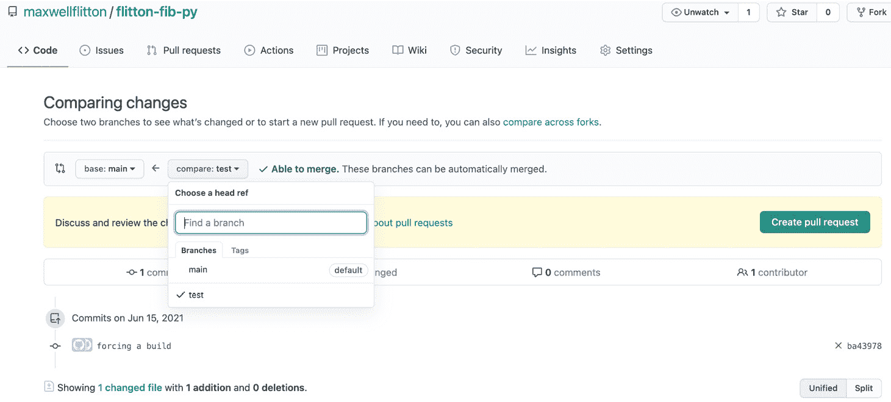
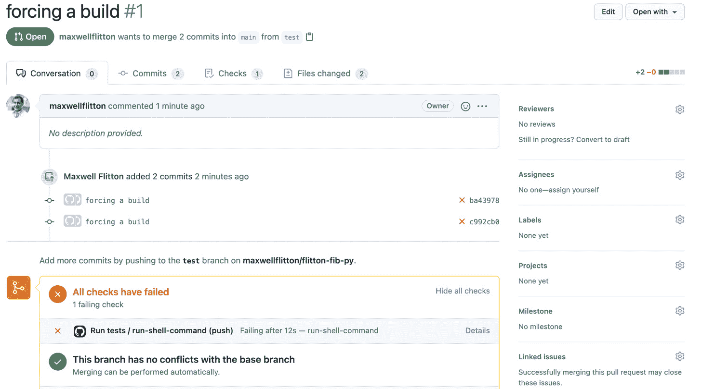
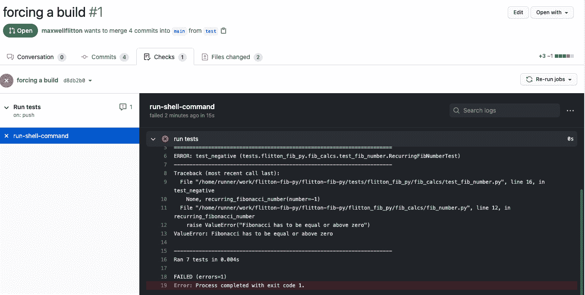
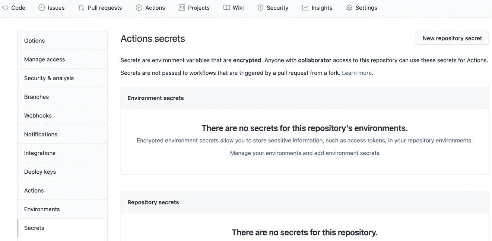
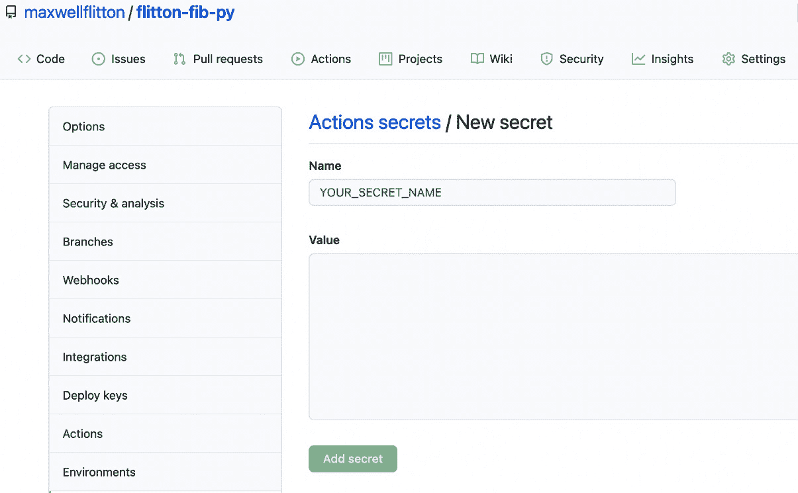

# *第四章*: 在 Python 中构建 pip 模块

编写代码来解决我们的问题是很有用的。然而，编写代码可能会变得重复且耗时，尤其是在我们构建应用程序时。应用程序通常需要定义构建应用程序的步骤。打包我们的代码可以帮助我们重用代码并与其他开发者共享。在本章中，我们将把斐波那契代码打包成一个 Python `pip` 模块，它可以轻松安装并具有命令行工具。我们还将介绍持续集成过程，一旦合并到 `main` 分支，就会部署我们的包。

在本章中，我们将涵盖以下主题：

+   为 Python `pip` 模块配置设置工具

+   在 `pip` 模块中打包 Python 代码

+   配置持续集成

# 技术要求

我们需要安装 Python 3。为了充分利用本章内容，我们还需要拥有一个 GitHub 账户，因为我们将会使用 GitHub 来打包我们的代码，可以通过此链接访问：[`github.com/maxwellflitton/flitton-fib-py`](https://github.com/maxwellflitton/flitton-fib-py)。

本章还需要 Git 命令行工具。这些工具可以通过以下说明进行安装：[`git-scm.com/book/en/v2/Getting-Started-Installing-Git`](https://git-scm.com/book/en/v2/Getting-Started-Installing-Git)。本章还将使用 PyPI 账户。你需要拥有自己的 PyPI 账户，可以通过此链接免费获得：[`pypi.org/`](https://pypi.org/)。

本章的代码可以通过此链接找到：[`github.com/PacktPublishing/Speed-up-your-Python-with-Rust/tree/main/chapter_four`](https://github.com/PacktPublishing/Speed-up-your-Python-with-Rust/tree/main/chapter_four)。

# 为 Python pip 模块配置设置工具

Python 中的设置工具是打包和安装我们模块中的代码的方式。它们为安装代码的系统提供了一套命令和参数，以便处理。为了探索如何实现这一点，我们将打包前一章中介绍的斐波那契数示例。然而，这些计算将被打包在一个 `pip` 模块中。为了配置我们的设置工具，我们需要执行以下步骤：

1.  为我们的 Python `pip` 包创建一个 GitHub 仓库。

1.  定义基本参数。

1.  定义一个 `README` 文件。

1.  定义基本模块结构。

让我们以下节详细查看这些步骤。

## 创建 GitHub 仓库

显然，经验丰富的开发者可以创建 GitHub 仓库，但为了完整性，我们将提供所有必要的步骤。如果你已经可以创建 GitHub 仓库，请继续下一节：

1.  在登录后的 GitHub 主页面上，我们可以通过点击**新建**按钮来创建我们的仓库，如图所示：

    图 4.1 – 如何在 GitHub 上创建一个新的仓库

1.  一旦点击，我们可以使用下面的参数配置我们的新仓库：

    图 4.2 – 我们新 GitHub 仓库的参数

    对于这个例子，我们将 GitHub 仓库设置为 `pip` 打包，这一章的私有仓库也将以相同的方式工作。我们还包含了一个 `.gitignore` 文件，并将其选为 Python。这是为了停止 Python 缓存，并让虚拟环境文件由 GitHub 跟踪，在我们上传代码到仓库时上传。现在我们已经创建了 GitHub 仓库，进入仓库将看起来像这样：

    

    图 4.3 – 我们 GitHub 仓库主页

    我们可以看到，我们的描述是写在 `README.md` 文件中的。还必须注意的是，`README.md` 文件是可渲染的。这发生在仓库的任何目录中。如果我们想，我们可以通过一系列的 `README.md` 文件在整个仓库中记录要做什么以及如何使用代码。

1.  完成这些后，我们可以使用下面的命令下载我们的仓库：

    ```rs
    git clone https://github.com/maxwellflitton/flitton-
      fib-py.git
    ```

    你的 URL 将不同，因为你有一个不同的仓库。唯一剩下的事情是确保我们的仓库的开发环境有一个 Python 虚拟环境。

1.  这可以通过导航到 GitHub 仓库的根目录，然后运行下面的命令来完成：

    ```rs
    venv directory in the root directory. We have to use the venv directory, as this is automatically included in the .gitignore file. However, there is nothing stopping us from calling it what we want, as long as we include it in the .gitignore file. However, venv is the convention, and using this will avoid confusion with other developers. Our environment is now fully set up. 
    ```

1.  要在终端中使用我们的虚拟环境，我们可以使用下面的命令激活它：

    ```rs
    source venv/bin/activate
    ```

我们可以看到，我们的命令前面带有 `(venv)` 前缀，这意味着它是激活的。

## 定义基本参数

现在我们已经使环境完全可用，我们将定义在安装 Python `pip` 模块时的基本参数：

1.  这通过在仓库根目录下创建一个 `setup.py` 文件来实现。当另一个 Python 系统安装我们的 `pip` 模块时，它将被运行。在我们的 `setup.py` 文件中，我们使用以下代码导入我们的设置工具：

    ```rs
    from setuptools import find_packages, setup
    ```

    我们将使用 `setup` 来定义我们的参数，并使用 `find_packages` 来排除测试。

1.  现在我们已经导入了设置工具，我们可以使用以下代码在同一个文件中定义我们的参数：

    ```rs
    setup(
        name="flitton_fib_py",
        version="0.0.1",
        author="Maxwell Flitton",
        author_email="maxwell@gmail.com",
        description="Calculates a Fibonacci number",
        long_description="A basic library that \
          calculates Fibonacci numbers",
        long_description_content_type="text/markdown",
        url="https://github.com/maxwellflitton/flitton- \
          fib-py",
        install_requires=[],
        packages=find_packages(exclude=("tests",)),
        classifiers=[
            "Development Status :: 4 - Beta",
            "Programming Language :: Python :: 3",
            "Operating System :: OS Independent",
        ],
        python_requires='>=3',
        tests_require=['pytest'],
    )
    ```

    这里有很多参数。我们从 `name` 字段到 `url` 所做的是本质上定义了我们 `pip` 模块的元数据。`classifiers` 字段也是我们模块的元数据。其余的字段具有以下效果：

    +   `Install_requires` 字段目前是一个空列表。这是因为我们的模块目前不需要任何第三方模块。我们将在 *管理依赖项* 部分介绍依赖项。

    +   `packages`字段确保我们在开始构建模块的测试时排除我们的`test`目录。虽然我们将使用测试来检查我们的模块并确保标准，但当我们使用我们的模块作为第三方依赖项时，我们不需要安装它们。

    +   `Python_requires`字段确保安装我们的模块的系统已安装正确的 Python 版本。

    +   `tests_require`是在运行测试时的一组需求。

1.  现在我们已经定义了基本设置，我们可以使用以下命令上传我们的代码：

    ```rs
    git add -A
    git commit -m "adding setup to module"
    git push origin main
    ```

我们在这里所做的是将所有新更改的文件添加到我们的 Git 分支（即`main`分支）。然后我们使用`adding setup to module`信息提交我们的文件。然后我们将代码推送到`main`分支，这意味着我们将更改上传到了在线的 Git 仓库。这不是管理我们的代码迭代的最优方式。我们将在本章末尾的持续集成部分介绍不同的分支以及如何管理它们。

你可能已经注意到`long_description`是 Markdown 格式；然而，试图将整个 Markdown 放入这个字段会导致`setup.py`文件变得庞大。它将基本上是一个跨越多行的长字符串，其中散布着一些 Python 代码行。我们希望我们的`setup.py`文件在模块安装时指导设置逻辑。我们还希望模块的详细描述在直接访问 GitHub 仓库时由 GitHub 渲染。因此，在下一节中，我们需要在定义我们的详细描述周围添加一些额外的逻辑。

## 定义一个 README 文件

我们的详细描述基本上是`README.md`文件。如果我们将其与`setup.py`合并，当我们在 PyPI 上访问它并上传到 PyPI 服务器时，`README.md`文件也会被渲染。这可以通过在`setup.py`文件中将`README.md`文件读取为字符串，然后使用以下代码将该字符串插入到`long_description`字段中来实现：

```rs
with open("README.md", "r") as fh:
```

```rs
    long_description = fh.read()
```

```rs
setup(
```

```rs
    name="flitton_fib_py",
```

```rs
    version="0.0.1",
```

```rs
    author="Maxwell Flitton",
```

```rs
    author_email="maxwell@gmail.com",
```

```rs
    description="Calculates a Fibonacci number",
```

```rs
    long_description=long_description,
```

```rs
    ...
```

`...`之后的代码与之前相同。有了这个，我们的基本模块设置就完成了。现在，我们只需要定义一个基本的模块来安装和使用，这就是我们在下一步将要做的。

## 定义一个基本模块

定义一个基本模块采用以下结构：

```rs
├── LICENSE
```

```rs
├── README.md
```

```rs
├── flitton_fib_py
```

```rs
│   └── __init__.py
```

```rs
├── setup.py
```

```rs
└── venv
```

我们将用户将拥有的实际代码放在我们的`flitton_fib_py`目录中。目前，我们只将有一个基本的打印函数，以便我们可以看到我们的`pip`包是否工作。以下是步骤：

1.  我们通过在`flitton_fib_py/__init__.py`文件中添加一个基本的`print`函数来实现这一点，该函数具有以下代码：

    ```rs
    def say_hello() -> None:
        print("the Flitton Fibonacci module is saying hello")
    ```

    一旦完成，我们可以使用 *打包 Python 代码到 pip 模块* 部分中描述的 git 命令将代码上传到 GitHub 仓库。现在我们应该在 `main` 分支中看到我们模块的所有代码。考虑到这一点，我们需要导航到另一个与我们的 `git` 仓库不相关的目录。

1.  然后，我们通过输入以下命令解除我们的虚拟环境：

    ```rs
    pip install and check to see whether it works.
    ```

1.  要使用 `pip install`，我们指向存储我们的 `pip` 模块的 GitHub 仓库的 URL，并定义它是哪个分支。我们通过输入以下命令来完成，所有内容都在一行中：

    ```rs
    pip install git+https://github.com/maxwellflitton/
      flitton-fib-py@main
    ```

    你的 GitHub 仓库将有一个不同的 URL，你可能有不同的目录。运行此命令将给出一系列输出，表明它正在克隆仓库并安装它。

1.  然后，我们通过输入以下命令打开 Python 终端：

    ```rs
    python
    ```

1.  我们现在有一个交互式终端。我们可以通过输入以下命令来检查我们的模块是否工作：

    ```rs
    >>> from flitton_fib_py import say_hello
    >>> say_hello()
    ```

    一旦输入最后一个命令，我们将在终端中得到以下输出：

    ```rs
    the Flitton Fibonacci module is saying hello
    ```

到这里，我们的 Python 包就成功了！这对私有和公共 GitHub 仓库都适用。现在没有什么能阻止我们将私有 Python 代码打包以在其他私有 Python 项目中重用！

虽然这是一个有用的工具，可以在其他计算机上以最少的设置打包和安装代码，但我们必须小心。当我们运行 `setup.py` 文件时，我们是以我们的 root 用户身份运行代码。因此，我们必须确保我们信任我们正在安装的内容。将恶意代码放入 `setup.py` 文件是一种攻击向量。我们可以使用标准 Python 库中的 `SubProcess` 对象在计算机上运行直接命令。确保你信任你用 `pip install` 安装的代码的作者。

这也突显了在仅仅运行 `pip install` 时，你必须多么警觉。有些开发者会稍微修改一个包。例如，有一个著名的案例是 `requests` 包。这是一个常见且广泛使用的包；然而，在一段时间内，有一个名为 `request` 的仿冒包。它们依赖于人们误输入 `pip install` 并下载错误的包。这被称为 **打字欺骗**。

我们现在已经将我们的 Python 代码打包成一个模块。然而，它不是一个非常有用的模块。这把我们带到了下一个部分，我们将打包我们的斐波那契序列代码。

# 打包 Python 代码到 pip 模块

现在我们已经配置了 GitHub 仓库，我们可以开始构建我们模块的斐波那契代码。为了实现这一点，我们必须执行以下步骤：

1.  构建我们的斐波那契计算代码。

1.  创建命令行界面。

1.  使用单元测试测试我们的斐波那契计算代码。

让我们现在详细讨论这些步骤。

## 构建我们的斐波那契计算代码

当涉及到构建我们的斐波那契计算代码时，我们将有两个函数——一个用于计算斐波那契数，另一个将接受一个数字列表并依赖于计算函数来返回计算出的斐波那契数列表。对于这个模块，我们将采用函数式编程方法。这并不意味着我们在构建每个`pip`模块时都应该采用函数式编程方法。我们使用函数式编程是因为斐波那契数列的计算自然地与函数式编程风格相结合。

Python 是一种面向对象的语言，具有多个相互关联的移动部分的问题自然地与面向对象的方法相结合。我们的模块结构将采用以下形式：

```rs
├── LICENSE
```

```rs
├── README.md
```

```rs
├── flitton_fib_py
```

```rs
│   ├── __init__.py
```

```rs
│   └── fib_calcs
```

```rs
│       ├── __init__.py
```

```rs
│       ├── fib_number.py
```

```rs
│       └── fib_numbers.py
```

```rs
├── setup.py
```

对于本章，我们将保持一个简单的界面，以便我们可以专注于在`pip`模块中打包代码。以下是步骤：

1.  首先，我们可以在`fib_number.py`文件中使用以下代码构建我们的斐波那契数计算器：

    ```rs
    from typing import Optional
    def recurring_fibonacci_number(number: int) -> \
    Optional[int]:
        if number < 0:
            return None
        elif number <= 1:
            return number
        else:
        return recurring_fibonacci_number(number - 1) + \
               recurring_fibonacci_number(number - 2)
    ```

    这里需要注意的是，当输入的数字小于零时，我们返回`None`。从技术上讲，我们应该抛出一个错误，但现在这样做是为了演示在*配置持续集成*部分中检查工具的有效性。正如我们从前一章所知，前面的代码将根据输入数字正确计算出斐波那契数。

1.  现在我们有了这个函数，我们可以依赖它来创建一个函数，该函数可以在我们的`fib_numbers.py`文件中生成斐波那契数列表，以下代码如下：

    ```rs
    from typing import List
    from .fib_number import recurring_fibonacci_number
    def calculate_numbers(numbers: List[int]) -> List[int]:
        return [recurring_fibonacci_number(number=i) \
          for i in numbers]
    ```

    我们现在准备好再次测试我们的`pip`模块。我们必须再次将我们的代码推送到存储库的`main`分支，在另一个虚拟环境中卸载我们的`pip`包，并使用`pip install`重新安装。

1.  在我们安装了新包的 Python 终端中，我们可以使用以下控制台命令测试我们的`recurring_fibonacci_number`函数：

    ```rs
    >>> from flitton_fib_py.fib_calcs.fib_number 
        import recurring_fibonacci_number
    >>> recurring_fibonacci_number(5)
    5
    >>> recurring_fibonacci_number(8)
    21
    ```

    在这里，我们可以看到我们的斐波那契函数可以被导入，并且它运行正常，计算出了正确的斐波那契数。

1.  我们可以使用以下命令测试我们的`calculate_numbers`：

    ```rs
    >>> from flitton_fib_py.fib_calcs.fib_numbers 
    import calculate_numbers
    >>> calculate_numbers([1, 2, 3, 4, 5, 6, 7])
    [1, 1, 2, 3, 5, 8, 13]
    ```

在这里，我们可以看到我们的`calculate_numbers`函数也运行正常。我们有一个完全功能的斐波那契`pip`模块。然而，如果我们只想计算一个斐波那契数而不编写 Python 脚本，我们就不必进入 Python 终端。我们可以通过在下一步构建命令行界面来解决这个问题。

## 创建命令行界面

为了构建我们的命令行函数，我们的模块可以采用以下结构：

```rs
├── LICENSE
```

```rs
├── README.md
```

```rs
├── flitton_fib_py
```

```rs
│   ├── __init__.py
```

```rs
│   ├── cmd
```

```rs
│   │   ├── __init__.py
```

```rs
│   │   └── fib_numb.py
```

```rs
│   └── fib_calcs
```

```rs
     . . .
```

要构建我们的界面，我们遵循以下步骤：

1.  我们在`fib_numb.py`文件中使用以下代码构建命令行界面：

    ```rs
    import argparse
    from flitton_fib_py.fib_calcs.fib_number \
        import recurring_fibonacci_number
    def fib_numb() -> None:
        parser = argparse.ArgumentParser(
            description='Calculate Fibonacci numbers')
        parser.add_argument('--number', action='store', 
                            type=int, required=True,
                            help="Fibonacci number to be \
                              calculated")
        args = parser.parse_args()
        print(f"Your Fibonacci number is: " \
          f"{recurring_fibonacci_number \
            (number=args.number)}")
    ```

    在这里，我们可以看到我们使用`argparse`模块从命令行获取传递的参数。一旦我们获得了参数，我们就会计算这个数字并将其打印出来。现在，为了实际上通过终端访问它，我们必须在`pip`包根目录的`setup.py`文件中指向它，通过在`setup`对象初始化中添加以下参数：

    ```rs
    entry_points={
        'console_scripts': [
            'fib-number = \
               flitton_fib_py.cmd.fib_numb:fib_numb',
        ],
    },
    ```

    在这里，我们所做的是将`fib-number`控制台命令与我们刚刚定义的函数相链接。在另一个虚拟环境中卸载我们的`pip`模块，将更改上传到我们仓库的`main`分支，并使用`pip install`安装我们的新模块后，我们将拥有我们构建的命令行工具的新模块。

1.  安装完成后，我们只需输入以下命令：

    ```rs
    argparse module that we are using ensures that we provide the arguments needed. If we need help, we can get this by typing in the following command:

    ```

    fib-number -h

    ```rs

    This gives us the help printout, as shown here:

    ```

    使用方法：fib-number [-h] --number NUMBER

    计算斐波那契数

    可选参数：

    -h, --help       显示此帮助信息并退出

    --number NUMBER  要计算的斐波那契数

    ```rs

    We can see that we have the type and the help description of what it does.
    ```

1.  因此，要计算斐波那契数，我们使用以下命令：

    ```rs
    fib-number --number 20
    ```

    这给我们以下输出：

    ```rs
    Your Fibonacci number is: 6765
    ```

    如果我们为参数提供一个字符串而不是数字，我们的程序将拒绝它，并抛出错误。

这里，我们已经有了，我们有一个完全工作的命令行工具！但这并没有结束。你可以更进一步。没有什么能阻止你使用标准库中的`subprocess`与其他库，如 Docker 结合，来构建你自己的 DevOps 工具。你可以自动化你自己的整个工作流程和应用程序。然而，如果我们越来越多地依赖我们的`pip`模块来做重复的繁重工作，如果程序引入了一些我们需要立即知道的错误，我们可能会遇到严重的问题。为了做到这一点，我们需要开始为我们模块构建单元测试。这些将在下一小节中介绍。

## 构建单元测试

单元测试对我们检查和维护代码的质量控制非常有帮助。为了构建我们的单元测试，我们的模块将具有以下结构：

```rs
├── LICENSE
```

```rs
├── README.md
```

```rs
├── flitton_fib_py
```

```rs
     . . .
```

```rs
├── scripts
```

```rs
│   └── run_tests.sh
```

```rs
├── setup.py
```

```rs
├── tests
```

```rs
│   ├── __init__.py
```

```rs
│   └── flitton_fib_py
```

```rs
│       ├── __init__.py
```

```rs
│       └── fib_calcs
```

```rs
│           ├── __init__.py
```

```rs
│           ├── test_fib_number.py
```

```rs
│           └── test_fib_numbers.py
```

我们可以看到我们正在模仿我们模块中的代码结构。这对于跟踪我们的测试非常重要。如果模块增长，我们不会在我们的测试中迷失方向。如果我们需要删除目录或将其移动到另一个模块，我们可以简单地删除适当的目录或移动它。还必须注意的是，我们已经构建了一个 Bash 脚本来运行我们的测试。

当涉及到编写我们的测试时，通常最好基于依赖链进行编码。例如，我们的文件具有以下依赖关系链的描述：



图 4.4 – 依赖关系链

考虑到我们的依赖关系链，我们应该首先为`fib_number.py`文件编写测试，并确保我们的`recurring_fibonacci_number`函数在编写依赖于`recurring_fibonacci_number`函数的测试之前正常工作。以下是编写测试的步骤：

1.  我们首先通过以下代码在我们的`test_fib_number.py`文件中导入测试代码所需的模块：

    ```rs
    from unittest import main, TestCase
    from flitton_fib_py.fib_calcs.fib_number \
        import recurring_fibonacci_number
    ```

    `main`函数是用来运行所有测试的。我们还通过编写自己的继承自`TestCase`的测试类来依赖`TestCase`类。这为我们提供了额外的类函数，有助于我们测试结果。

1.  我们可以使用以下代码编写一系列输入的测试：

    ```rs
    class RecurringFibNumberTest(TestCase):
        def test_zero(self):
            self.assertEqual(0, 
                recurring_fibonacci_number(number=0)
            )
        def test_negative(self):
            self.assertEqual(
                None, recurring_fibonacci_number \
                  (number=-1)
            )
        def test_one(self):
            self.assertEqual(1, \
              recurring_fibonacci_number(number=1))
        def test_two(self):
            self.assertEqual(1, \ 
              recurring_fibonacci_number(number=2))
        def test_twenty(self):
            self.assertEqual( \
            6765, recurring_fibonacci_number(number=20)
            )
    ```

    这里需要注意的是，我们所有的函数都有一个`test_`前缀。这标志着该函数是一个测试函数。文件名也是这样。所有测试文件都有`test_`前缀，以标记该文件包含测试。在我们的测试代码中，我们可以看到我们只是将一系列输入传递给我们要测试的函数，并断言结果是我们所期望的。如果断言不成立，那么我们会得到一个错误和一个失败的结果。鉴于我们只是在重复测试同一个函数，我们可以将所有的断言放入一个测试函数中。如果我们正在测试整个对象，这通常是首选的。我们实际上会为对象中要测试的每个函数有一个测试函数。

1.  现在我们已经运行了所有的测试，如果直接在`test_fib_number.py`文件的底部运行`unittest` `main`函数，我们可以运行以下代码：

    ```rs
    if __name__ == "__main__":
        main()
    ```

1.  现在，我们必须将我们的`PYTHONPATH`变量设置为`flitton_fib_py`目录。

    完成这些后，我们可以运行我们的`test_fib_number.py`文件，并得到如图所示的控制台输出：

    ```rs
    None to a 1 in the second test, we would get the following printout:

    ```

    测试点中的 F 会高亮显示，并突出显示失败的测试及其失败的位置。

    ```rs

    ```

1.  现在我们已经构建了我们的基本测试，我们可以构建一个函数的测试，该函数接受一个整数列表并返回一个斐波那契数列列表。在我们的`test_fib_numbers.py`文件中，我们使用以下代码导入所需的模块：

    ```rs
    from unittest import main, TestCase
    from unittest.mock import patch
    from flitton_fib_py.fib_calcs.fib_numbers \
        import calculate_numbers
    ```

    在这里，我们可以看到我们正在导入我们正在测试的函数以及相同的`main`和`TestCase`。但是，必须注意的是，我们已经导入了`patch`函数。这是因为我们已经测试了我们的`recurring_fibonacci_number`函数。`patch`函数使我们能够将`MagicMock`对象插入到我们的`recurring_fibonacci_number`函数的位置。

对于我们的例子，可以争论我们不需要修补任何东西。然而，了解修补是很重要的。`MagicMock`对象；我们可以在测试期间将返回值定义为任何我们想要的，并记录对`MagicMock`对象的全部调用。

在这里的优势是，我们可能由于某种原因意外地调用了我们依赖的函数两次。然而，如果函数两次返回相同的值，如果我们没有修复它，我们将一无所知。但是，通过修复，我们可以检查调用并抛出错误，如果行为不是我们所期望的。我们也可以通过仅更改补丁的返回值并重新运行测试，非常快速地测试一系列边缘情况。

所有这些，我们可以理解为什么我们对修补感到兴奋。然而，也有一些缺点。如果我们不更新修补的返回值，依赖的代码不会得到更改，测试也不会保持准确。这就是为什么总是明智地采用多种方法，并运行一个不进行任何修补的功能测试，以运行整个过程。考虑到所有这些，我们的修补单元测试在`tests/flitton_fib_by/fib_calcs/test_fib_numbers.py`文件中是通过以下代码执行的：

```rs
class Test(TestCase):
```

```rs
    @patch("flitton_fib_py.fib_calcs.fib_numbers." 
```

```rs
           "recurring_fibonacci_number")
```

```rs
    def test_calculate_numbers(self, mock_fib_calc):
```

```rs
        expected_outcome = [mock_fib_calc.return_value, 
```

```rs
                          mock_fib_calc.return_value]
```

```rs
        self.assertEqual(expected_outcome, 
```

```rs
                         calculate_numbers(numbers=[3, 4]))
```

```rs
        self.assertEqual(2, 
```

```rs
          len(mock_fib_calc.call_args_list))
```

```rs
        self.assertEqual({'number': 3}, 
```

```rs
          mock_fib_calc.call_args_list[0][1])
```

```rs
        self.assertEqual({'number': 4}, 
```

```rs
          mock_fib_calc.call_args_list[1][1])
```

在这里，我们可以看到我们使用了一个字符串来定义我们要修补的函数的路径，将补丁作为装饰器使用。然后，我们将修补后的函数通过`mock_fib_calc`参数传递给测试函数。接着，我们声明我们期望直接测试的函数（`calculate_numbers`）的结果是修补函数的两个返回值的列表。然后，我们将两个整数包裹在列表中传递给`calculate_numbers`函数，并断言这将与我们的预期结果相同。一旦完成，我们断言`mock_fib_calc`只被调用了两次，并检查每一个调用，断言它们是我们传递的数字，并且顺序正确。这给了我们很大的权力来真正检查我们的代码。然而，我们还没有完成；我们还需要定义功能测试，以便我们能够运行这里的测试：

```rs
    def test_functional(self):
```

```rs
        self.assertEqual([2, 3, 5], 
```

```rs
            calculate_numbers(numbers=[3, 4, 5]))
```

```rs
if __name__ == "__main__":
```

```rs
    main()
```

对于我们的模块，所有的单元测试都已经完成。然而，我们不想手动运行每个文件来查看我们的测试。有时我们只想查看所有测试的结果，看看是否有失败的。为了自动化这个过程，我们可以在`run_tests.sh`文件中构建一个 Bash 脚本，代码如下：

```rs
#!/usr/bin/env bash
```

```rs
SCRIPTPATH="$( cd "$(dirname "$0")" ; pwd -P )"
```

```rs
cd $SCRIPTPATH
```

```rs
cd ..
```

```rs
source venv/bin/activate
```

```rs
export PYTHONPATH="./flitton_fib_py"
```

```rs
python -m unittest discover
```

在这里，我们声称这个文件是一个 Bash 脚本，第一行是。第一行是一个 shebang 行，告诉运行它的计算机它是什么类型的语言。然后我们获取这个脚本所在的目录路径，并将其分配给`SCRIPTPATH`变量。然后我们导航到这个目录，移动到我们模块的根目录，激活我们的虚拟环境，然后定义我们的`PYTHONPATH`变量，使其包含我们的模块中的斐波那契数代码。现在一切都已经定义好了，为了运行我们的测试，我们使用`unittest`命令行工具来运行所有的单元测试。记住，所有我们的测试文件名都有`test_`前缀。运行这个命令会给出以下输出：

```rs
.......
```

```rs
------------------------------------------
```

```rs
Ran 7 tests in 0.003s
```

```rs
OK
```

在这里，我们可以看到有七个测试正在运行，并且它们都通过了。我们可以看到我们已经开始了测试运行的自动化过程。这并不是我们应该停止的地方。当我们继续前进到打包和分发我们的`pip`模块时，我们应该调查通过持续集成来自动化这些过程，这是我们将在下一节中探讨的内容。目前，按照现状，如果一个用户可以访问我们的 GitHub 仓库，我们可以通过`pip`安装代码并使用它。

# 配置持续集成

我们的 Python `pip`包完全可用。然而，这并不是终点。我们需要保持代码的质量，并在我们向模块推送新功能和对现有代码进行重构时，使其能够不断升级。持续集成使我们能够确保测试通过，并保持质量标准。它还加快了部署过程，使我们能够在几分钟内推送新迭代，使我们能够专注于手头的任务。它还降低了出错的风险。

如我们所知，最平凡、重复的任务是最容易出错的任务。这是生活的一个事实。众所周知，大多数车祸发生在司机离家 5 分钟内。这是因为司机注意力分散，大脑关闭，依赖肌肉记忆。部署过程也是如此。它们是重复的，不需要太多的精神集中。因此，经过几次之后，我们开始依赖肌肉记忆，忘记检查某些事情，在部署我们的`pip`包时犯下小错误。持续集成是避免错误和节省时间（不仅是在部署中，而且在无需纠正错误中）的必要手段。为了设置持续集成，我们必须执行以下步骤：

1.  手动部署到 PyPI。

1.  管理我们的依赖项。

1.  设置 Python 的类型检查。

1.  使用 GitHub Actions 设置和运行测试以及类型检查。

1.  为我们的`pip`包创建自动版本控制。

1.  使用 GitHub Actions 部署到 PyPI。

让我们以下一节详细查看这些步骤。

## 手动部署到 PyPI

我们现在继续到手动将我们的 GitHub 仓库部署到 PyPI 的第一步。我们已经通过直接指向 GitHub 仓库安装了我们的`pip`包。然而，如果我们允许每个人访问我们的模块，因为它开源，那么上传我们的包到 PyPI 会更简单。这将使其他人能够使用简单的命令进行安装。以下是步骤：

1.  首先，在我们上传之前，需要打包我们的`pip`模块。这可以通过以下命令完成：

    ```rs
    pip module in a tar.gz file, which gives us the following file outline:

    ```

    ├── LICENSE

    ├── README.md

    ├── dist

    │   └── flitton_fib_py-0.0.1.tar.gz

    ├── flitton_fib_py

    . . .

    ```rs

    ```

1.  我们现在可以看到版本号已经包含在文件名中。我们现在已经准备好上传到 PyPI 服务器。为此，我们必须使用以下命令安装`twine`：

    ```rs
    pip install twine
    ```

1.  我们现在可以使用以下命令上传`tar.gz`文件：

    ```rs
    twine upload dist/*
    ```

    这将上传我们创建的所有包。在这个过程中，终端会要求我们输入 PyPI 用户名和密码。然后上传包，并告诉我们可以在 PyPI 上找到模块的位置。如果我们访问这个位置，我们应该会看到以下图中所示视图：



图 4.5 – 我们模块的 PyPI 视图

我们可以看到，我们的`README.md`文件正在被直接渲染在*图 4.5*的视图中。现在，我们可以直接使用 PyPI 视图中的`pip install`命令来安装它。必须注意的是，我们现在有一个依赖项。我们需要管理这些依赖项。我们将在下一步中介绍这一点。

## 管理依赖项

当涉及到依赖项时，我们必须管理两种类型。例如，我们的`twine`依赖项帮助我们将其上传到 PyPI。然而，这对于`pip`包来说并不是必需的。因此，我们需要两个不同的依赖项列表——一个用于开发，另一个用于实际使用。我们使用这里所述的简单标准命令定义我们需要的开发依赖项：

```rs
pip freeze > requirements.txt
```

`pip freeze`命令给我们的是一个特定需求列表，我们的当前 Python 环境需要安装这些需求才能运行。`> requirements.txt`将其写入`requirements.txt`文件。如果你是一个新开发者，刚开始开发我们的模块，你可以使用以下命令安装所有需要的依赖项：

```rs
pip install -r requirements.txt
```

我们可以在这里很严格，因为除了直接开发我们的模块外，没有任何东西依赖于开发需求。然而，当涉及到我们的模块时，我们知道它将被安装到多个系统上，每个系统都有多个需求。因此，我们希望有一些灵活性。例如，如果我们的模块将要把斐波那契数写入`yml`和`pickle`文件，那么我们将需要使用`pyYAML`和`dill`模块来使我们能够将斐波那契数写入`yml`和`pickle`文件。为此，我们修改`setup.py`文件中`setup`初始化的`install_requires`参数，如下所示：

```rs
install_requires=[ 
```

```rs
    "PyYAML>=4.1.2",
```

```rs
    "dill>=0.2.8"
```

```rs
],
```

必须注意，这些并不是最新的包。我们必须放弃一些版本，并允许我们的依赖项等于或高于该版本。这给我们的用户在使用我们的 pip 包时提供了自由度。我们还必须将这些需求复制粘贴到我们的`requirements.txt`文件中，以确保我们的开发与我们的`pip`模块的用户体验保持一致。假设我们打算添加一个可选功能，即启动一个小型的 Flask 服务器，该服务器本地提供计算斐波那契数的 API。在这里，我们可以在`setup.py`文件中的`setup`初始化中添加一个`install_requires`参数，如下所示：

```rs
extras_require={
```

```rs
  'server': ["Flask>=1.0.0"]
```

```rs
},
```

现在，如果我们把我们的新代码上传到 PyPI 或我们的个人 GitHub 仓库，在安装我们的包时，我们会遇到不同的体验。如果我们正常安装它，我们会看到，当我们运行安装命令时，我们的`pickle`和`yml`需求会自动安装，如下所示：

```rs
pip install flitton-fib-py[server]
```

实际上会安装服务器需求。我们可以为 `server` 配置文件设置任意多的需求，并且它们都会被安装。记住，我们的 `extras_require` 参数是一个字典，因此我们可以定义任意多的额外需求配置文件。有了这个，我们现在有了开发需求、基本 `pip` 模块需求和可选 `pip` 模块需求。在下一步中，我们现在将依赖于一个新的开发需求来检查类型。

## 为 Python 设置类型检查

在本书的这个阶段，我们已经体验到了 Rust 引入的安全性。当类型不匹配时，Rust 编译器拒绝编译。然而，在 Python 中，我们不会得到这个，因为 Python 是一种解释型语言。然而，我们可以使用 `mypy` 模块来模拟这一点。步骤如下：

1.  首先，我们可以使用以下命令安装 `mypy` 模块：

    ```rs
    pip install mypy
    ```

1.  我们可以使用 `mypy` 入口点使用这里的代码进行类型检查：

    ```rs
    mypy is doing is checking the consistency across all of our Python code! Like a Rust compiler, it has found an inconsistency. However, because this is Python, we can still run our Python code. While Python is memory-safe, the strong type-checking that Rust enforces is going to reduce the risk of incorrect variables being passed into the function in runtime. Now, we know that there is an inconsistency. The inconsistency is that our recurring_fibonacci_number function returns either None or int. However, our calculate_numbers function relies on the recurring_fibonacci_number function for the return value, but it returns a list of integers as opposed to returning a list of integers or None values.
    ```

1.  我们可以使用 `recurring_fibonacci_number` 函数将返回值限制为一个整数：

    ```rs
    def recurring_fibonacci_number(number: int) -> int:
        if number < 0:
            raise ValueError(
            "Fibonacci has to be equal or above zero"
            )
        elif number <= 1:
            return number
        else:
         return recurring_fibonacci_number(number - 1) + \
                recurring_fibonacci_number(number - 2)
    ```

    在这里，我们可以看到如果输入数字小于零，我们会引发一个错误。无论如何它都不会计算，所以我们不妨抛出一个错误，通知用户存在错误，而不是默默地产生一个 `None` 值。

    如果我们运行 `mypy` 检查，我们会得到以下控制台输出：

    ```rs
    Success: no issues found in 6 source files
    ```

在这里，我们可以看到所有文件都已检查，并且它们具有类型一致性。

然而，我们可能会忘记每次上传新代码到 GitHub 仓库时都运行这种检查。在下一节中，我们将定义 GitHub Actions 来自动化我们的检查。

## 使用 GitHub Actions 设置和运行测试以及类型检查

GitHub Actions 执行一系列我们可以在 `yml` 文件中定义的计算。我们通常使用 GitHub Actions 来自动化每次都需要运行的过程。工作流程 `yml` 文件会被 GitHub 自动检测并运行，具体取决于我们给它提供的标签。我们可以通过以下步骤设置我们的 GitHub Actions：

1.  对于我们的测试和类型检查标签，我们将在 `.github/workflows/run-tests.yml` 文件中定义这些。在这个文件中，我们最初给出工作流程的名称，并声明它在从一个分支推送到另一个分支时触发。这发生在拉取请求完成时，一个分支被推送到另一个分支。如果我们合并拉取请求之前在我们的分支上推送更多更改，它也会重新运行。我们的定义以以下代码插入文件的顶部：

    ```rs
    Run tests. 
    ```

1.  接下来，我们必须定义我们的作业。我们还必须声明我们的作业是一个 `shell` 命令。然后我们定义操作系统是什么。一旦我们完成这个，我们就定义作业的步骤。在我们的 `steps` 部分，我们接着定义 `uses`，我们将声明它们是以下代码中的 `actions`：

    ```rs
    uses step, then we would not be able to access files such as the requirements. 
    ```

1.  现在，我们准备在 `steps` 标签下定义其余步骤。这些步骤通常有一个 `name` 和 `run` 标签。对我们来说，我们将定义三个步骤：

    1.  第一项是安装依赖项。

    1.  第二项是运行所有单元测试。

    1.  第三步是在这里运行类型检查：

    ```rs
    run is just a one-line terminal command. At one point, there is a | (pipe) value next to a run tag of the Install dependencies step. This pipe value simply allows us to write multiple lines of commands in one step. We must ensure that our requirements.txt file is updated with the mypy module. Once this is done, we can push this code to our GitHub repository and this GitHub action will run when we do pull requests. If you are familiar with GitHub and making pull requests, then you can move on to the next step. However, if you are not, then we can perform one now.
    ```

1.  首先，我们必须使用以下命令从我们的`main`分支拉取一个新的分支：

    ```rs
    test. We can then make a change in our code. 
    ```

1.  要仅通过拉取请求触发 GitHub 动作，我们可以在任何文件中添加一个注释来简单地标记我们的代码，例如这里：

    ```rs
    # trigger build (14-6-2021)
    ```

    如果代码有变化，你可以写任何内容，因为这只是一个注释。然后我们添加并提交我们的更改到我们的**测试**分支，并将其推送到 GitHub 仓库。一旦完成，我们可以通过点击**拉取请求**标签并选择我们的**测试**分支来触发一个拉取请求，如图所示：

    

    图 4.6 – 设置 GitHub 拉取请求

1.  一旦完成，我们可以点击**创建拉取请求**来查看它。在这里，我们将看到所有被触发的 GitHub Actions 及其状态，如图下所示：

    图 4.7 – 拉取请求的 GitHub Actions 状态视图

    我们可以看到我们的测试失败了！如果我们点击**详情**，我们可以看到一切都在正常工作；只是我们忘记更新我们的测试。如果我们记得，我们更改了我们的代码，在将负值传递给斐波那契计算函数时抛出错误，如下所示：

    

    图 4.8 – GitHub Actions 执行细节视图

1.  我们可以将测试代码更改为在`tests/flitton_fib_py/fib_calcs/test_fib_number.py`文件中的测试代码断言抛出一个错误，如下所示：

    ```rs
    def test_negative(self):
        with self.assertRaises(ValueError) as \
    raised_error:
            recurring_fibonacci_number(number=-1)
        self.assertEqual(
            "Fibonacci has to be equal or above zero",
            str(raised_error.exception)
        ) 
    ```

    在这里，我们可以看到我们断言抛出一个值错误，因为我们正在运行我们期望会抛出错误的代码，并且异常正是我们所期望的。将此推送到我们的 GitHub 仓库将确保所有测试都已通过。如果我们想将代码合并到我们的`main`分支，我们可以合并这个拉取请求。

    从这个例子中我们可以看到持续集成是有用的。它捕捉到了我们可能没有注意到的代码更改。

现在我们知道我们的测试是自动运行的，我们需要自动化跟踪我们模块的版本，以避免犯我们在没有更新测试时犯过的同样的错误。

## 为我们的 pip 包创建自动版本控制

为了自动化更新版本号的过程，我们打算在我们的`pip`模块根目录下的`get_latest_version.py`文件中放置几个函数。以下是步骤：

1.  首先，我们需要使用以下代码导入我们需要的所有内容：

    ```rs
    os and pathlib to manage writing the latest version to a file. We are also going to use the requests module to call PyPI to get the latest version that is currently available to the public. 
    ```

1.  要做到这一点，我们可以创建一个函数，该函数将从 PyPI 获取我们模块的元数据并返回以下代码中的版本：

    ```rs
    def get_latest_version_number() -> str:
        req = requests.get(
        "https://pypi.org/pypi/flitton-fib-py/json")
        return req.json()["info"]["version"]
    ```

1.  这只是一个简单的网络请求。一旦我们完成这个操作，我们就想使用定义的下一个函数将这个字符串解包成一个整数元组：

    ```rs
    def unpack_version_number(version_string: str) \
        -> Tuple[int, int, int]:
        version_buffer: List[str] = \
          version_string.split(".")
        return int(version_buffer[0]),\
          int(version_buffer[1]),int(version_buffer[2])
    ```

    在这里，我们可以看到这是一个简单的通过项目符号分割。然后，我们将它们转换为整数并将它们打包成一个元组以返回。

1.  现在我们已经得到了我们的版本号，我们需要使用定义的下一个函数将这个数字增加 `1`：

    ```rs
    def increase_version_number(version_buffer: \
    Union[Tuple[int, int, int], List[int]]) -> List[int]:
        first: int = version_buffer[0]
        second: int = version_buffer[1]
        third: int = version_buffer[2]
        third += 1
        if third >= 10:
            third = 0
            second += 1
            if second >= 10:
                second = 0
                first += 1
        return [first, second, third]
    ```

    在这里，我们可以看到如果其中一个整数等于或大于 `10`，我们就将其重置为 `0` 并将下一个数字增加 `1`。唯一不会重置为 `0` 的是最左边的数字。这将不断上升。

1.  现在我们已经将数字增加了 `1`，我们需要使用定义的下一个函数将整数打包成一个字符串：

    ```rs
    def pack_version_number(
        version_buffer: Union[Tuple[int, int, int], 
          List[int]]) -> str:
        return f"{version_buffer[0]}.{version_buffer[1]} \ 
          .{version_buffer[2]}"
    ```

1.  一旦我们将这个数字打包成一个字符串，我们就必须将版本写入一个文件。这可以通过定义的下一个函数来完成：

    ```rs
    def write_version_to_file(version_number: str) -> \
    None:
        version_file_path: str = str( \
        pathlib.Path(__file__).parent.absolute()) + \
        "/flitton_fib_py/version.py"
        if os.path.exists(version_file_path):
            os.remove(version_file_path)
        with open(version_file_path, "w") as f:
            f.write(f"VERSION='{version_number}'")
    ```

    在这里，我们可以看到我们确保路径将位于我们模块的根目录。然后，如果版本文件已经存在，我们就删除它，因为它已经过时了。

1.  然后，我们使用以下代码将更新的版本号写入文件：

    ```rs
    if __name__ == "__main__":
        write_version_to_file(
            version_number=pack_version_number(
                version_buffer=increase_version_number(
                    version_buffer=unpack_version_number(
                version_string=get_latest_version_number()
                    )
                )
            )
        )
    ```

    这确保了如果我们直接运行文件，我们将得到写入文件的更新版本。

1.  现在，在我们的模块根目录的 `setup.py` 文件中，我们必须读取版本文件并将其定义为我们 `setup` 初始化中的版本参数。为此，我们首先将 `pathlib` 导入到我们的文件中，并使用以下代码读取版本文件：

    ```rs
    import pathlib
    with open(str(pathlib.Path(__file__).parent.absolute()) +
              "/flitton_fib_py/version.py", "r") as fh:
        version = fh.read().split("=")[1].replace("'", "")
    ```

1.  然后，我们使用以下代码使用读取的值设置 `version` 参数：

    ```rs
    setup(
        name="flitton_fib_py",
        version=version,
        ...
    ```

现在我们已经完全自动化了版本更新过程；我们必须将其连接到我们的 GitHub Actions，以便在合并到 `main` 分支时自动运行更新过程并推送到 PyPI。

## 使用 GitHub Actions 部署到 PyPI

为了使我们的 GitHub Actions 能够推送到 PyPI，我们需要遵循以下步骤：

1.  首先，我们将我们的 PyPI 账户的用户名和密码存储在我们的 GitHub 仓库的 **Secrets** 部分中。这可以通过点击 **设置** 选项卡，然后点击左侧侧边栏上的 **Secrets** 选项卡来完成，如图所示：

    图 4.9 – GitHub Secrets 部分的视图

1.  在 *图 4.9* 视图的右上角是 **新建仓库密钥**。如果我们点击这个，我们会得到以下屏幕：



图 4.10 – GitHub 密钥创建部分的视图

在这里，我们可以为我们的 PyPI 密码创建一个密钥，并为我们的 PyPI 用户名创建另一个密钥。

现在我们已经定义了我们的密钥，我们可以在 `.github/workflows/publish-package.yml` 文件中构建我们的 GitHub Action：

1.  首先，我们需要确保只有在我们将分支与 `main` 分支合并时才发布我们的包。为此，我们需要确保我们的操作只在关闭 pull request 时执行，并且指向的分支是 `main`，以下代码为证：

    ```rs
    name: Publish Python  distributions  to PyPI
    on:
      pull_request:
        types: [closed]
        branches:
          - main
    ```

1.  完成此操作后，我们可以使用以下代码中的 `jobs` 定义基本任务，安装依赖项和更新包版本：

    ```rs
    jobs:
      run-shell-command:
        runs-on: ubuntu-latest
        steps:
          - uses: actions/checkout@v2
          - name: Install dependencies
            run: |
              python -m pip install --upgrade pip
              pip install -r requirements.txt
          - name: update version
            run: python get_latest_version.py
    ```

    我们所做的是好的。然而，它将在指向 `main` 的任何 pull request 被关闭时运行。因此，我们必须确保在执行此步骤之前，pull request 已经合并。

1.  对于下一部分，我们使用以下代码安装依赖项：

    ```rs
          - name: install deployment dependancies
            if: github.event.pull_request.merged == true
            run: |
              pip install twine
              pip install pexpect
    ```

1.  我们可以看到我们的条件语句非常直接。然后我们运行 `setup.py` 文件，按照以下步骤生成我们的发行版：

    ```rs
          - name: package module
            if: github.event.pull_request.merged == true
            run: python setup.py sdist
    ```

1.  现在我们已经定义了准备我们的包所需的所有步骤，我们可以使用以下代码使用 `twine` 上传我们的包：

    ```rs
          - name: deploy to pypi
            if: github.event.pull_request.merged == true
            env:
              TWINE_USERNAME: ${{ secrets.TWINE_USERNAME 
                }}
              TWINE_PASSWORD: ${{ secrets.TWINE_PASSWORD 
                }}
            run: |
              twine upload dist/*
    ```

在这里，我们可以看到我们已经使用 GitHub Actions 自动化了我们的模块部署到 PyPI。

# 摘要

在本章中，我们已经成功构建了一个具有持续集成的完整 `pip` Python 模块。我们最初设置了一个 GitHub 仓库并创建了一个虚拟环境。这对于大多数 Python 项目来说是一个基本技能，即使你的项目不是一个 `pip` 模块，你也应该使用 GitHub 仓库和虚拟环境。你将能够分享你的项目并与团队成员一起工作。然后我们定义了我们的 `setup.py` 文件，以便我们的代码可以通过 `pip` 安装。即使我们的 GitHub 仓库是私有的，任何有权访问 GitHub 仓库的人都可以自由安装我们的代码。这在我们分发代码时给了我们更多的权力。

当我们定义了一个接口时，我们的用户不需要了解太多关于我们的代码，只需知道如何使用这个接口。这也使我们能够防止代码重复。例如，如果我们使用数据库驱动程序构建一个用户数据模型，我们可以将其打包为一个 `pip` 模块，并在多个网络应用程序中使用它。我们所需做的只是更改 `pip` 模块中的数据模型，并发布新版本，然后所有网络应用程序都可以在需要时使用更新后的版本。

一旦我们的代码被打包，我们在`pip`模块中重新构建了我们的斐波那契代码，并且它工作了。然后我们更进一步，构建了入口点，使我们能够定义自己的命令行工具。这使得我们的代码打包更加强大，因为用户甚至不需要导入和编写模块；他们可以直接调用命令行参数！有了这个，我们可以构建开发工具，通过自动化这些入口点来加快我们的开发速度。然后我们构建了基本的单元测试，以确保我们的代码质量得到保持。然后我们使用 GitHub Actions 的自动化管道将这些良好标准锁定。我们在单元测试管道中引入了`mypy`进行类型检查。我们不必就此停止。例如，我们编写的 Python 脚本，通过增加版本号来提升它，可以构建在自己的`pip`仓库中，并具有命令行界面。有了这个，我们可以在 GitHub Actions 中使用`pip install`来安装模块并运行命令。现在，有了这种代码打包，你可以构建自己的工具并将它们添加到你的工具箱中，随着时间的推移，减少你日常编码中的重复工作。

在下一章中，我们将介绍在本章中我们使用 Rust 做了什么。考虑到这一点，我们利用 Rust 的安全性和速度，以及`pip`打包的灵活性。利用这一点将提升你作为 Python 工具制作者的技能，使你对你团队来说无价。

# 问题

1.  您会如何在`test`分支上使用`pip install`来安装我们的 GitHub 仓库？

1.  如果您将`pip`包上传到 PyPI，其他没有访问您 GitHub 仓库的开发者能否安装您的`pip`包？

1.  开发依赖和包依赖之间有什么区别？

1.  `mypy`确保我们的 Python 代码在类型一致性方面的正确性。这与 Rust 中的类型检查有何不同？

1.  为什么我们应该自动化无聊的重复性任务？

# 答案

1.  `pip install git+https://github.com/maxwellflitton/flitton-fib-py@test  `

1.  是的，即使没有访问您的 GitHub 仓库，他们也可以下载它。如果我们这样考虑，我们把我们`pip`模块打包成一个文件，然后上传到 PyPI 服务器。从 PyPI 服务器下载我们的包与我们的 GitHub 仓库无关。

1.  开发依赖是在`requirements.txt`文件中定义的特定依赖。这确保了开发者可以工作在`pip`包上。包需求稍微宽松一些，并在`setup.py`文件中定义。这些依赖会在用户安装我们的包时安装。包需求是为了使`pip`包能够被使用。

1.  Rust 在编译时会进行类型检查，如果类型不一致则无法编译。因此，我们无法运行它。然而，Python 是一种解释型语言。因此，我们仍然可以运行它，尽管存在潜在的错误。

1.  重复性任务很容易自动化，因此投入的努力不会过多。此外，重复性任务产生错误的风险更高。自动化这些任务可以减少我们可能犯的错误数量。

# 进一步阅读

+   *Python 组织 (2021) 打包代码*: [`packaging.python.org/guides/distributing-packages-using-setuptools/`](https://packaging.python.org/guides/distributing-packages-using-setuptools/)

+   *GitHub 组织 (2021) GitHub Actions*: [`docs.github.com/en/actions`](https://docs.github.com/en/actions)
