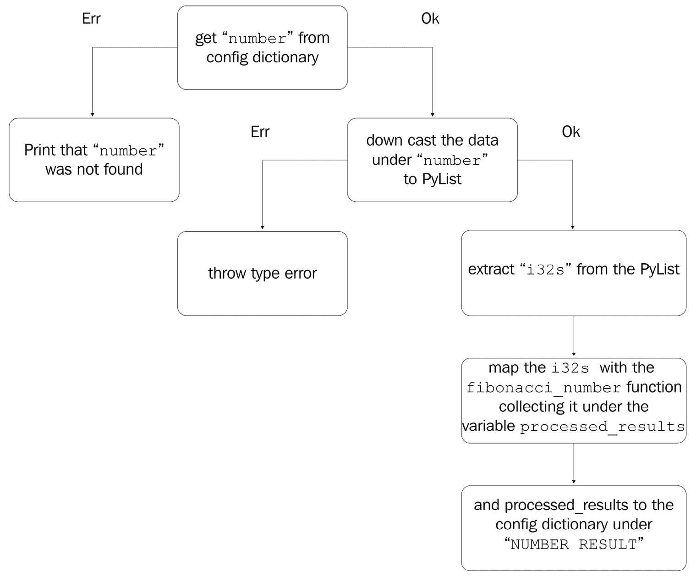
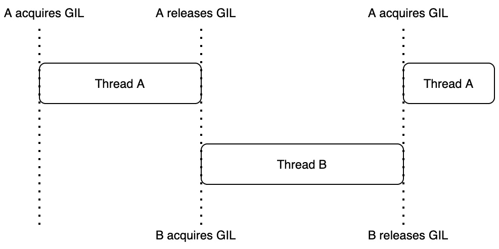

# 第五章：*第六章*：在 Rust 中使用 Python 对象

到目前为止，我们已经成功地将 Rust 与 Python 融合在一起，以加快我们的代码。然而，用 Rust 编写的软件程序可能会变得复杂。虽然我们可以通过将整数和字符串传递到 Rust 函数中从 Python 代码中应付过去，但处理来自 Python 的更复杂的数据结构和对象将是有用的。在本章中，我们接受并处理 Python 数据结构，如**字典**。我们将进一步通过处理自定义 Python 对象，甚至在我们的 Rust 代码中创建 Python 对象。

在本章中，我们将涵盖以下主题：

+   将复杂 Python 对象传递给 Rust

+   检查和使用自定义 Python 对象

+   在 Rust 中构建我们自己的自定义 Python 对象

# 技术要求

本章的代码可以通过以下 GitHub 链接找到：

[`github.com/PacktPublishing/Speed-up-your-Python-with-Rust/tree/main/chapter_six`](https://github.com/PacktPublishing/Speed-up-your-Python-with-Rust/tree/main/chapter_six)

# 将复杂 Python 对象传递给 Rust

一项关键技能使我们能够将我们的 Rust `pip`模块开发提升到下一个层次，就是接受并使用复杂的 Python 数据结构/对象。在*第五章* *为我们的 pip 模块创建 Rust 接口*中，我们接受了整数。我们注意到这些原始整数是直接传递到我们的 Rust 函数中的。然而，对于 Python 对象，这比这更复杂。

为了探索这一点，我们将创建一个新的命令行函数，该函数读取一个`.yml`文件并将一个 Python 字典传递给我们的 Rust 函数。这个字典中的数据将包含触发我们的`fibonacci_numbers`和`fibonacci_number`Rust 函数所需的参数，将这些函数的结果添加到 Python 字典中，并将其传递回 Python 系统。

为了实现这一点，我们必须执行以下步骤：

1.  更新我们的`setup.py`文件以支持`.yml`加载和一个读取它的命令行函数。

1.  定义一个命令行函数，该函数读取`.yml`文件并将其输入到 Rust 中。

1.  在 Rust 中处理来自我们的 Python 字典的`fibonacci_numbers`数据。

1.  从配置文件中提取数据。

1.  将我们的 Python 字典返回到我们的 Python 系统。

这种方法要求我们在运行之前先写出整个流程。这可能会让人感到沮丧，因为我们无法在结束时看到它的工作情况。然而，本书正是以这种方式安排的，这样我们就可以看到数据流。我们首次探索将复杂的数据结构传递给 Rust 的概念。一旦我们理解了它是如何工作的，我们就可以开发出为我们个人工作的`pip`模块。

## 更新我们的`setup.py`文件以支持`.yml`加载

让我们从更新我们的`setup.py`文件开始这段旅程，如下所示：

1.  使用我们新的命令行函数，我们读取一个`.yml`文件并将数据传递给我们的 Rust 函数。这要求我们的 Python `pip`模块必须包含`pyyaml` Python 模块。这可以通过在`setup`初始化中添加`requirements`参数来实现，如下所示：

    ```rs
        requirements=[
            "pyyaml>=3.13"
        ]
    ```

    我们记得我们只需将它们添加到我们的`requirements`列表中，就可以继续添加更多的依赖到我们的模块中。如果我们想让我们的模块对多个系统的安装更加灵活，建议我们可以降低`pyyaml`模块需求版本的数字。

1.  现在我们已经定义了我们的需求，我们可以定义一个新的控制台脚本，这将在`setup`初始化中的`entry_points`参数中产生，如下所示：

    ```rs
        entry_points={
            'console_scripts': [
                'fib-number = flitton_fib_rs.'
                'fib_number_command:'
                'fib_number_command',
                'config-fib = flitton_fib_rs.'
                'config_number_command:'
                'config_number_command',
            ],
        },
    ```

    通过这个，我们可以看到我们的新控制台脚本将位于`flitton_fib_rs/config_number_command.py`目录下。

1.  在`flitton_fib_rs/config_number_command.py`目录下，我们需要构建一个名为`config_number_command`的函数。首先，我们需要导入所需的模块，如下所示：

    ```rs
    import argparse
    import yaml
    import os
    from pprint import pprint
    from .flitton_fib_rs import run_config
    ```

`os`将帮助我们定义到`.yml`文件的路径。`pprint`函数将帮助我们以易于阅读的格式在控制台上打印数据。我们还定义了一个将处理我们的字典的 Rust 函数，名为`run_config`。

## 定义我们的.yml 加载命令

现在我们已经完成了导入，我们可以定义我们的函数并收集命令行参数。以下是我们的操作步骤：

1.  你可以从以下代码开始：

    ```rs
    def config_number_command() -> None:
        parser = argparse.ArgumentParser(
            description='Calculate Fibonacci numbers '
                        'using a config file')
        parser.add_argument('--path', action='store',
                            type=str, required=True,
                            help="path to config file")
        args = parser.parse_args()
    ```

1.  在这里，我们可以看到我们接收一个字符串，它是带有`--path`标签的`.yml`文件路径，然后我们解析它。现在我们已经解析了路径，我们可以通过运行以下代码来打开我们的`.yml`文件：

    ```rs
        with open(str(os.getcwd()) + "/" + args.path) as \
          f:
            config_data: dict = yaml.safe_load(f)
    ```

    在这里，我们可以看到我们使用`os.getcwd()`函数附加我们的路径。这是因为我们必须知道用户在哪里调用命令。例如，如果我们位于`x/y/`目录下，并想指向`x/y/z.yml`文件，我们必须运行`config-fib --path z.yml`命令。如果文件的目录是`x/y/test/z.yml`，我们就必须运行`config-fib --path test/z.yml`命令。

1.  现在我们已经从`.yml`文件中加载数据，我们可以打印它，并通过运行以下代码打印出我们 Rust 函数的结果：

    ```rs
        print("Here is the config data: ")
        pprint(config_data)
        print(f"Here is the result:")
        pprint(run_config(config_data))
    ```

通过这个，我们现在已经完成了所有的 Python 代码。

## 处理来自 Python 字典的数据

我们现在需要构建 Rust 函数来处理 Python 字典。以下是我们的操作步骤：

1.  当涉及到处理输入字典时，我们必须就我们将接受的格式达成一致。为了保持简单，我们的 Python 字典将有两个键。`number`键用于一个整数列表，可以单独调用斐波那契数计算，而`numbers`键用于整数列表的列表。为了确保我们的 Rust 代码不会变得杂乱无章，我们将在自己的接口目录中定义我们的接口，给我们的 Rust 代码以下结构：

    ```rs
    ├── fib_calcs
    │   ├── fib_number.rs
    │   ├── fib_numbers.rs
    │   └── mod.rs
    ├── interface
    │   ├── config.rs
    │   └── mod.rs
    ├── lib.rs
    └── main.rs
    ```

1.  我们将在`src/interface/config.rs`文件中构建我们的配置接口。首先，我们将导入我们需要的所有函数和宏，如下所示：

    ```rs
    use pyo3::prelude::{pyfunction, PyResult};
    use pyo3::types::{PyDict, PyList};
    use pyo3::exceptions::PyTypeError;
    use crate::fib_calcs::fib_number::fibonacci_number;
    use crate::fib_calcs::fib_numbers::fibonacci_numbers;
    ```

    我们将使用`pyfunction`来封装我们的接口，该接口接受一个 Python 字典。我们将返回一个包含在`pyResult`结构体中的字典给 Python 程序。鉴于我们接受一个 Python 字典，我们将使用`PyDict`结构体来描述传入和返回的字典。我们还将使用`PyList`结构体来访问字典中的列表。如果我们的字典没有包含列表，那么我们将不得不抛出一个 Python 系统可以理解的错误。为此，我们将使用`PyTypeError`结构体。最后，我们将使用我们的斐波那契数函数来计算斐波那契数。我们可以看到，我们在 Rust 代码中简单地使用`use crate::`从另一个模块导入。即使我们的斐波那契数函数应用了`pyfunction`宏，这也阻止不了我们在 Rust 代码的其他地方将它们作为正常的 Rust 函数使用。

1.  在我们编写接口函数之前，我们需要构建一个私有函数，该函数接受我们的列表列表，计算斐波那契数，并以列表列表的形式返回它们，如下面的代码片段所示：

    ```rs
    fn process_numbers(input_numbers: Vec<Vec<i32>>) \
        -> Vec<Vec<u64>> {
        let mut buffer: Vec<Vec<u64>> = Vec::new();
        for i in input_numbers {
            buffer.push(fibonacci_numbers(i));
        }
        return buffer
    }
    ```

1.  在这本书的这个阶段，这应该是直截了当的。考虑到这一点，我们现在已经拥有了构建接口所需的一切。首先，我们需要定义一个`pyfunction`函数，通过运行以下代码来接受和返回相同的数据：

    ```rs
    #[pyfunction]
    pub fn run_config<'a>(config: &'a PyDict) \
        -> PyResult<&'a PyDict> {
    ```

    在这里，我们可以看到，我们告诉 Rust 编译器，我们接受的 Python 字典必须与我们要返回的 Python 字典具有相同的生命周期。这很有道理，因为我们添加结果后返回的是同一个字典。

1.  我们的第一步是检查字典中是否存在`number`键，如下所示：

    ```rs
        match config.get_item("number") {
            Some(data) => {
                . . .
            },
            None => println!(
            "parameter number is not in the config"
            )
        }
    ```

    在这里，我们可以看到，如果没有`number`键，我们就仅仅打印出它不存在。我们可以更改规则，抛出一个错误，但我们是接受一个宽容的`config`文件。如果用户没有要计算的任何单独的斐波那契数，只有它们的列表，那么我们就不应该抛出错误，坚持要求用户添加该字段。在*步骤 6*中显示的代码片段中的三个点表示如果存在`number`键，代码将在这里执行。

1.  我们在以下代码片段中替换了三个点：

    ```rs
                match data.downcast::<PyList>() {
                    Ok(raw_data) => {
                        . . .
                    },
                    Err(_) => Err(PyTypeError::new_err(
                        "parameter number is not a list 
                        of integers")).unwrap()
                }
    ```

    在这里，我们可以看到，我们将属于`number`键的提取数据向下转换为`PyList`结构体。如果这失败，我们将主动抛出一个类型错误，因为用户尝试配置`number`键但失败了。如果它通过，我们可以通过用以下代码替换前面代码片段中的三个点来运行斐波那契函数：

    ```rs
                        let processed_results: Vec<i32> = 
                  raw_data.extract::<Vec<i32>>().unwrap();
                        let fib_numbers: Vec<u64> = 
                        processed_results.iter().map(
                            |x| fibonacci_number(*x)
                        ).collect();
                        config.set_item(
                        "NUMBER RESULT", fib_numbers);
    ```

在这里，我们所做的是通过在 `PyList` 结构体上运行 `extract` 函数来创建 `Vec<i32>`。我们直接解包它，这样如果出现错误，它将立即抛出。然后我们通过使用 `iter()` 函数遍历向量来创建 `Vec<u64>`，它包含了计算出的斐波那契数。然后我们使用 `map` 函数将那个向量中的每个 `i32` 整数映射。在 `map` 函数内部，我们定义一个闭包，它被映射到向量中的每个 `i32` 整数。必须注意的是，我们在应用 `fibonacci` 函数时取消引用传入的 `i32` 整数，因为它现在是一个借用引用。我们使用 `.collect()` 函数收集这个映射的结果，这使得 `processed_results` 变量成为 `i32` 计算出的斐波那契数的集合。然后我们在 `NUMBER RESULT` 键下将计算出的数字添加到字典中。我们可以在以下图中看到刚刚描述的流程：



图 6.1 – 数据提取流程

在下一步中，我们将执行与 *图 6.1* 中显示的类似的过程来处理 `numbers` 键下的列表。

## 从我们的配置文件中提取数据

在这一点上，尝试自己实现 `numbers` 键的处理过程是个好主意。为了使事情更容易，你可以使用我们在 *处理来自 Python 字典的数据* 部分的 *步骤 3* 中定义的 `process_numbers` 函数。我们将在接下来的步骤中介绍这个解决方案：

1.  `numbers` 键可以通过我们在此处定义的代码由我们的 `run_config` 函数处理：

    ```rs
        match config.get_item("numbers") {
            Some(data) => {
                match data.downcast::<PyList>() {
                    Ok(raw_data) => {
                        let processed_results_two: \
                          Vec<Vec<i32>> = 
                        raw_data.extract::<Vec<Vec<i32>>>(
                        ).unwrap();
                        config.set_item("NUMBERS RESULT", 
                        process_numbers(processed \
                          _results_two));
                    },
                    Err(_) => Err(PyTypeError::new_err(
                    "parameter numbers is not a list of \
                       lists of integers")).unwrap()
                }
            },
            None => println!(
            "parameter numbers is not in the config")
        }
        return Ok(config)
    ```

    在这里，我们可以看到 `process_numbers` 函数实际上使这个实现比 `numbers` 键的处理更简单。如果复杂性开始增加，总是值得将逻辑分解成更小的函数。还必须注意的是，我们返回一个封装了配置字典的结果。现在我们已经完成了处理我们字典的逻辑，我们需要在下一步中返回我们的字典。

1.  在这里，我们必须通过运行以下代码在 `src/interface/mod.rs` 文件中公开定义我们的 `src/interface/config.rs` 文件：

    ```rs
    pub mod config;
    ```

1.  然后我们通过运行以下代码将其导入到我们的 `src/lib.rs` 文件中：

    ```rs
    mod interface;
    use interface::config::__pyo3_get_function_run_config;
    ```

1.  然后我们通过运行以下代码将函数添加到我们的 `src/lib.rs` 模块中：

    ```rs
    m.add_wrapped(wrap_pyfunction!(run_config));
    ```

我们现在已经完成了所有步骤。

## 将我们的 Rust 字典返回到 Python 系统

我们的 `pip` 模块现在可以接受一个配置文件，将其转换为 Python 字典，将 Python 字典传递给计算斐波那契数的 Rust 函数，并以字典的形式将结果返回到 Python。这可以通过执行以下步骤实现：

1.  定义一个将被我们的程序处理的 `.yml` 文件。可以通过以下代码定义一个可以运行我们刚刚所做操作的示例 `.yml` 文件：

    ```rs
    number:
      - 4
      - 7
      - 2
    numbers:
      -
        - 12
        - 15
        - 20
      -
        - 15
        - 19
        - 18
    ```

    我为了演示目的，将前面的`.yml`代码保存在我的桌面上，文件名为`example.yml`。请记住更新你的 GitHub 仓库，并在你的 Python 环境中卸载当前的模块，然后安装我们的新模块。

1.  然后，我们可以使用以下命令将`.yml`文件传递到我们的模块入口点：

    ```rs
    config-fib --path example.yml
    ```

1.  我在我的桌面（存储了`example.yml`文件的地方）运行了这个命令。运行前面的命令给出了以下输出：

    ```rs
    Here is the config data: 
    {'number': [4, 7, 2, 10, 15],
     'numbers': [[5, 8, 12, 15, 20], [12, 15, 19, 18, 8]]}
    Here is the result:
    {'NUMBER RESULT': [3, 13, 1, 55, 610],
     'NUMBERS RESULT': [[5, 21, 144, 610, 6765], 
                        [144, 610, 4181, 2584, 21]],
     'number': [4, 7, 2, 10, 15],
     'numbers': [[5, 8, 12, 15, 20], [12, 15, 19, 18, 8]]}
    ```

    在这里，我们可以看到我们的 Python 接口将 Python 字典喂给了 Rust 接口。然后，我们将斐波那契函数的结果通过相同的字典传递回来。

1.  现在，我们在`.yml`文件中引入一个破坏性变更。我们可以通过在`example.yml`文件中将`number`键从整数列表更改为字典来测试我们的错误，如下所示运行以下代码：

    ```rs
    number:
      one: 1
    ```

1.  最后我们再次运行我们的代码，期望得到正确的错误消息。当我们再次运行命令时，给出了以下错误：

    ```rs
    TypeError exception was raised. This is not trivial. This means that we can try to accept type errors in our Python code when using our Rust module if we need to. Considering this, if a user did not know how our module was built, they would have no problem thinking that our module was built in pure Python. There is one more test that we can consider. We only manually threw an error when we were downcasting to PyList, highlighting that we need to have a list of integers. However, we just unwrapped the extract function being performed on PyList. 
    ```

1.  通过运行以下代码，我们可以看到`extract`函数如何处理字符串的输入，从而将`example.yml`文件中的`number`键从整数列表更改为字符串列表：

    ```rs
    number:
      - "test"
    ```

1.  再次运行我们的命令，给出了以下输出：

    ```rs
    pyo3_runtime.PanicException: called 'Result:: \
      unwrap()' on an 
    'Err' value: PyErr { type: <class 'TypeError'>, 
    value: TypeError(
    "'str' object cannot be interpreted as an integer"), 
    traceback: None }
    ```

在这里，我们可以看到错误字符串的解析稍微困难一些，因为我们没有直接编写一个错误代码来告诉用户我们想要什么；然而，它仍然是`TypeError`。我们还可以看到，由作用于 Python 对象的函数引发的错误是 Python 友好的。

我们现在已经总结了解如何与复杂的 Python 数据结构交互。没有什么可以阻止你在 Rust 中构建与 Python 程序无缝融合的 Python `pip`模块。然而，我们可以在下一节中通过处理和检查自定义 Python 对象将我们的 Rust `pip`模块提升到下一个层次。

# 检查和操作自定义 Python 对象

从技术上讲，Python 中的所有内容都是一个对象。我们在上一节中工作的 Python 字典是一个对象，因此我们已经管理了 Python 对象。然而，正如我们所知，Python 使我们能够构建自定义对象。在本节中，我们将使我们的 Rust 函数接受一个具有`number`和`numbers`属性的自定义 Python 类。为了实现这一点，我们必须执行以下步骤：

1.  创建一个将自身传递到我们的 Rust 接口的对象。

1.  获取 Python 的`PyDict`结构体。

1.  将自定义对象的属性添加到我们新创建的`PyDict`结构体中。

1.  将自定义对象的属性设置为`run_config`函数的结果。

## 为我们的 Rust 接口创建一个对象

我们通过以下方式设置我们的接口对象开始我们的旅程：

1.  我们将传递自身到我们的 Rust 代码中的对象放在`flitton_fib_rs/object_interface.py`文件中。最初，我们通过以下代码导入我们需要的内容：

    ```rs
    from typing import List, Optional
    from .flitton_fib_rs import object_interface
    ```

1.  然后我们通过以下代码定义我们的对象的`__init__`方法：

    ```rs
    class ObjectInterface:
        def __init__(self, number: List[int], \ 
           numbers: List[List[int]]) -> None:
            self.number: List[int] = number
            self.numbers: List[List[int]] = numbers
            self.number_results: Optional[List[int]] = \
              None
            self.numbers_results:Optional[List[List \
              [int]]] = None
    ```

    在这里，我们可以看到我们可以将想要计算的斐波那契数作为参数传递。然后我们只需将我们的属性设置为传递给我们的参数。这里定义的结果参数的值为`None`。然而，当我们将此对象传递到我们的 Rust 对象接口时，它们将由 Rust 代码填充。

1.  我们首先定义一个函数，通过运行以下代码将我们的对象传递到 Rust 代码中：

    ```rs
        def process(self) -> None:
            object_interface(self)
    ```

在这里，我们可以看到这是通过仅仅将`self`引用传递到函数中实现的。现在我们已经定义了我们的对象，我们可以继续构建我们的接口并与 Python GIL 交互。

## 在 Rust 中获取 Python GIL

对于我们的接口，我们将在`src/interface/object.rs`文件中放置我们的函数。我们将按以下步骤进行：

1.  首先，我们必须通过运行以下代码导入所有我们需要的东西：

    ```rs
    use pyo3::prelude::{pyfunction, PyResult, Python};
    use pyo3::types::{PyAny, PyDict};
    use pyo3::exceptions::PyLookupError;
    use super::config::run_config;
    ```

    到现在为止，大多数这些导入都是熟悉的。我们必须注意的新导入是`Python`导入。`Python`是一个结构体，本质上是一个标记，是我们将要进行的 Python 操作所必需的。

1.  现在我们已经导入了所有需要的东西，我们可以通过运行以下代码为我们的接口构建参数并创建一个`PyDict`结构体：

    ```rs
    #[pyfunction]
    pub fn object_interface<'a>(input_object: &'a PyAny) \
        -> PyResult<&'a PyAny> {
        let gil = Python::acquire_gil();
        let py = gil.python();
        let config_dict: &PyDict = PyDict::new(py);
    ```

在这里，我们实际上所做的是获取 Python GIL，然后使用它来创建一个`PyDict`结构体。为了完全理解我们在做什么，最好探索一下 Python GIL 是什么。在*第三章*，*理解并发*中，我们介绍了线程阻塞的概念。这意味着如果另一个线程正在执行，则所有其他线程都会被锁定。GIL 确保了这一点，如下面的图所示：



图 6.2 – GIL 流程

这是因为 Python 没有所有权概念。Python 对象可以被引用多次，我们可以从任何这些引用中修改变量。当我们获取`gil`变量时，我们确保只有一个线程可以使用 Python 解释器和 Python `gil`变量是一个`GILGuard`结构体，它确保我们在对 Python 对象执行任何操作之前获取 GIL。

## 向我们新创建的 PyDict 结构体添加数据

现在我们已经通过 GIL 控制了 Python 对象，我们可以继续到下一步，将输入对象的数据添加到我们新创建的`PyDict`结构体中，如下所示：

1.  我们在这个步骤中的方法可以总结如下：

    图 6.3 – PyDict 流程

1.  我们可以通过运行以下代码实现*图 6.3*中描述的第一个循环：

    ```rs
        match input_object.getattr("number") {
            Ok(data) => {
                config_dict.set_item("number", data) \
                  .unwrap();
            },
            Err(_) => Err(PyLookupError::new_err(
                "attribute number is missing")).unwrap()
        }
    ```

    在这里，我们可以看到我们匹配`getattr`函数，如果`input_object`没有`number`属性，则抛出错误。如果我们有这个属性，我们将其分配给`config_dict`。

1.  我们可以通过运行以下代码进行第二个循环：

    ```rs
        match input_object.getattr("numbers") {
            Ok(data) => {
                config_dict.set_item("numbers", data) \
                  .unwrap();
            }
            Err(_) => Err(PyLookupError::new_err(
                "attribute numbers is missing")).unwrap()
        }
    ```

1.  必须注意的是，这里有很多重复，只有一处变化。我们可以通过运行以下代码将这个重构为一个带有 `attribute` 参数的单个函数：

    ```rs
    fn extract_data<'a>(input_object: &'a PyAny, \
        attribute: &'a str, config_dict: &'a PyDict) \
          -> &'a PyDict {
        match input_object.getattr(attribute) {
            Ok(data) => {
                config_dict.set_item(attribute, \
                  data).unwrap();
            },
            Err(_) => Err(PyLookupError::new_err(
                "attribute number is missing")).unwrap()
        }
        return config_dict
    }
    ```

1.  在这里，我们可以看到，我们的 Python 对象提供了很多灵活性。这个函数可以在我们的 `object_interface` 函数中多次使用重构后的代码，就像这里所看到的那样：

    ```rs
        let mut config_dict: &PyDict = PyDict::new(py);
        config_dict = extract_data(input_object, \
          "number", config_dict);
        config_dict = extract_data(input_object, 
          "numbers", config_dict);
    ```

在这里，我们可以看到，我们将 `config_dict` 改为了可变的。现在我们已经用所有需要的数据加载了我们的 `PyDict` 结构体，我们只需运行我们的 `run_config` 函数，将其添加到输入对象的属性中，并在下一步将其返回到 Python 接口。

## 设置我们自定义对象的属性

我们现在处于接口模块的最后阶段。以下是步骤：

1.  我们可以通过运行以下代码将我们的 `run_config` 函数的输出传递到我们的 Python 对象接口：

    ```rs
        let output_dict: &PyDict = run_config( \
          config_dict).unwrap();
        input_object.setattr(
            "number_results", 
            output_dict.get_item(
                "NUMBER RESULT").unwrap()).unwrap();
        input_object.setattr(
            "numbers_results", 
            output_dict.get_item(
                "NUMBERS RESULT").unwrap()).unwrap();
        return Ok(input_object)
    ```

    在这里，我们可以看到，我们从 `run_config` 函数中获取了 `output_dict` Python 字典。一旦我们得到了这个，我们就根据 `output_dict` 中的条目设置 `input_object` 属性。

1.  我们现在已经完成了接口，接下来必须将其插入到我们的 Rust 模块中。我们通过在 `src/interface/mod.rs` 文件中运行以下代码来公开定义我们的接口文件：

    ```rs
    pub mod object;
    ```

1.  然后，我们可以在我们的 Rust 模块中通过将其导入到我们的 `src/lib.rs` 文件中来定义我们的接口函数，如下所示：

    ```rs
    use interface::object::__pyo3_get_function_object_ \
      interface;
    ```

1.  然后，我们将我们的函数添加到我们的模块中，如下所示：

    ```rs
        m.add_wrapped(wrap_pyfunction!(object_interface));
    ```

1.  我们现在模块已经完全运行。和往常一样，我们必须记得更新我们的 GitHub 仓库，在我们的 Python 环境中卸载我们的旧模块，并重新安装它。一旦完成，我们可以通过运行一个 Python 虚拟环境来测试它。在我们的虚拟环境中，我们可以通过运行以下代码来测试我们的对象：

    ```rs
    >>> from flitton_fib_rs.object_interface import 
    ObjectInterface
    >>> test = ObjectInterface([5, 6, 7, 8], [])
    >>> test.process()
    >>> test.number_results
    [5, 8, 13, 21]
    ```

在这里，我们可以看到，我们导入了我们将要使用的对象。然后我们初始化它并运行 `process` 函数。一旦完成，我们可以看到我们的 Rust 代码接受并交互了我们的对象，因为我们有正确的 `number_results` 属性的结果。

现在我们可以与 Python 自定义对象交互，我们可以解决的问题以及我们如何与 Python 系统交互都是强大的。自定义 Python 对象不会限制我们。然而，在 Rust 代码中，我们不应该过分沉迷于 Python 对象。虽然我们应该在我们的接口中使用它们，但我们不应该依赖它们来构建整个程序。在本节中，我们确实这样做了，因为我们依赖前一个部分中构建的函数来避免过多的代码，以便传达一个观点。然而，在你的项目中，Python 对象应该在接口之后离开你的代码。如果你发现自己一直在 Rust 代码中使用 Python 对象，那么你必须问自己为什么你不用纯 Python。用 Python 编写代码会比用 Rust 慢，但元类、动态属性以及许多其他 Python 特性将使在 Python 中编写代码比试图将 Python 风格的编码强加到 Rust 中更容易和更有趣。Rust 提供了结构体、特质、枚举和具有生命周期的强类型，这些类型在超出作用域后会切断以保持资源低。

因此，深入这种编码风格，以充分利用在 Rust 中构建`pip`模块的好处。超越你对于 Python 编码风格的舒适区。下一节是关于在 Rust 代码中构建 Python 对象。

# 在 Rust 中构建我们自己的自定义 Python 对象

在本节的最后，我们将构建一个 Rust 中的 Python 模块，该模块可以在 Python 系统中交互，就像它是本地的 Python 对象一样。为此，我们必须遵循以下步骤：

1.  定义具有所有属性的 Python 类。

1.  定义类静态方法以处理数字。

1.  定义类构造函数。

## 定义具有所需属性的 Python 类

为了开始我们的旅程，我们在`src/class_module/fib_processor.rs`文件中定义我们的类，如下所示：

1.  要构建我们的类，我们需要运行以下代码来导入所需的宏：

    ```rs
    use pyo3::prelude::{pyclass, pymethods, staticmethod};
    use crate::fib_calcs::fib_number::fibonacci_number;
    use crate::fib_calcs::fib_numbers::fibonacci_numbers;
    ```

    在这里，我们使用`pyclass`宏来定义我们的 Rust Python 类。然后我们使用`pymethods`和`staticmethod`来定义附加到类的方法。我们还使用标准的斐波那契数来计算斐波那契数。

1.  现在我们已经导入了所有需要的，我们可以定义类和属性，如下所示：

    ```rs
    #[pyclass]
    pub struct FibProcessor {
        #[pyo3(get, set)]
        pub number: Vec<i32>,
        #[pyo3(get, set)]
        pub numbers: Vec<Vec<i32>>,
        #[pyo3(get)]
        pub number_results: Vec<u64>,
        #[pyo3(get)]
        pub numbers_results: Vec<Vec<u64>>
    }
    ```

在这里，我们可以看到我们使用 Rust 类型来定义我们的属性。我们还使用宏来声明我们可以对这些属性做什么。对于我们的`number`和`numbers`属性，我们可以获取和设置属于这些属性的数据。然而，对于我们的`results`属性，我们只能获取数据，因为这是由计算设置的。

## 定义类静态方法以处理输入数字

我们现在可以使用我们的属性来实现类方法。

就像标准结构体一样，我们可以通过`impl`块实现附加到类的方法，如下面的代码片段所示：

```rs
#[pymethods]
```

```rs
impl FibProcessor {
```

```rs
    #[staticmethod]
```

```rs
    fn process_numbers(input_numbers: Vec<Vec<i32>>) \
```

```rs
      -> Vec<Vec<u64>> {
```

```rs
        let mut buffer: Vec<Vec<u64>> = Vec::new();
```

```rs
        for i in input_numbers {
```

```rs
            buffer.push(fibonacci_numbers(i));
```

```rs
        }
```

```rs
        return buffer
```

```rs
    }
```

```rs
}
```

在这里，我们可以看到我们已经将 `pymethods` 宏应用到我们的 `impl` 块中。我们还应用了 `staticmethod` 宏到我们的 `process_numbers` 静态方法上。这个函数在上一节中已经被使用，用于处理列表的列表。现在我们的静态方法已经定义，我们可以在下一步的构造方法中使用它。

## 定义类构造函数

我们需要采取以下步骤：

1.  我们可以通过运行以下代码在我们的 `impl` 块中定义我们的构造方法：

    ```rs
        #[new]
        fn new(number: Vec<i32>, numbers: Vec<Vec<i32>>) \
          -> Self {
            let input_numbers: Vec<Vec<i32>> = \
              numbers.clone();
            let input_number: Vec<i32> = number.clone();
            let number_results: Vec<u64> = 
              input_number.iter(
                                 ).map(
                |x| fibonacci_number(*x)
            ).collect();
            let numbers_results: Vec<Vec<u64>> = Self::
                     process_numbers(input_numbers);
            return FibProcessor {number, numbers, 
                     number_results, numbers_results}
        }
    ```

    在这里，我们接受输入以计算斐波那契数。然后我们克隆它们，因为我们将要通过斐波那契数函数传递它们。一旦完成，我们通过映射输入并收集结果来应用 `fibonacci_number` 函数。我们还从我们的静态方法中收集结果。一旦所有数据都被计算，我们构建类并返回它。一旦完成，我们只需将我们的类连接到我们的模块。

1.  这可以通过在 `src/class_module/mod.rs` 文件中公开声明我们的类文件来完成，如下所示：

    ```rs
    pub mod fib_processor;
    ```

1.  现在已经完成，我们通过运行以下代码将它们导入到我们的 `src/lib.rs` 文件中：

    ```rs
    mod class_module;
    use class_module::fib_processor::FibProcessor;
    ```

1.  一旦完成，我们可以在同一文件中将我们的类添加到我们的模块中，如下所示：

    ```rs
    m.add_class::<FibProcessor>()?;
    ```

现在我们已经完全将我们的类集成到 `pip` 模块中。

## 收尾和测试我们的模块

总是，当我们到达一个章节的结尾时，我们必须记住做以下事情：

+   更新 GitHub 仓库。

+   卸载当前的 `pip` 模块。

+   在我们的 Python 环境中重新安装它。

现在我们已经完成了模块的构建并更新了安装的版本，我们可以通过以下步骤在 Python 系统中手动测试我们的模块：

1.  我们可以打开我们的 Python shell 并通过运行以下代码来测试我们的类：

    ```rs
    >>> from flitton_fib_rs.flitton_fib_rs import 
    FibProcessor
    >>> test = FibProcessor([11, 12, 13, 14], [[11, 12], 
                            [13, 14], [15, 16]])
    >>> test.numbers_results
    [[89, 144], [233, 377], [610, 987]]
    ```

1.  我们可以看到我们的 Rust 对象在我们的 Python 系统中无缝工作，并计算出结果。我们必须记住，我们已经为我们的属性设置了规则。为了检查这一点，我们可以尝试分配我们的 `results` 属性，这将给出以下输出：

    ```rs
    >>> test.numbers_results = "test"
    Traceback (most recent call last):
      File "<stdin>", line 1, in <module>
    AttributeError: attribute 'numbers_results' of 
    'builtins.FibProcessor' objects is not writable
    ```

1.  在这里，我们可以看到我们的 `results` 属性是不可写的。我们也可以测试类型。尽管我们的 `number` 属性是可写的，但它应该是一个整数向量。如果我们尝试将一个字符串分配给这个属性，我们会得到以下输出：

    ```rs
    >>> test.number = "test"
    Traceback (most recent call last):
      File "<stdin>", line 1, in <module>
    TypeError: 'str' object cannot be interpreted as an 
    integer
    ```

1.  在这里，我们可以看到我们的类型检查也得到了强制执行，尽管它看起来和表现得像是一个原生的 Python 对象。最后，我们可以通过运行以下代码来测试我们是否可以写入 `number` 属性的新值：

    ```rs
    >>> test.number = [1, 2, 3, 4, 5]
    >>> test.number
    [1, 2, 3, 4, 5]
    ```

    看起来，当类型和权限正确时，我们可以写入。考虑到所有这些，创建这些类的目的是什么？它们使我们的模块接口更加平滑，但这个类有多快？

为了量化这一点，我们可以在我们的 Python 环境中创建一个简单的测试 Python 脚本，如下所示：

1.  首先，在我们的 Python 脚本中，我们通过运行以下代码导入我们的 Rust 类和 `time` 模块：

    ```rs
    from flitton_fib_rs.flitton_fib_rs import FibProcessor
    import time
    ```

1.  我们现在必须在这个脚本中创建一个具有相同功能的纯 Python 对象，如下所示：

    ```rs
    class PythonFibProcessor:
         def __init__(self, number, numbers):
               self.number = number
               self.numbers = numbers
               self.numbers_results = None
               self.number_results = None
               self._process()
         def _process(self):
               self.numbers_results = \
                 [self.calculate_numbers(i)\ 
                   for i in self.numbers]
               self.number_results = \
                 self.calculate_numbers(
                   self.number)
         def fibonacci_number(self, number):
             if number < 0:
                 return None
             elif number <= 2:
                 return 1
             else:
              return self.fibonacci_number(number - 1) + \
                        self.fibonacci_number(number - 2)
         def calculate_numbers(self, numbers):
              return [self.fibonacci_number(i) for i in \
                numbers]
    ```

1.  现在我们已经定义了基准纯 Python 对象，我们现在处于脚本的计时阶段，我们将相同的输入放入两个类中，并使用以下代码进行测试：

    ```rs
    t_one = time.time()
    test = FibProcessor([11, 12, 13, 14], [[11, 12], \
        [13, 14], [15, 16]])
    t_two = time.time()
    print(t_two - t_one)
    t_one = time.time()
    test = PythonFibProcessor([11, 12, 13, 14], \
      [[11, 12], [13, 14], [15, 16]])
    t_two = time.time()
    print(t_two - t_one)
    ```

1.  运行此代码会给我们以下输出：

    ```rs
    1.4781951904296875e-05
    0.0007779598236083984
    ```

    这等价于以下内容：

    ```rs
    0.000017881393432617188
    0.0007779598236083984
    ```

记住，Rust 类是最高效的。这意味着我们的 Rust 类比我们的 Python 类快 **43 倍**！为了更直观地了解这一点，我们可以看到以下截图中的差异：


图 6.4 – Rust 和 Python 之间的类速度差异

在这里，我们可以看到我们用 Rust 构建的类接口比我们的 Python 类更快。`pyo3` 支持类继承和其他功能。更多相关信息可以在 *进一步阅读* 部分找到。现在，我们在 Rust 中处理 Python 对象方面有了坚实的基础。总有更多功能需要阅读，这些功能可以建立在我们所构建的结构之上。

# 摘要

在本章中，我们将第三方 `pip` 模块添加到我们的 `setup.py` 文件中，以便我们可以添加另一个入口点，该入口点可以读取 `.yml` 文件。我们读取了 `.yml` 文件，并将该文件中的数据以字典的形式传递到我们的 Rust 函数中，在 `PyDict` 结构体下处理复杂的数据结构。然后，我们将复杂的数据结构向下转换为其他 Python 对象和 Rust 数据类型。这使得我们能够处理传递到 Rust 代码中的各种 Python 数据类型，从而在 Python 代码与 Rust 代码交互方面提供了额外的灵活性。

我们在 `PyAny` 结构体下接受自定义 Python 对象，比复杂的 Python 数据结构更进一步。一旦我们接受了自定义 Python 对象，我们就可以检查属性并在需要时设置它们。我们甚至获得了 Python GIL，以创建我们自己的 Python 数据结构，帮助我们处理传递到 Rust 代码中的自定义 Python 对象。为了完善我们的 Python 对象技能，我们在 Rust 代码中构建了 Python 类，这些类不仅可以被导入到 Python 系统中，就像纯 Python 类一样，而且速度要快 44 倍。我们现在有一个强大的工具，它不仅可以加快我们的 Python 代码，还可以使我们能够无缝地与 Python 系统交互。

在下一章中，我们将解决阻止我们将 Rust 添加到我们拥有的每个 Python 项目的最后一个障碍。人们之所以选择 Python，是因为为其构建了大量的第三方模块，例如统计和 `numpy` 模块，并在我们的 Rust 代码中使用它们。这将使我们能够在 Rust 扩展中利用第三方 Python 模块。

# 问题

1.  如何从 `PyDict` 结构体中提取一个 `i32` 整数向量？

1.  如果我们有一个字符串向量，但我们对其应用了一个 `.extract::<Vec<i32>>()` 函数，并且直接解包它，会发生什么？

1.  你如何在 Rust 代码的一行中遍历一个 `Vec<i32>` 向量，将每个元素加倍并将结果包装在另一个向量中？

1.  如果我们获取 Python GIL 来创建一个 `PyDict` 结构体，这会以任何方式影响 Python 系统吗？

1.  虽然我们在 Rust 代码中构建的 Python 类本质上与我们的纯 Python 类运行方式相同，但有一些核心区别。它们是什么？

# 答案

1.  首先，我们必须通过将 `get_item` 函数应用于 `PyDict` 来从 `PyDict` 结构体中获取一个列表。如果我们在使用的键下有数据，我们然后执行 `.downcast::<PyList>()` 将我们的数据转换为 `PyList` 结构体。如果我们做到了这一点，我们然后在 `PyList` 结构体上执行 `.extract::<Vec<i32>>()`，给我们一个 `Vec<i32>`。

1.  我们的 `extract` 函数将自动抛出一个 Python 友好的 `PyTypeError` 错误。

1.  使用这个，我们使用 `iter`、`map` 和 `collect` 函数，如下所示：

    ```rs
    let results: Vec<i32> = some_vector.iter().map(
                |x| 2*x
            ).collect();
    ```

1.  不——正在运行代码的 Python 系统已经获取了全局解释器锁（GIL）。如果没有 GIL，它将等待另一个线程完成后再获取 GIL。

1.  类型系统仍然被强制执行。如果我们尝试将一个整数列表属性设置为字符串，将会抛出一个错误。另一个区别是，每个属性的 `set` 和 `get` 宏都必须定义。如果没有定义，则无法访问或设置该属性。

# 进一步阅读

+   *PyO3* (2021). *PyO3 用户指南*—*Python 类* [`pyo3.rs/v0.13.2/class.html`](https://pyo3.rs/v0.13.2/class.html)
