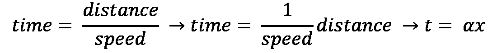
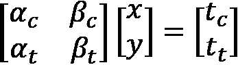

# *第七章*: 在 Rust 中使用 Python 模块

我们现在已经熟悉了在 Rust 中编写可以使用`pip`安装的 Python 包。然而，Python 的一个大优势是它拥有许多成熟的 Python 库，这有助于我们以最小的错误编写高效的代码。这似乎是一个合理的观察，可能会阻止我们在 Python 系统中采用 Rust。然而，在本章中，我们通过将 Python 模块导入我们的 Rust 代码并在 Rust 代码中运行 Python 代码来反驳这一观察。为了理解这一点，我们将使用**NumPy** Python 包来实现一个基本的数学模型。一旦完成，我们将在 Rust 代码中使用 NumPy 包来简化我们的数学模型的实现。最后，我们将评估两种实现的性能。

在本章中，我们将涵盖以下主题：

+   探索 NumPy

+   在 NumPy 中构建模型

+   在 Rust 中使用 NumPy 和其他 Python 模块

+   在 Rust 中重新创建我们的 NumPy 模型

完成本章后，我们将能够将 Python 包导入我们的 Rust 代码并使用它。这是强大的，因为依赖某个 Python 包不会阻碍我们在 Python 系统中实现 Rust 来完成特定任务。我们本章使用纯 Python、Rust 和 NumPy 实现的解决方案也将让我们了解每种实现在代码复杂度和速度方面的权衡，这样我们就不试图为每个问题实现一个*一刀切*的解决方案，避免次优解。

# 技术要求

本章的代码可以通过以下 GitHub 链接找到：

[`github.com/PacktPublishing/Speed-up-your-Python-with-Rust/tree/main/chapter_seven`](https://github.com/PacktPublishing/Speed-up-your-Python-with-Rust/tree/main/chapter_seven)

# 探索 NumPy

在我们开始在自定义模块中使用 NumPy 之前，我们必须探索 NumPy 是什么以及如何使用它。NumPy 是一个第三方计算 Python 包，它使我们能够在列表上执行计算。NumPy 主要用 C 语言编写，这意味着它将比纯 Python 更快。在本节中，我们将评估我们的 NumPy 实现是否优于导入 Python 的 Rust 实现。

## NumPy 中的向量相加

NumPy 使我们能够构建可以遍历并对其应用函数的向量。我们还可以在向量之间执行操作。我们可以通过将每个向量的项目相加来展示 NumPy 的强大功能，如下所示：

```rs
[0, 1, 2, 3, 4]
```

```rs
[0, 1, 2, 3, 4]
```

```rs
---------------
```

```rs
[0, 2, 4, 6, 8]
```

要实现这一点，我们最初需要通过运行以下代码来导入模块：

```rs
import time
```

```rs
import numpy as np
```

```rs
import matplotlib.pyplot as plt
```

通过这种方式，我们可以构建一个`numpy_function` NumPy 函数，该函数创建一定大小的两个 NumPy 向量并通过运行以下代码将它们相加：

```rs
def numpy_function(total_vector_size: int) -> float:
```

```rs
    t1 = time.time()
```

```rs
    first_vector = np.arange(total_vector_size)
```

```rs
    second_vector = np.arange(total_vector_size)
```

```rs
    sum_vector = first_vector + second_vector
```

```rs
    return time.time() - t1
```

在这里，我们可以看到我们可以通过仅使用加法运算符来添加向量。现在我们已经定义了函数，我们可以通过遍历一个整数列表并应用`numpy_function`到这些项上，通过运行下面的代码来收集结果，并绘制出这个扩展性：

```rs
numpy_results = [numpy_function(i) for i in range(0 \ 
```

```rs
  10000)]
```

```rs
plt.plot(numpy_results, linestyle='dashdot')
```

```rs
plt.show()
```

这给我们一条线形图，如下所示：


图 7.1 – 根据大小添加两个 NumPy 向量的时间

在前面的屏幕截图中，我们可以看到增长是线性的。这是预期的，因为添加向量中的每个整数到另一个向量时只有一个循环。我们还可以看到时间突然增加的点——这是垃圾回收开始工作的时候。为了欣赏 NumPy 的影响，我们可以在下一小节中通过在纯 Python 中使用列表添加两个向量来重新定义我们的示例。

## 在纯 Python 中添加向量

我们可以在纯 Python 中添加两个向量并计时，通过运行以下代码：

```rs
def python_function(total_vector_size: int) -> float:
```

```rs
    t1 = time.time()
```

```rs
    first_vector = range(total_vector_size)
```

```rs
    second_vector = range(total_vector_size)
```

```rs
    sum_vector = [first_vector[i] + second_vector[i] for \
```

```rs
      i in range(len(second_vector))]
```

```rs
    return time.time() - t1
```

使用我们新的 Python 函数，我们可以运行 NumPy 和 Python 函数，并通过运行以下代码来绘制它们：

```rs
print(python_function(1000))
```

```rs
print(numpy_function(1000))
```

```rs
python_results = [python_function(i) for i in range(0, \
```

```rs
  10000)]
```

```rs
numpy_results = [numpy_function(i) for i in range(0, \
```

```rs
  10000)]
```

```rs
plt.plot(python_results, linestyle='solid')
```

```rs
plt.plot(numpy_results, linestyle='dashdot')
```

```rs
plt.show()
```

这给我们以下结果：


图 7.2 – 根据大小添加两个向量的时间

正如我们在*图 7.2*中看到的，NumPy 向量在底部行表示，纯 Python 在递增行表示，因此我们可以得出结论，与我们的 NumPy 实现相比，Python 的扩展性并不好。输出清楚地表明，在执行大向量计算时，NumPy 是一个不错的选择。然而，这与我们的 Rust 实现相比如何呢？我们将在下一小节中探讨这个问题。

## 在 Rust 中使用 NumPy 添加向量

要比较 NumPy 与我们的 Rust 实现，我们必须在我们的 Rust 包中添加一个添加向量的函数，这是我们到目前为止在整本书中一直在构建的。以下是我们需要采取的步骤：

1.  考虑到这是一个用于演示目的的测试函数，我们只需将其插入到我们的`lib.rs`文件中。我们只是构建一个`time_add_vectors`函数，该函数接受一个数字，创建两个大小等于输入数字的向量，同时遍历它们，并将这些项相加，如下所示：

    ```rs
    #[pyfunction]
    fn time_add_vectors(total_vector_size: i32)
        -> Vec<i32> {    
        let mut buffer: Vec<i32> = Vec::new();
        let first_vector: Vec<i32> = 
          (0..total_vector_size.clone()
             ).map(|x| x).collect();
        let second_vector: Vec<i32> = \
          (0..total_vector_size
             ).map(|x| x).collect();

        for i in &first_vector {
            buffer.push(first_vector[**&i as usize] + 
                         second_vector[*i as usize]);
        }
       return buffer
    }
    ```

1.  一旦我们完成这个步骤，我们必须记住将这个函数添加到我们的模块中，如下所示：

    ```rs
    #[pymodule]
    fn flitton_fib_rs(_py: Python, m: &PyModule) -> \
      PyResult<()> {
        . . .
        m.add_wrapped(wrap_pyfunction!(time_add_vectors));
        . . .
        Ok(())
    }
    ```

    我们必须记住更新我们的 GitHub 仓库并在 Python 环境中重新安装我们的 Rust 包。

1.  一旦完成这个步骤，我们必须在我们的 Python 测试脚本中实现这个函数并计时。首先，我们必须使用以下代码导入它：

    ```rs
    import time
    import matplotlib.pyplot as plt
    import numpy as np
    from flitton_fib_rs import time_add_vectors
    ```

1.  一旦完成这个步骤，我们可以定义我们的`rust_function` Python 函数，该函数调用`time_add_vectors`函数并计时完成加法所需的时间，通过运行以下代码：

    ```rs
    def rust_function(total_vector_size: int) -> float:
        t1 = time.time()
        sum_vector = time_add_vectors(total_vector_size)
        result = time.time() - t1
        if result > 0.00001:
            result = 0.00001
        return result
    ```

    你可能已经注意到我们修剪了 `rust_function` 返回的 `result`。这并不是作弊——我们这样做是因为当垃圾回收器启动时，它可能会导致峰值并破坏图形的扩展。我们也将通过以下代码对 NumPy 函数做同样的事情：

    ```rs
    def numpy_function(total_vector_size: int) -> float:
        t1 = time.time()
        first_vector = np.arange(total_vector_size)
        second_vector = np.arange(total_vector_size)
        sum_vector = first_vector + second_vector
        result = time.time() - t1
        if result > 0.00001:
            result = 0.00001
        return result
    ```

    我们可以看到，我们对这两个函数应用了相同的度量标准，这样就不会人为地降低其中一个与另一个相比的值。

1.  现在我们已经完成了这些，我们需要通过运行以下代码来定义纯函数：

    ```rs
    def python_function(total_vector_size: int) -> float:
        t1 = time.time()
        first_vector = range(total_vector_size)
        second_vector = range(total_vector_size)
        sum_vector = [first_vector[i] + second_vector[i] for
          i in range(len(second_vector))]
        result = time.time() - t1
        if result > 0.0001:
            result = 0.0001
        return result
    ```

    必须指出，我们对纯 Python 的截止值更高，因为我们预计基本读数会高得多。

1.  现在我们已经拥有了 Rust、NumPy 和纯 Python 的所有度量函数，我们可以创建包含这两个函数结果的 Python 列表，并通过运行以下代码进行绘图：

    ```rs
    numpy_results = [numpy_function(i) for i in range(0, \ 
      300)]
    rust_results = [rust_function(i) for i in range(0, \
      300)]
    python_results = [python_function(i) for i in range \
      (0,300)]
    plt.plot(rust_results, linestyle='solid', \
      color="green")
    plt.plot(python_results, linestyle='solid', \
     color="red")
    plt.plot(numpy_results, linestyle='solid', \
    color="blue")
    plt.show()
    ```

    运行我们的代码将给出以下结果：

![Figure 7.3 – Time taken to add two vectors based on the size of the vectors;

左：NumPy；中：Rust；右：纯 Python

![Figure 7.3 – Time taken to add two vectors based on the size of the vectors;

图 7.3 – 基于向量大小添加两个向量所需的时间；左：NumPy；中：Rust；右：纯 Python

在前面的屏幕截图中，我们可以看到 NumPy 是最快的，并且随着向量大小的增加并没有过于激进地进行扩展。我们的 Rust 实现比我们的纯 Python 实现快一个数量级，但它并不像 NumPy 那么高效。

我们可以看到，Python 优化，如 NumPy，与纯 Python 和 Rust 相比确实提高了速度。然而，NumPy 简单添加向量的清晰语法并不是这个模块的唯一功能优势。在下一节中，我们将探讨 NumPy 具有的另一个功能，如果我们尝试在 Python 或 Rust 中从头开始编写代码，这将需要很多额外的代码。

# 在 NumPy 中构建模型

在本节中，我们将构建一个基本的数学模型来展示 NumPy 除了速度之外的强大功能。我们将使用矩阵来构建一个简单的模型。为了实现这一点，我们必须执行以下步骤：

1.  定义我们的模型。

1.  构建一个执行我们模型的 Python 对象。

让我们在以下小节中详细查看这些步骤。

## ![img/B17720_07_001.png]

一个数学模型本质上是一组权重，它根据输入计算结果。在继续之前，我们必须记住这本书的范围。我们正在构建一个模型来展示如何利用 NumPy。如果我们涵盖了数学建模的细微差别，那将占用整本书。我们将基于前一小节讨论的示例构建一个模型，但这并不意味着定义的模型是数学建模复杂性的准确描述。以下是我们需要采取的步骤：

1.  我们首先查看一个非常简单的数学模型，它将是一个简单的速度方程，如下所示：

    ![img/B17720_07_001.png]

1.  使用我们的模型，我们可以通过以下方式计算完成旅程所需的时间：

    

    右侧最后的方程只是替换字母的值，以便它们可以插入到一个更大的模型中，而不会占用整整一页。

1.  现在，让我们将我们的模型进一步扩展。我们从一家卡车公司收集了一些数据，并设法将不同的交通等级量化为数字，并拟合我们的数据，以便我们可以产生一个权重来描述交通对时间的影响。有了这个，我们的模型已经发展到如下定义的形式：

    

    在这里， 表示交通的权重，而 *y* 表示交通等级。正如我们所见，如果交通等级增加，时间也会相应增加。现在，让我们假设模型对汽车和卡车是不同的。这给我们以下一组方程：

    

    

    我们可以从方程中推断出，距离 (*x*) 和交通等级 (*y*) 对汽车和卡车都是相同的。这是有道理的。虽然权重可能不同，因为汽车可能受到距离和交通的影响不同，正如它们在权重中所表示的，但输入参数是相同的。

1.  考虑到这一点，方程可以定义为以下矩阵方程：

    

    这可能现在看起来有些过分，但这种方法有其优势。矩阵有一系列函数，使我们能够对它们进行代数运算。我们将在这里介绍几个，以便我们能够理解 NumPy 在计算此模型时对我们是多么有价值。

1.  要做到这一点，我们必须承认矩阵乘法必须按照一定的顺序进行，才能使其工作。我们的模型本质上是通过以下符号计算的：

    

1.  我们的 *x* *y* 矩阵必须位于权重矩阵的右侧。我们可以通过以下符号向 *x* *y* 矩阵添加更多输入：

    

1.  实际上，我们可以继续堆叠我们的输入，并将得到成比例的输出。这是强大的；如果我们保持矩阵的维度一致，我们可以输入任何大小的输入矩阵。我们还可以求逆矩阵。如果我们求逆矩阵，我们就可以输入时间来计算距离和交通等级。求逆矩阵的形式如下：

    

1.  在这里，我们可以看到，如果我们将标量乘以矩阵，它就会应用于矩阵的所有元素。考虑到这一点，我们的模型可以使用以下符号使用逆矩阵来计算交通等级和距离：


我们只覆盖了足够的矩阵数学知识来编写我们的模型，但即使这样，我们也可以看到矩阵使我们能够操纵多个方程，快速地重新排列它们以计算不同的事情。然而，如果我们从头开始编写矩阵乘法，这将花费很多时间，我们还会犯错误的风险。为了快速、安全地开发我们的模型，我们需要使用 NumPy 模块函数，这就是我们在下一小节将要做的。

## 构建执行我们的模型的 Python 对象

在上一节中，我们看到了两条不同的路径。当我们构建我们的模型时，我们将有两个分支——一个用于计算时间，另一个用于从时间计算交通和距离。为了构建我们的模型类，我们必须绘制出我们的依赖关系，如下所示：


图 7.4 – Python 矩阵模型的依赖关系

上述图表显示，我们必须在所有其他内容之前定义权重矩阵属性，因为这个属性是其他所有计算的主要机制。这在矩阵方程中也很明显。我们可以通过以下方式构建具有权重矩阵属性的类：

```rs
import numpy as np
```

```rs
class MatrixModel:
```

```rs
    @property
```

```rs
    def weights_matrix(self) -> np.array:
```

```rs
        return np.array([
```

```rs
            [3, 2],
```

```rs
            [1, 4]
```

```rs
        ])
```

在这里，我们可以看到我们使用 NumPy 进行矩阵操作，并且我们的矩阵是一个列表的列表。我们使用 NumPy 数组而不是普通数组，因为 NumPy 数组具有矩阵操作，如`transpose`。记住，当矩阵相乘时，矩阵的位置很重要。例如，我们有一个简单的矩阵方程如下：

![img/B17720_07_012.png]

如果我们交换矩阵的顺序，由于它们的形状不兼容，矩阵将无法相乘；这就是`transpose`操作发挥作用的地方。`transpose`函数翻转矩阵，使我们能够切换乘法的顺序。在我们的模型中，我们不会使用`transpose`，但终端中的 Python 命令显示了 NumPy 如何直接提供这个函数：

```rs
>>> import numpy as np
```

```rs
>>> t = np.array([
```

```rs
                [3, 2],
```

```rs
                [1, 4]
```

```rs
            ])
```

```rs
>>> t.transpose()
```

```rs
array([[3, 1],
```

```rs
       [2, 4]])
```

```rs
>>> x = np.array([
```

```rs
                    [3],
```

```rs
                    [1]
```

```rs
                ])
```

```rs
>>> x.transpose()
```

```rs
array([[3, 1]])
```

在这里，我们可以看到我们用 NumPy 数组构建的矩阵可以轻松地改变形状。既然我们已经确定我们是用 NumPy 数组构建矩阵，我们可以构建一个函数，该函数将调用接受旅程距离和交通等级的函数，用于我们的`MatrixModel`类，如下所示：

```rs
    def calculate_times(self, distance: int, \
```

```rs
      traffic_grade: int) -> dict:
```

```rs
        inputs = np.array([
```

```rs
            [distance],
```

```rs
            [traffic_grade]
```

```rs
        ])
```

```rs
        result = np.dot(self.weights_matrix, inputs)
```

```rs
        return {
```

```rs
            "car time": result[0][0],
```

```rs
            "truck time": result[1][0]
```

```rs
        }
```

在这里，我们可以看到，一旦我们构建了输入矩阵，我们就使用`np.dot`函数将其与权重矩阵相乘。`result`是一个矩阵，正如我们所知，它是一个列表的列表。我们解包它，然后以字典的形式返回它。

我们几乎完成了我们的模型；我们现在必须构建我们的逆模型。这就是我们传入旅程所需时间来计算`MatrixModel`类的距离和交通等级的地方。这是通过以下代码完成的：

```rs
    def calculate_parameters(self, car_time: int, 
```

```rs
                             truck_time: int) -> dict:
```

```rs
        inputs = np.array([
```

```rs
            [car_time],
```

```rs
            [truck_time]
```

```rs
        ])
```

```rs
        result = np.dot(np.linalg.inv(self. \
```

```rs
          weights_matrix), inputs)
```

```rs
        return {
```

```rs
            "distance": result[0][0],
```

```rs
            "traffic grade": result[1][0]
```

```rs
        }
```

在这里，我们可以看到我们采取了相同的方法；然而，我们使用`np.linalg.inv`函数来获取`self.weights_matrix`矩阵的逆。现在这项工作已经完成，我们有一个完全功能化的模型，我们可以按照以下方式对其进行测试：

```rs
test = MatrixModel()
```

```rs
times = test.calculate_times(distance=10, traffic_grade=3)
```

```rs
print(f"here are the times: {times}")
```

```rs
parameters = test.calculate_parameters(
```

```rs
    car_time=times["car time"], truck_time=times["truck \
```

```rs
      time"]
```

```rs
)
```

```rs
print(f"here are the parameters: {parameters}")
```

运行前面的代码将在终端给出以下输出：

```rs
{'car time': 36, 'truck time': 22}
```

```rs
{'distance': 10.0, 'traffic grade': 3.0}
```

通过这个终端输出，我们可以看到我们的模型是有效的，并且我们的逆模型返回了原始输入。由此，我们还可以得出结论，NumPy 不仅仅是加快我们的代码；它为我们提供了额外的工具来解决诸如矩阵建模等问题。这是阻止我们达到 Rust 的最后障碍。在下一节中，我们将通过在 Rust 中重新创建我们的模型来使用 NumPy Python 模块。

# 在 Rust 中使用 NumPy 和其他 Python 模块

在本节中，我们将了解如何在 Rust 程序中导入 Python 模块（如 NumPy）的基本知识，并将结果返回到我们的 Python 函数中。我们将构建我们迄今为止在这本书中编写的 Fibonacci 数字包的功能。我们还将简要探讨以通用方式导入 Python 模块，以便您体验如何使用具有您所依赖的功能的 Python 模块。我们将在下一节中构建一个更全面的在 Rust 代码中使用 Python 模块的方法。对于本节，我们将把所有代码都写在`src/lib.rs`文件中。以下是我们需要采取的步骤：

1.  首先，我们需要承认我们传递了一个字典，并在其中返回结果。正因为如此，我们必须通过运行以下代码来导入`PyDict`结构体：

    ```rs
    use pyo3::types::PyDict;
    ```

1.  现在已经导入，我们可以通过运行以下代码来定义我们的函数：

    ```rs
    #[pyfunction]
    fn test_numpy<'a>(result_dict: &'a PyDict) 
                -> PyResult<&'a PyDict> {
        let gil = Python::acquire_gil();
        let py = gil.python();
        let locals = PyDict::new(py);
        locals.set_item("np", 
          py.import("numpy").unwrap());
    }
    ```

    由于我们正在使用一个 Python 模块，因此我们获得名为`locals`的`PyDict`结构体并不令人惊讶。

    然后，我们使用`py.import`函数导入 NumPy 模块，将其插入到我们的`localsstruct`中。

    如此所示，我们将使用我们的`locals`结构体作为 Python 存储：

    ![图 7.5 – Rust 在 Rust 中计算 Python 进程的流程]

    

    图 7.5 – Rust 在 Rust 中计算 Python 进程的流程

    在这里，每次我们在 Rust 代码中运行 Python 操作时，我们都会将 Python 对象从`locals`传递到 Python 计算中。然后，我们将任何需要添加到我们的`PyDict` `locals`结构体的新 Python 变量传递进去。

1.  现在我们已经了解了流程，我们可以在`test_numpy`函数内部通过运行以下代码来计算我们的第一个 Python 计算：

    ```rs
        let code = "np.array([[3, 2], [1, 4]])";
        let weights_matrix = py.eval(code, 
                               None, 
                               Some(&locals)).unwrap();
        locals.set_item("weights_matrix", weights_matrix);
    ```

    在这里，我们可以看到我们定义 Python 命令为一个字符串字面量。然后，我们将这个传递给我们的`py.eval`函数。我们的`None`参数用于全局变量。我们将避免传递全局变量以保持简单。我们还传递了我们的`PyDict` `locals`结构体，以获取在`np`命名空间下导入的 NumPy 模块。然后，我们解包结果并将其添加到我们的`localsstruct`中。

1.  现在我们可以创建一个输入 NumPy 向量，并通过运行以下代码将结果插入到我们的`localsstruct`中：

    ```rs
        let new_code = "np.array([[10], [20]])";
        let input_matrix = py.eval(new_code, None, 
                                  Some(&locals)).unwrap();
        locals.set_item("input_matrix", input_matrix);
    ```

1.  现在我们已经将两个矩阵存储在我们的`locals`存储中，我们可以将它们相乘，将它们添加到我们的输入字典中，并通过运行以下代码来返回结果：

    ```rs
        let calc_code = "np.dot(weights_matrix, \
           input_matrix)";
        let result_end = py.eval(calc_code, None, 
                                 Some(&locals)).unwrap();
        result_dict.set_item("numpy result", result_end);
        return Ok(result_dict)
    ```

通过这种方式，我们现在可以在 Rust 代码中使用 NumPy，并将结果传递回 Python 系统。我们必须记住更新我们的 GitHub 存储库，并在 Python 系统中重新安装我们的 Rust 包。为了测试这一点，我们可以执行以下控制台命令：

```rs
>>> from flitton_fib_rs import test_numpy
```

```rs
>>> outcome = test_numpy({})
```

```rs
>>> outcome["numpy result"].transpose()
```

```rs
array([[70, 90]])
```

在这里，我们可以看到我们的 NumPy 过程在 Rust 中运行，并返回我们可以像所有其他 Python 对象一样使用的 Python 对象。我们本可以使用 Rust NumPy 模块，它为我们提供了 NumPy Rust 结构。然而，使用我们已介绍的方法，我们没有任何阻止我们使用我们想要的任何 Python 模块。我们现在有了融合 Python 和 Rust 的完整工具包。在下一节中，我们将通过一系列函数在 Rust 中构建 NumPy 模型，以便我们可以输入逆计算的时间并按距离计算时间来评估交通。

# 在 Rust 中重新创建我们的 NumPy 模型

现在我们可以在 Rust 中使用我们的 NumPy 模块，我们需要探索如何构建它，以便我们可以使用 Python 模块来解决更大的问题。我们将通过构建一个具有 Python 接口的 NumPy 模型来实现这一点。为了实现这一点，我们可以将过程分解为我们可以按需使用的函数。我们的 NumPy 模型的结构如下所示：

![Figure 7.6 – Rust NumPy 模型结构

![img/Figure_7.06_B17720.jpg]

图 7.6 – Rust NumPy 模型结构

考虑到前面图表中我们的模型结构的流程，我们可以按照以下步骤在 Rust 中构建我们的 NumPy 模型：

1.  构建`get_weight_matrix`和`inverse_weight_matrix`函数。

1.  构建`get_parameters`、`get_times`和`get_input_vector`函数。

1.  构建`calculate_parameters`和`calculate_times`函数。

1.  向 Python 绑定添加计算函数，并在`setup.py`文件中添加 NumPy 依赖项。

1.  构建我们的 Python 接口。

我们可以看到每个步骤都依赖于前一个步骤。让我们在以下子节中详细查看每个步骤。

## 构建`get_weight_matrix`和`inverse_weight_matrix`函数

我们的权重和逆权重矩阵使我们能够计算时间，然后根据这些时间重新计算输入的参数。我们可以在`src/numpy_model.rs`文件中通过以下步骤开始构建我们的权重矩阵函数：

1.  在我们编写任何代码之前，我们可以通过运行以下代码来导入我们需要的：

    ```rs
    use pyo3::prelude::*;
    use pyo3::types::PyDict;
    ```

    我们将使用`PyDict`结构在函数之间传递数据，并使用`pyo3`宏包装函数以获取 Python GIL。

1.  现在我们已经导入了所有必要的模块，我们可以通过运行以下代码来构建我们的权重矩阵函数：

    ```rs
    fn get_weight_matrix(py: &Python, locals: &PyDict) \
      -> () {
        let code: &str = "np.array([[3, 2], [1, 4]])";
        let weights_matrix = py.eval(code, None, 
                             Some(&locals)).unwrap();
        locals.set_item("weights_matrix", weights_matrix);
    }
    ```

    在这里，我们可以看到我们接受对 Python 和 `locals` 存储的引用。有了这个，我们运行我们的代码并将其添加到我们的 `locals` 存储中。我们不需要返回任何内容，因为这些只是通过借用进行引用。这意味着当变量的作用域结束时，`py` 和 `locals` 变量不会被删除。这也意味着即使没有返回任何内容，`locals` 存储空间也会通过我们的 `weights_matrix` 函数被更新。我们将在图 7.6 中展示的大多数函数中使用这种方法。

1.  现在我们已经定义了我们的方法，我们可以通过以下代码创建我们的逆矩阵函数：

    ```rs
    fn invert_get_weight_matrix(py: &Python, 
                                locals: &PyDict) -> () {
        let code: &str = "np.linalg.inv(weights_matrix)";
        let inverted_weights_matrix = py.eval(code, None, 
                                  Some(&locals)).unwrap();
        locals.set_item("inverted_weights_matrix", 
                        inverted_weights_matrix);
    }
    ```

显然，除非我们事先运行 `get_weight_matrix` 函数，否则无法运行 `invert_get_weight_matrix` 函数。我们可以在 `locals` 存储中的 `weights_matrix` 上进行 `get_item` 检查，以使这个操作更加健壮，如果权重矩阵不存在，则运行 `get_weight_matrix` 函数，但这不是必需的。我们现在已经定义了权重函数，因此可以继续到下一步——构建我们的输入向量和计算函数。

## 构建 `get_parameters`、`get_times` 和 `get_input_vector` 函数

就像之前的步骤一样，我们将通过使用三个函数来获取我们的参数、时间和输入。我们还需要将这些函数中的 Python `struct` 和 `locals` 存储传递进去，因为它们也将通过 Python 使用 NumPy。我们将在以下步骤中定义这三个函数：

1.  参考图 7.6，我们可以看到我们的输入向量函数没有任何依赖，而其他两个则依赖于输入向量。考虑到这一点，我们通过以下代码构建我们的输入向量函数：

    ```rs
    fn get_input_vector(py: &Python, locals: &PyDict, 
                        first: i32, second: i32) -> () {
        let code: String = format!("np.array([[{}], \
          [{}]])", first, second);
        let input_vector = py.eval(&code.as_str(), None, 
                           Some(&locals)).unwrap();
        locals.set_item("input_vector", input_vector);
    }
    ```

    在这里，我们可以看到这个向量是通用的，因此我们可以根据所需的计算传递参数或时间。我们可以看到我们使用 `format!` 宏将参数传递到我们的 Python 代码中。

1.  现在我们已经定义了输入向量函数，我们可以通过以下代码构建我们的计算：

    ```rs
    fn get_times<'a>(py: &'a Python, 
                     locals: &PyDict) -> &'a PyAny {
        let code: &str = "np.dot(weights_matrix, \
          input_vector)";
        let times = py.eval(code, None, 
          Some(&locals)).unwrap();
        return times
    }
    fn get_parameters<'a>(py: &'a Python, 
                         locals: &PyDict) -> &'a PyAny {
        let code: &str = "
        np.dot(inverted_weights_matrix, input_vector)";
        let parameters = py.eval(code, None, 
                         Some(&locals)).unwrap();
        return parameters
    }
    ```

使用上述函数，我们可以获取所需的变量并将它们放入使用 NumPy `np.dot` 函数的 Python 代码中。然后我们将结果返回，而不是添加到 `locals` 中。我们不需要将其添加到 `locals` 中，因为我们不会在 Rust 中的任何其他计算中使用这些结果。现在所有的计算步骤都已经完成，我们可以继续到下一步——构建运行和组织整个过程的计算函数。

## 构建 `calculate_parameters` 和 `calculate_times` 函数

使用这些计算函数时，我们需要输入一些参数，获取 Python GIL，定义我们的 `locals` 存储空间，然后运行一系列计算过程以获取所需内容。我们可以通过以下代码定义一个 `calculate_times` 函数：

```rs
#[pyfunction]
```

```rs
pub fn calculate_times<'a>(result_dict: &'a PyDict, 
```

```rs
    distance: i32, traffic_grade: i32) -> PyResult<&'a \
```

```rs
      PyDict> {
```

```rs
    let gil = Python::acquire_gil();
```

```rs
    let py = gil.python();
```

```rs
    let locals = PyDict::new(py);
```

```rs
    locals.set_item("np", py.import("numpy").unwrap());
```

```rs
    get_weight_matrix(&py, locals);
```

```rs
    get_input_vector(&py, locals, distance, traffic_grade);
```

```rs
    result_dict.set_item("times", get_times(&py, locals));
```

```rs
    return Ok(result_dict)
```

```rs
}
```

在这里，我们可以看到我们首先获取权重矩阵，然后是输入向量，然后将结果插入到一个空的`PyDict`结构中并返回它。我们可以看到这种方法的灵活性。我们可以随时添加或移除函数，重新排列顺序也不是问题。现在我们已经构建了`calculate_times`函数，我们可以通过运行以下代码来构建`calculate_parameters`函数：

```rs
#[pyfunction]
```

```rs
pub fn calculate_parameters<'a>(result_dict: &'a PyDict, 
```

```rs
    car_time: i32, truck_time: i32) -> PyResult<&'a PyDict> {
```

```rs
    let gil = Python::acquire_gil();
```

```rs
    let py = gil.python();
```

```rs
    let locals = PyDict::new(py);
```

```rs
    locals.set_item("np", py.import("numpy").unwrap());
```

```rs
    get_weight_matrix(&py, locals);
```

```rs
    invert_get_weight_matrix(&py, locals);
```

```rs
    get_input_vector(&py, locals, car_time, truck_time);
```

```rs
    result_dict.set_item("parameters", 
```

```rs
        get_parameters(&py, locals));
```

```rs
    return Ok(result_dict)
```

```rs
}
```

我们可以看到，我们使用了与我们的`calculate_times`函数相同的方法，使用的是逆权重。我们可以重构这段代码以减少重复代码，或者我们可以享受两个函数相互隔离的最大灵活性。我们的模型现在已经构建完成，因此我们可以进入下一步，将我们的计算函数添加到我们的 Python 绑定中。

## 将计算函数添加到 Python 绑定中，并在`setup.py`文件中添加 NumPy 依赖项

现在我们有了通过两个函数计算参数所需的所有模型代码，我们必须通过以下步骤使外部用户能够使用这些函数：

1.  在我们的`src/lib.rs`文件中，我们必须通过运行以下代码定义我们的模块：

    ```rs
    mod numpy_model;
    ```

1.  现在这个模块已经声明，我们可以通过运行以下代码导入函数：

    ```rs
    use numpy_model::__pyo3_get_function_calculate_times;
    use numpy_model::__pyo3_get_function_calculate_ \
      parameters;
    ```

1.  然后我们通过运行以下代码将我们的函数包装在我们的模块中：

    ```rs
    #[pymodule]
    fn flitton_fib_rs(_py: Python, m: &PyModule) -> \
      PyResult<()> {
        . . . 
        m.add_wrapped(wrap_pyfunction!(calculate_times));
        m.add_wrapped(wrap_pyfunction!(calculate_parameters));
        . . . 
    }
    ```

    记住——`...`表示现有代码。我们现在必须接受我们的 Rust 代码依赖于 NumPy，因此在我们的`setup.py`文件中，我们的依赖项将如下所示：

    ```rs
        requirements=[
            "pyyaml>=3.13",
            "numpy"
        ]
    ```

在这个阶段，没有任何阻碍我们使用我们的 NumPy 模型；然而，有一个简单的 Python 接口会更好，我们将在下一步定义它。

## 构建我们的 Python 接口

在`src/numpy_model.rs`文件中，我们导入所需的模块并通过运行以下代码定义一个基本类：

```rs
from .flitton_fib_rs import calculate_times, \
```

```rs
calculate_parameters
```

```rs
class NumpyInterface:
```

```rs
    def __init__(self):
```

```rs
        self.inventory = {}
```

`self.inventory`变量将用于存储结果。我们类中的函数应该通过调用我们的 Rust 函数来计算时间和参数，如下所示：

```rs
    def calc_times(self, distance, traffic_grade):
```

```rs
        result = calculate_times({}, distance, 
```

```rs
                                 traffic_grade)
```

```rs
        self.inventory["car time"] = result["times"][0][0]
```

```rs
        self.inventory["truck time"] = \
```

```rs
          result["times"][1][0]
```

```rs
    def calc_parameters(self, car_time, truck_time):
```

```rs
        result = calculate_parameters({}, car_time, 
```

```rs
            truck_time)
```

```rs
        self.inventory["distance"] = 
```

```rs
                          result["parameters"][0][0]
```

```rs
        self.inventory["traffic grade"] = 
```

```rs
                          result["parameters"][1][0]
```

现在我们已经构建了 Python 接口，我们的 NumPy 模型已经完成。

我们必须记得更新我们的 GitHub 仓库并重新安装我们的模块。一旦完成，我们可以运行以下 Python 控制台命令：

```rs
>>> from flitton_fib_rs.numpy_interface import 
```

```rs
NumpyInterface
```

```rs
>>> test = NumpyInterface()
```

```rs
>>> test.calc_times(10, 20)
```

```rs
>>> test.calc_parameters(70, 90)
```

```rs
>>> test.inventory
```

```rs
{'car time': 70, 'truck time': 90, 
```

```rs
 'distance': 9.999999999999998, 
```

```rs
 'traffic grade': 20.0}
```

虽然这展示了我们如何在 Rust 中使用 Python 模块，但我们必须小心何时使用它们。对于我们的 NumPy 模型示例，直接在我们的 Python 代码中使用 NumPy 会更好。说实话，你用 Python 模块能做的事情，你用 Rust 也能做。Rust 已经有一个我们可以使用的 NumPy crate。如果我们找不到——或者没有时间找到并学习——Rust 的替代模块，我们应该在初始阶段使用 Python 模块；然而，随着时间的推移，这些应该从你的 Rust 代码中逐步淘汰。

# 摘要

在本章中，我们通过在 Rust 代码中使用 Python 模块，完成了构建 Rust 中 Python 扩展的工具集。通过探索矩阵数学来创建一个简单的数学模型，我们对诸如 NumPy 等模块有了更深的理解。这表明我们使用诸如 NumPy 等模块是为了其他功能，如矩阵乘法，而不仅仅是使用 NumPy 来提高速度。这在我们用几行 NumPy 代码和矩阵逻辑操作多个数学方程时得到了证明。

然后，我们使用 Rust 代码中的矩阵 NumPy 乘法函数，通过灵活的函数式编程方法重新创建我们的数学模型。我们通过在 Python 类中创建我们的接口来完成这项工作。我们还必须记住，NumPy 的实现比我们的 Rust 代码更快。这部分的归因于我们部分的糟糕实现和 NumPy 中的 C 优化。这表明虽然 Rust 比 Python 快得多，但使用 Python 包如 NumPy 解决问题可能仍然更快，直到等效的 Rust crate 被编写出来。

我们使用了一种通用的方法来在 Rust 中使用 Python 模块。正因为如此，我们可以理论上使用我们想要的任何 Python 模块。这意味着，如果您正在重写的 Python 模块依赖于第三方 Python 模块的功能，例如 NumPy，我们现在能够创建使用它们的 Rust 函数。考虑到这一点，没有通用的技术障碍阻止您在 Rust 中重写 Python 代码并将其嵌入到您的 Python 系统中。

在下一章中，我们将把迄今为止所学的一切整合起来，从头到尾用 Rust 编写一个新的 Python 包。

# 问题

1.  我们必须遵循哪些步骤才能在 Rust 中运行一个 Python 模块？

1.  如何将 Python 模块导入到您的 Rust 代码中？

1.  如果我们想在 Rust 中使用我们的 Python 代码结果，我们该如何做？

1.  当您比较 Python/NumPy 与 Rust 的速度图表时，Python/NumPy 代码有很多峰值。这可能是由于什么原因造成的？

1.  你认为我们用 Rust 实现的 NumPy 与从 Python 调用 NumPy 相比，速度会更快还是更慢，为什么？

# 答案

1.  我们最初必须从 GIL 获取 Python。然后我们必须构建一个 `PyDict` 结构体，以便在 Python 执行之间存储和传递 Python 变量。然后我们将 Python 代码定义为字符串字面量，并将其作为参数传递给我们的 `py.eval` 函数，同时使用我们的 `PyDict` 存储空间。

1.  我们必须确保我们从 GIL 获取 Python。然后我们使用它来运行 `py.eval` 函数，并将导入代码行作为字符串字面量传递。我们必须记住传递我们的 `PyDict` 存储空间，以确保我们将来可以引用该模块。

1.  我们必须记住，Python 代码返回一个 `PyAny` 结构体，我们可以使用以下代码提取它：

    ```rs
    let code = "5 + 6";
    number should be 11. 
    ```

1.  这是因为 Python 版本必须不断停止以清理变量，这是垃圾回收机制的一部分。

1.  这可能会稍微慢一些。这是因为我们本质上仍然在运行 Python 代码，但通过一个额外的层，即 Rust。考虑到这一点，我们应该出于方便而不是优化的原因使用 Python 代码。

# 进一步阅读

+   Rust 的 NumPy 文档（2021）: *Crate numpy:* [`docs.rs/numpy/0.14.1/numpy/`](https://docs.rs/numpy/0.14.1/numpy/)

+   Giuseppe Ciaburro (2020): *使用 Python 进行实践模拟建模：开发模拟模型以获得准确的结果并增强决策过程*。Packt 出版。
