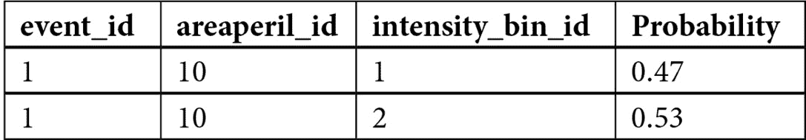
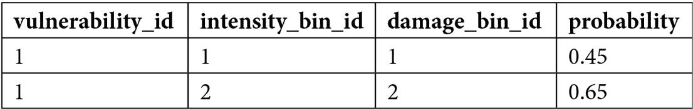
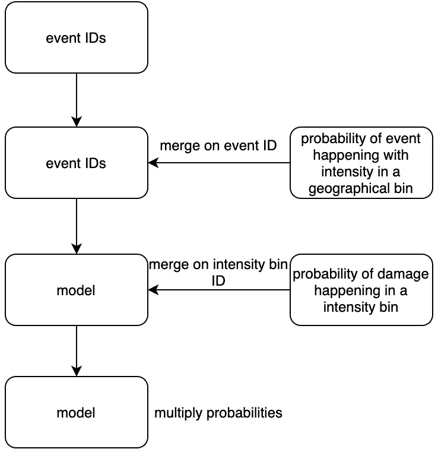
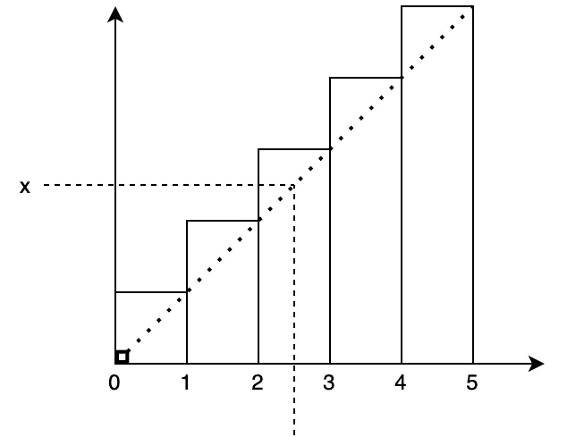
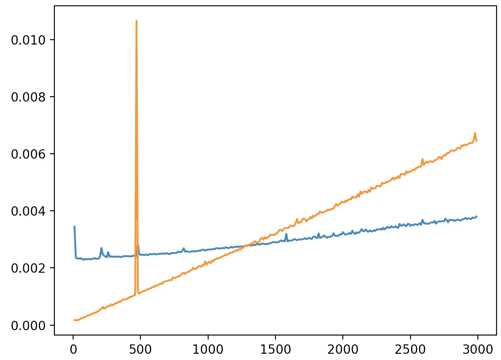

# *第八章*：在 Rust 中构建端到端 Python 包的结构

现在我们已经掌握了足够的 Rust 和 `pyo3` 知识，理论上可以构建一系列现实世界的解决方案，我们必须小心。如果我们决定在 Rust 中重新发明轮子，并在编码解决方案后得到较慢的结果，那就不好了。因此，理解如何解决问题并测试我们的实现非常重要。在本章中，我们将使用 Rust 构建一个 Python 包，该包解决一个简化的现实世界问题，并从文件中加载数据来构建灾难模型。我们将以这种方式构建包，以便在模型变得更加复杂时可以添加额外的功能。一旦我们构建了模型，我们将对其进行测试，以查看我们的实现是否在扩展和速度方面值得。

在本章中，我们将涵盖以下主题：

+   将灾难建模问题分解为我们的包

+   将端到端解决方案作为包构建

+   利用和测试我们的包

本章使我们能够将本书中学到的知识应用于解决现实世界的问题，并处理数据文件。测试我们的解决方案也将使我们避免花费太多时间在结果较慢的解决方案上，从而防止我们错过在办公场所实施 Rust 在 Python 系统中的机会。

# 技术要求

本章的代码和数据可以在[`github.com/PacktPublishing/Speed-up-your-Python-with-Rust/tree/main/chapter_eight`](https://github.com/PacktPublishing/Speed-up-your-Python-with-Rust/tree/main/chapter_eight)找到。

# 将灾难建模问题分解为我们的包

我们将要构建的项目是一个灾难模型。这是我们在特定地理位置计算灾难（如飓风、洪水或恐怖袭击）发生概率的地方。我们可以使用经纬度坐标来做这件事。然而，如果我们这样做，这将需要大量的计算能力和时间，而收益却很小。例如，如果我们想要计算伦敦查令十字医院的洪水概率，我们可以使用坐标 *51.4869° N, 0.2195° W*。

然而，如果我们使用坐标 *51.4865° N, 0.2190° W*，即使我们改变了 *0.0004° N, 0.0005° W* 的坐标，我们仍然会击中查令十字医院。因此，我们将进行大量的计算来重复计算同一建筑的洪水概率，这并不高效。为了解决这个问题，我们可以将位置分解为分区，并给它们一个数值，如图所示：


图 8.1 – 岛屿灾难模型的地理分区

在这里，我们可以看到，如果模型中的数据行指的是`25`号区间，这意味着该数据行指的是我们关注的岛屿中间的土地。我们可以使我们的计算更加高效。例如，我们可以看到*图 8.1*中坐标为`33`、`35`、`47`和`49`以及`1`、`2`、`8`和`9`的正方形位于海洋中。因此，这些正方形发生洪水的概率为零，因为它们已经是水，而且海洋中没有什么我们关心的是关于洪水的。因为我们只是将这些计算映射到这些区间上，所以没有任何阻止我们重新定义这些正方形内部的所有区间为一个区间的。

因此，我们只需执行一个操作来计算所有海洋区间的洪水风险，这将是一个零值，因为海洋已经洪水了。实际上，没有什么阻止我们坚持一个区间的正方形分类。编号为 1 的区间可以是所有 100%位于海洋中的正方形，这样可以节省我们很多时间。我们也可以反过来操作。我们可以使一些区间更加精细。例如，沿海地区可能具有更细微的洪水梯度，因为靠近海洋的小距离可能会大大增加洪水风险；因此，我们可以将编号为 26 的区间分解成更小的区间。为了避免陷入细节，我们将在模型数据中引用任意的区间编号。灾难建模是它自己的主题，我们只是在用它来展示如何构建可以解决实际问题的 Rust Python 包，而不是试图构建最准确的灾难模型。现在我们了解了如何使用概率映射地理数据，我们可以继续计算这些概率。

就像地理数据的映射一样，概率计算比我们在本书中将要讨论的要复杂和微妙得多。像 OASISLMF 这样的公司会与大学里的学术部门合作，来模拟灾难的风险以及造成的损害。然而，在计算这些概率时，我们必须遵循一个总的主题。我们必须使用事件在该区域发生的概率以及事件造成损害的概率来计算损害的总概率。为了做到这一点，我们必须将这些概率相乘。我们还必须分解事件以一定强度发生的概率。例如，一级飓风造成建筑损害的可能性比五级飓风要小。因此，我们将为每个强度区间运行这些概率计算。

在没有查看我们可用的数据之前，我们不能进一步设计我们的流程。数据以`CSV`文件的形式存在，并在*技术要求*部分中提到的 GitHub 仓库中可用。我们可以检查的第一个数据文件是`footprint.csv`文件。该文件展示了在某个区域发生一定强度灾难的概率：



在这里，我们可以看到我们输入了一系列事件 ID。我们可以将`footprint.csv`数据与传入的事件 ID 合并。这使得我们能够将传入的事件 ID 与一个区域、强度和发生的概率进行映射。

现在我们已经合并了我们的地理数据，我们现在可以查看`vulnerability.csv`文件中的损害数据：



观察这个流程，我们可以合并强度分箱 ID 的损害数据，复制我们需要的任何内容。然后我们必须乘以概率以得到总概率。流程可以总结如下：



图 8.2 – 灾难模型流程

考虑数据和流程，我们可以看到我们现在有具有强度分箱 ID、损害分箱 ID、事件在该区域发生的概率以及事件在某个分箱中造成损害的概率的事件。这些可以传递到另一个阶段，即计算财务损失的过程。我们将在这里停止，但我们必须记住，现实世界的应用需要适应扩展。例如，有插值。这就是我们使用一个函数来估计分箱之间的值，这里进行了演示：



图 8.3 – 分布的线性插值

在这里，我们可以看到如果我们仅仅使用分箱，我们在`2`和`2.9`之间的读取将是相同的。我们知道分布是增加的，所以我们使用一个简单的线性函数，我们的读取值随着读取值的增加而增加。我们可以使用其他更复杂的函数，但如果分箱太宽，这可以提高读取的准确性。虽然我们不会在我们的例子中使用插值，但这是一个我们可能希望在以后插入的合法步骤。考虑到这一点，我们的流程需要被隔离。

在设计我们的包时，我们必须考虑的另一件事是我们模型数据的存储。我们的概率将由一个收集和分析了一系列数据源和特定知识的学术团队定义。例如，建筑物的损害需要结构工程知识和飓风知识。虽然我们可能期望我们的团队在后续版本中更新模型，但我们不希望最终用户轻易地操作数据。我们也不希望在 Rust 代码中硬编码数据；因此，在包中存储`CSV`文件对于这个演示是有用的。考虑到这一点，我们的包应该采取以下结构：

```rs
├── Cargo.toml
```

```rs
├── MANIFEST.in
```

```rs
├── README.md
```

```rs
├── flitton_oasis_risk_modelling
```

```rs
│   ├── __init__.py
```

```rs
│   ├── footprint.csv
```

```rs
│   └── vulnerability.csv
```

```rs
├── src
```

```rs
│   ├── lib.rs
```

```rs
│   ├── main.rs
```

```rs
│   ├── footprint
```

```rs
│   │   ├── mod.rs
```

```rs
│   │   ├── processes.rs
```

```rs
│   │   └── structs.rs
```

```rs
│   └── vulnerabilities
```

```rs
│       ├── mod.rs
```

```rs
│       ├── processes.rs
```

```rs
│       └── structs.rs
```

结构应该对你来说很熟悉。在先前的文件结构中，我们可以看到我们的合并过程，即事件发生概率和损害的合并过程，都在它们自己的文件夹中。过程的数据结构存储在`structs.rs`文件中，而围绕过程的功能定义在`processes.rs`文件中。`flitton_oasis_risk_modelling`文件夹将存放我们的编译后的 Rust 代码；因此，我们的`CSV`文件也存储在那里。

我们在`MANIFEST.in`文件中声明我们存储我们的`CSV`文件。我们的`lib.rs`文件定义了我们的 Rust 和 Python 之间的接口。现在我们已经定义了我们的灾难模型的过程，我们可以继续构建我们的端到端包的下一部分。

# 将端到端解决方案作为一个包构建

在上一节中，我们确定了构建我们的灾难模型包需要做什么。我们可以通过以下步骤实现：

1.  构建足迹合并过程。

1.  构建脆弱性和概率合并过程。

1.  在 Rust 中构建 Python 接口。

1.  在 Python 中构建一个接口。

1.  构建包安装说明。

在我们构建任何东西之前，我们必须在我们的`Cargo.toml`文件中定义我们的依赖项，以下代码：

```rs
[package]
```

```rs
name = "flitton_oasis_risk_modelling"
```

```rs
version = "0.1.0"
```

```rs
authors = ["Maxwell Flitton <maxwellflitton@gmail.com>"]
```

```rs
edition = "2018"
```

```rs
[dependencies]
```

```rs
csv = "1.1"
```

```rs
serde = { version = "1", features = ["derive"] }
```

```rs
[lib]
```

```rs
name = "flitton_oasis_risk_modelling"
```

```rs
crate-type=["rlib", "cdylib"]
```

```rs
[dependencies.pyo3]
```

```rs
version = "0.13.2"
```

```rs
features = ["extension-module"]
```

在这里，我们可以看到我们正在使用`csv`crate 来加载数据，使用`serde`crate 来序列化我们从`CSV`文件中加载的数据。采用这种方法，我们首先编码过程是很重要的。这样，当我们构建接口时，我们就知道我们需要什么。考虑到这一点，我们可以开始构建我们的足迹合并过程。

## 构建足迹合并过程

我们的足迹合并过程本质上是在加载我们的足迹数据并将其与我们的输入 ID 合并。一旦完成，我们就将数据返回以供另一个过程使用。在我们构建过程之前，我们最初需要构建我们的数据结构，因为我们的过程将需要它们。我们可以在`src/footprint/structs.rs`文件中用以下代码构建我们的足迹结构体：

```rs
use serde::Deserialize;
```

```rs
#[derive(Debug, Deserialize, Clone)]
```

```rs
pub struct FootPrint {
```

```rs
    pub event_id: i32,
```

```rs
    pub areaperil_id: i32,
```

```rs
    pub intensity_bin_id: i32,
```

```rs
    pub probability: f32
```

```rs
}
```

在这里，我们可以看到我们应用了`Deserialize`宏到结构体上，这样当我们从文件加载数据时，它可以直接加载到我们的`FootPrint`结构体中。如果我们向我们的包传递了多个类似的事件 ID，我们还将想要克隆我们的结构体。

既然我们已经有了我们的结构体，我们就可以在我们的`src/footprint/processes.rs`文件中构建我们的合并过程：

1.  首先，我们必须用以下代码定义我们需要的导入：

    ```rs
    use std::error::Error;
    use std::fs::File;
    use csv;
    use super::structs::FootPrint;
    ```

    我们必须记住，我们没有在`src/footprint/mod.rs`文件中定义我们的结构体，所以这还不能运行，但我们将在运行代码之前定义它。

1.  我们现在可以构建一个函数，用以下代码从文件中读取足迹：

    ```rs
    pub fn read_footprint(mut base_path: String) -> \
      Result<Vec<FootPrint>, Box<dyn Error>> {
        base_path.push_str("/footprint.csv");
        let file = File::open(base_path.as_str())?;
        let mut rdr = csv::Reader::from_reader(file);
        let mut buffer = Vec::new();

        for result in rdr.deserialize() {
            let record: FootPrint = result?;
            buffer.push(record);
        }
        Ok(buffer)
    }
    ```

    在这里，我们可以看到我们的函数需要一个包含数据文件的目录。然后我们将文件名添加到路径中，打开文件，并通过`from_reader`函数传递它。然后我们定义一个空向量，并将反序列化的数据添加到其中。现在我们有一个`FootPrint`结构体的向量，我们将其返回。

1.  现在我们有了`load data`函数，我们可以在同一个文件中构建`merge footprints`函数，以下是一段代码：

    ```rs
    pub fn merge_footprint_with_events(event_ids: \
      Vec<i32>, 
          footprints: Vec<FootPrint>) -> Vec<FootPrint> {
        let mut buffer = Vec::new();
        for event_id in event_ids {
            for footprint in &footprints {
                if footprint.event_id == event_id {
                    buffer.push(footprint.clone());
                }
            }
        }
        return buffer
    }
    ```

    在这里，我们可以看到我们接受一个事件 ID 的向量和一个`FootPrint`结构体的向量。然后我们遍历事件 ID。对于每个事件，我们遍历所有的`FootPrint`结构体，如果结构体与事件 ID 匹配，就将结构体添加到我们的缓冲区中。然后我们返回缓冲区，这意味着我们已经合并了所有需要的内容。我们不需要编写更多的流程。为了使它们变得有用，我们可以在`src/footprint/mod.rs`文件中构建一个接口。

1.  因此，我们必须使用以下代码导入所需的模块：

    ```rs
    pub mod structs;
    pub mod processes;
    use structs::FootPrint;
    use processes::{merge_footprint_with_events, \
      read_footprint};
    ```

1.  现在我们已经导入了所有需要的模块，我们可以在同一个文件中构建我们的界面，以下是一段代码：

    ```rs
    pub fn merge_event_ids_with_footprint(event_ids: \
      Vec<i32>, 
           base_path: String) -> Vec<FootPrint> {
        let foot_prints = \
          read_footprint(base_path).unwrap();
        return merge_footprint_with_events(event_ids, \
          foot_prints)
    }
    ```

    在这里，我们仅仅接受文件路径和事件 ID，并将它们通过我们的处理流程传递，返回结果。

这样，我们的足迹处理流程就构建完成了，这意味着我们可以继续构建漏洞合并处理流程的下一步。

## 构建漏洞合并流程

现在我们已经将事件 ID 与我们的足迹数据合并，我们得到了一个工作映射，它显示了在地理区域内一定强度下某些事件发生的概率。我们可以通过以下步骤将此与由于灾难发生的损坏概率合并：

1.  在这个过程中，我们必须加载漏洞并将它们与现有数据合并。为了方便起见，我们将需要构建两个结构体——一个用于从文件加载的数据，另一个用于合并后的结果。因为我们正在加载数据，所以我们需要使用`serde`包。在我们的`src/vulnerabilities/structs.rs`文件中，我们使用以下代码导入它：

    ```rs
    use serde::Deserialize;
    ```

1.  然后，我们使用以下代码构建我们的结构体来加载文件：

    ```rs
    #[derive(Debug, Deserialize, Clone)]
    pub struct Vulnerability {
        pub vulnerability_id: i32,
        pub intensity_bin_id: i32,
        pub damage_bin_id: i32,
        pub probability: f32
    }
    ```

    我们必须注意，我们正在加载的数据的概率被标记在`probability`字段下。这与我们的`FootPrint`结构体相同。因此，我们必须将`probability`字段重命名，以避免合并时的冲突。我们还需要计算总概率。

1.  考虑到这一点，合并后的结果形式如下所示：

    ```rs
    #[derive(Debug, Deserialize, Clone)]
    pub struct VulnerabilityFootPrint {
        pub vulnerability_id: i32,
        pub intensity_bin_id: i32,
        pub damage_bin_id: i32,
        pub damage_probability: f32,
        pub event_id: i32,
        pub areaperil_id: i32,
        pub footprint_probability: f32,
        pub total_probability: f32
    }
    ```

这样，我们的结构体就完整了，我们可以在`src/vulnerabilities/processes.rs`文件中构建我们的处理流程。在这里，我们将有两个函数，一个是读取漏洞，然后使用我们的模型将它们合并：

1.  首先，我们必须使用以下代码导入所有需要的模块：

    ```rs
    use std::error::Error;
    use std::fs::File;
    use csv;
    use crate::footprint::structs::FootPrint;
    use super::structs::{Vulnerability, \
      VulnerabilityFootPrint};
    ```

    在这里，我们可以看到我们依赖于来自`footprint`模块的`FootPrint`结构体。

1.  现在我们已经拥有了所有东西，我们可以构建我们的第一个进程，即使用以下代码加载数据：

    ```rs
    pub fn read_vulnerabilities(mut base_path: String) \
      -> Result<Vec<Vulnerability>, Box<dyn Error>> {
        base_path.push_str("/vulnerability.csv");
        let file = File::open(base_path.as_str())?;
        let mut rdr = csv::Reader::from_reader(file);
        let mut buffer = Vec::new();

        for result in rdr.deserialize() {
            let record: Vulnerability = result?;
            buffer.push(record);
        }
        Ok(buffer)
    }
    ```

    这里，我们可以看到这与我们在足迹模块中的加载过程类似。将其重构为通用函数将是一个很好的练习。

1.  现在我们有了加载函数，我们可以将 `Vec<Vulnerability>` 与 `Vec<FootPrint>` 合并，以获得 `Vec<VulnerabilityFootPrint>`。我们可以使用以下代码定义该函数：

    ```rs
    pub fn merge_footprint_with_vulnerabilities(
      vulnerabilities: Vec<Vulnerability>, 
      footprints: Vec<FootPrint>) -> \
        Vec<VulnerabilityFootPrint> {
        let mut buffer = Vec::new();
        for vulnerability in &vulnerabilities {
            for footprint in &footprints {
                if footprint.intensity_bin_id == \
                  vulnerability
                    .intensity_bin_id {
                    . . .
                }
            }
        }
        return buffer
    }
    ```

    这里，我们可以看到我们有一个名为 `buffer` 的新向量，它将存储在 `. . .` 占位符中的合并数据。我们可以看到我们遍历每个漏洞的足迹。如果 `intensity_bin_id` 匹配，我们执行 `. . .` 占位符中的代码，如下所示：

    ```rs
    buffer.push(VulnerabilityFootPrint{
        vulnerability_id: vulnerability.vulnerability_id,
        intensity_bin_id: vulnerability.intensity_bin_id,
        damage_bin_id: vulnerability.damage_bin_id,
        damage_probability: vulnerability.probability,
        event_id: footprint.event_id,
        areaperil_id: footprint.areaperil_id,
        footprint_probability: footprint.probability,
        total_probability: footprint.probability * \
          vulnerability.probability
                    });
    ```

    在这里，我们只是将正确的值映射到我们的 `VulnerabilityFootPrint` 结构体的正确字段。在最后一个字段中，我们通过将其他概率相乘来计算总概率。

我们的过程终于完成了，所以我们继续在 `src/vulnerabilities/mod.rs` 文件中构建我们这个过程的接口：

1.  我们首先使用以下代码导入我们需要的内容：

    ```rs
    pub mod structs;
    pub mod processes;
    use structs::VulnerabilityFootPrint;
    use processes::{merge_footprint_with_vulnerabilities \
        ,read_vulnerabilities};
    use crate::footprint::structs::FootPrint;
    ```

    通过这种方式，我们可以创建一个函数，该函数接受数据文件所在目录的基路径以及足迹数据。

1.  我们然后将它们通过加载和合并这两个进程，并使用以下代码返回我们的合并数据：

    ```rs
    pub fn merge_vulnerabilities_with_footprint( \
      footprint: Vec<FootPrint>, mut base_path: String) \
        -> Vec<VulnerabilityFootPrint> {
        let vulnerabilities = read_vulnerabilities( \
          base_path).unwrap();
        return merge_footprint_with_vulnerabilities( \
          vulnerabilities, footprint)
    }
    ```

我们现在已经构建了构建数据模型所需的两个进程。我们可以继续进行下一步，即在 Rust 中构建我们的 Python 接口。

## 在 Rust 中构建 Python 接口

Python 接口定义在 `src/lib.rs` 文件中，我们在这里使用 `pyo3` crate 使我们的 Rust 代码能够与 Python 系统进行通信。以下是步骤：

1.  首先，我们必须使用以下代码导入我们需要的内容：

    ```rs
    use pyo3::prelude::*;
    use pyo3::wrap_pyfunction;
    use pyo3::types::PyDict;
    mod footprint;
    mod vulnerabilities;
    use footprint::merge_event_ids_with_footprint;
    use vulnerabilities::merge_vulnerabilities_with_footprint;
    use vulnerabilities::structs::VulnerabilityFootPrint; 
    ```

    这里，我们可以看到我们导入了来自 `pyo3` crate 的所需内容。我们将使用 `wrap_pyfunction` 包装 `get_model` 函数，并返回 `PyDict` 结构体的列表。我们还定义了构建模型所需的过程模块、结构体和函数。

1.  我们可以定义我们的函数，如下所示：

    ```rs
    #[pyfunction]
    fn get_model<'a>(event_ids: Vec<i32>, \
        mut base_path: String, py: Python) -> Vec<&PyDict> {
        let footprints = merge_event_ids_with_footprint( \
          event_ids, base_path.clone());
        let model = merge_vulnerabilities_with_footprint \
          (footprints, base_path);
       let mut buffer = Vec::new();

       for i in model {
           . . .
       }
       return buffer
    }
    ```

    必须注意的是，我们接受一个 `Python` 结构体到我们的函数中。这是自动填充的。如果我们通过 `Python` 结构体获取 `Python` 结构体，我们可以使用我们接受的 `Python` 结构体返回在函数中创建的 Python 结构体。

1.  在 `. . .` 占位符中，我们创建一个包含模型行所有数据的 `PyDict` 结构体，并使用以下代码将其推送到我们的缓冲区：

    ```rs
        let placeholder = PyDict::new(py);
        placeholder.set_item("vulnerability_id", \
          i.vulnerability_id);
        placeholder.set_item("intensity_bin_id", \
          i.intensity_bin_id);
        placeholder.set_item("damage_bin_id", \
          i.damage_bin_id);
        placeholder.set_item("damage_probability",\ 
          i.damage_probability);
        placeholder.set_item("event_id", \
          i.event_id);
        placeholder.set_item("areaperil_id",\ 
          i.areaperil_id);
        placeholder.set_item("footprint_probability", \
          i.footprint_probability);
        placeholder.set_item("total_probability", \
          i.total_probability);
           buffer.push(placeholder);
    ```

    这里，我们可以看到我们可以将不同类型推送到我们的 `PyDict` 结构体，而 Rust 并不在乎。

1.  然后，我们可以使用以下代码包装我们的函数并定义我们的模块：

    ```rs
    #[pymodule]
    fn flitton_oasis_risk_modelling(_py: Python, \
        m: &PyModule) -> PyResult<()> {
        m.add_wrapped(wrap_pyfunction!(get_model));
        Ok(())
    }
    ```

现在我们所有的 Rust 编程都完成了，我们可以继续在下一步构建我们的 Python 接口。

## 在 Python 中构建我们的接口

当涉及到我们的 Python 接口时，我们将在`flitton_oasis_rist_modelling/__init__.py`文件中的 Python 脚本中构建一个函数。我们还把我们的数据`CSV`文件存储在`flitton_oasis_rist_modelling`目录中。记住，我们不希望我们的用户干扰`CSV`文件或需要知道它们的位置。为此，我们将使用`os`Python 模块来找到我们的模块目录以加载我们的`CSV`数据。

要做到这一点，我们需要在`flitton_oasis_rist_modelling/__init__.py`文件中导入所需的模块，以下代码：

```rs
import os 
```

```rs
from .flitton_oasis_risk_modelling import *
```

记住，我们的 Rust 代码将编译成一个二进制文件并存储在`flitton_oasis_rist_modelling`目录中，因此我们可以对我们的 Rust 代码中的所有包装函数进行相对导入。现在，我们可以用以下代码编写我们的`construct_model`模型函数：

```rs
def construct_model(event_ids):
```

```rs
    dir_path = os.path.dirname(os.path.realpath(__file__))
```

```rs
    return get_model(event_ids, str(dir_path))
```

在这里，我们可以看到用户需要做的只是传入事件 ID。然而，如果我们尝试使用`pip`安装这个包，我们会得到错误信息，指出无法找到`CSV`文件；这是因为我们的设置中不包括数据文件。我们可以在构建包安装说明的下一步中解决这个问题。

## 构建包安装说明

要做到这一点，我们必须声明我们想要在`MANIFEST.in`文件中保留所有`CSV`文件，以下代码：

```rs
recursive-include flitton_oasis_risk_modelling/*.csv
```

现在我们已经完成了这个步骤，我们可以转到`setup.py`文件来定义我们的设置：

1.  首先，我们必须用以下代码导入所需的模块：

    ```rs
    #!/usr/bin/env python
    from setuptools import dist
    dist.Distribution().fetch_build_eggs([ \
      'setuptools_rust'])
    from setuptools import setup
    from setuptools_rust import Binding, RustExtension
    ```

    在这里，就像我们之前做的那样，我们获取`setuptools_rust`包；尽管它对于包的运行不是必需的，但它对于安装是必需的。

1.  现在，我们可以用以下代码定义我们的设置参数：

    ```rs
    setup(
        name="flitton-oasis-risk-modelling",
        version="0.1",
        rust_extensions=[RustExtension(
        ".flitton_oasis_risk_modelling.flitton_oasis \
          _risk_modelling",
           path="Cargo.toml", binding=Binding.PyO3)],
        packages=["flitton_oasis_risk_modelling"],
        include_package_data=True,
        package_data={'': ['*.csv']},
        zip_safe=False,
    )
    ```

    在这里，我们可以看到我们不需要任何 Python 第三方包。我们还定义了我们的 Rust 扩展，将`include_package_data`参数设置为`True`，并使用`package_data={'': ['*.csv']}`定义了我们的包数据。这样，在安装我们的包时，所有`CSV`文件都将被保留。

1.  我们几乎完成了；我们只需要在`.cargo/config`文件中定义`rustflags`环境变量，以下代码：

    ```rs
    [target.x86_64-apple-darwin]
    rustflags = [
        "-C", "link-arg=-undefined",
        "-C", "link-arg=dynamic_lookup",
    ]
    [target.aarch64-apple-darwin]
    rustflags = [
        "-C", "link-arg=-undefined",
        "-C", "link-arg=dynamic_lookup",
    ]
    ```

    使用这个方法，我们可以上传我们的代码并在我们的 Python 系统中安装它。

现在，我们可以使用我们的 Python 模块。我们可以在模块中使用终端输出进行测试，如下所示：

```rs
>>> from flitton_oasis_risk_modelling import 
```

```rs
  construct_model
```

```rs
>>> construct_model([1, 2])
```

```rs
[{'vulnerability_id': 1, 'intensity_bin_id': 1, 
```

```rs
'damage_bin_id': 1, 'damage_probability': 0.44999998807907104, 
```

```rs
'event_id': 1, 'areaperil_id': 10, 
```

```rs
'footprint_probability': 0.4699999988079071, 
```

```rs
'total_probability': 0.21149998903274536}, 
```

```rs
{'vulnerability_id': 1, 'intensity_bin_id': 1, 
```

```rs
'damage_bin_id': 1, 'damage_probability': 
```

```rs
0.44999998807907104, 
```

```rs
'event_id': 2, 'areaperil_id': 20, 
```

```rs
'footprint_probability': 0.30000001192092896, 
```

```rs
'total_probability': 0.13500000536441803}, 
```

```rs
{'vulnerability_id': 1, 'intensity_bin_id': 2, 
```

```rs
'damage_bin_id': 2, 'damage_probability': 
```

```rs
0.6499999761581421, 
```

```rs
'event_id': 1, 'areaperil_id': 10, 
```

```rs
'footprint_probability': 0.5299999713897705, 
```

```rs
'total_probability': 0.34449997544288635}, 
```

```rs
{'vulnerability_id': 1, 'intensity_bin_id': 2, 
```

```rs
'damage_bin_id': 2, 
```

```rs
'damage_probability': 0.6499999761581421, 'event_id': 2, 
```

```rs
'areaperil_id': 20, 'footprint_probability': 
```

```rs
0.699999988079071, 
```

```rs
'total_probability': 0.45499998331069946},
```

```rs
. . .
```

打印出来的数据更多，但如果你的打印输出与前面的输出相关联，那么你剩余的数据很可能也是准确的。在这里，我们已经构建了一个现实世界的解决方案，该解决方案加载数据并执行一系列操作和过程来生成模型。然而，这是一个基本的模型，不会用于现实生活中的灾难建模；我们已经将其编码在独立的模块中，以便在需要时可以添加更多过程。

然而，我们需要确保我们的努力没有白费。我们可以使用 pandas 和几行 Python 代码来做到这一点，pandas 是用 C 语言编写的，所以它可能更快或者速度相同。考虑到这一点，我们需要在下一节测试以确保我们没有浪费时间。

# 利用和测试我们的包

我们已经开始使用 Rust 编写的 Python 包构建我们的解决方案。然而，我们需要向我们的团队和我们自己证明所有这些努力都是值得的。我们可以通过一个单独的 Python 脚本来测试是否应该继续我们的努力。在这个 Python 脚本中，我们可以按照以下步骤进行测试：

1.  使用 pandas 构建 Python 结构模型。

1.  构建随机事件 ID 生成函数。

1.  使用一系列不同的数据大小来计时我们的 Python 和 Rust 实现。

一旦我们完成了上述所有步骤，我们就会知道是否应该进一步推进我们的模块。

在我们的测试脚本中，在我们开始编码任何东西之前，我们必须使用以下代码导入所有需要的模块：

```rs
import random
```

```rs
import time
```

```rs
import matplotlib.pyplot as plt
```

```rs
import pandas as pd
```

```rs
from flitton_oasis_risk_modelling import construct_model
```

在这里，我们使用`random`模块生成随机事件 ID，使用`time`模块来计时我们的实现。我们使用`pandas`构建我们的模型，`matplotlib`来绘制结果，以及我们的 Rust 实现。现在我们可以构建我们的模型。

## 使用 pandas 构建 Python 结构模型

现在我们已经导入了所有需要的模块，我们可以继续在 Python 中加载数据从 CSV 文件，并使用 pandas 构建模型，以下是步骤：

1.  首先，我们的函数必须接受事件 ID。我们还必须使用以下代码从我们的`CSV`文件加载数据：

    ```rs
    def python_construct_model(event_ids):
        vulnerabilities = \
          pd.read_csv("./vulnerability.csv")
        foot_print = pd.read_csv("./footprint.csv")
        event_ids = pd.DataFrame(event_ids)
    ```

1.  现在我们已经拥有了所有数据，我们可以合并我们的数据，并将`probability`列重命名为避免与以下代码冲突：

    ```rs
        model = pd.merge(
            event_ids, foot_print, how="inner", \
              on="event_id"
        )
        model.rename(
            columns={"probability": \
              "footprint_probability"},
            inplace=True
        )
    ```

    在这里，我们可以看到我们使用了更少的代码。

1.  现在，我们可以进行最终的处理，即与漏洞合并，然后使用以下代码计算总概率：

    ```rs
        model = pd.merge(
            model, vulnerabilities,
            how="inner", on="intensity_bin_id"
        )
        model.rename(
            columns={"probability": \
              "vulnerability_probability"},
            inplace=True
        )
        model["total_prob"] = \
          model["footprint_probability"] * \
            model["vulnerability_probability"]
        return model
    ```

这样，我们的 Python 模型现在就完成了。我们现在可以继续下一步，构建随机事件 ID 生成函数。

## 构建一个随机事件 ID 生成函数

当涉及到我们的 Rust 实现时，我们需要一个整数列表。对于我们的 Python 模型，我们需要传递一个包含事件 ID 的字典列表。我们可以使用以下代码定义这些函数：

```rs
def generate_event_ids_for_python(number_of_events):
```

```rs
    return [{"event_id": random.randint(1, 4)} for _
```

```rs
            in range(0, number_of_events)]
```

```rs
def generate_event_ids_for_rust(number_of_events):
```

```rs
    return [random.randint(1, 4) for _
```

```rs
            in range(0, number_of_events)]
```

现在我们已经拥有了所有需要的东西，我们可以执行测试实现的最后一步。

## 使用一系列不同的数据大小来计时我们的 Python 和 Rust 实现

现在我们已经拥有了测试我们的 Rust 和 Python 实现所需的一切。通过执行以下步骤，我们可以运行 Python 和 Rust 模型并计时：

1.  为了测试我们的实现，我们定义了我们的入口点和我们的时间图的所有数据结构，以下代码：

    ```rs
    if __name__ == "__main__":
        x = []
        python_y = []
        rust_y = []
    ```

1.  对于我们的测试数据，我们将使用以下代码遍历从 `10` 到 `3000` 的整数列表，步长为 `10`：

    ```rs
        for i in range(10, 3000, 10):
            x.append(i)
    ```

    Python 和 Rust 的实现将运行相同的事件 ID 数据集大小，这就是为什么我们只有一个 `x` 向量。现在我们可以使用以下代码测试我们的 Python 实现：

    ```rs
            python_event_ids = \
              generate_event_ids_for_python(
                number_of_events=i
            )
            python_start = time.time()
            python_construct_model(event_ids= \
              python_event_ids)
            python_finish = time.time()
            python_y.append(python_finish - python_start)
    ```

    在这里，我们将我们的 ID 数据集生成到循环中整数的规模。然后我们开始计时，用 Python 构建我们的模型，结束计时，并将所用时间添加到我们的 Python 数据列表中。

1.  我们使用以下代码对 Rust 进行测试：

    ```rs
            rust_event_ids = generate_event_ids_for_rust(
                number_of_events=i
            )
            rust_start = time.time()
            construct_model(rust_event_ids)
            rust_finish = time.time()
            rust_y.append(rust_finish - rust_start)
    ```

    我们的数据收集现在已经完成。

1.  我们需要做的只是使用以下代码在循环结束后绘制结果：

    ```rs
        plt.plot(x, python_y)
        plt.plot(x, rust_y)
        plt.show()
    ```

我们现在已经编写了所有测试代码，它应该显示一个像这样的图表：

![图 8.4 – Rust 与 Python 在模型生成时间上的比较，针对数据大小]



图 8.4 – Rust 与 Python 在模型生成时间上的比较，针对数据大小

在前面的图中，我们看到我们的 Rust 实现在一开始比我们的 Python pandas 实现更快。然而，一旦超过 1,300 的标记，我们的 Rust 模型比 Python pandas 模型慢。这是因为我们的代码扩展性不好。我们在循环中执行循环。在我们的 pandas 模型中，我们对总概率进行向量化。pandas 是一个编写良好的模块，多个开发者已经优化了合并函数。

因此，尽管我们的 Rust 代码将比 Python 和 pandas 代码更快，但如果我们的实现不够严谨且扩展性不好，我们甚至可能会减慢我们的程序。我见过实现不佳的 C++ 被 Python pandas 超越。在尝试将 Rust 应用于您的系统时，理解这个细微差别非常重要。Rust 是一种新的语言，如果承诺大幅提升，却因代码实现不佳而导致在 Rust 中编码实现花费了大量时间后性能反而更慢，同事们可能会感到失望。

由于这是一本关于在 Rust 中构建 Python 包的书籍，而不是关于 Rust 中的数据处理，所以我们在这里停止。然而，Xavier Tao 在 Rust 中实现了一个高效的合并过程，这使得 Rust 的运行时间减少了 75%，内存减少了 78%。这一点在 *进一步阅读* 部分有所说明。还有一个名为 **Polars** 的 Rust 实现 pandas，它也有 Python 绑定。它的速度比标准的 pandas 快，这份文档也列在 *进一步阅读* 部分中。

这里的启示信息是，Rust 使我们能够构建快速且内存高效的解决方案，但我们必须小心我们的实现并测试我们所做的是否合理。如果我们试图从头开始构建一个在现有的 Python 包中有优化解决方案的解决方案，我们更应该小心。

# 摘要

在本章中，我们学习了构建简单灾难模型的基础知识。然后，我们将逻辑分解成步骤，以便在 Rust 中构建灾难模型。这包括获取路径、从文件中加载数据、在我们的包中包含数据，以及构建一个 Python 接口，这样我们的用户在构建模型时就不必了解底层发生了什么。在完成所有这些之后，我们测试了我们的模块，并确保我们不断增加测试数据的大小，以查看其扩展性。我们发现，最初，我们的 Rust 解决方案更快，因为 Rust 比 Python 和 Pandas 快。然而，我们的实现扩展性不佳，因为我们在一个循环内部又嵌套了一个循环来进行合并。

随着数据量的增加，我们的 Rust 代码最终变得较慢。在之前的章节中，我们多次展示了 Rust 实现通常更快。然而，这并不能抵消糟糕代码实现的影响。如果你依赖于 Python 第三方模块来执行复杂过程，那么为了性能提升而将其重写为 Rust 可能不是一个好主意。如果不存在用于相同解决方案的 Rust crate，那么最好将解决方案的这一部分留给 Python 模块。

在下一章中，我们将构建一个 Flask 网络应用程序，为将 Rust 应用于 Python 网络应用程序奠定基础。

# 进一步阅读

+   Rust Crate Polars 的 Polars 文档（2021 年）：[`docs.rs/polars/0.15.1/polars/frame/struct.DataFrame.html`](https://docs.rs/polars/0.15.1/polars/frame/struct.DataFrame.html%0D)

+   *数据处理：Pandas 对 Rust*，*夏维尔·陶*（2021 年）：[`able.bio/haixuanTao/data-manipulation-pandas-vs-rust--1d70e7fc`](https://able.bio/haixuanTao/data-manipulation-pandas-vs-rust--1d70e7fc)
