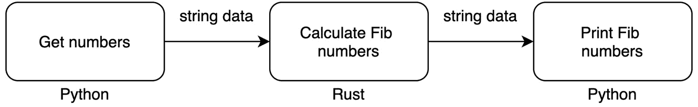
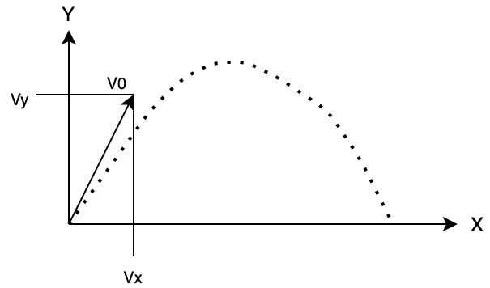
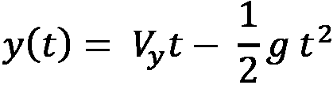
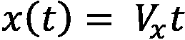
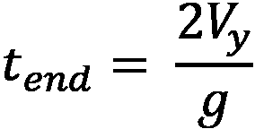
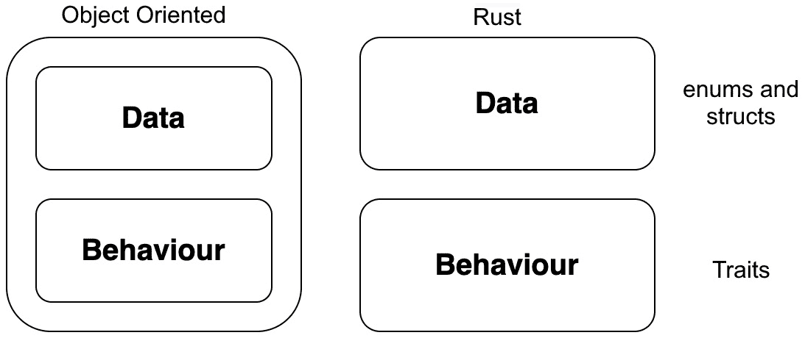
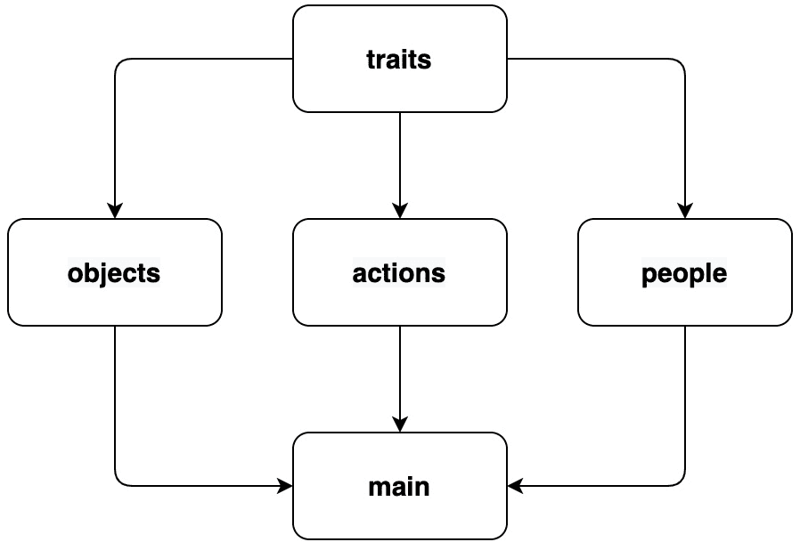

# 第十章：*第十一章*：Rust 集成的最佳实践

在*第十章*，“将 Rust 注入 Python Flask 应用”，我们成功地将我们的 Rust 代码与 Python 网络应用程序融合在一起。在本章的最后一章中，我们将总结本书中涵盖的最佳实践。这些实践对于将 Rust 与 Python 融合不是必需的；然而，它们将帮助我们避免在构建 Rust 的大包时遇到陷阱。当谈到最佳实践时，我们可以通过 Google 搜索主题“SOLID 原则”，这将给我们提供大量关于如何保持代码通常干净的免费信息。但不是重复这些原则，我们将涵盖特定于使用 Rust 和 Python 一起的概念。如果要求不是过于苛刻，我们将学习如何尽可能简化 Rust/Python 实现。我们还将了解 Python 和 Rust 在计算任务和 Python 接口方面的优势。然后，我们研究 Rust 中的特性和它们如何帮助我们组织和结构我们的结构体。最后，当我们想要使用 Rayon crate 实现数据并行时，我们将探讨如何保持简单。

在本章中，我们将涵盖以下主题：

+   通过将数据从 Rust 中导入和导出，保持我们的 Rust 实现简单

+   使界面具有原生对象感

+   使用特性和对象相对

+   使用 Rayon 保持数据并行简单

覆盖这些主题将使我们能够在构建更复杂的大包时避免陷阱。我们还将能够更快地为小型项目构建 Rust 解决方案，因为我们将会了解到我们不必依赖于 Python 设置工具和`pip`安装。

# 技术要求

本章的代码和数据可以在以下链接找到：

[`github.com/PacktPublishing/Speed-up-your-Python-with-Rust/tree/main/chapter_eleven`](https://github.com/PacktPublishing/Speed-up-your-Python-with-Rust/tree/main/chapter_eleven)

# 通过将数据从 Rust 中导入和导出，保持我们的 Rust 实现简单

我们已经涵盖了将 Rust 集成到我们的 Python 系统中所需的所有内容。我们可以构建可以使用`pip`安装的 Rust 包，并在与 Web 应用程序集成时在 Docker 中使用它们。然而，如果我们要解决的问题既小又简单，那么伸手去拿设置工具可能太过费力。例如，如果我们只是在 Python 中打开一个包含数字的**逗号分隔值**（**CSV**）文件，计算斐波那契数，然后将它们写入另一个文件，那么直接用 Rust 编写程序是有意义的。然而，如果我们有一个更复杂的 Python 独立脚本，只需要用 Rust 简单地加速——它仍然只是一个独立脚本——我们不会用 Python 设置工具开始构建 Rust 包。相反，我们通过管道传输数据。这意味着我们将数据从 Python 脚本传递到 Rust 独立二进制文件，然后再将其传递回 Python 脚本以计算斐波那契数，如图所示：



图 11.1 – 基本管道的过程

为了在不使用任何设置工具的情况下达到与 Rust 斐波那契计算包相同的速度，我们必须执行以下步骤：

1.  构建一个 Python 脚本，用于为计算制定数字。

1.  构建一个 Rust 文件，该文件接受数字，计算斐波那契数，并返回计算结果。

1.  构建另一个 Python 脚本，该脚本接受计算出的数字并将它们打印出来。

这样，我们将能够拥有一个简单的管道。虽然每个文件都是隔离的，并且我们可以按任何顺序构建，但开始于*步骤 1*是有意义的。

## 构建一个 Python 脚本，用于为计算制定数字。

对于这个例子，我们只是将输入数字硬编码到我们的管道中，但没有任何阻止你从文件中读取数据或从命令行参数中获取数字。在我们的`input.py`文件中，我们可以使用以下代码写入`stdout`：

```rs
import sys
```

```rs
sys.stdout.write("5\n")
```

```rs
sys.stdout.write("6\n")
```

```rs
sys.stdout.write("7\n")
```

```rs
sys.stdout.write("8\n")
```

```rs
sys.stdout.write("9\n")
```

```rs
sys.stdout.write("10\n")
```

使用这种方式，如果我们使用 Python 解释器运行此脚本，我们将得到以下输出：

```rs
$ python input.py
```

```rs
5
```

```rs
6
```

```rs
7
```

```rs
8
```

```rs
9
```

```rs
10
```

现在，我们可以继续进行下一步。

## 构建另一个 Rust 文件，该文件接受数字，计算斐波那契数，并返回计算结果。

对于我们的 Rust 文件，我们必须确保文件中包含所有内容，以尽可能保持其简单性。如果需要，我们可以将其分散到多个文件中，但对于简单的计算，将所有内容放在一个文件中就足够了。在我们的`fib.rs`文件中，我们最初导入所需的库并使用以下代码定义我们的斐波那契函数：

```rs
use std::io;
```

```rs
use std::io::prelude::*;
```

```rs
pub fn fibonacci_reccursive(n: i32) -> u64 {
```

```rs
    match n {
```

```rs
         1 | 2 => 1,
```

```rs
         _     => fibonacci_reccursive(n - 1) + 
```

```rs
                  fibonacci_reccursive(n - 2)
```

```rs
    }
```

```rs
}
```

在这里，我们可以看到没有什么新东西；我们只是将要使用`std::io`从文件中获取数字，然后计算斐波那契数，通过以下`main`函数将其发送到管道中的下一个文件：

```rs
fn main() {
```

```rs
    let stdin = io::stdin();
```

```rs
    let stdout = std::io::stdout();
```

```rs
    let mut writer = stdout.lock();
```

```rs
    for line in stdin.lock().lines() {
```

```rs
        let input_int: i32 = line.unwrap().parse::<i32>() \
```

```rs
          .unwrap();
```

```rs
        let fib_number = fibonacci_reccursive(input_int);
```

```rs
        writeln!(writer, "{}", fib_number);
```

```rs
    }
```

```rs
}
```

在这里，我们可以看到我们定义了`stdin`来接收发送给 Rust 程序的数量，以及`stdout`来发送计算出的斐波那契数。然后我们遍历发送到 Rust 程序中的每一行，并将每一行解析为整数。然后我们计算斐波那契数，然后使用我们通过`io`预处理器导入的宏将其发送出去。有了这个，我们现在可以使用以下命令编译我们的 Rust 文件：

```rs
rustc fib.rs
```

这将编译我们的 Rust 文件。我们现在可以运行这两个文件，使用以下命令将 Python 文件中的数据管道传输到编译后的 Rust 代码：

```rs
$ python input.py | ./fib 
```

```rs
5
```

```rs
8
```

```rs
13
```

```rs
21
```

```rs
34
```

```rs
55
```

在这里，我们可以看到来自`python input.py`命令的数字被管道传输到返回计算出的斐波那契数的 Rust 代码。有了这个，我们现在可以继续到最后一步，从 Rust 代码中获取计算出的斐波那契数并将它们打印出来。

## 构建另一个 Python 脚本，该脚本接受计算出的数字并将它们打印出来

我们的`output.py`文件非常简单。它具有以下形式：

```rs
import sys
```

```rs
for i in sys.stdin.readlines():
```

```rs
    try:
```

```rs
        processed_number = int(i)
```

```rs
        print(f"receiving: {processed_number}")
```

```rs
    except ValueError:
```

```rs
        pass
```

我们有一个`try`块，因为传递给最后一个 Python 脚本的数据的开始和结束将有空行，并且当我们尝试将它们转换为整数时会失败。然后我们在最后一个脚本中添加`"receiving: {processed_number}"`来打印数据，以便使其清晰，这是`output.py`文件正在打印数字。这给我们以下打印输出：

```rs
$ python input.py | ./fib | python output.py
```

```rs
receiving: 5
```

```rs
receiving: 8
```

```rs
receiving: 13
```

```rs
receiving: 21
```

```rs
receiving: 34
```

```rs
receiving: 55
```

我们可以使用`time`命令来测量管道运行所需的时间。如果我们将这个与使用我们使用的示例数字的纯 Python 进行比较，纯 Python 将更快。然而，我们知道 Rust 比纯 Python 代码要快得多。因为`pure_python.py`文件：

```rs
def recur_fib(n: int) -> int:
```

```rs
    if n <= 2:
```

```rs
        return 1
```

```rs
    else:
```

```rs
        return (recur_fib(n - 1) +
```

```rs
                recur_fib(n - 2))
```

```rs
for i in [5, 6, 7, 8, 9, 10, 15, 20, 25, 30]:
```

```rs
    print(recur_fib(i))
```

这给我们以下打印输出：

```rs
$ time python pure_python.py 
```

```rs
5
```

```rs
8
```

```rs
13
```

```rs
21
```

```rs
34
```

```rs
55
```

```rs
610
```

```rs
6765
```

```rs
75025
```

```rs
832040
```

```rs
real  0m0.315s
```

```rs
user  0m0.240s
```

```rs
sys  0m0.027s
```

将相同的数字添加到管道中，我们得到以下打印输出：

```rs
$ time python input.py | ./fib | python output.py
```

```rs
receiving: 5
```

```rs
receiving: 8
```

```rs
receiving: 13
```

```rs
receiving: 21
```

```rs
receiving: 34
```

```rs
receiving: 55
```

```rs
receiving: 610
```

```rs
receiving: 6765
```

```rs
receiving: 75025
```

```rs
receiving: 832040
```

```rs
real  0m0.054s
```

```rs
user  0m0.050s
```

```rs
sys  0m0.025s
```

在这里，我们可以看到我们的管道运行得更快。随着数字的增加和数量的增多，Rust 和纯 Python 之间的差距将越来越大。我们可以看到这里，这要容易得多，因为涉及的组件更少。如果我们的程序很简单，那么我们保持 Rust 的构建和使用简单。

# 通过对象为界面提供原生感觉

Python 是一种面向对象的语言。当我们构建 Rust 包时，我们需要保持较低的采用摩擦。如果我们保持接口为对象，Rust 包的采用会更好。大多数 Python 包都有对象接口。计算使用输入完成，Python 对象有一系列函数和属性，可以给我们计算的结果。虽然我们在*第六章*中介绍了如何使用`pyo3`宏在 Rust 中创建类，即*在 Rust 中处理 Python 对象*部分，但在*在 Rust 中构建我们的自定义 Python 对象*部分，建议我们了解这样做的好处和坏处。我们记得用 Rust 编写的类运行得更快。然而，使用纯 Python 进行继承和元类化的自由是有用的。因此，最好将对象接口的构建和组织留给纯 Python。任何需要完成的计算都可以在 Rust 中完成。为了演示这一点，我们可以使用以下截图中的简单物理示例，即粒子的**二维**(**2D**)轨迹：



图 11.2 – 简单的二维物理轨迹

在这里，我们可以看到初始速度被表示为*V0*。在*x*轴上的投影被表示为*Vx*，而在*y*轴上的投影被表示为*Vy*。虚线表示粒子在每一时刻的位置。这里的“时间”是另一个维度。我们为时间中的每一个位置以及时间终点（当它触地时）的方程定义如下：







在这里，*g*是重力常数。我们还想知道粒子在某个特定时间点的位置。我们通过计算最后一个时间点，然后遍历从零到最后一个时间点之间的所有时间点，计算`x`和`y`坐标来实现。我们需要的只是`x`和`y`的初始速度。位置计算的循环都会在 Rust 中完成。所有键都是时间，所有值都是`x`和`y`元组的字典被包含在 Python 对象中。我们可以编写一个函数来处理所有时间，并返回一个名为`calculate_coordinates`的 Rust 字典。在 Python 类中使用它看起来像这样：

```rs
from rust_package import calculate_coordinates
```

```rs
class Particle:
```

```rs
    def __init__(self, v_x, v_y):
```

```rs
        self.co_dict = calculate_coordinates(v_x, v_y)
```

```rs
    def get_position(self, time) -> tuple:
```

```rs
        return self.co_dict[time]
```

```rs
    @property
```

```rs
    def times(self):
```

```rs
        return list(self.co_dict.keys())
```

用户只需导入`Particle`对象，用`x`和`y`坐标的初始速度初始化它，然后输入时间以获取坐标。为了绘制粒子的所有位置，我们会使用以下代码的类：

```rs
from . . . import Particle
```

```rs
particle = Particle(20, 30)
```

```rs
x_positions = []
```

```rs
y_positions = []
```

```rs
for t in particle.times:
```

```rs
    x, y = particle.get_position(t)
```

```rs
    x_positions.append(x)
```

```rs
    y_positions.append(y)
```

这对 Python 来说是很直观的。我们一直在 Rust 中保留所有的数值计算以获得速度，但我们已经设法保留了所有的接口，包括访问时间和位置，都在 Python 中。因此，使用这个包的开发者不会知道它是用 Rust 编写的——他们只会欣赏它的速度。我们可以通过元类将数据结构和访问保持 100%在 Python 中，而所有计算都在 Rust 中完成，来强调这样做的好处。

在我们的粒子系统中，我们可以为粒子的初始速度加载大量数据。结果，我们的系统将计算我们加载的粒子的轨迹。然而，如果我们加载两个具有相同初始速度的粒子，它们都将具有相同的轨迹。考虑到这一点，对我们来说计算两个粒子的轨迹是没有意义的。为了避免这种情况，我们不需要在文件或数据库中存储任何东西作为参考；我们只需要实现一个轻量级设计模式。这就是我们检查传递给对象的参数的地方。如果它们与之前的实例相同，我们就只返回之前的实例。轻量级模式用以下代码定义：

```rs
class FlyWeight(type):
```

```rs
    _instances = {}
```

```rs
    def __call__(cls, *args, **kwargs):
```

```rs
        key = str(args[0]) + str(args[1])
```

```rs
        if key not in cls._instances:
```

```rs
            cls._instances[key] = super( \
```

```rs
                FlyWeight, cls).__call__(*args, **kwargs)
```

```rs
        return cls._instances[key]
```

在这里，我们可以看到我们通过组合初始速度来定义一个键，然后检查是否已经存在具有这些速度的实例。如果存在，我们就从我们的`_instances`字典中返回该实例。如果不存在，我们就创建一个新的实例并将其插入到我们的`_instances`字典中。我们的粒子将采取以下代码的形式：

```rs
class Particle(metaclass=FlyWeight):
```

```rs
    def __init__(self, v_x, v_y):
```

```rs
        self.co_dict = calculate_coordinates(v_x, v_y)
```

```rs
    def get_position(self, time) -> tuple:
```

```rs
        return self.co_dict[time]
```

```rs
    @property
```

```rs
    def times(self):
```

```rs
        return list(self.co_dict.keys())
```

在这里，我们的粒子现在将遵循轻量级模式。我们可以用以下代码来测试这一点：

```rs
test = Particle(4, 6)
```

```rs
test_two = Particle(3, 8)
```

```rs
test_three = Particle(4, 6)
```

```rs
print(id(test))
```

```rs
print(id(test_three))
```

```rs
print(id(test_two))
```

运行这段代码将给出以下输出：

```rs
140579826787152
```

```rs
140579826787152
```

```rs
140579826787280
```

在这里，我们可以看到具有相同初始速度的两个粒子具有相同的内存地址，所以它工作得很好。

我们可以在任何地方初始化这些粒子，并且这个设计模式将适用，确保我们不进行重复的计算。考虑到我们正在用 Rust 编写 Python 扩展，轻量级模式真正展示了我们如何通过接口的调用、使用和显示来获得多少控制。尽管我们在 Python 中构建了接口，但这并不意味着我们不需要结构化我们的 Rust 代码。这把我们带到了下一个部分，我们将讨论在结构化我们的 Rust 代码时如何倾向于特质而不是对象。

使用特质而不是对象

作为一名 Python 开发者，构建通过其他结构体组合继承的结构体是有诱惑力的。**面向对象编程**（**OOP**）在 Python 中得到了很好的支持；然而，有许多原因使得 Rust 更受欢迎，其中之一就是特质。正如以下截图所示，特质使我们能够将数据与行为分离：



图 11.3 – 特质与对象的区别

这给我们提供了很大的灵活性，因为数据和行为是解耦的，使我们能够根据需要将行为插入和从结构体中移除。结构体可以拥有一系列特性，而不会给我们带来多重继承的缺点。为了演示这一点，我们将创建一个基本的医生、病人、护士程序，以便我们可以看到不同的结构体可以有不同的特性，使它们能够通过函数移动。我们将看到特性如何影响我们在多个文件中布局代码的方式。我们的程序将具有以下布局：

```rs
├── Cargo.toml
```

```rs
├── src
```

```rs
│   ├── actions.rs
```

```rs
│   ├── main.rs
```

```rs
│   ├── objects.rs
```

```rs
│   ├── people.rs
```

```rs
│   └── traits.rs
```

使用这种结构，我们的代码流程将呈现以下形式：



图 11.4 – 简单基于特性的程序代码流程

通过这种方式，我们可以看到我们的代码是解耦的。我们的特性被放入所有其他文件中，以定义这些文件的行为。为了构建这个程序，我们必须执行以下步骤：

+   定义特性——为我们的结构体构建特性

+   使用特性定义结构体行为

+   通过函数传递特性

+   存储具有共同特性的结构体

+   在`main.rs`文件中运行我们的程序。

因此，我们可以从第一小节开始定义我们的特性。

## 定义特性

在我们开始定义特性之前，我们必须概念化我们程序中定义行为的人的类型。它们如下列出：

+   **病人**：这个人没有任何临床技能，但对他们执行操作。

+   **护士**：这个人拥有临床技能，但不能开具处方或诊断。

+   **护士执业医师**：这个人拥有临床技能，可以开具处方但不能诊断。

+   **高级护士执业医师**：这个人拥有临床技能，可以开具处方和诊断。

+   **医生**：这个人拥有临床技能，可以开具处方和诊断。

我们在这里可以看到，他们都是人类。因此，他们都能说话并介绍自己。所以，在我们的`traits.rs`文件中，我们可以创建一个`Speak`特性，以下代码：

```rs
pub trait Speak {
```

```rs
    fn introduce(&self) -> ();
```

```rs
}
```

如果一个结构体实现了这个特性，它必须创建自己的`introduce`函数，具有相同的返回和输入参数。我们还可以看到，除了病人之外的所有人都有临床技能。为了适应这一点，我们可以实现一个临床技能特性，以下代码：

```rs
pub trait ClinicalSkills {
```

```rs
    fn can_prescribe(&self) -> bool {        
```

```rs
        return false
```

```rs
    }
```

```rs
    fn can_diagnose(&self) -> bool {
```

```rs
        return false
```

```rs
    }
```

```rs
    fn can_administer_medication(&self) -> bool {
```

```rs
        return true
```

```rs
    }
```

```rs
}
```

在这里，我们可以看到我们为每个临床医生定义了最常用的属性。只有两个人——医生和高级护士执业医师——可以诊断和开具处方。然而，他们所有人都可以给药。我们可以为所有临床医生实现这个特性，然后覆盖具体细节。我们必须注意，由于医生和高级护士执业医师在诊断和开具处方方面具有相同的可能性，我们可以为这一点创建另一个特性，以防止重复，并使用以下代码为病人创建一个特性：

```rs
pub trait AdvancedMedical {}
```

```rs
pub trait PatientRole {
```

```rs
    fn get_name(&self) -> String;
```

```rs
}
```

我们现在已经定义了我们需要的所有特性。我们可以开始使用它们来定义下一小节中的人。

## 使用特性定义结构体行为

在定义任何结构体之前，我们必须使用以下代码将我们的特征导入到`people.rs`文件中：

```rs
use super::traits;
```

```rs
use traits::{Speak, ClinicalSkills, AdvancedMedical, \
```

```rs
  PatientRole};
```

我们现在有了所有特征，因此我们可以使用以下代码在程序中定义我们的人：

```rs
pub struct Patient {
```

```rs
    pub name: String
```

```rs
}
```

```rs
pub struct Nurse {
```

```rs
    pub name: String
```

```rs
}
```

```rs
pub struct NursePractitioner {
```

```rs
    pub name: String
```

```rs
}
```

```rs
pub struct AdvancedNursePractitioner {
```

```rs
    pub name: String
```

```rs
}
```

```rs
pub struct Doctor {
```

```rs
    pub name: String
```

```rs
}
```

很遗憾，这里有一些重复。这也会发生在我们的`Speak`特征上；然而，保持这些结构体分开是很重要的，因为我们稍后会将特征插入到它们中，所以我们需要它们是解耦的。我们可以使用以下代码为每个人实现`Speak`特征：

```rs
impl Speak for Patient {
```

```rs
    fn introduce(&self) {
```

```rs
        println!("hello I'm a Patient and my name is {}", \
```

```rs
            self.name);
```

```rs
    }
```

```rs
}
```

```rs
impl Speak for Nurse {
```

```rs
    fn introduce(&self) {
```

```rs
        println!("hello I'm a Nurse and my name is {}", \
```

```rs
            self.name);
```

```rs
    }
```

```rs
}
```

```rs
impl Speak for NursePractitioner {
```

```rs
    fn introduce(&self) {
```

```rs
        println!("hello I'm a Practitioner and my name is \
```

```rs
            {}", self.name);
```

```rs
    }
```

```rs
}
```

```rs
. . .
```

我们可以继续这种模式，并为所有人结构体实现`Speak`特征。现在这已经完成，我们可以使用以下代码为我们的人实现临床技能和病人角色特征：

```rs
impl PatientRole for Patient {
```

```rs
    fn get_name(&self) -> String {
```

```rs
        return self.name.clone()
```

```rs
    }
```

```rs
}
```

```rs
impl ClinicalSkills for Nurse {}
```

```rs
impl ClinicalSkills for NursePractitioner {
```

```rs
    fn can_prescribe(&self) -> bool {
```

```rs
        return true
```

```rs
    }
```

```rs
}
```

这里，我们可以看到我们的人结构体具有以下特征：

+   `Patient`结构体具有标准的`PatientRole`特征。

+   `Nurse`结构体具有标准的`ClinicalSkills`特征。

+   `NursePractitioner`结构体具有标准的`ClinicialSkills`特征，并且将`can_prescribe`函数重写为返回`true`。

现在我们已经将临床技能应用到标准临床医生上，我们现在可以使用以下代码应用我们的高级特征：

```rs
impl AdvancedMedical for AdvancedNursePractitioner {}
```

```rs
impl AdvancedMedical for Doctor {}
```

```rs
impl<T> ClinicalSkills for T where T: AdvancedMedical {
```

```rs
    fn can_prescribe(&self) -> bool {
```

```rs
        return true
```

```rs
    }
```

```rs
    fn can_diagnose(&self) -> bool {
```

```rs
        return true
```

```rs
    }
```

```rs
}
```

这里，我们将`AdvancedMedical`特征应用到`Doctor`和`AdvancedNursePractitioner`结构体上。然而，我们知道这些结构体也是临床医生。我们需要它们具有临床技能。因此，我们为`AdvancedMedical`特征实现`ClinicalSkills`。然后，我们将`can_prescribe`和`can_diagnose`函数重写为`true`。因此，医生和高级护士执业医师都具有`ClinicalSkills`和`AdvancedMedical`特征，可以进行诊断和开处方。有了这个，我们的人结构体就准备好传递到函数中了。我们将在下一小节中这样做。

## 通过函数传递特征

为了执行更新数据库或向服务器发送数据等动作，我们将通过函数传递我们的人结构体，让临床医生可以对病人采取行动。为此，我们必须使用以下代码在我们的`actions.rs`文件中导入我们的特征：

```rs
use super::traits;
```

```rs
use traits::{ClinicalSkills, AdvancedMedical, PatientRole};
```

我们的第一项动作是接收病人。这可以由任何具有临床技能的人完成。考虑到这一点，我们可以用以下代码定义这个动作：

```rs
pub fn admit_patient<Y: ClinicalSkills>(
```

```rs
    patient: &Box<dyn PatientRole>, _clinician: &Y) {
```

```rs
    println!("{} is being admitted", patient.get_name());
```

```rs
}
```

在这里，我们可以看到传入我们的临床医生可以是任何具有`ClinicalSkills`特征的实体，这意味着所有我们的临床医生结构体。然而，必须注意的是，我们还在传入`&Box<dyn PatientRole>`作为病人。这是因为当传入病人时，我们将使用病人列表。我们可以将多个病人分配给一个临床医生。我们将在定义病人列表结构体的下一小节中探讨为什么我们使用`&Box<dyn PatientRole>`。接下来的动作是对病人进行诊断，这通过以下代码定义：

```rs
pub fn diagnose_patient<Y: AdvancedMedical>(
```

```rs
    patient: &Box<dyn PatientRole>, _clinician: &Y) {
```

```rs
    println!("{} is being diagnosed", patient.get_name());
```

```rs
}
```

在这里，拥有用于诊断的`AdvancedMedical`特质是有意义的。如果我们尝试传递一个`Nurse`或`NursePractitioner`结构体，由于特质不匹配，程序将无法编译。然后我们可以有一个开药动作，其形式如下代码：

```rs
pub fn prescribe_meds<Y: ClinicalSkills>(
```

```rs
    patient: &Box<dyn PatientRole>, clinician: &Y) {
```

```rs
    if clinician.can_prescribe() {
```

```rs
        println!("{} is being prescribed medication", \
```

```rs
          patient.get_name());
```

```rs
    } else {
```

```rs
        panic!("clinician cannot prescribe medication");
```

```rs
    }
```

```rs
}
```

在这里，我们可以看到`ClinicalSkills`特质被接受，但如果临床医生不能开药，代码将会抛出错误。这是因为我们的`NursePractitioner`结构体可以开药。我们也可以创建一个第三级中间特质，并将其应用于医生、高级和普通护士。然而，这只是一个检查，而不是为所有三个临床医生结构体实现一个新特质。我们的最后一个动作是给药和出院，这可以通过我们所有的临床医生结构体来完成；因此，它具有以下形式：

```rs
pub fn administer_meds<Y: ClinicalSkills>(
```

```rs
    patient: &Box<dyn PatientRole>, _clinician: &Y) {
```

```rs
    println!("{} is having meds administered", \
```

```rs
      patient.get_name());
```

```rs
}
```

```rs
pub fn discharge_patient<Y: ClinicalSkills>(
```

```rs
    patient: &Box<dyn PatientRole>, _clinician: &Y) {
```

```rs
    println!("{} is being discharged", patient.get_name());
```

```rs
}
```

我们现在可以通过一系列动作传递我们的`people`结构体，如果我们将错误的人结构体传递到函数中，编译器将拒绝编译。在下一小节中，我们将存储具有特质的结构体在患者列表中。

## 存储具有共同特质的结构体

当涉及到患者列表时，直接在向量中存储患者结构体似乎很诱人。然而，这并不提供很多灵活性。例如，假设我们的系统已经部署，医院里的一名护士生病了，必须住院。我们可以通过将`PatientRole`特质应用于`Nurse`结构体来实现这一点，而无需重写其他任何内容。我们可能还需要扩展不同类型的患者，添加更多结构体，如`ShortStayPatient`或`CriticallySickPatient`。因此，我们在`objects.rs`文件中使用以下代码存储具有`PatientRole`特质的我们的患者：

```rs
use super::traits;
```

```rs
use traits::PatientRole;
```

```rs
pub struct PatientList {
```

```rs
    pub patients: Vec<Box<dyn PatientRole>>
```

```rs
}
```

我们必须将我们的结构体包装在`Box`中，因为我们不知道编译时的确切大小。不同大小不同结构体的结构体可以实现相同的特质。`Box`是堆内存中的指针。因为我们知道指针的大小，所以我们知道在编译时添加到向量中的内存大小。`dyn`关键字用于定义我们正在引用的特质。在`patients`向量中直接访问结构体是不可能的，因为我们再次不知道结构体的大小。因此，我们通过`PatientRole`特质中的`get_name`函数在我们的动作函数中访问结构体的数据。特质也是指针。我们仍然可以构建如结构体构造函数之类的函数。然而，当我们的`Patient`结构体通过我们创建的动作函数传递时，我们的`PatientRole`特质充当了`Patient`结构体和我们的`admit_function`函数之间的接口。我们现在拥有了所有需要的东西，因此我们可以继续到下一个小节，将它们全部组合在一起，并在我们的`main.rs`文件中运行。

## 在主文件中运行我们的特质

将所有代码一起运行既简单又安全。以下是我们需要做的：

1.  首先，我们在 `main.rs` 文件中使用以下代码导入所有需要的模块：

    ```rs
    mod traits;
    mod objects;
    mod people;
    mod actions;
    use people::{Patient, Nurse, Doctor};
    use objects::PatientList;
    use actions::{admit_patient, diagnose_patient, \
      prescribe_meds, administer_meds, discharge_patient};
    ```

1.  在我们的 `main` 函数中，我们现在可以使用以下代码定义我们诊所当天所需的两位护士和医生：

    ```rs
    fn main() {
        let doctor = Doctor{name: String::from("Torath")};
        let doctor_two = Doctor{name: \
          String::from("Sergio")};
        let nurse = Nurse{name: String::from("Maxwell")};
        let nurse_two = Nurse{name: \
          String::from("Nathan")};
    }
    ```

1.  然后，我们获取病人名单，结果发现四骑士已经到来接受治疗，如下面的代码片段所示：

    ```rs
        let patient_list = PatientList {
            patients: vec![
                Box::new(Patient{name: \
                  String::from("pestilence")}),
                Box::new(Patient{name: \
                  String::from("war")}),
                Box::new(Patient{name: \
                  String::from("famine")}),
                Box::new(Patient{name: \
                  String::from("death")})
            ]
        };
    ```

1.  然后，我们遍历我们的病人，使用以下代码让医生和护士照顾他们：

    ```rs
        for i in patient_list.patients {
            admit_patient(&i, &nurse);
            diagnose_patient(&i, &doctor);
            prescribe_meds(&i, &doctor_two);
            administer_meds(&i, &nurse_two);
            discharge_patient(&i, &nurse);
        }
    ```

这就是我们的 `main` 函数的结束。运行它将给出以下输出：

```rs
conquest is being admitted
```

```rs
conquest is being diagnosed
```

```rs
conquest is being prescribed medication
```

```rs
conquest is having meds administered
```

```rs
conquest is being discharged
```

```rs
war is being admitted
```

```rs
. . .
```

```rs
famine is being admitted
```

```rs
. . .
```

```rs
death is being admitted
```

```rs
. . .
```

通过这种方式，我们已经完成了在 Rust 中使用特质的练习。希望如此，你能看到使用特质时我们获得的灵活性和解耦。然而，我们必须记住，如果我们构建一个与我们的 Python 系统的接口，这种方法将无法得到支持。如果我们构建一个接口，可以使用以下伪代码来完成：

```rs
#[pyclass]
```

```rs
pub struct NurseClass {
```

```rs
    #[pyo3(get, set)]
```

```rs
    pub name: String,
```

```rs
    #[pyo3(get, set)]
```

```rs
    pub admin: bool,
```

```rs
    #[pyo3(get, set)]
```

```rs
    pub prescribe: bool,
```

```rs
    #[pyo3(get, set)]
```

```rs
    pub diagnose: bool,
```

```rs
}
```

```rs
#[pymethods]
```

```rs
impl NurseClass {
```

```rs
    #[new]
```

```rs
    fn new(name: String, admin: bool, prescribe: bool,
```

```rs
           diagnose: bool)      Self {
```

```rs
        return Nurse{name, admin, prescribe}
```

```rs
    }
```

```rs
    fn introduce(&self)      Vec<Vec<u64>> {
```

```rs
        println!("hello I'm a Nurse and my name is {}", 
```

```rs
                 self.name);
```

```rs
    }
```

```rs
}
```

在这里，我们可以看到我们用属性替换了 `ClinicalSkills` 特质中的函数。我们将能够将带有特质的 `NurseClass` 结构体传递给调用 `ClinicalSkills` 函数的函数。然后，`ClinicalSkills` 函数的结果可以传递给 `NurseClass` 结构体的构造函数。然后，我们的 `NurseClass` 结构体可以被传递到我们的 Python 系统中。

面向对象编程有其优点，应该在用 Python 编码时使用。然而，Rust 给我们带来了一个新的灵活且解耦的方法。虽然理解特质可能需要一段时间，但它们是值得的。建议你在 Rust 代码中继续使用特质以获得使用特质的优点。

# 使用 Rayon 保持数据并行简单

在 *第三章* *理解并发* 中，我们并行处理了斐波那契数。虽然研究并发很有趣，但当我们构建自己的应用程序时，我们应该依赖其他 crate 来减少应用程序的复杂性。这就是 `rayon` crate 发挥作用的地方。这将使我们能够遍历要计算的数字并将它们并行处理。为了做到这一点，我们最初必须在 `Cargo.toml` 文件中定义 crate，如下所示：

```rs
[dependencies]
```

```rs
rayon = "1.5.1"
```

```rs
With this, we import this crate in our main.rs file with the 
```

```rs
following code:
```

```rs
extern crate rayon;
```

```rs
use rayon::prelude::*;
```

然后，如果我们没有使用 `use rayon::prelude::*;` 导入宏，当我们尝试将标准向量转换为并行迭代器时，编译器将拒绝编译。有了这些宏，我们可以使用以下代码执行并行斐波那契计算：

```rs
pub fn fibonacci_reccursive(n: i32) -> u64 {
```

```rs
      match n {
```

```rs
            1 | 2 => 1,
```

```rs
      _     => fibonacci_reccursive(n - 1) +
```

```rs
                   fibonacci_reccursive(n - 2)
```

```rs
      }
```

```rs
}
```

```rs
fn main() {
```

```rs
    let numbers: Vec<u64> = vec![6, 7, 8, 9, 10].into_par_iter(
```

```rs
    ).map(
```

```rs
        |x| fibonacci_reccursive(x)
```

```rs
    ).collect();
```

```rs
    println!("{:?}", numbers);
```

```rs
}
```

使用这段代码，我们可以看到我们定义了一个标准的斐波那契数函数。然后我们获取一个输入数字的向量，并使用 `into_par_iter` 函数将其转换为并行迭代器。然后我们将斐波那契函数映射到这个并行迭代器上。之后，我们收集结果。因此，打印 `numbers` 将会给出 `[8, 13, 21, 34, 55]`。就这样！我们已经编写了并行代码，并且我们用 `rayon` 包保持了它的简单性。然而，我们必须记住，设置这种并行化是有成本的。如果我们只是使用示例中的数字，普通的循环会更快。然而，如果数字和数组的大小增加，`rayon` 的好处开始显现。例如，如果我们有一个从 6 到 33 的数字向量要计算，我们将在以下图中看到时间差异：

![Figure 11.5 – 循环 6 -> 33 斐波那契数所需时间（微秒）

![img/Figure_11.05_B17720.jpg]

图 11.5 – 循环 6 -> 33 斐波那契数所需时间（微秒）

[左 = Rayon 右 = 普通循环]

通过这种方式，我们有一个简单的并行化计算方法，这将保持我们的复杂性和错误率较低。

摘要

在本章中，我们讨论了在 Python 系统中实现 Rust 的最佳实践。我们最初从保持简单开始。我们看到了，我们可以利用 Rust 的速度，而无需设置工具或安装包，这得益于通过管道将数据从 Python 传输到 Rust 二进制文件以及从 Rust 二进制文件传输到 Python。这是一个有用的技术，不仅限于 Python 和 Rust。实际上，你可以在任何语言之间传输数据。

如果你正在编写一个基础程序，那么数据管道应该是你首先应该做的事情。这样，你可以减少移动部件的数量并加快开发速度。一个简单的 Bash 脚本可以编译 Rust 文件并运行该过程。然而，随着程序复杂性的增加，你可以选择设置工具并将你的 Rust 代码直接导入到 Python 代码中，利用本书中介绍的内容。

然后，我们转向了利用 Python 的对象支持以及元类的重要性，以便在不使用 Rust 包的情况下依赖 Python 来构建我们的接口。Python 是一种成熟且非常表达性的语言。在构建我们的包时，使用 Python 作为接口和 Rust 作为计算，使用 Python 的最佳和 Rust 的最佳是有意义的。我们最终讨论了如何利用特质而不是通过组合强制 Rust 采用面向对象的方法。结果是解耦和灵活性更高。最后，我们通过第三方包保持了并行处理代码的简单性，这将提高我们的生产力并减少代码的复杂性，从而减少错误。

我们现在已经来到了这本书的结尾。总有更多东西要学习；然而，你现在已经拥有了一个完整的工具箱。你不仅掌握了最先进的、内存安全的快速语言，而且还能以高效的方式将其与广泛使用的 Python 语言融合，通过`pip`进行安装。这不仅适用于 Python 脚本，你还可以将 Rust 扩展封装在 Docker 中，使你能够在 Python 网络应用程序中使用 Rust。因此，你不必等待你的公司和项目重写和采用 Rust。相反，你可以在明天就将 Rust 插入到一个已经建立的项目中。我对你在未来将如何使用这一点感到无比兴奋。

# 进一步阅读

+   [《精通面向对象 Python》](https://packtpub.com/product/mastering-object-oriented-python/2019) 由 [Steven Lott](https://packtpub.com/authors/steven-lott) 著（2019）[Packt Publishing](https://packtpub.com/packt-publishing)

+   [《精通 Rust》](https://packtpub.com/product/mastering-rust/2018) 由 [Rahul Sharma](https://packtpub.com/authors/rahul-sharma) 和 [Vesa Kaihlavirta](https://packtpub.com/authors/vesa-kaihlavirta) 著（2018）[Packt Publishing](https://packtpub.com/packt-publishing)
