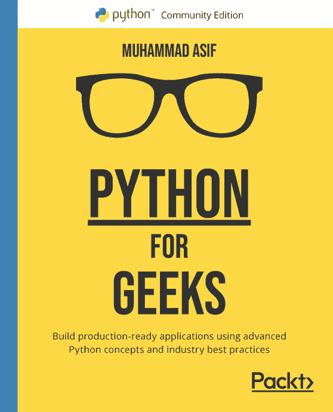
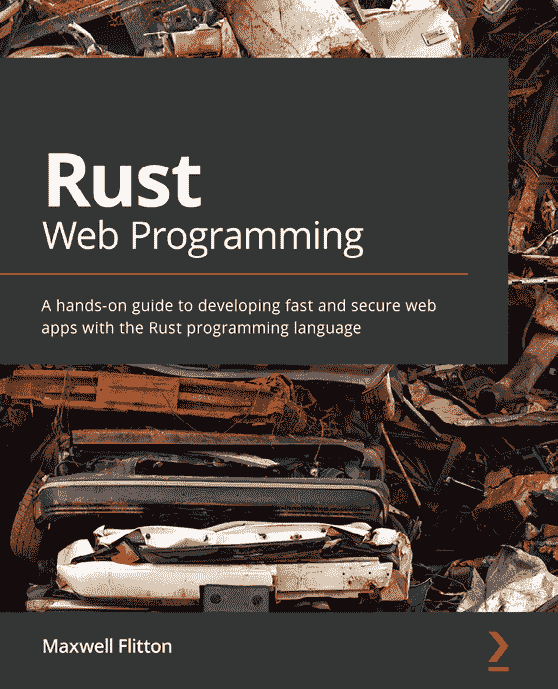

[Packt.com](http://Packt.com)

订阅我们的在线数字图书馆，全面访问超过 7,000 本书籍和视频，以及行业领先的工具，帮助您规划个人发展并推进您的职业生涯。更多信息，请访问我们的网站。

# 为什么订阅？

+   使用来自超过 4,000 位行业专业人士的实用电子书和视频，节省学习时间，更多时间编码

+   通过为您量身定制的技能计划提高您的学习效果

+   每月免费获得一本电子书或视频

+   完全可搜索，便于轻松访问关键信息

+   复制粘贴、打印和收藏内容

您知道 Packt 为每本书都提供电子书版本，并提供 PDF 和 ePub 文件吗？您可以在[packt.com](https://packt.com)升级到电子书版本，并且作为印刷书客户，您有权获得电子书副本的折扣。有关更多信息，请联系我们[customercare@packtpub.com](https://customercare@packtpub.com)。

在[www.packt.com](https://www.packt.com)，您还可以阅读一系列免费技术文章，注册各种免费通讯，并享受 Packt 书籍和电子书的独家折扣和优惠。

# 您可能还会喜欢的其他书籍

如果您喜欢这本书，您可能会对 Packt 的这些其他书籍感兴趣：

(https://www.packtpub.com/product/python-for-geeks/9781801070119)

**Python for Geeks**

Muhammad Asif

ISBN: 9781801070119

+   了解如何设计和管理复杂的 Python 项目

+   在 Python 中制定测试驱动开发（TDD）策略

+   探索 Python 中的多线程和多程序设计

+   使用 Apache Spark 和 Google Cloud Platform (GCP)用 Python 进行数据处理

+   在公共云（如 GCP）上部署无服务器程序

+   使用 Python 构建 Web 应用程序和应用程序编程接口

+   将 Python 应用于网络自动化和无服务器函数

+   掌握 Python 在数据分析和机器学习中的应用

(https://packt.link/9781800560819)

**Rust Web 编程**

Maxwell Flitton

ISBN: 9781800560819

+   在 Rocket、Actix Web 和 Warp 中使用 Rust 构建可扩展的 Web 应用程序

+   使用 PostgreSQL 为您的 Web 应用程序应用数据持久性

+   为您的 Web 应用程序构建登录、JWT 和配置模块

+   从 Actix Web 服务器提供 HTML、CSS 和 JavaScript

+   在 Postman 和 Newman 中构建单元测试和功能 API 测试

+   使用 NGINX 和 Docker 将 Rust 应用程序部署到 AWS EC2 实例上

# Packt 正在寻找像您这样的作者

如果您有兴趣成为 Packt 的作者，请访问[authors.packtpub.com](https://authors.packtpub.com)并今天申请。我们与成千上万的开发者和技术专业人士合作，就像您一样，帮助他们与全球技术社区分享他们的见解。您可以提交一般申请，申请我们正在招募作者的特定热门话题，或提交您自己的想法。

# 分享您的想法

现在您已经完成了 *用 Rust 加速 Python*，我们非常想听听您的想法！如果您从亚马逊购买了这本书，请点击此处直接进入该书的亚马逊评论页面，分享您的反馈或在该购买网站上留下评论。

您的评论对我们和科技社区都非常重要，它将帮助我们确保我们提供的是高质量的内容。

您可能还会喜欢的其他书籍

您可能还会喜欢的其他书籍
